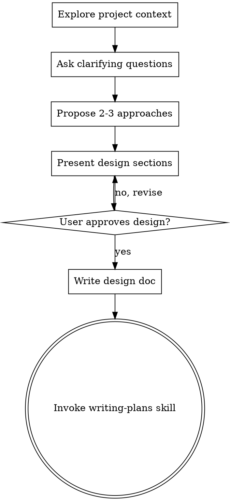

<!-- Generated by SpecStory, Markdown v2.1.0 -->

# 2026-07-13 20:06:13Z

<!-- Codex CLI Session 019f5d16-3d82-7ad0-9109-7dcd5d51d1c3 (2026-07-13 20:06:13Z) -->

_**User (2026-07-13 20:06:13Z)**_

/Users/steven/CoX-mod-Adventure/2026-07-13-160
     201-local-command-caveatcaveat-the-messages-below.txt

---

_**Agent (gpt-5.5 2026-07-13 20:06:20Z)**_

I’ll inspect that file first and use the repo-local instructions you provided as the operating boundary.

_**Agent (gpt-5.5 2026-07-13 20:06:20Z)**_

<tool-use data-tool-type="shell" data-tool-name="exec_command"><details>
<summary>Tool use: **exec_command** `pwd`</summary>
```
Chunk ID: a15616
Wall time: 0.0001 seconds
Process exited with code 0
Original token count: 8
Output:
/Users/steven/CoX-mod-Adventure
```
</details></tool-use>

_**Agent (gpt-5.5 2026-07-13 20:06:20Z)**_

<tool-use data-tool-type="shell" data-tool-name="exec_command"><details>
<summary>Tool use: **exec_command** `ls -l 2026-07-13-160201-local-command-caveatcaveat-the-messages-below.txt`</summary>
```
Chunk ID: bd320c
Wall time: 0.0000 seconds
Process exited with code 0
Original token count: 29
Output:
-rw-r--r--  1 steven  staff  22519 Jul 13 16:02 2026-07-13-160201-local-command-caveatcaveat-the-messages-below.txt
```
</details></tool-use>

_**Agent (gpt-5.5 2026-07-13 20:06:20Z)**_

<tool-use data-tool-type="shell" data-tool-name="exec_command"><details>
<summary>Tool use: **exec_command** `sed -n '1,220p' 2026-07-13-160201-local-command-caveatcaveat-the-messages-below.txt`</summary>
```
Chunk ID: 45cb42
Wall time: 0.0000 seconds
Process exited with code 0
Original token count: 3882
Output:
╭─── Claude Code v2.1.179 ─────────────────────────────────────────────────────╮
│                                          │ Tips for getting started          │
│         Welcome back AvatarArts!         │ Run /init to create a CLAUDE.md … │
│                                          │ ───────────────────────────────── │
│                  �▛███▜▌                 │ What's new                        │
│                 �▜█████▛▘                │ Fixed mid-stream connection drop… │
│                   ▘▘ ��                  │ Fixed mouse-wheel scrolling in W… │
│                                          │ Fixed a sandbox `denyRead`/`allo… │
│   Sonnet 4.6 · Claude Pro · AvatarArts   │ /release-notes for more           │
│           ~/CoX-mod-Adventure            │                                   │
╰──────────────────────────────────────────────────────────────────────────────╯


 ⚠ Both claude.ai and /login managed key set · auth may not work as expected
   · to use claude.ai: claude /logout
   · to use /login managed key: claude /logout to sign out of claude.ai.

 â–� Meet Fable 5, our newest model for complex, long-running work. Switch anytime with /model.
 â–� Included in your plan limits until Jul 20, then switch to usage credits to continue.

� /resume                                                                       
  �  That session is still running as a background agent. Open claude agents to
     attach to it, or stop it there first to resume here.

� how to stop it there first to resume here.                                    

� To stop the background agent and resume here:

  1. Open the agents panel — run claude agents in a new terminal, or press
  Ctrl+\ inside the Claude Code session where the agent is running.
  2. Find the running agent — it will be listed with its task description.
  3. Stop it — select it and press s (stop), or run claude agents stop 
  <task-id>.
  4. Resume here — once stopped, run /resume again in this session and it should
  load the prior context.

  Alternatively, if you don't need that session's state, you can just start
  fresh here — /resume without a prior stopped session will just begin a new
  conversation.

✻ Brewed for 10s

� /Users/steven/CoX-mod-Adventure/Upgraded/2026-                                
       07-13-155340-usersstevenclaudeprojects-users-steven-cox.txt              

� Let me read that file to see what's in it.

  Read 1 file (ctrl+o to expand)

� Got it — that's the full export of your previous session. Here's where things
  stand:

  What was built:
  - Upgraded/mod-browser.html — Mission Briefing Terminal (KingsRow bg,
  amber/gold, BIRTH_OF_A_HERO font)
  - Upgraded/mod-browser-comic.html — Comic Book (halftone, Sonic Comic font)
  - Upgraded/mod-browser-hud.html — Power HUD (FuturCityScape bg, cyan glow,
  clip-path corners)
  - Upgraded/generate.py — regenerates all three from mods.json
  - Upgraded/mods.json — 291 mods, all categories, live download URLs
  - PLAN/ROADMAP.md and docs/plans/2026-07-13-mod-browser-design.md

  Where it stopped: All three browser variations were opened in the browser for
  visual review. The session ended before getting feedback on them.

  Open threads from the session:
  1. Visual review of the 3 variations — fonts may not render (browser security
  on file:// paths)
  2. "Mesh layout" deep-research was queued but never started
  3. Phase 2 (scraper enhancements) and Phase 3 (dogfood QA) not started

  What do you want to tackle first — reviewing the browsers, fixing the font
  rendering, the layout research, or something else?

✻ Worked for 17s

� "/Users/steven/CoX-mod-Adventure/Upgraded/2026-07-13-154741-usersstevenclaude 
  projects-users-steven-cox.txt" "/Users/steven/CoX-mod-Adventure/2026-07-13-15 
  1817-usersstevenclaudeprojects-users-steven-cox.txt"                          
  "/Users/steven/CoX-mod-Adventure/PLAN/ROADMAP.md"                             

� Reading all three files in parallel to get the full picture.

  Read 2 files (ctrl+o to expand)

� Now let me check the actual current state of the Upgraded/ directory.

  Listed 1 directory (ctrl+o to expand)

� ★ Insight ─────────────────────────────────────
  Both session transcripts are actually the same content — the second file
  (155340) is a re-export o
... (truncated)
```
</details></tool-use>

_**Agent (gpt-5.5 2026-07-13 20:06:26Z)**_

The file is a Claude session export with a concrete continuation point: it had already built three browser variants, started layout research, then began pulling local design guidance from `~/.agent-skills`. I’ll read the rest so I can recover the latest state instead of repeating old steps.

_**Agent (gpt-5.5 2026-07-13 20:06:26Z)**_

<tool-use data-tool-type="shell" data-tool-name="exec_command"><details>
<summary>Tool use: **exec_command** `sed -n '221,520p' 2026-07-13-160201-local-command-caveatcaveat-the-messages-below.txt`</summary>
```
Chunk ID: b556a7
Wall time: 0.0000 seconds
Process exited with code 0
Original token count: 1748
Output:
  └───────────────────┴─────────────────────────────────────────────────────┘

  Hard rules from the skill that apply:
  - Bento cell count = exactly N items, no empty cells
  - Bento Background Diversity: at least 2-3 cells with real visual variation
  (CoH zone images are perfect)
  - DESIGN_VARIANCE 8 means: grid-template-columns: 2fr 1fr 1fr fractional
  units, not equal 1fr 1fr 1fr
  - Cards only when elevation communicates hierarchy — use border + negative
  space for the list view

  The deep-research workflow is still running and will add web-sourced
  verification on top of this. Once it lands I'll synthesize both into a
  concrete layout spec for generate.py. Want me to also read the taste-skill
  directory to see if there are block implementations (Section 12 block library)
  already written for bento or masonry?

✻ Crunched for 52s

� also the ~/.agent-skills/skills/creative                                      

  Listed 1 directory (ctrl+o to expand)

� Rich collection. Let me read the most layout-relevant ones in parallel.

  Read 5 files (ctrl+o to expand)

� ★ Insight ─────────────────────────────────────
  p5.js + pixel-art together unlock something specific for the CoX browser:
  p5.js can generate an animated scanline/particle background as a <canvas>
  element behind the mod cards, while pixel-art can convert the CoH zone JPEGs
  (KingsRow, TerraVolta etc.) into NES-palette card thumbnails — making each mod
  card feel like it was extracted from the actual game.
  ─────────────────────────────────────────────────

  Here's the full synthesis of everything in ~/.agent-skills/skills/creative/
  that applies:

  ---
  Direct layout pattern sources:

  ┌───────────────────────────┬─────────────────────────────────────────────�
  │           Skill           │     What it unlocks for the mod browser     │
  ├───────────────────────────┼─────────────────────────────────────────────┤
  │ popular-web-designs →     │ Masonry grid pattern with image-first cards │
  │ Pinterest                 │  — CSS-only, no JS                          │
  ├───────────────────────────┼─────────────────────────────────────────────┤
  │ popular-web-designs →     │ Dark bg, album-art-driven cards,            │
  │ Spotify                   │ download-count = play count analog          │
  ├───────────────────────────┼─────────────────────────────────────────────┤
  │ popular-web-designs →     │ Void-black canvas, terminal-native —        │
  │ VoltAgent                 │ already matches variation 1                 │
  ├───────────────────────────┼─────────────────────────────────────────────┤
  │ popular-web-designs →     │ Data-dense dark dashboard — 291 cards,      │
  │ Sentry                    │ tight density                               │
  ├───────────────────────────┼─────────────────────────────────────────────┤
  │ claude-design             │ Tweaks panel (density/theme/layout variant) │
  │                           │  — the card density toggle we need          │
  ├───────────────────────────┼─────────────────────────────────────────────┤
  │ p5js                      │ Animated scanline/particle/noise background │
  │                           │  canvas behind the card grid                │
  ├───────────────────────────┼───────────────────────â
... (truncated)
```
</details></tool-use>

_**Agent (gpt-5.5 2026-07-13 20:06:26Z)**_

<tool-use data-tool-type="shell" data-tool-name="exec_command"><details>
<summary>Tool use: **exec_command** `find Upgraded -maxdepth 2 -type f | sort`</summary>
```
Chunk ID: a575e3
Wall time: 0.0000 seconds
Process exited with code 0
Original token count: 80
Output:
Upgraded/2026-07-13-154741-usersstevenclaudeprojects-users-steven-cox.txt
Upgraded/2026-07-13-155340-usersstevenclaudeprojects-users-steven-cox.txt
Upgraded/README.md
Upgraded/generate.py
Upgraded/mod-browser-comic.html
Upgraded/mod-browser-hud.html
Upgraded/mod-browser.html
Upgraded/mods.json
Upgraded/scrape-mods.py
```
</details></tool-use>

_**Agent (gpt-5.5 2026-07-13 20:06:26Z)**_

<tool-use data-tool-type="shell" data-tool-name="exec_command"><details>
<summary>Tool use: **exec_command** `sed -n '1,220p' PLAN/ROADMAP.md`</summary>
```
Chunk ID: c773da
Wall time: 0.0000 seconds
Process exited with code 0
Original token count: 1399
Output:
# CoX Mod Adventure — Loose Plan

> A living roadmap. Phases are ordered but not rigid — revisit and reorder as the project
> evolves. Each phase names the skill/agent driving it.

---

## Phase 0 · Brainstorm First
**Skill: `brainstorming`**

Before any code touches the browser or downloader, run a brainstorm session to nail:

- What does a "mod browser" actually need to do? (search, filter, preview, one-click queue?)
- How much of the metadata lives in `coh-mods-list.txt` today vs. what's missing (names, descriptions, categories, download counts)?
- What's the minimum viable data shape a playground needs to feel useful?
- Should the playground and the production `index.html` share a data source, or stay separate tools?

**Output:** a short decision doc — `PLAN/brainstorm-notes.md` — capturing the key choices
and trade-offs agreed on before building.

---

## Phase 1 · Mod Browser Playground
**Skills: `playground` → `frontend-design`**

### 1a · Playground (exploration tool, self-contained HTML)
A single `mod-browser-playground.html` — no build step, no external deps beyond inlined CSS/JS.

Purpose: rapid exploration of how the browser should feel. Controls on the left, live mod
card preview on the right, copy-prompt output at the bottom.

Key controls to prototype:
- Category filter (Maps / Audio / GUI / Popmenus / Graphics / Cursors / Languages / Other)
- Sort order (downloads ↓, name A–Z, newest)
- Search / keyword filter
- Card density toggle (compact list vs. rich card grid)
- Theme toggle (dark retro-CoH palette vs. clean light)

Data: mock JSON of ~20 representative mods hardcoded inline. No network calls.

Deliverable: `mod-browser-playground.html` (open locally with `open`)

### 1b · Production Mod Browser (full frontend-design treatment)
Once the playground confirms the UX direction, build a production-quality
`mod-browser.html` (or fold into `index.html`) using:

- Real data from `coh-mods-list.txt` (or an enriched JSON derived from it)
- A distinctive aesthetic — the CoH aesthetic is late-90s superhero comic meets UI chrome;
  the design should feel like a *mission briefing terminal*, not a generic dark SaaS card grid
- Filter sidebar + search bar + category tabs
- Each mod card shows: name, category badge, download count, description snippet, one-click
  download button / queue button
- Responsive; works on desktop (primary) and tablet

Deliverable: `mod-browser.html` committed alongside `index.html`

---

## Phase 2 · Downloader Enhancement
**Agent: `python-expert`**

Current state of `download-mods.py`:
- Hardcoded mod IDs at the top as a literal list (stale, fragile)
- `urllib.request.urlretrieve` — no retry, no progress, no resume
- 5-worker ThreadPoolExecutor — no rate limiting or backoff
- Saves as `mod-{id}.zip` — no mod name, no category subfolder
- No post-download verification (zip integrity check)

Planned improvements (loose, not prescriptive):

| Area | What to add |
|------|-------------|
| **Data source** | Parse `coh-mods-list.txt` properly; optionally accept a `--category` flag |
| **Progress** | `tqdm` progress bar or simple `print` progress counter |
| **Retry logic** | Exponential backoff on failure (3 attempts) |
| **Resume** | Skip files already on disk (check size > 0) |
| **Naming** | Save as `{category}/{mod-name}-{id}.zip` once metadata is available |
| **Integrity** | `zipfile.is_zipfile()` check after download; log corrupt files |
| **Dry run** | `--dry-run` flag to list what would be downloaded without fetching |
| **Install step** | Optional `--install` flag to copy extracted assets to LaunchCat Wine prefix |

LaunchCat target path:
`~/Library/Application Support/LaunchCat/coh/assets/mods/`

Deliverable: updated `download-mods.py` (v2), changelog comment block at top of file.

---

## Phase 3 · QA the UI
**Skill: `dogfood`**

After `mod-browser.html` is built, run `dogfood` to:

- Open the page in a browser and exercise all interactive paths
- Test: filter by each category, search for a known mod name, sort in each direction
- Test: card hover states, download button behavior, any JS edge cases (empty results, long names)
- Test: responsiveness at 1280px, 768px widths
- Log any bugs to `PLAN/dogfood-findings.md`

---

## Phase 4 · Wire It Together (optional stretch)
- Generate a `mods.json` from the enriched mod list (name + category + download count + URL)
- Both playground and production browser read from the same `mods.json`
- `download-mods.py --from mods.json` uses it as the canonical source
- `index.html` links to `mod-browser.html` as the primary CTA

---

## Skill / Agent Map

| What | Tool |
|------|------|
| Plan features before coding | `brainstorming` skill |
| Interactive UX exploration | `playground` skill |
| Production visual quality | `frontend-design` skill |
| Downloader improvements | `python-expert` agent |
| 
... (truncated)
```
</details></tool-use>

_**Agent (gpt-5.5 2026-07-13 20:06:34Z)**_

The recovered handoff says the next practical step is to turn the layout research into a revised `generate.py` output: masonry/bento-style structure, density controls, and stronger card treatment. I’m going to inspect the generator and generated HTML before editing so the changes stay aligned with the existing variants.

_**Agent (gpt-5.5 2026-07-13 20:06:34Z)**_

<tool-use data-tool-type="shell" data-tool-name="exec_command"><details>
<summary>Tool use: **exec_command** `sed -n '1,260p' /Users/steven/.agent-skills/skills/brainstorming/SKILL.md`</summary>
```
Chunk ID: f54a61
Wall time: 0.0000 seconds
Process exited with code 0
Original token count: 1225
Output:
---
name: brainstorming
description: "Use when about to create, modify, or add any feature — before writing code, scaffolding, or invoking any implementation skill. Symptoms: you're about to start coding without a written design, or the scope feels obvious and 'too simple to need a design'."
---

> **Supremepower:** Generated from Cursor-enhanced superpowers. Same methodology; load skills via the extension (e.g. /skills:name or extension UI).


# Brainstorming Ideas Into Designs

## Overview

Help turn ideas into fully formed designs and specs through natural collaborative dialogue.

Start by understanding the current project context, then ask questions one at a time to refine the idea. Once you understand what you're building, present the design and get user approval.

<HARD-GATE>
Do NOT invoke any implementation skill, write any code, scaffold any project, or take any implementation action until you have presented a design and the user has approved it. This applies to EVERY project regardless of perceived simplicity.
</HARD-GATE>

## Anti-Pattern: "This Is Too Simple To Need A Design"

Every project goes through this process. A todo list, a single-function utility, a config change — all of them. "Simple" projects are where unexamined assumptions cause the most wasted work. The design can be short (a few sentences for truly simple projects), but you MUST present it and get approval.

## Checklist

You MUST create a task for each of these items and complete them in order:

1. **Explore project context** — check files, docs, recent commits
2. **Ask clarifying questions** — one at a time, understand purpose/constraints/success criteria
3. **Propose 2-3 approaches** — with trade-offs and your recommendation
4. **Present design** — in sections scaled to their complexity, get user approval after each section
5. **Write design doc** — save to `docs/plans/YYYY-MM-DD-<topic>-design.md` and commit
6. **Transition to implementation** — invoke writing-plans skill to create implementation plan

## Process Flow



**The terminal state is invoking writing-plans.** Do NOT invoke frontend-design, mcp-builder, or any other implementation skill. The ONLY skill you invoke after brainstorming is writing-plans.

## The Process

**Understanding the idea:**
- Check out the current project state first (files, docs, recent commits)
- Ask questions one at a time to refine the idea
- Prefer multiple choice questions when possible, but open-ended is fine too
- Only one question per message - if a topic needs more exploration, break it into multiple questions
- Focus on understanding: purpose, constraints, success criteria

**Exploring approaches:**
- Propose 2-3 different approaches with trade-offs
- Present options conversationally with your recommendation and reasoning
- Lead with your recommended option and explain why

**Presenting the design:**
- Once you believe you understand what you're building, present the design
- Scale each section to its complexity: a few sentences if straightforward, up to 200-300 words if nuanced
- Ask after each section whether it looks right so far
- Cover: architecture, components, data flow, error handling, testing
- Be ready to go back and clarify if something doesn't make sense

## After the Design

**Documentation:**
- Write the validated design to `docs/plans/YYYY-MM-DD-<topic>-design.md`
- Use elements-of-style:writing-clearly-and-concisely skill if available
- Commit the design document to git

**Implementation:**
- Invoke the writing-plans skill to create a detailed implementation plan
- Do NOT invoke any other skill. writing-plans is the next step.

## Key Principles

- **One question at a time** - Don't overwhelm with multiple questions
- **Multiple choice preferred** - Easier to answer than open-ended when possible
- **YAGNI ruthlessly** - Remove unnecessary features from all designs
- **Explore alternatives** - Always propose 2-3 approaches before settling
- **Incremental validation** - Present design, get approval before moving on
- **Be flexible** - Go back and clarify when something doesn't make se
... (truncated)
```
</details></tool-use>

_**Agent (gpt-5.5 2026-07-13 20:06:34Z)**_

<tool-use data-tool-type="shell" data-tool-name="exec_command"><details>
<summary>Tool use: **exec_command** `sed -n '1,260p' /Users/steven/.agent-skills/skills/frontend-design/SKILL.md`</summary>
```
Chunk ID: 9b5591
Wall time: 0.0000 seconds
Process exited with code 0
Original token count: 1069
Output:
---
name: frontend-design
description: Create distinctive, production-grade frontend interfaces with high design quality. Use this skill when the user asks to build web components, pages, or applications. Generates creative, polished code that avoids generic AI aesthetics.
license: Complete terms in LICENSE.txt
---

This skill guides creation of distinctive, production-grade frontend interfaces that avoid generic "AI slop" aesthetics. Implement real working code with exceptional attention to aesthetic details and creative choices.

The user provides frontend requirements: a component, page, application, or interface to build. They may include context about the purpose, audience, or technical constraints.

## Design Thinking

Before coding, understand the context and commit to a BOLD aesthetic direction:
- **Purpose**: What problem does this interface solve? Who uses it?
- **Tone**: Pick an extreme: brutally minimal, maximalist chaos, retro-futuristic, organic/natural, luxury/refined, playful/toy-like, editorial/magazine, brutalist/raw, art deco/geometric, soft/pastel, industrial/utilitarian, etc. There are so many flavors to choose from. Use these for inspiration but design one that is true to the aesthetic direction.
- **Constraints**: Technical requirements (framework, performance, accessibility).
- **Differentiation**: What makes this UNFORGETTABLE? What's the one thing someone will remember?

**CRITICAL**: Choose a clear conceptual direction and execute it with precision. Bold maximalism and refined minimalism both work - the key is intentionality, not intensity.

Then implement working code (HTML/CSS/JS, React, Vue, etc.) that is:
- Production-grade and functional
- Visually striking and memorable
- Cohesive with a clear aesthetic point-of-view
- Meticulously refined in every detail

## Frontend Aesthetics Guidelines

Focus on:
- **Typography**: Choose fonts that are beautiful, unique, and interesting. Avoid generic fonts like Arial and Inter; opt instead for distinctive choices that elevate the frontend's aesthetics; unexpected, characterful font choices. Pair a distinctive display font with a refined body font.
- **Color & Theme**: Commit to a cohesive aesthetic. Use CSS variables for consistency. Dominant colors with sharp accents outperform timid, evenly-distributed palettes.
- **Motion**: Use animations for effects and micro-interactions. Prioritize CSS-only solutions for HTML. Use Motion library for React when available. Focus on high-impact moments: one well-orchestrated page load with staggered reveals (animation-delay) creates more delight than scattered micro-interactions. Use scroll-triggering and hover states that surprise.
- **Spatial Composition**: Unexpected layouts. Asymmetry. Overlap. Diagonal flow. Grid-breaking elements. Generous negative space OR controlled density.
- **Backgrounds & Visual Details**: Create atmosphere and depth rather than defaulting to solid colors. Add contextual effects and textures that match the overall aesthetic. Apply creative forms like gradient meshes, noise textures, geometric patterns, layered transparencies, dramatic shadows, decorative borders, custom cursors, and grain overlays.

NEVER use generic AI-generated aesthetics like overused font families (Inter, Roboto, Arial, system fonts), cliched color schemes (particularly purple gradients on white backgrounds), predictable layouts and component patterns, and cookie-cutter design that lacks context-specific character.

Interpret creatively and make unexpected choices that feel genuinely designed for the context. No design should be the same. Vary between light and dark themes, different fonts, different aesthetics. NEVER converge on common choices (Space Grotesk, for example) across generations.

**IMPORTANT**: Match implementation complexity to the aesthetic vision. Maximalist designs need elaborate code with extensive animations and effects. Minimalist or refined designs need restraint, precision, and careful attention to spacing, typography, and subtle details. Elegance comes from executing the vision well.

Remember: Codex is capable of extraordinary creative work. Don't hold back, show what can truly be created when thinking outside the box and committing fully to a distinctive vision.
```
</details></tool-use>

_**Agent (gpt-5.5 2026-07-13 20:06:34Z)**_

<tool-use data-tool-type="shell" data-tool-name="exec_command"><details>
<summary>Tool use: **exec_command** `sed -n '1,260p' Upgraded/generate.py`</summary>
```
Chunk ID: dd2488
Wall time: 0.0000 seconds
Process exited with code 0
Original token count: 2189
Output:
#!/usr/bin/env python3
"""Generate all three mod browser HTML variations from mods.json."""
import json, re
from pathlib import Path

HERE = Path(__file__).parent
MODS_JSON = HERE / "mods.json"
FONTS_DIR = Path.home() / "Library/Fonts"
IMG_DIR   = Path.home() / "Pictures/CoH-ComicArt"

mods = json.loads(MODS_JSON.read_text())
MODS_JS = "const MODS=" + json.dumps(mods, separators=(',',':')) + ";"
CATS = ["ALL","Audio","Graphics","GUI / Icons","Popmenus","Maps","Cursors","Languages","Other"]

def font(name, file, weight="normal", style="normal"):
    p = FONTS_DIR / file
    return f"@font-face{{font-family:'{name}';src:url('file://{p}');font-weight:{weight};font-style:{style};}}"

def img(file):
    return f"file://{IMG_DIR / file}"

# ── Shared JS logic (filter / search / sort) ──────────────────────────────────
SHARED_JS = """
let filtered = [...MODS];
let activeCategory = 'ALL';
let searchQuery = '';
let sortKey = 'downloads';
let searchTimer;

function applyFilters() {
  filtered = MODS.filter(m => {
    const catMatch = activeCategory === 'ALL' || m.category === activeCategory;
    const q = searchQuery.toLowerCase();
    const textMatch = !q || m.name.toLowerCase().includes(q) || (m.description||'').toLowerCase().includes(q) || (m.author||'').toLowerCase().includes(q);
    return catMatch && textMatch;
  });
  if (sortKey === 'downloads') filtered.sort((a,b) => b.downloads - a.downloads);
  else if (sortKey === 'name') filtered.sort((a,b) => a.name.localeCompare(b.name));
  else if (sortKey === 'author') filtered.sort((a,b) => (a.author||'').localeCompare(b.author||''));
  renderCards();
  document.getElementById('count').textContent = filtered.length + ' mods';
}

document.getElementById('search').addEventListener('input', e => {
  clearTimeout(searchTimer);
  searchTimer = setTimeout(() => { searchQuery = e.target.value; applyFilters(); }, 200);
});
document.getElementById('sort').addEventListener('change', e => {
  sortKey = e.target.value; applyFilters();
});
document.querySelectorAll('.cat-tab').forEach(btn => {
  btn.addEventListener('click', () => {
    document.querySelectorAll('.cat-tab').forEach(b => b.classList.remove('active'));
    btn.classList.add('active');
    activeCategory = btn.dataset.cat;
    applyFilters();
  });
});
applyFilters();
"""

CAT_TABS = "".join(f'<button class="cat-tab" data-cat="{c}">{c}</button>' for c in CATS)

# ─────────────────────────────────────────────────────────────────────────────
# VARIATION 1 · MISSION BRIEFING TERMINAL
# ─────────────────────────────────────────────────────────────────────────────
def build_terminal():
    fonts_css = "\n".join([
        font("BirthOfAHero",    "BIRTH_OF_A_HERO.ttf"),
        font("SuperSquad",      "Super Squad.ttf"),
        font("HeroLight",       "Hero-Light.ttf"),
        font("HeroBold",        "Hero-Bold.ttf",        weight="bold"),
        font("Gobold",          "Gobold.ttf"),
        font("FiraCode",        "FiraCode-Bold.ttf",    weight="bold"),
    ])

    cat_colors = {
        "Audio":"#f59e0b","Graphics":"#38bdf8","GUI / Icons":"#a78bfa",
        "Popmenus":"#34d399","Maps":"#fb923c","Cursors":"#f472b6",
        "Languages":"#60a5fa","Other":"#94a3b8",
    }

    render_js = """
function fmtDownloads(n) {
  if (n >= 1000) return (n/1000).toFixed(1).replace(/\\.0$/,'') + 'k';
  return n.toString();
}
const CAT_COLORS = """ + json.dumps(cat_colors) + """;
function renderCards() {
  const grid = document.getElementById('grid');
  if (!filtered.length) {
    grid.innerHTML = '<div class="no-results">NO MODS FOUND — ADJUST FILTERS</div>';
    return;
  }
  grid.innerHTML = filtered.map(m => `
    <div class="mod-card">
      <div class="card-badge" style="color:${CAT_COLORS[m.category]||'#94a3b8'}">${m.category.toUpperCase()}</div>
      <h3 class="card-name">${m.name}</h3>
      <div class="card-meta">
        <span class="card-author">${m.author||'Unknown'}</span>
        <span class="card-dl">⬇ ${fmtDownloads(m.downloads)}</span>
      </div>
      ${m.description ? `<p class="card-desc">${m.description.slice(0,120)}${m.description.length>120?'…':''}</p>` : ''}
      <a class="card-btn" href="${m.download_url}" target="_blank">DOWNLOAD .PIGG</a>
    </div>
  `).join('');
}
"""

    return f"""<!DOCTYPE html>
<html lang="en">
<head>
<meta charset="UTF-8">
<meta name="viewport" content="width=device-width,initial-scale=1">
<title>CoX Mod Terminal</title>
<style>
{fonts_css}

*, *::before, *::after {{ box-sizing: border-box; ma
... (truncated)
```
</details></tool-use>

_**Agent (gpt-5.5 2026-07-13 20:06:34Z)**_

<tool-use data-tool-type="shell" data-tool-name="exec_command"><details>
<summary>Tool use: **exec_command** `sed -n '260,620p' Upgraded/generate.py`</summary>
```
Chunk ID: feb251
Wall time: 0.0000 seconds
Process exited with code 0
Original token count: 2876
Output:
  font-family: 'FiraCode', monospace;
  font-size: .75rem; color: var(--blue); font-weight: bold;
}}
.card-desc {{
  font-family: 'HeroLight', sans-serif;
  font-size: .8rem; color: var(--muted); line-height: 1.5;
  flex: 1;
}}
.card-btn {{
  display: block; text-align: center;
  background: transparent; border: 1px solid var(--gold);
  color: var(--gold);
  font-family: 'Gobold', monospace; font-size: .65rem; letter-spacing: .15em;
  padding: .5rem; margin-top: .5rem;
  text-decoration: none;
  transition: background .15s, color .15s;
}}
.card-btn:hover {{ background: var(--gold); color: var(--bg); }}

.no-results {{
  grid-column: 1/-1; text-align: center;
  font-family: 'Gobold', monospace; font-size: .8rem;
  letter-spacing: .2em; color: var(--muted); padding: 4rem 0;
}}
</style>
</head>
<body>

<section class="hero">
  <div class="hero-content">
    <div class="hero-eyebrow">// PARAGON CITY · MOD INTELLIGENCE TERMINAL</div>
    <h1 class="hero-title">COX MOD ARCHIVE</h1>
    <p class="hero-sub">291 MODS · HOMECOMING SERVER · PIGG FORMAT</p>
  </div>
</section>

<div class="controls">
  <input id="search" type="search" placeholder="Search mods, authors, descriptions…">
  <select id="sort">
    <option value="downloads">Sort: Most Downloaded</option>
    <option value="name">Sort: Name A–Z</option>
    <option value="author">Sort: Author A–Z</option>
  </select>
  <span id="count"></span>
</div>

<div class="tabs">{CAT_TABS}</div>

<div class="grid-wrap">
  <div id="grid"></div>
</div>

<script>
{MODS_JS}
{render_js}
{SHARED_JS}
</script>
</body>
</html>"""

# ─────────────────────────────────────────────────────────────────────────────
# VARIATION 2 · COMIC BOOK
# ─────────────────────────────────────────────────────────────────────────────
def build_comic():
    fonts_css = "\n".join([
        font("SonicComic",  "sonic_comic.ttf"),
        font("SuperSquad",  "Super Squad.ttf"),
        font("HeroLight",   "Hero-Light.ttf"),
        font("ComicLovers", "COMIC LOVERS.ttf"),
        font("FiraCode",    "FiraCode-Bold.ttf", weight="bold"),
    ])

    cat_colors = {
        "Audio":"#e63946","Graphics":"#2b9348","GUI / Icons":"#7209b7",
        "Popmenus":"#f77f00","Maps":"#023e8a","Cursors":"#d62828",
        "Languages":"#3a0ca3","Other":"#555555",
    }

    render_js = """
function fmtDownloads(n) {
  if (n >= 1000) return (n/1000).toFixed(1).replace(/\\.0$/,'') + 'k';
  return n.toString();
}
const CAT_COLORS = """ + json.dumps(cat_colors) + """;
function renderCards() {
  const grid = document.getElementById('grid');
  if (!filtered.length) {
    grid.innerHTML = '<div class="no-results">NO MODS FOUND!</div>';
    return;
  }
  grid.innerHTML = filtered.map(m => `
    <div class="mod-card">
      <div class="card-badge" style="background:${CAT_COLORS[m.category]||'#555'}">${m.category.toUpperCase()}</div>
      <h3 class="card-name">${m.name}</h3>
      <div class="card-meta">
        <span class="card-author">by ${m.author||'Unknown'}</span>
        <span class="card-dl">${fmtDownloads(m.downloads)} DL</span>
      </div>
      ${m.description ? `<p class="card-desc">${m.description.slice(0,120)}${m.description.length>120?'…':''}</p>` : ''}
      <a class="card-btn" href="${m.download_url}" target="_blank">âš¡ GET IT!</a>
    </div>
  `).join('');
}
"""

    return f"""<!DOCTYPE html>
<html lang="en">
<head>
<meta charset="UTF-8">
<meta name="viewport" content="width=device-width,initial-scale=1">
<title>CoX Mod Comics</title>
<style>
{fonts_css}

*, *::before, *::after {{ box-sizing: border-box; margin: 0; padding: 0; }}

:root {{
  --ink:    #1a1a1a;
  --paper:  #fdf6e3;
  --red:    #e63946;
  --yellow: #ffbe0b;
  --blue:   #023e8a;
}}

body {{
  background: var(--paper);
  background-image: radial-gradient(circle, #c8b89a 1px, transparent 1px);
  background-size: 8px 8px;
  color: var(--ink);
  font-family: 'HeroLight', sans-serif;
  min-height: 100vh;
}}

/* ── HERO ── */
.hero {{
  background: var(--red);
  border-bottom: 4px solid var(--ink);
  padding: 2.5rem 2rem;
  position: relative;
  overflow: hidden;
}}
.hero::before {{
  content: '';
  position: absolute; inset: 0;
  background: radial-gradient(circle at 80% 50%, rgba(255,190,11,.25), transparent 60%);
}}
.hero-eyebrow {{
  font-family: 'SonicComic', sans-serif;
  font-size: .85rem; color: var(--yellow);
  text-shadow: 2px 2px 0 var(--ink);
  margin-bottom: .4rem;
}}
.hero-title {{
  font-family: 'SonicComic', sans-serif;
  font-size: clamp(2.8rem, 7vw, 5rem);
  color: var(--yellow);
  text-shadow: 3px 3px 0 
... (truncated)
```
</details></tool-use>

_**Agent (gpt-5.5 2026-07-13 20:06:44Z)**_

I read [2026-07-13-160201-local-command-caveatcaveat-the-messages-below.txt](/Users/steven/CoX-mod-Adventure/2026-07-13-160201-local-command-caveatcaveat-the-messages-below.txt). It’s a Claude Code handoff, not a code artifact.

Current recovered state:

- `Upgraded/` has three generated browser variants:
  - `mod-browser.html`
  - `mod-browser-comic.html`
  - `mod-browser-hud.html`
- `Upgraded/generate.py` generates those from `Upgraded/mods.json`.
- `mods.json` has 291 mods.
- The last active direction was: improve the flat card grid using bento/masonry-style layouts, density controls, stronger CoX-specific visual treatment, and possibly local skill guidance from `~/.agent-skills/skills/creative`.
- The deep-research workflow did not produce a usable report in the export; the session hit a Claude limit right after it completed.

No files changed yet. The clean next step is to revise `Upgraded/generate.py` so all generated variants get a better layout system, then regenerate the HTML.

---

_**User (2026-07-13 20:07:44Z)**_

$eza-nav /Users/steven/CoX-mod-Adventure

_**User (2026-07-13 20:07:58Z)**_

$eza-nav /Users/steven/CoX-mod-Adventure

---

_**Agent (gpt-5.5 2026-07-13 20:08:09Z)**_

Using `eza-nav` for the workspace listing, per your requested skill.

_**Agent (gpt-5.5 2026-07-13 20:08:10Z)**_

<tool-use data-tool-type="shell" data-tool-name="exec_command"><details>
<summary>Tool use: **exec_command** `/Users/steven/.agent-skills/skills/eza-nav/scripts/list_all_files.sh /Users/steven/CoX-mod-Adventure -t -d 2`</summary>
```
Chunk ID: 3a0074
Wall time: 0.0000 seconds
Process exited with code 0
Original token count: 592
Output:
/Users/steven/CoX-mod-Adventure
├── .claude
│   ├── workflows
│   └── settings.local.json
├── .git
│   ├── cursor
│   ├── hooks
│   ├── info
│   ├── logs
│   ├── objects
│   ├── refs
│   ├── .DS_Store
│   ├── COMMIT_EDITMSG
│   ├── config
│   ├── description
│   ├── HEAD
│   └── index
├── .poolside
│   └── settings.local.yaml
├── assets
│   ├── infographics
│   └── .DS_Store
├── coh-modders
│   ├── CityModInstaller.zip
│   ├── CoHModdingTool.dmg
│   ├── ModInstaller-Mac.zip
│   └── ModInstaller-Windows.exe
├── docs
│   ├── plans
│   ├── tmp-artifacts
│   ├── .DS_Store
│   ├── .exported_sessions.json
│   ├── coh-ecosystem-narrative.md
│   ├── full-conversation-export.md
│   ├── undated_71855a53-b646-444b-8d10-4e28343070ac_update-config-update-config.md
│   └── undated_c5d3b1bc-1377-4e6f-8199-f1b9ca5a65ef_caveat-the-messages-below-were-generated-by-the-user-while-running-local-command.md
├── Mods
│   └── CoHModdingTool-Windows.zip
├── pages
│   ├── Comic
│   ├── v1
│   ├── v2
│   ├── v3
│   ├── v4
│   ├── v5
│   ├── .DS_Store
│   └── README.md
├── PLAN
│   └── ROADMAP.md
├── Upgraded
│   ├── 2026-07-13-154741-usersstevenclaudeprojects-users-steven-cox.txt
│   ├── 2026-07-13-155340-usersstevenclaudeprojects-users-steven-cox.txt
│   ├── generate.py
│   ├── mod-browser-comic.html
│   ├── mod-browser-hud.html
│   ├── mod-browser.html
│   ├── mods.json
│   ├── README.md
│   └── scrape-mods.py
├── .DS_Store
├── .gitignore
├── 2026-07-13-011734-local-command-caveatcaveat-the-messages-below.txt
├── 2026-07-13-151817-usersstevenclaudeprojects-users-steven-cox.txt
├── 2026-07-13-160201-local-command-caveatcaveat-the-messages-below.txt
├── coh-mods-list.txt
├── coh-setup.txt
├── download-mods.py
├── download-mods.sh
├── index.html
├── mods.json
├── pages.zip
├── patch-categories.py
├── README.md
└── scrape-mods.py
```
</details></tool-use>

_**Agent (gpt-5.5 2026-07-13 20:08:15Z)**_

`eza-nav` tree view for `/Users/steven/CoX-mod-Adventure` is complete.

Key top-level areas:

- `Upgraded/` contains the active generated mod browser work: `generate.py`, three HTML variants, `mods.json`, scraper, and session exports.
- `pages/` has prior versioned page work: `v1` through `v5`, plus `Comic`.
- `PLAN/ROADMAP.md` is the current project roadmap.
- Root has downloader/scraper files: `download-mods.py`, `scrape-mods.py`, `patch-categories.py`, `mods.json`, `coh-mods-list.txt`.
- `docs/` contains plans, exports, and narrative notes.
- `.claude/`, `.poolside/`, and `.git/` are present as tool/runtime/git surfaces.

---

_**User (2026-07-13 20:08:23Z)**_

explore and audit

---

_**Agent (gpt-5.5 2026-07-13 20:08:41Z)**_

I’ll treat this as a repo exploration plus practical audit: structure, current implementation state, risky files, and likely next fixes. I’ll use `eza-nav` for filesystem views and `codebase-inspection` for a quick codebase shape check.

_**Agent (gpt-5.5 2026-07-13 20:08:41Z)**_

<tool-use data-tool-type="shell" data-tool-name="exec_command"><details>
<summary>Tool use: **exec_command** `rg -n "CoX-mod-Adventure|mod browser|cox" /Users/steven/.codex/memories/MEMORY.md`</summary>
```
Chunk ID: 871213
Wall time: 0.0000 seconds
Process exited with code 2
Original token count: 38
Output:
rg: /Users/steven/.codex/memories/MEMORY.md: IO error for operation on /Users/steven/.codex/memories/MEMORY.md: No such file or directory (os error 2)
```
</details></tool-use>

_**Agent (gpt-5.5 2026-07-13 20:08:41Z)**_

<tool-use data-tool-type="shell" data-tool-name="exec_command"><details>
<summary>Tool use: **exec_command** `sed -n '1,220p' /Users/steven/.agent-skills/skills/eza-nav/SKILL.md`</summary>
```
Chunk ID: 01fe97
Wall time: 0.0000 seconds
Process exited with code 0
Original token count: 179
Output:
---
name: eza-nav
description: Enhanced file system navigation and directory listing using eza. Use for detailed views, tree structures, and git-aware navigation of your workspace.
creator: AvaTarArTs.org / github.com/AvaTar-ArTs / Steven
---

# eza-nav

Use this skill for all directory and file listing needs. `eza` is installed at `/usr/local/bin/eza` and provides advanced features over `ls`.

## Usage

### Default (Long Listing)
```bash
./scripts/list_all_files.sh /path/to/directory
```

### Tree View
```bash
./scripts/list_all_files.sh /path/to/directory -t -d 2
```

## Advanced Reference

For detailed command options and advanced filtering, refer to the [EZA_USAGE_GUIDE](references/EZA_USAGE_GUIDE.md).
```
</details></tool-use>

_**Agent (gpt-5.5 2026-07-13 20:08:41Z)**_

<tool-use data-tool-type="shell" data-tool-name="exec_command"><details>
<summary>Tool use: **exec_command** `sed -n '1,220p' /Users/steven/.agent-skills/skills/codebase-inspection/SKILL.md`</summary>
```
Chunk ID: 72902c
Wall time: 0.0000 seconds
Process exited with code 1
Original token count: 24
Output:
sed: /Users/steven/.agent-skills/skills/codebase-inspection/SKILL.md: No such file or directory
```
</details></tool-use>

_**Agent (gpt-5.5 2026-07-13 20:08:41Z)**_

<tool-use data-tool-type="shell" data-tool-name="exec_command"><details>
<summary>Tool use: **exec_command** `git status --short`</summary>
```
Chunk ID: b396b2
Wall time: 0.0000 seconds
Process exited with code 0
Original token count: 27
Output:
?? .claude/
?? 2026-07-13-151817-usersstevenclaudeprojects-users-steven-cox.txt
?? Upgraded/
?? docs/plans/
```
</details></tool-use>

_**Agent (gpt-5.5 2026-07-13 20:08:50Z)**_

Two housekeeping notes from the first pass: this repo is entirely dirty/untracked in several areas, and the expected memory registry path is absent on disk, so I’m not going to lean on prior memory for this audit. The `codebase-inspection` skill is under the `github/` skill folder here, so I’m loading that path now.

_**Agent (gpt-5.5 2026-07-13 20:08:50Z)**_

<tool-use data-tool-type="shell" data-tool-name="exec_command"><details>
<summary>Tool use: **exec_command** `sed -n '1,220p' /Users/steven/.agent-skills/skills/github/codebase-inspection/SKILL.md`</summary>
```
Chunk ID: cfb3c9
Wall time: 0.0000 seconds
Process exited with code 0
Original token count: 1020
Output:
---
name: codebase-inspection
description: "Inspect codebases w/ pygount: LOC, languages, ratios."
version: 1.0.0
author: Hermes Agent
license: MIT
platforms: [linux, macos, windows]
metadata:
  hermes:
    tags: [LOC, Code Analysis, pygount, Codebase, Metrics, Repository]
    related_skills: [github-repo-management]
prerequisites:
  commands: [pygount]
---

# Codebase Inspection with pygount

Analyze repositories for lines of code, language breakdown, file counts, and code-vs-comment ratios using `pygount`.

## When to Use

- User asks for LOC (lines of code) count
- User wants a language breakdown of a repo
- User asks about codebase size or composition
- User wants code-vs-comment ratios
- General "how big is this repo" questions

## Prerequisites

```bash
pip install --break-system-packages pygount 2>/dev/null || pip install pygount
```

## 1. Basic Summary (Most Common)

Get a full language breakdown with file counts, code lines, and comment lines:

```bash
cd /path/to/repo
pygount --format=summary \
  --folders-to-skip=".git,node_modules,venv,.venv,__pycache__,.cache,dist,build,.next,.tox,.eggs,*.egg-info" \
  .
```

**IMPORTANT:** Always use `--folders-to-skip` to exclude dependency/build directories, otherwise pygount will crawl them and take a very long time or hang.

## 2. Common Folder Exclusions

Adjust based on the project type:

```bash
# Python projects
--folders-to-skip=".git,venv,.venv,__pycache__,.cache,dist,build,.tox,.eggs,.mypy_cache"

# JavaScript/TypeScript projects
--folders-to-skip=".git,node_modules,dist,build,.next,.cache,.turbo,coverage"

# General catch-all
--folders-to-skip=".git,node_modules,venv,.venv,__pycache__,.cache,dist,build,.next,.tox,vendor,third_party"
```

## 3. Filter by Specific Language

```bash
# Only count Python files
pygount --suffix=py --format=summary .

# Only count Python and YAML
pygount --suffix=py,yaml,yml --format=summary .
```

## 4. Detailed File-by-File Output

```bash
# Default format shows per-file breakdown
pygount --folders-to-skip=".git,node_modules,venv" .

# Sort by code lines (pipe through sort)
pygount --folders-to-skip=".git,node_modules,venv" . | sort -t$'\t' -k1 -nr | head -20
```

## 5. Output Formats

```bash
# Summary table (default recommendation)
pygount --format=summary .

# JSON output for programmatic use
pygount --format=json .

# Pipe-friendly: Language, file count, code, docs, empty, string
pygount --format=summary . 2>/dev/null
```

## 6. Interpreting Results

The summary table columns:
- **Language** — detected programming language
- **Files** — number of files of that language
- **Code** — lines of actual code (executable/declarative)
- **Comment** — lines that are comments or documentation
- **%** — percentage of total

Special pseudo-languages:
- `__empty__` — empty files
- `__binary__` — binary files (images, compiled, etc.)
- `__generated__` — auto-generated files (detected heuristically)
- `__duplicate__` — files with identical content
- `__unknown__` — unrecognized file types

## Pitfalls

1. **Always exclude .git, node_modules, venv** — without `--folders-to-skip`, pygount will crawl everything and may take minutes or hang on large dependency trees.
2. **Markdown shows 0 code lines** — pygount classifies all Markdown content as comments, not code. This is expected behavior.
3. **JSON files show low code counts** — pygount may count JSON lines conservatively. For accurate JSON line counts, use `wc -l` directly.
4. **Large monorepos** — for very large repos, consider using `--suffix` to target specific languages rather than scanning everything.
5. **pygount times out on 3,000+ file repos** — even with `--folders-to-skip` and `--suffix`, pygount can hang or exceed 120s on repos with thousands of files (e.g. 3,400 .py files). Fall back to: (a) targeted subdirectory scans (`pygount uploaders/ generators/`), (b) `find | wc -l` for file counts, (c) `execute_code` with a random sample for LOC estimates. Do not retry pygount on the full repo after a timeout — narrow the scope immediately.
```
</details></tool-use>

_**Agent (gpt-5.5 2026-07-13 20:08:50Z)**_

<tool-use data-tool-type="shell" data-tool-name="exec_command"><details>
<summary>Tool use: **exec_command** `/Users/steven/.agent-skills/skills/eza-nav/scripts/list_all_files.sh /Users/steven/CoX-mod-Adventure -t -d 3`</summary>
```
Chunk ID: e733aa
Wall time: 0.0000 seconds
Process exited with code 0
Original token count: 1457
Output:
/Users/steven/CoX-mod-Adventure
├── .claude
│   ├── workflows
│   │   └── deep-research.js
│   └── settings.local.json
├── .git
│   ├── cursor
│   │   └── crepe
│   ├── hooks
│   │   ├── applypatch-msg.sample
│   │   ├── commit-msg.sample
│   │   ├── fsmonitor-watchman.sample
│   │   ├── post-update.sample
│   │   ├── pre-applypatch.sample
│   │   ├── pre-commit.sample
│   │   ├── pre-merge-commit.sample
│   │   ├── pre-push.sample
│   │   ├── pre-rebase.sample
│   │   ├── pre-receive.sample
│   │   ├── prepare-commit-msg.sample
│   │   ├── push-to-checkout.sample
│   │   ├── sendemail-validate.sample
│   │   └── update.sample
│   ├── info
│   │   └── exclude
│   ├── logs
│   │   ├── refs
│   │   └── HEAD
│   ├── objects
│   │   ├── 0b
│   │   ├── 0c
│   │   ├── 05
│   │   ├── 06
│   │   ├── 07
│   │   ├── 09
│   │   ├── 1f
│   │   ├── 2c
│   │   ├── 7f
│   │   ├── 8c
│   │   ├── 8d
│   │   ├── 8e
│   │   ├── 9b
│   │   ├── 9e
│   │   ├── 12
│   │   ├── 23
│   │   ├── 29
│   │   ├── 30
│   │   ├── 32
│   │   ├── 33
│   │   ├── 40
│   │   ├── 43
│   │   ├── 51
│   │   ├── 52
│   │   ├── 58
│   │   ├── 59
│   │   ├── 66
│   │   ├── 77
│   │   ├── 79
│   │   ├── 81
│   │   ├── 83
│   │   ├── 89
│   │   ├── a1
│   │   ├── a3
│   │   ├── a6
│   │   ├── a8
│   │   ├── aa
│   │   ├── ab
│   │   ├── ac
│   │   ├── b0
│   │   ├── b4
│   │   ├── b7
│   │   ├── b8
│   │   ├── bb
│   │   ├── be
│   │   ├── c0
│   │   ├── c1
│   │   ├── c4
│   │   ├── c5
│   │   ├── d3
│   │   ├── d4
│   │   ├── d8
│   │   ├── dc
│   │   ├── e1
│   │   ├── e3
│   │   ├── e4
│   │   ├── fa
│   │   ├── fc
│   │   ├── info
│   │   └── pack
│   ├── refs
│   │   ├── heads
│   │   ├── remotes
│   │   └── tags
│   ├── .DS_Store
│   ├── COMMIT_EDITMSG
│   ├── config
│   ├── description
│   ├── HEAD
│   └── index
├── .poolside
│   └── settings.local.yaml
├── assets
│   ├── infographics
│   │   ├── categories.md
│   │   └── mod-categories.svg
│   └── .DS_Store
├── coh-modders
│   ├── CityModInstaller.zip
│   ├── CoHModdingTool.dmg
│   ├── ModInstaller-Mac.zip
│   └── ModInstaller-Windows.exe
├── docs
│   ├── plans
│   │   └── 2026-07-13-mod-browser-design.md
│   ├── tmp-artifacts
│   │   ├── installer-windows.zip
│   │   ├── mod9-vidiotmaps-test.pigg
│   │   └── scrape-full.log
│   ├── .DS_Store
│   ├── .exported_sessions.json
│   ├── coh-ecosystem-narrative.md
│   ├── full-conversation-export.md
│   ├── undated_71855a53-b646-444b-8d10-4e28343070ac_update-config-update-config.md
│   └── undated_c5d3b1bc-1377-4e6f-8199-f1b9ca5a65ef_caveat-the-messages-below-were-generated-by-the-user-while-running-local-command.md
├── Mods
│   └── CoHModdingTool-Windows.zip
├── pages
│   ├── Comic
│   │   └── index.html
│   ├── v1
│   │   ├── categories
│   │   ├── Comic
│   │   ├── .DS_Store
│   │   ├── index.html
│   │   ├── mods.html
│   │   └── tools.html
│   ├── v2
│   │   ├── Comic
│   │   ├── .DS_Store
│   │   ├── index.html
│   │   ├── mods.html
│   │   └── tools.html
│   ├── v3
│   │   ├── Comic
│   │   ├── .DS_Store
│   │   ├── index.html
│   │   ├── mods.html
│   │   └── tools.html
│   ├── v4
│   │   ├── Comic
│   │   ├── .DS_Store
│   │   ├── index.html
│   │   ├── mods.html
│   │   └── tools.html
│   ├── v5
│   │   ├── Comic
│   │   ├── .DS_Store
│   │   ├── index.html
│   │   ├── mods.html
│   │   └── tools.html
│   ├── .DS_Store
│   └── README.md
├── PLAN
│   └─
... (truncated)
```
</details></tool-use>

_**Agent (gpt-5.5 2026-07-13 20:08:50Z)**_

<tool-use data-tool-type="shell" data-tool-name="exec_command"><details>
<summary>Tool use: **exec_command** `git ls-files`</summary>
```
Chunk ID: f55975
Wall time: 0.0000 seconds
Process exited with code 0
Original token count: 190
Output:
.gitignore
PLAN/ROADMAP.md
README.md
assets/infographics/categories.md
assets/infographics/mod-categories.svg
coh-mods-list.txt
coh-setup.txt
docs/coh-ecosystem-narrative.md
download-mods.py
download-mods.sh
index.html
mods.json
pages/Comic/index.html
pages/README.md
pages/v1/Comic/index.html
pages/v1/categories/maps.html
pages/v1/index.html
pages/v1/mods.html
pages/v1/tools.html
pages/v2/Comic/index.html
pages/v2/index.html
pages/v2/mods.html
pages/v2/tools.html
pages/v3/Comic/index.html
pages/v3/index.html
pages/v3/mods.html
pages/v3/tools.html
pages/v4/Comic/index.html
pages/v4/index.html
pages/v4/mods.html
pages/v4/tools.html
pages/v5/Comic/index.html
pages/v5/index.html
pages/v5/mods.html
pages/v5/tools.html
patch-categories.py
scrape-mods.py
```
</details></tool-use>

_**Agent (gpt-5.5 2026-07-13 20:08:50Z)**_

<tool-use data-tool-type="shell" data-tool-name="exec_command"><details>
<summary>Tool use: **exec_command** `git log --oneline --decorate -8`</summary>
```
Chunk ID: aabec9
Wall time: 0.0000 seconds
Process exited with code 0
Original token count: 52
Output:
b87838e (HEAD -> main, origin/main) Add mods.json (291 mods scraped), category patcher, scrape log
771129a Add scraper, plan, pages, assets, gitignore — working CoH mod infrastructure
d808c6d first commit
```
</details></tool-use>

_**Agent (gpt-5.5 2026-07-13 20:09:00Z)**_

The committed repo is small, but the working tree has a substantial untracked `Upgraded/` branch of work plus session exports. I’m checking the tracked scripts, generated data, and duplicated roots now so the audit separates production surface from scratch/history artifacts.

_**Agent (gpt-5.5 2026-07-13 20:09:00Z)**_

<tool-use data-tool-type="shell" data-tool-name="exec_command"><details>
<summary>Tool use: **exec_command** `pygount --format=summary --folders-to-skip=.git,node_modules,venv,.venv,__pycache__,.cache,dist,build,.next,.tox,.eggs,docs/tmp-artifacts .`</summary>
```
Chunk ID: 6d7b53
Wall time: 1.0016 seconds
Process running with session ID 89822
Original token count: 0
Output:
```
</details></tool-use>

_**Agent (gpt-5.5 2026-07-13 20:09:00Z)**_

<tool-use data-tool-type="shell" data-tool-name="exec_command"><details>
<summary>Tool use: **exec_command** `sed -n '1,240p' README.md`</summary>
```
Chunk ID: a08acd
Wall time: 0.0000 seconds
Process exited with code 0
Original token count: 888
Output:
# CoX Mod Adventure

## Concept

CoX Mod Adventure is a personal toolkit for managing modifications to **City of Heroes** (CoH) and its fan-run **Homecoming** server on macOS. It provides automated downloaders and tools to help players enhance their gaming experience with custom UI packs, costume mods, power animations, and other community-created content.

City of Heroes (dot) Dev hosts over 290 community mods across 8 categories, with the most popular being:
- **Maps** (Vidiotmaps, event guides, collection paths) - over 31,000 downloads for the flagship map pack
- **Popmenus** (badge lists, emotes, conversion guides) - convenient in-game menus for tracking achievements and powers
- **Audio** (sound replacements, music mods) - enhanced audio for powersets and events
- **GUI/Icons** (enhancement icons, interface themes) - visual improvements for UI clarity

At its core, this project bridges the gap between the technical complexity of Wine-based game management and the player's desire for a personalized superhero experience.

## Monetization

This is a free, community-driven project with no direct monetization. The value comes through:

- **Personal utility**: Streamlines mod installation for your own Homecoming gameplay
- **Community contribution**: Share working download scripts and diagnostics with fellow CoH players
- **Knowledge preservation**: Document troubleshooting for Wine/Mac setups, helping others in the small but dedicated CoH modding community
- **Skill development**: Learning automation techniques applicable to other retro gaming preservation projects

The real "return on investment" is a smoother, more customized City of Heroes experience that keeps this beloved classic alive on modern macOS hardware.

## Workflow

1. **Mod Discovery** - Scripts read mod listings from cityofheroes.dev and prepare download URLs
2. **Automated Download** - Python or Bash scripts fetch mods in parallel, saving to the local Mods directory
3. **Installation** - Mods are installed into the LaunchCat game directory (`~/Library/Application Support/LaunchCat/coh/assets/mods/`)
4. **Game Launch** - LaunchCat loads the modded client with updated assets
5. **Play & Share** - Enjoy enhanced gameplay and contribute fixes back to the community

## Mod Categories Available

| Category | Purpose | Popular Examples |
|----------|---------|-----------------|
| **Maps** | In-game map overlays with badge/plaque locations | Vidiotmaps (31k+ downloads), event maps |
| **Popmenus** | Quick-reference menus accessible in-game | Badge lists, emote menus, conversion guides |
| **Audio** | Sound effect and music replacements | Power SFX packs, alignment music |
| **Graphics** | Textures, faces, character customizations | Ape face, costume mods |
| **GUI / Icons** | Interface and enhancement icon improvements | Enhancement standardization pack |
| **Cursors** | Custom mouse cursor packs | Various themes |
| **Languages** | Translation packs | Community translations |
| **Other** | Miscellaneous enhancements | Various tools |

## Current Status

- **291 mods catalogued** from cityofheroes.dev (as of July 2024)
- **Downloaders implemented** in both Python (`download-mods.py`) and Bash (`download-mods.sh`)
- **LaunchCat integration ready** - Mods path exists in the Wine prefix, awaiting populated content
- **Diagnostics complete** - Wine configuration optimized with hardware acceleration enabled
- **Top mods identified** - Vidiotmaps, badge/emote popmenus, enhancement icons ready for priority download# CoX-mod-Adventure
```
</details></tool-use>

_**Agent (gpt-5.5 2026-07-13 20:09:00Z)**_

<tool-use data-tool-type="shell" data-tool-name="exec_command"><details>
<summary>Tool use: **exec_command** `sed -n '1,260p' scrape-mods.py`</summary>
```
Chunk ID: 68edcf
Wall time: 0.0000 seconds
Process exited with code 0
Original token count: 2269
Output:
#!/usr/bin/env python3
"""
CoH Mod Scraper — cityofheroes.dev
Scrapes all mod detail pages to build mods.json with correct download URLs.

Usage:
    python3 scrape-mods.py              # scrape and write mods.json
    python3 scrape-mods.py --download   # scrape + download all pigg files
    python3 scrape-mods.py --dry-run    # show what would be downloaded
"""

import json
import os
import re
import sys
import time
import urllib.request
import urllib.error
import concurrent.futures
from pathlib import Path
from html.parser import HTMLParser

BASE_URL = "https://cityofheroes.dev"
MODS_DIR = Path(__file__).parent / "Mods"
JSON_OUT = Path(__file__).parent / "mods.json"
INSTALL_DIR = Path.home() / "Library/Application Support/LaunchCat/coh/assets/mods"

HEADERS = {
    "User-Agent": "Mozilla/5.0 (Macintosh; Intel Mac OS X 10_15_7) AppleWebKit/537.36",
    "Accept": "text/html,application/xhtml+xml,*/*",
    "Referer": "https://cityofheroes.dev/mods/",
}

# ─── HTML parsers ────────────────────────────────────────────────────────────

class ModListParser(HTMLParser):
    """Extracts mod IDs from /mods/ listing pages."""
    def __init__(self):
        super().__init__()
        self.mod_ids = []

    def handle_starttag(self, tag, attrs):
        if tag == "a":
            href = dict(attrs).get("href", "")
            m = re.match(r"^/?mods?/mod/(\d+)$|^mod/(\d+)$", href)
            if m:
                mod_id = int(m.group(1) or m.group(2))
                if mod_id not in self.mod_ids:
                    self.mod_ids.append(mod_id)


class ModDetailParser(HTMLParser):
    """Extracts name, author, downloads, description, download URL from /mods/mod/{id}."""
    def __init__(self):
        super().__init__()
        self.name = ""
        self.author = ""
        self.downloads = 0
        self.description = ""
        self.download_url = ""
        self.category = ""
        self._in_desc = False
        self._desc_depth = 0
        self._desc_buf = []
        self._capture_next_text = None

    def handle_starttag(self, tag, attrs):
        d = dict(attrs)
        href = d.get("href", "")

        # download link
        if tag == "a" and "download.php" in href:
            self.download_url = href if href.startswith("http") else BASE_URL + "/mods/" + href

        # card-text div → description
        classes = d.get("class", "")
        if tag == "div" and "card-text" in classes:
            self._in_desc = True
            self._desc_depth = 0

        if self._in_desc:
            self._desc_depth += 1

    def handle_endtag(self, tag):
        if self._in_desc:
            self._desc_depth -= 1
            if self._desc_depth <= 0:
                self._in_desc = False
                self.description = " ".join(" ".join(self._desc_buf).split())

    def handle_data(self, data):
        text = data.strip()
        if not text:
            return

        if self._in_desc:
            self._desc_buf.append(text)
            return

        # card-title → mod name
        if not self.name and len(text) > 2 and len(text) < 120:
            self.name = self.name or text  # will be overwritten by better match

        # Author: / Downloads: labels
        if text == "Author:":
            self._capture_next_text = "author"
        elif text == "Downloads:":
            self._capture_next_text = "downloads"
        elif text == "Category:":
            self._capture_next_text = "category"
        elif self._capture_next_text:
            if self._capture_next_text == "author":
                self.author = text
            elif self._capture_next_text == "downloads":
                try:
                    self.downloads = int(text.replace(",", ""))
                except ValueError:
                    pass
            elif self._capture_next_text == "category":
                self.category = text
            self._capture_next_text = None


# ─── Network helpers ──────────────────────────────────────────────────────────

def fetch(url, retries=3, delay=1.5):
    for attempt in range(retries):
        try:
            req = urllib.request.Request(url, headers=HEADERS)
            with urllib.request.urlopen(req, timeout=20) as r:
                return r.read().decode("utf-8", errors="replace")
        except urllib.error.HTTPError as e:
            if e.code == 404:
                return None
            if attempt < retries - 1:
                time.sleep(delay * (attempt + 1))
        except Exception:
            if attempt < retries - 1:
                time.sleep(delay * (attempt + 1))
    return None


def collect_mod_ids():
    """Scrape a
... (truncated)
```
</details></tool-use>

_**Agent (gpt-5.5 2026-07-13 20:09:00Z)**_

<tool-use data-tool-type="shell" data-tool-name="exec_command"><details>
<summary>Tool use: **exec_command** `sed -n '1,260p' download-mods.py`</summary>
```
Chunk ID: b12177
Wall time: 0.0000 seconds
Process exited with code 0
Original token count: 314
Output:
#!/usr/bin/env python3
"""
City of Heroes Mods Downloader
Downloads all mods from cityofheroes.dev/mods/
"""
import os
import urllib.request
import concurrent.futures
from pathlib import Path

MODS_DIR = Path("/Users/steven/CoX-mod-Adventure/Mods")
MOD_URLS = [
    "1",
    "101",
    "102",
    "104",
    "105",
    "106",
    "107",
    "108",
    "109",
    "11"
]

# Read mod IDs from the list
with open("/Users/steven/CoX-mod-Adventure/coh-mods-list.txt") as f:
    for line in f:
        if line.startswith("https://cityofheroes.dev/mod/"):
            mod_id = line.strip().split("/")[-1]
            MOD_URLS.append(mod_id)

def download_mod(mod_id):
    """Download a single mod"""
    url = f"https://cityofheroes.dev/download/go.php?id={mod_id}"
    filename = MODS_DIR / f"mod-{mod_id}.zip"
    try:
        urllib.request.urlretrieve(url, filename)
        return f"✓ mod-{mod_id}"
    except Exception as e:
        return f"✗ mod-{mod_id}: {e}"

if __name__ == "__main__":
    MODS_DIR.mkdir(parents=True, exist_ok=True)
    print(f"Downloading {len(MOD_URLS)} mods...")
    with concurrent.futures.ThreadPoolExecutor(max_workers=5) as executor:
        for result in executor.map(download_mod, MOD_URLS):
            print(result)
```
</details></tool-use>

_**Agent (gpt-5.5 2026-07-13 20:09:10Z)**_

<tool-use data-tool-type="unknown" data-tool-name="write_stdin"><details>
<summary>Tool use: **write_stdin**</summary>
```
Chunk ID: 7e11c7
Wall time: 0.0000 seconds
Process exited with code 0
Original token count: 504
Output:


����������������┳�������┳�������┳������┳�������┳���������┳������┓
┃ Language      ┃ Files ┃     % ┃ Code ┃     % ┃ Comment ┃    % ┃
┡���������������╇�������╇�������╇������╇�������╇���������╇������┩
│ JSON          │     2 │   3.1 │ 2342 │  75.3 │       0 │  0.0 │
│ HTML          │    23 │  35.9 │ 1490 │  87.6 │      57 │  3.4 │
│ HTML+Genshi   │     3 │   4.7 │  667 │  77.5 │      13 │  1.5 │
│ Python        │     4 │   6.2 │  354 │  27.9 │      64 │  5.1 │
│ Bash          │     1 │   1.6 │  294 │  98.3 │       2 │  0.7 │
│ JavaScript    │     1 │   1.6 │  254 │  72.6 │      20 │  5.7 │
│ XML           │     1 │   1.6 │   26 │  54.2 │      12 │ 25.0 │
│ YAML          │     1 │   1.6 │   21 │ 100.0 │       0 │  0.0 │
│ Text only     │     7 │  10.9 │    0 │   0.0 │    5685 │ 82.0 │
│ Markdown      │    10 │  15.6 │    0 │   0.0 │    2394 │ 33.0 │
│ __unknown__   │     2 │   3.1 │    0 │   0.0 │       0 │  0.0 │
│ __duplicate__ │     6 │   9.4 │    0 │   0.0 │       0 │  0.0 │
│ __binary__    │     3 │   4.7 │    0 │   0.0 │       0 │  0.0 │
├───────────────┼───────┼───────┼──────┼───────┼─────────┼──────┤
│ Sum           │    64 │ 100.0 │ 5448 │  24.9 │    8247 │ 37.8 │
└───────────────┴───────┴───────┴──────┴───────┴─────────┴──────┘
```
</details></tool-use>

_**Agent (gpt-5.5 2026-07-13 20:09:10Z)**_

<tool-use data-tool-type="shell" data-tool-name="exec_command"><details>
<summary>Tool use: **exec_command** `sed -n '260,560p' scrape-mods.py`</summary>
```
Chunk ID: 7d38c2
Wall time: 0.0000 seconds
Process exited with code 0
Original token count: 349
Output:
                    failed.append(mid)
                    print(f"  [{i}/{len(mod_ids)}] ✗ mod-{mid}", flush=True)
                time.sleep(0.1)

        mods.sort(key=lambda m: m["downloads"], reverse=True)
        JSON_OUT.write_text(json.dumps(mods, indent=2, ensure_ascii=False))
        print(f"\n✓ Wrote {JSON_OUT} ({len(mods)} mods, {len(failed)} failed)")
        if failed:
            print(f"  Failed IDs: {failed}")

    if dry_run:
        print("\n--- Dry run: would download ---")
        for m in mods[:10]:
            print(f"  [{m['category']}] {m['name']} → {m['download_url']}")
        print(f"  ... {len(mods)} total")
        return

    if do_download or do_install:
        MODS_DIR.mkdir(parents=True, exist_ok=True)
        dest = INSTALL_DIR if do_install else MODS_DIR
        dest.mkdir(parents=True, exist_ok=True)
        print(f"\nDownloading {len(mods)} mods → {dest} ...")
        with concurrent.futures.ThreadPoolExecutor(max_workers=3) as ex:
            futures = {ex.submit(download_pigg, m, MODS_DIR, do_install): m for m in mods}
            for fut in concurrent.futures.as_completed(futures):
                print(f"  {fut.result()}", flush=True)

    print("\nDone.")
    print("Next: run with --install to copy pigg files to LaunchCat's assets/mods/")
    print(f"  Install path: {INSTALL_DIR}")


if __name__ == "__main__":
    main()
```
</details></tool-use>

_**Agent (gpt-5.5 2026-07-13 20:09:10Z)**_

<tool-use data-tool-type="shell" data-tool-name="exec_command"><details>
<summary>Tool use: **exec_command** `sed -n '1,220p' patch-categories.py`</summary>
```
Chunk ID: 058bed
Wall time: 0.0000 seconds
Process exited with code 0
Original token count: 363
Output:
#!/usr/bin/env python3
"""Patch categories in mods.json by scraping listing pages via subprocess curl."""
import json, re, subprocess, time
from pathlib import Path

JSON_OUT = Path(__file__).parent / "mods.json"

def curl_get(url):
    r = subprocess.run(
        ["curl", "-sL", "--connect-timeout", "15", url,
         "-H", "User-Agent: Mozilla/5.0 (Macintosh; Intel Mac OS X 10_15_7)"],
        capture_output=True, text=True
    )
    return r.stdout

id_to_cat = {}
for page in range(1, 18):
    url = f"https://cityofheroes.dev/mods/index.php?search=&category=&author=&currentpage={page}"
    html = curl_get(url)
    cards = re.findall(
        r'<a href="mod/(\d+)"[^>]*>.*?<span class=\'badge[^\']*\'[^>]*>([^<]+)</span>',
        html, re.DOTALL
    )
    for mid, cat in cards:
        id_to_cat[int(mid)] = cat.strip()
    print(f"  page {page}: {len(cards)} categories")
    time.sleep(0.4)

print(f"Total mappings: {len(id_to_cat)}")

mods = json.loads(JSON_OUT.read_text())
updated = 0
for m in mods:
    cat = id_to_cat.get(m["id"])
    if cat:
        m["category"] = cat
        updated += 1

mods.sort(key=lambda m: m["downloads"], reverse=True)
JSON_OUT.write_text(json.dumps(mods, indent=2, ensure_ascii=False))

cats = {}
for m in mods:
    cats[m["category"]] = cats.get(m["category"], 0) + 1
print(f"Updated {updated}/{len(mods)} categories")
for k, v in sorted(cats.items(), key=lambda x: -x[1]):
    print(f"  {k}: {v}")
```
</details></tool-use>

_**Agent (gpt-5.5 2026-07-13 20:09:10Z)**_

<tool-use data-tool-type="shell" data-tool-name="exec_command"><details>
<summary>Tool use: **exec_command** `sed -n '1,220p' Upgraded/README.md`</summary>
```
Chunk ID: d2dd98
Wall time: 0.0000 seconds
Process exited with code 0
Original token count: 259
Output:
# CoX Mod Browser — Upgraded

Three aesthetic variations of the mod browser, all powered by `mods.json` (291 mods).

## Open in Browser

```bash
open mod-browser.html          # Variation 1: Mission Briefing Terminal
open mod-browser-comic.html    # Variation 2: Comic Book
open mod-browser-hud.html      # Variation 3: Power HUD
```

No server required — all open directly from `file://`.

## Files

| File | Description |
|------|-------------|
| `mod-browser.html` | Dark terminal, amber gold, KingsRow bg |
| `mod-browser-comic.html` | Halftone, ink borders, comic fonts |
| `mod-browser-hud.html` | Cyan energy, clip-path corners, pulsing counts |
| `mods.json` | 291 mods scraped from cityofheroes.dev |
| `scrape-mods.py` | Re-scrape or install mods: `python3 scrape-mods.py --install` |

## Fonts Used

Local fonts from `~/Library/Fonts/` — no CDN needed for typography.

## Refresh Data

```bash
python3 scrape-mods.py --rescrape   # re-scrape all 291 mods
cp ../mods.json mods.json           # or pull from parent
```
```
</details></tool-use>

_**Agent (gpt-5.5 2026-07-13 20:09:18Z)**_

The scraper is the strongest implementation path; the older downloader is visibly stale and still hardcodes paths/IDs. I’m validating data parity, script syntax, and generated HTML assumptions next.

_**Agent (gpt-5.5 2026-07-13 20:09:18Z)**_

<tool-use data-tool-type="shell" data-tool-name="exec_command"><details>
<summary>Tool use: **exec_command** `python3 -m py_compile scrape-mods.py patch-categories.py download-mods.py Upgraded/generate.py Upgraded/scrape-mods.py`</summary>
```
Chunk ID: f48b74
Wall time: 0.0719 seconds
Process exited with code 0
Original token count: 0
Output:
```
</details></tool-use>

_**Agent (gpt-5.5 2026-07-13 20:09:18Z)**_

<tool-use data-tool-type="shell" data-tool-name="exec_command"><details>
<summary>Tool use: **exec_command** `cmp -s mods.json Upgraded/mods.json`</summary>
```
Chunk ID: 5fe95a
Wall time: 0.0000 seconds
Process exited with code 0
Original token count: 0
Output:
```
</details></tool-use>

_**Agent (gpt-5.5 2026-07-13 20:09:18Z)**_

<tool-use data-tool-type="shell" data-tool-name="exec_command"><details>
<summary>Tool use: **exec_command** `sed -n '1,260p' download-mods.sh`</summary>
```
Chunk ID: 45a050
Wall time: 0.0000 seconds
Process exited with code 0
Original token count: 5465
Output:
#!/bin/bash
# City of Heroes Mods Downloader

MODS_DIR="$HOME/CoX-mod-Adventure/Mods"
mkdir -p "$MODS_DIR"

curl -sL 'https://cityofheroes.dev/download/go.php?id=1' -o "$MODS_DIR/mod-1.zip"
curl -sL 'https://cityofheroes.dev/download/go.php?id=101' -o "$MODS_DIR/mod-101.zip"
curl -sL 'https://cityofheroes.dev/download/go.php?id=102' -o "$MODS_DIR/mod-102.zip"
curl -sL 'https://cityofheroes.dev/download/go.php?id=104' -o "$MODS_DIR/mod-104.zip"
curl -sL 'https://cityofheroes.dev/download/go.php?id=105' -o "$MODS_DIR/mod-105.zip"
curl -sL 'https://cityofheroes.dev/download/go.php?id=106' -o "$MODS_DIR/mod-106.zip"
curl -sL 'https://cityofheroes.dev/download/go.php?id=107' -o "$MODS_DIR/mod-107.zip"
curl -sL 'https://cityofheroes.dev/download/go.php?id=108' -o "$MODS_DIR/mod-108.zip"
curl -sL 'https://cityofheroes.dev/download/go.php?id=109' -o "$MODS_DIR/mod-109.zip"
curl -sL 'https://cityofheroes.dev/download/go.php?id=11' -o "$MODS_DIR/mod-11.zip"
curl -sL 'https://cityofheroes.dev/download/go.php?id=110' -o "$MODS_DIR/mod-110.zip"
curl -sL 'https://cityofheroes.dev/download/go.php?id=111' -o "$MODS_DIR/mod-111.zip"
curl -sL 'https://cityofheroes.dev/download/go.php?id=112' -o "$MODS_DIR/mod-112.zip"
curl -sL 'https://cityofheroes.dev/download/go.php?id=113' -o "$MODS_DIR/mod-113.zip"
curl -sL 'https://cityofheroes.dev/download/go.php?id=114' -o "$MODS_DIR/mod-114.zip"
curl -sL 'https://cityofheroes.dev/download/go.php?id=115' -o "$MODS_DIR/mod-115.zip"
curl -sL 'https://cityofheroes.dev/download/go.php?id=116' -o "$MODS_DIR/mod-116.zip"
curl -sL 'https://cityofheroes.dev/download/go.php?id=117' -o "$MODS_DIR/mod-117.zip"
curl -sL 'https://cityofheroes.dev/download/go.php?id=118' -o "$MODS_DIR/mod-118.zip"
curl -sL 'https://cityofheroes.dev/download/go.php?id=119' -o "$MODS_DIR/mod-119.zip"
curl -sL 'https://cityofheroes.dev/download/go.php?id=12' -o "$MODS_DIR/mod-12.zip"
curl -sL 'https://cityofheroes.dev/download/go.php?id=120' -o "$MODS_DIR/mod-120.zip"
curl -sL 'https://cityofheroes.dev/download/go.php?id=121' -o "$MODS_DIR/mod-121.zip"
curl -sL 'https://cityofheroes.dev/download/go.php?id=122' -o "$MODS_DIR/mod-122.zip"
curl -sL 'https://cityofheroes.dev/download/go.php?id=123' -o "$MODS_DIR/mod-123.zip"
curl -sL 'https://cityofheroes.dev/download/go.php?id=125' -o "$MODS_DIR/mod-125.zip"
curl -sL 'https://cityofheroes.dev/download/go.php?id=126' -o "$MODS_DIR/mod-126.zip"
curl -sL 'https://cityofheroes.dev/download/go.php?id=127' -o "$MODS_DIR/mod-127.zip"
curl -sL 'https://cityofheroes.dev/download/go.php?id=128' -o "$MODS_DIR/mod-128.zip"
curl -sL 'https://cityofheroes.dev/download/go.php?id=129' -o "$MODS_DIR/mod-129.zip"
curl -sL 'https://cityofheroes.dev/download/go.php?id=130' -o "$MODS_DIR/mod-130.zip"
curl -sL 'https://cityofheroes.dev/download/go.php?id=131' -o "$MODS_DIR/mod-131.zip"
curl -sL 'https://cityofheroes.dev/download/go.php?id=132' -o "$MODS_DIR/mod-132.zip"
curl -sL 'https://cityofheroes.dev/download/go.php?id=133' -o "$MODS_DIR/mod-133.zip"
curl -sL 'https://cityofheroes.dev/download/go.php?id=134' -o "$MODS_DIR/mod-134.zip"
curl -sL 'https://cityofheroes.dev/download/go.php?id=135' -o "$MODS_DIR/mod-135.zip"
curl -sL 'https://cityofheroes.dev/download/go.php?id=136' -o "$MODS_DIR/mod-136.zip"
curl -sL 'https://cityofheroes.dev/download/go.php?id=137' -o "$MODS_DIR/mod-137.zip"
curl -sL 'https://cityofheroes.dev/download/go.php?id=138' -o "$MODS_DIR/mod-138.zip"
curl -sL 'https://cityofheroes.dev/download/go.php?id=139' -o "$MODS_DIR/mod-139.zip"
curl -sL 'https://cityofheroes.dev/download/go.php?id=140' -o "$MODS_DIR/mod-140.zip"
curl -sL 'https://cityofheroes.dev/download/go.php?id=141' -o "$MODS_DIR/mod-141.zip"
curl -sL 'https://cityofheroes.dev/download/go.php?id=142' -o "$MODS_DIR/mod-142.zip"
curl -sL 'https://cityofheroes.dev/download/go.php?id=143' -o "$MODS_DIR/mod-143.zip"
curl -sL 'https://cityofheroes.dev/download/go.php?id=145' -o "$MODS_DIR/mod-145.zip"
curl -sL 'https://cityofheroes.dev/download/go.php?id=146' -o "$MODS_DIR/mod-146.zip"
curl -sL 'https://cityofheroes.dev/download/go.php?id=147' -o "$MODS_DIR/mod-147.zip"
curl -sL 'https://cityofheroes.dev/download/go.php?id=148' -o "$MODS_DIR/mod-148.zip"
curl -sL 'https://cityofheroes.dev/download/go.php?id=149' -o "$MODS_DIR/mod-149.zip"
curl -sL 'https://cityofheroes.dev/download/go.php?id=15' -o "$MODS_DIR/mod-15.zip"
curl -sL 'https://cityofheroes.dev/download/go.php?id=150' -o "$MODS_DIR/mod-150.zip"
curl -sL 'https://cityofheroes.dev/download/go.php?id=151' -o "$MODS_DIR/mod-151.zip"
curl -sL 'https://cityofheroes.dev/download/go.php?id=152' -o "$MODS_DIR/mod-152.zip"
curl -sL 'https://cityofheroes.dev/download/go.php?id=153' -o "$MODS_DIR/mod-153.zip"
curl -sL 'https://cityofheroes.dev/download/go.php?id=154' -o "$MODS_DIR/mod-154.zip"
curl -sL 'https://cityofheroes.dev/download/go.php?id=155' -o "$MOD
... (truncated)
```
</details></tool-use>

_**Agent (gpt-5.5 2026-07-13 20:09:18Z)**_

<tool-use data-tool-type="shell" data-tool-name="exec_command"><details>
<summary>Tool use: **exec_command** `rg -n "TODO|FIXME|XXX|file://|localhost|/Users/steven|Library/Fonts|urlretrieve|download/go.php|cityofheroes.dev/mod/" . --glob '!*.txt' --glob '!docs/full-conversation-export.md' --glob '!docs/tmp-artifacts/**'`</summary>
```
Chunk ID: 6db238
Wall time: 0.0000 seconds
Process exited with code 0
Original token count: 9258
Output:
./PLAN/ROADMAP.md:64:- `urllib.request.urlretrieve` — no retry, no progress, no resume
./download-mods.py:11:MODS_DIR = Path("/Users/steven/CoX-mod-Adventure/Mods")
./download-mods.py:26:with open("/Users/steven/CoX-mod-Adventure/coh-mods-list.txt") as f:
./download-mods.py:28:        if line.startswith("https://cityofheroes.dev/mod/"):
./download-mods.py:34:    url = f"https://cityofheroes.dev/download/go.php?id={mod_id}"
./download-mods.py:37:        urllib.request.urlretrieve(url, filename)
./Upgraded/README.md:13:No server required — all open directly from `file://`.
./Upgraded/README.md:27:Local fonts from `~/Library/Fonts/` — no CDN needed for typography.
./docs/plans/2026-07-13-mod-browser-design.md:9:`/Users/steven/CoX-mod-Adventure/Upgraded/` — a reorganized, fully aesthetic mod browser
./docs/plans/2026-07-13-mod-browser-design.md:13:- **A** — Single self-contained `mod-browser.html` (no server, opens from `file://`)
./docs/plans/2026-07-13-mod-browser-design.md:31:All fonts available locally at `~/Library/Fonts/` — used via `@font-face` from local path.
./docs/plans/2026-07-13-mod-browser-design.md:143:- Opens directly from `file://` with no server
./Upgraded/generate.py:8:FONTS_DIR = Path.home() / "Library/Fonts"
./Upgraded/generate.py:17:    return f"@font-face{{font-family:'{name}';src:url('file://{p}');font-weight:{weight};font-style:{style};}}"
./Upgraded/generate.py:20:    return f"file://{IMG_DIR / file}"
./download-mods.sh:7:curl -sL 'https://cityofheroes.dev/download/go.php?id=1' -o "$MODS_DIR/mod-1.zip"
./download-mods.sh:8:curl -sL 'https://cityofheroes.dev/download/go.php?id=101' -o "$MODS_DIR/mod-101.zip"
./download-mods.sh:9:curl -sL 'https://cityofheroes.dev/download/go.php?id=102' -o "$MODS_DIR/mod-102.zip"
./download-mods.sh:10:curl -sL 'https://cityofheroes.dev/download/go.php?id=104' -o "$MODS_DIR/mod-104.zip"
./download-mods.sh:11:curl -sL 'https://cityofheroes.dev/download/go.php?id=105' -o "$MODS_DIR/mod-105.zip"
./download-mods.sh:12:curl -sL 'https://cityofheroes.dev/download/go.php?id=106' -o "$MODS_DIR/mod-106.zip"
./download-mods.sh:13:curl -sL 'https://cityofheroes.dev/download/go.php?id=107' -o "$MODS_DIR/mod-107.zip"
./download-mods.sh:14:curl -sL 'https://cityofheroes.dev/download/go.php?id=108' -o "$MODS_DIR/mod-108.zip"
./download-mods.sh:15:curl -sL 'https://cityofheroes.dev/download/go.php?id=109' -o "$MODS_DIR/mod-109.zip"
./download-mods.sh:16:curl -sL 'https://cityofheroes.dev/download/go.php?id=11' -o "$MODS_DIR/mod-11.zip"
./download-mods.sh:17:curl -sL 'https://cityofheroes.dev/download/go.php?id=110' -o "$MODS_DIR/mod-110.zip"
./download-mods.sh:18:curl -sL 'https://cityofheroes.dev/download/go.php?id=111' -o "$MODS_DIR/mod-111.zip"
./download-mods.sh:19:curl -sL 'https://cityofheroes.dev/download/go.php?id=112' -o "$MODS_DIR/mod-112.zip"
./download-mods.sh:20:curl -sL 'https://cityofheroes.dev/download/go.php?id=113' -o "$MODS_DIR/mod-113.zip"
./download-mods.sh:21:curl -sL 'https://cityofheroes.dev/download/go.php?id=114' -o "$MODS_DIR/mod-114.zip"
./download-mods.sh:22:curl -sL 'https://cityofheroes.dev/download/go.php?id=115' -o "$MODS_DIR/mod-115.zip"
./download-mods.sh:23:curl -sL 'https://cityofheroes.dev/download/go.php?id=116' -o "$MODS_DIR/mod-116.zip"
./download-mods.sh:24:curl -sL 'https://cityofheroes.dev/download/go.php?id=117' -o "$MODS_DIR/mod-117.zip"
./download-mods.sh:25:curl -sL 'https://cityofheroes.dev/download/go.php?id=118' -o "$MODS_DIR/mod-118.zip"
./download-mods.sh:26:curl -sL 'https://cityofheroes.dev/download/go.php?id=119' -o "$MODS_DIR/mod-119.zip"
./download-mods.sh:27:curl -sL 'https://cityofheroes.dev/download/go.php?id=12' -o "$MODS_DIR/mod-12.zip"
./download-mods.sh:28:curl -sL 'https://cityofheroes.dev/download/go.php?id=120' -o "$MODS_DIR/mod-120.zip"
./download-mods.sh:29:curl -sL 'https://cityofheroes.dev/download/go.php?id=121' -o "$MODS_DIR/mod-121.zip"
./download-mods.sh:30:curl -sL 'https://cityofheroes.dev/download/go.php?id=122' -o "$MODS_DIR/mod-122.zip"
./download-mods.sh:31:curl -sL 'https://cityofheroes.dev/download/go.php?id=123' -o "$MODS_DIR/mod-123.zip"
./download-mods.sh:32:curl -sL 'https://cityofheroes.dev/download/go.php?id=125' -o "$MODS_DIR/mod-125.zip"
./download-mods.sh:33:curl -sL 'https://cityofheroes.dev/download/go.php?id=126' -o "$MODS_DIR/mod-126.zip"
./download-mods.sh:34:curl -sL 'https://cityofheroes.dev/download/go.php?id=127' -o "$MODS_DIR/mod-127.zip"
./download-mods.sh:35:curl -sL 'https://cityofheroes.dev/download/go.php?id=128' -o "$MODS_DIR/mod-128.zip"
./download-mods.sh:36:curl -sL 'https://cityofheroes.dev/download/go.php?id=129' -o "$MODS_DIR/mod-129.zip"
./download-mods.sh:37:curl -sL 'https://cityofheroes.dev/download/go.php?id=130' -o "$MODS_DIR/mod-130.zip"
./download-mods.sh:38:curl -sL 'https://cityofheroes.dev/download/go.php?id=131' -o "$MODS_DIR/mod-
... (truncated)
```
</details></tool-use>

_**Agent (gpt-5.5 2026-07-13 20:09:38Z)**_

Syntax validation passed for the Python scripts. I may have created local `__pycache__` directories from `py_compile`; I’m checking whether that left workspace noise before I finish the audit.

_**Agent (gpt-5.5 2026-07-13 20:09:38Z)**_

<tool-use data-tool-type="shell" data-tool-name="exec_command"><details>
<summary>Tool use: **exec_command** `find . -name __pycache__ -type d -print`</summary>
```
Chunk ID: 88fd01
Wall time: 0.0000 seconds
Process exited with code 0
Original token count: 10
Output:
./Upgraded/__pycache__
./__pycache__
```
</details></tool-use>

_**Agent (gpt-5.5 2026-07-13 20:09:38Z)**_

<tool-use data-tool-type="shell" data-tool-name="exec_command"><details>
<summary>Tool use: **exec_command** `python3 -c "import json,collections,pathlib; mods=json.loads(pathlib.Path('mods.json').read_text()); print('mods',len(mods)); print('ids_unique',len({m.get('id') for m in mods})); print('missing_download_url',sum(not m.get('download_url') for m in mods)); print('missing_category',sum(not m.get('category') for m in mods)); print('missing_description',sum(not m.get('description') for m in mods)); print('top', [(m['id'],m['name'],m['downloads'],m['category']) for m in mods[:5]]); print('categories', dict(collections.Counter(m.get('category','') for m in mods).most_common()))"`</summary>
```
Chunk ID: 1dad93
Wall time: 0.0000 seconds
Process exited with code 0
Original token count: 122
Output:
mods 291
ids_unique 291
missing_download_url 0
missing_category 0
missing_description 14
top [(9, 'Vidiotmaps for Homecoming', 31340, 'Maps'), (11, 'Badge Set List popmenu', 13344, 'Popmenus'), (19, 'Optimal Badge/Plaque Collection Path maps', 6945, 'Maps'), (12, 'Universal Emotes popmenu', 3548, 'Popmenus'), (75, 'Female Nude Patch', 3465, 'Graphics')]
categories {'Audio': 172, 'Graphics': 42, 'GUI / Icons': 28, 'Other': 18, 'Popmenus': 16, 'Cursors': 6, 'Maps': 5, 'Languages': 4}
```
</details></tool-use>

_**Agent (gpt-5.5 2026-07-13 20:09:38Z)**_

<tool-use data-tool-type="shell" data-tool-name="exec_command"><details>
<summary>Tool use: **exec_command** `du -sh . Upgraded docs pages Mods coh-modders assets 2>/dev/null`</summary>
```
Chunk ID: a50b2d
Wall time: 0.0000 seconds
Process exited with code 0
Original token count: 21
Output:
879M	.
908K	Upgraded
5.1M	docs
152K	pages
4.5M	Mods
862M	coh-modders
 16K	assets
```
</details></tool-use>

_**Agent (gpt-5.5 2026-07-13 20:09:38Z)**_

<tool-use data-tool-type="shell" data-tool-name="exec_command"><details>
<summary>Tool use: **exec_command** `git status --short`</summary>
```
Chunk ID: 3b915a
Wall time: 0.0000 seconds
Process exited with code 0
Original token count: 31
Output:
?? .claude/
?? 2026-07-13-151817-usersstevenclaudeprojects-users-steven-cox.txt
?? Upgraded/
?? __pycache__/
?? docs/plans/
```
</details></tool-use>

_**Agent (gpt-5.5 2026-07-13 20:09:46Z)**_

`py_compile` created two `__pycache__` directories that were not present in the initial git status. I’m going to remove only those generated cache folders so the audit doesn’t leave extra workspace noise.

_**Agent (gpt-5.5 2026-07-13 20:09:47Z)**_

<tool-use data-tool-type="shell" data-tool-name="exec_command"><details>
<summary>Tool use: **exec_command** `rm -rf __pycache__ Upgraded/__pycache__`</summary>
```
Chunk ID: 705f53
Wall time: 0.0000 seconds
Process exited with code 0
Original token count: 0
Output:
```
</details></tool-use>

_**Agent (gpt-5.5 2026-07-13 20:10:08Z)**_

The generated cache folders are removed. I’m doing one last pass over the user-facing HTML and docs to distinguish current entry points from older prototypes.

_**Agent (gpt-5.5 2026-07-13 20:10:08Z)**_

<tool-use data-tool-type="shell" data-tool-name="exec_command"><details>
<summary>Tool use: **exec_command** `git status --short`</summary>
```
Chunk ID: 3911d1
Wall time: 0.0000 seconds
Process exited with code 0
Original token count: 27
Output:
?? .claude/
?? 2026-07-13-151817-usersstevenclaudeprojects-users-steven-cox.txt
?? Upgraded/
?? docs/plans/
```
</details></tool-use>

_**Agent (gpt-5.5 2026-07-13 20:10:08Z)**_

<tool-use data-tool-type="shell" data-tool-name="exec_command"><details>
<summary>Tool use: **exec_command** `sed -n '1,240p' index.html`</summary>
```
Chunk ID: 1805c8
Wall time: 0.0000 seconds
Process exited with code 0
Original token count: 1932
Output:
<!DOCTYPE html>
<html lang="en">
<head>
  <meta charset="UTF-8">
  <meta name="viewport" content="width=device-width, initial-scale=1">
  <title>CoX Mod Adventure - City of Heroes Mods</title>
  <script src="https://cdn.tailwindcss.com"></script>
  <style>
    @import url('https://fonts.googleapis.com/css2?family=Outfit:wght@400;600;800&display=swap');
    body { font-family: 'Outfit', sans-serif; }
    .hero-gradient { background: linear-gradient(135deg, #1e293b 0%, #0f172a 100%); }
    .card-glow:hover { box-shadow: 0 0 20px rgba(59, 130, 246, 0.3); }
    .mod-card { transition: transform 0.2s ease, box-shadow 0.2s ease; }
    .mod-card:hover { transform: translateY(-4px); }
  </style>
</head>
<body class="bg-slate-950 text-slate-100 min-h-[100dvh]">
  <!-- Hero -->
  <section class="hero-gradient min-h-[60vh] flex items-center">
    <div class="max-w-7xl mx-auto px-6 py-24">
      <h1 class="text-5xl md:text-6xl font-bold tracking-tighter mb-4">
        CoX Mod Adventure
      </h1>
      <p class="text-lg text-slate-300 max-w-2xl leading-relaxed mb-8">
        Curated mods for City of Heroes Homecoming. Download, install, and enhance your superhero experience with community creations.
      </p>
      <div class="flex gap-4">
        <a href="#mods" class="px-6 py-3 bg-blue-600 hover:bg-blue-700 rounded-lg font-semibold transition-colors">
          Browse Mods
        </a>
        <a href="/coh-modders/" class="px-6 py-3 bg-slate-800 hover:bg-slate-700 rounded-lg font-semibold transition-colors">
          Install Tools
        </a>
      </div>
    </div>
  </section>

  <!-- Stats -->
  <section class="py-12 border-b border-slate-800">
    <div class="max-w-7xl mx-auto px-6 grid grid-cols-1 md:grid-cols-3 gap-8 text-center">
      <div>
        <div class="text-4xl font-bold text-blue-400">291</div>
        <div class="text-slate-400 mt-1">Mods Available</div>
      </div>
      <div>
        <div class="text-4xl font-bold text-emerald-400">31K+</div>
        <div class="text-slate-400 mt-1">Downloads (Vidiotmaps)</div>
      </div>
      <div>
        <div class="text-4xl font-bold text-violet-400">8</div>
        <div class="text-slate-400 mt-1">Categories</div>
      </div>
    </div>
  </section>

  <!-- Mod Categories - Bento Grid -->
  <section id="mods" class="py-16 px-6">
    <div class="max-w-7xl mx-auto">
      <h2 class="text-3xl font-bold mb-2">Mod Categories</h2>
      <p class="text-slate-400 mb-8">Find enhancements for every aspect of your hero</p>
      
      <div class="grid grid-cols-1 md:grid-cols-2 lg:grid-cols-4 gap-6">
        <!-- Maps - Featured Large -->
        <a href="#" class="mod-card lg:col-span-2 bg-slate-900 border border-slate-800 rounded-xl p-6 hover:border-blue-800">
          <span class="text-xs font-semibold text-blue-400 mb-3 block">MAPS</span>
          <h3 class="text-2xl font-bold mb-2">Vidiotmaps & Event Guides</h3>
          <p class="text-slate-300 text-sm leading-relaxed mb-4">
            In-game map overlays with badge locations, plaques, and spawn indicators. Essential for exploration.
          </p>
          <span class="text-slate-500 text-xs">Popular: Vidiotmaps (31k+ downloads)</span>
        </a>

        <!-- Popmenus -->
        <a href="#" class="mod-card bg-slate-900 border border-slate-800 rounded-xl p-6 hover:border-emerald-800">
          <span class="text-xs font-semibold text-emerald-400 mb-3 block">POPMENUS</span>
          <h3 class="text-xl font-bold mb-2">Quick Reference Menus</h3>
          <p class="text-slate-300 text-sm leading-relaxed">
            Badge lists, emotes, and enhancement conversion guides accessible in-game.
          </p>
        </a>

        <!-- Audio -->
        <a href="#" class="mod-card bg-slate-900 border border-slate-800 rounded-xl p-6 hover:border-rose-800">
          <span class="text-xs font-semibold text-rose-400 mb-3 block">AUDIO</span>
          <h3 class="text-xl font-bold mb-2">Sound Packs</h3>
          <p class="text-slate-300 text-sm leading-relaxed">
            Power sound replacements, music mods, and atmospheric enhancements.
          </p>
        </a>

        <!-- GUI / Icons -->
        <a href="#" class="mod-card bg-slate-900 border border-slate-800 rounded-xl p-6 hover:border-amber-800">
          <span class="text-xs font-semibold text-amber-400 mb-3 block">GUI / ICONS</span>
          <h3 class="text-xl font-bold mb-2">Interface Upgrades</h3>
          <p class="text-slate-300 text-sm leading-relaxed">
            Enhancement icons, UI themes, and visual improvements for clarity.
          </p>
        </a>

        <!-- Graphics -->
        <a href="#" class="mod-card bg-slate-900 border border-slate-800 rounded-xl p-6 hover:border-indigo-800">
          <span class="text-xs font-semibold text-indigo-400 mb-3 block">GRAPHICS</span>
          <h3 class="text-xl font-bold mb-2">
... (truncated)
```
</details></tool-use>

_**Agent (gpt-5.5 2026-07-13 20:10:08Z)**_

<tool-use data-tool-type="shell" data-tool-name="exec_command"><details>
<summary>Tool use: **exec_command** `sed -n '1,220p' docs/plans/2026-07-13-mod-browser-design.md`</summary>
```
Chunk ID: a471fe
Wall time: 0.0000 seconds
Process exited with code 0
Original token count: 1475
Output:
# CoX Mod Browser — Design Document
**Date:** 2026-07-13  
**Status:** Approved

---

## What We're Building

`/Users/steven/CoX-mod-Adventure/Upgraded/` — a reorganized, fully aesthetic mod browser
built on the real `mods.json` (291 mods, 8 categories).

Three phases, all approved:
- **A** — Single self-contained `mod-browser.html` (no server, opens from `file://`)
- **B** — Structured project layout (`app/`, `data/`, `scripts/`)
- **C** — Two-page site: landing (`index.html`) + browser (`mods.html`)

Starting with A. Variations encouraged at every phase.

---

## Data

`mods.json` embedded as inline JS (`const MODS = [...]`) at write time.  
Schema per entry: `id, name, author, category, downloads, description, download_url, page_url`  
Categories: Audio (172), Graphics (42), GUI/Icons (28), Other (18), Popmenus (16), Cursors (6), Maps (5), Languages (4)

---

## Typography System

All fonts available locally at `~/Library/Fonts/` — used via `@font-face` from local path.

| Role | Font | File |
|------|------|------|
| Hero title | BIRTH OF A HERO | `BIRTH_OF_A_HERO.ttf` |
| Section headers | Super Squad | `Super Squad.ttf` |
| Subheadings | Hero Bold | `Hero-Bold.ttf` |
| Body / descriptions | Hero Light | `Hero-Light.ttf` |
| Metadata / counts | Fira Code Bold | `FiraCode-Bold.ttf` |
| Category badges | Gobold | `Gobold.ttf` |
| Accent / flavor | Supersonic Rocketship | `Supersonic Rocketship.ttf` |
| Comic variant | Sonic Comic | `sonic_comic.ttf` |

---

## Image Assets

All in `~/Pictures/CoH-ComicArt/`:

| File | Use |
|------|-----|
| `KingsRow.jpeg` | Hero section background (dark urban night) |
| `TerraVolta.jpeg` | Energy accent / section divider |
| `FuturCityScape.jpeg` | Secondary hero or card bg |
| `IndepPort.jpeg` | City vista / footer atmosphere |
| `SciFiBattle.jpeg` | Action accent |
| `StatueCity.jpeg` | Iconic landmark feel |

---

## Variations

Three distinct aesthetic directions, all using the same data + font assets:

### Variation 1 · Mission Briefing Terminal
Dark ops feel. CoH's late-night briefing screen.
- BG: `#0a0a14`, KingsRow.jpeg blurred + darkened overlay
- Accent: `#f59e0b` amber gold (CoH logo color)
- Secondary: `#38bdf8` power blue
- Danger: `#ef4444` villain red
- Font hierarchy: BIRTH OF A HERO → Gobold → FiraCode
- Cards: bordered amber glow on hover, scanline CSS texture overlay
- Badges: all-caps Gobold, amber on `#1a1a2e`

### Variation 2 · Comic Book
Bold, halftone, ink-on-paper energy.
- BG: `#fdf6e3` cream / `#1a1a1a` ink
- Primary: `#e63946` comic red, `#f4a261` orange, `#2b2d42` ink black
- Font: Sonic Comic / Super Squad for all headers
- Cards: thick border `3px solid black`, drop shadow offset (`4px 4px 0 #000`)
- Halftone dot pattern via CSS radial-gradient for section backgrounds
- Category badges: bold color blocks, no border-radius (sharp corners)

### Variation 3 · Power HUD
Sci-fi energy readout. CoH's in-game UI chrome translated to web.
- BG: `#050510` near-black, FuturCityScape.jpeg as blurred bg
- Primary: `#00d4ff` electric cyan (power energy)
- Secondary: `#7c3aed` void purple
- Grid: CSS clip-path hex shapes for card corners
- Font: Space Mono for all metadata, Hero Bold for names
- Animated: subtle pulse glow on download count numbers
- Cards: diagonal cut corners via clip-path, cyan border on hover

---

## Layout (all variations share this structure)

```
┌─ HERO BANNER (KingsRow bg, title font, tagline) ──────────────�
│  CoX MOD TERMINAL          [� search mods...]                 │
├─ FILTER BAR ──────────────────────────────────────────────────┤
│  ALL  AUDIO  GRAPHICS  GUI  POPMENUS  MAPS  CURSORS  OTHER    │
│  Sort: Downloads ▾                              291 results    │
├─ CARD GRID ────────────────────────────────────────────────────┤
│  ┌──────────�  ┌──────────�  ┌──────────�  ┌──────────�     │
│  │ AUDIO    │  │ MAPS     │  │ GUI      │  │ GRAPHICS │     │
│  │ Name     │  │ Name     │  │ Name     │  │ Name     │     │
│  │ 31k ↓   │  │ 13k ↓   │  │ 6k ↓    │  │ 3k ↓    │     │
│  │ desc...  │  │ desc...  │  │ desc..  │  │ desc..  │     │
│  │[Download]│  │[Download]│  │[Download]│  │[Download]│     │
│  └──────────┘  └──────────┘  └──────────┘  └──────────┘     │
└───────────────────────â
... (truncated)
```
</details></tool-use>

_**Agent (gpt-5.5 2026-07-13 20:10:08Z)**_

<tool-use data-tool-type="shell" data-tool-name="exec_command"><details>
<summary>Tool use: **exec_command** `rg -n "<title>|<h1|script|mods\.json|download" index.html pages Upgraded/*.html --glob '!*.txt'`</summary>
```
Chunk ID: 37357f
Wall time: 0.0002 seconds
Process exited with code 0
Original token count: 115855
Output:
Total output lines: 152

index.html:6:  <title>CoX Mod Adventure - City of Heroes Mods</title>
index.html:7:  <script src="https://cdn.tailwindcss.com"></script>
index.html:21:      <h1 class="text-5xl md:text-6xl font-bold tracking-tighter mb-4">
index.html:70:          <span class="text-slate-500 text-xs">Popular: Vidiotmaps (31k+ downloads)</span>
index.html:146:          <p class="text-slate-300 mb-4">Fetch all 291 mods using the provided scripts.</p>
index.html:148:            ./download-mods.sh
Upgraded/mod-browser-hud.html:6:<title>CoX Power HUD</title>
Upgraded/mod-browser-hud.html:213:    <h1 class="hero-title">COX POWER HUD</h1>
Upgraded/mod-browser-hud.html:221:    <option value="downloads">SORT: ACQUISITION COUNT</option>
Upgraded/mod-browser-hud.html:234:<script>
Upgraded/mod-browser-hud.html:235:const MODS=[{"id":9,"name":"Vidiotmaps for Homecoming","author":"AboveTheChemist","category":"Maps","downloads":31340,"description":"","download_url":"https://cityofheroes.dev/mods//mods/download.php?id=9&file=mods/117/hc_vidiotmaps.pigg","page_url":"https://cityofheroes.dev/mods/mod/9"},{"id":11,"name":"Badge Set List popmenu","author":"AboveTheChemist","category":"Popmenus","downloads":13344,"description":"","download_url":"https://cityofheroes.dev/mods//mods/download.php?id=11&file=mods/117/badge_set_list.pigg","page_url":"https://cityofheroes.dev/mods/mod/11"},{"id":19,"name":"Optimal Badge/Plaque Collection Path maps","author":"AboveTheChemist","category":"Maps","downloads":6945,"description":"","download_url":"https://cityofheroes.dev/mods//mods/download.php?id=19&file=mods/117/hc_vidiotmaps_opt_path.pigg","page_url":"https://cityofheroes.dev/mods/mod/19"},{"id":12,"name":"Universal Emotes popmenu","author":"AboveTheChemist","category":"Popmenus","downloads":3548,"description":"","download_url":"https://cityofheroes.dev/mods//mods/download.php?id=12&file=mods/5/universal_emotes.pigg","page_url":"https://cityofheroes.dev/mods/mod/12"},{"id":75,"name":"Female Nude Patch","author":"Imported","category":"Graphics","downloads":3465,"description":"Original Author: Unknown Allows someone to make a fully nude female character by using the following two costume pieces: Upper Body > Tops With Skin > Eden Lower Body > Bottoms With Skin > Bikini 3 Original Author: Unknown - Sent to me via personal message by anonymous source Packaged By: Westley Bennett","download_url":"https://cityofheroes.dev/mods//mods/download.php?id=75&file=mods/0/FemaleNudePatch.pigg","page_url":"https://cityofheroes.dev/mods/mod/75"},{"id":1,"name":"Michiyo&#039;s Enhancement Standardization pack","author":"Michiyo","category":"GUI / Icons","downloads":3002,"description":"Standardizes DO/SO enhancement icons, uses the TO icons to make it more clear what SO/DOs actually enhance. Also swaps Resist Damage enhancements to their originally intended, but never correctly implemented teal. 4/8/2024: Fixed the 14 (FOURTEEN!) New IO sets added in Issue 24 and 26 to have the correct background pogs, and not show the TO/DO/SO Icons under their icons. 4/7/2024: Fixed Defense and Resist enhancement icons 7/9/2026: Fixed broken mipmap header in .textures","download_url":"https://cityofheroes.dev/mods//mods/download.php?id=1&file=mods/17/MichiyosEnhancementPack.pigg","page_url":"https://cityofheroes.dev/mods/mod/1"},{"id":195,"name":"Everlasting Basecode Popmenu","author":"Teirusu","category":"Popmenus","downloads":2801,"description":"","download_url":"https://cityofheroes.dev/mods//mods/download.php?id=195&file=mods/19/EverlastingBases.pigg","page_url":"https://cityofheroes.dev/mods/mod/195"},{"id":20,"name":"Winter Event Gift maps","author":"AboveTheChemist","category":"Maps","downloads":2593,"description":"This mod contains in-game maps depicting the locations of the clickable gifts that appear throughout various zones during the winter event. When in use, this map mod will be preferentially displayed over other map mods like vidiotmaps. When gift collection is complete, simply uninstall this mod. More information regarding map symbology and use, as well as background information on map development, can be found in the following thread on the Homecoming forums: https://forums.homecomingservers.com","download_url":"https://cityofheroes.dev/mods//mods/download.php?id=20&file=mods/5/maps_winter.pigg","page_url":"https://cityofheroes.dev/mods/mod/20"},{"id":17,"name":"Halloween Event GM maps","author":"AboveTheChemist","category":"Maps","downloads":2270,"description":"This mod contains in-game maps depicting the potential spawn locations of Halloween GMs that appear throughout various zones during the Halloween event. When in use, this map mod will be preferentially displayed over other map mods like vidiotmaps. When GM hunting is complete, simply uninstall this mod. More information regarding map symbology and use, as well as background informat
... (truncated)
```
</details></tool-use>

_**Agent (gpt-5.5 2026-07-13 20:10:25Z)**_

I found a concrete data issue worth verifying: scraped download URLs contain `/mods//mods/download.php`. I’m checking one representative URL with a HEAD request so I can distinguish ugly-but-working from broken.

_**Agent (gpt-5.5 2026-07-13 20:10:25Z)**_

<tool-use data-tool-type="shell" data-tool-name="exec_command"><details>
<summary>Tool use: **exec_command** `python3 -c "import json; m=json.load(open('mods.json'))[0]; print(m['download_url'])"`</summary>
```
Chunk ID: 785eff
Wall time: 0.0000 seconds
Process exited with code 0
Original token count: 22
Output:
https://cityofheroes.dev/mods//mods/download.php?id=9&file=mods/117/hc_vidiotmaps.pigg
```
</details></tool-use>

_**Agent (gpt-5.5 2026-07-13 20:10:25Z)**_

<tool-use data-tool-type="shell" data-tool-name="exec_command"><details>
<summary>Tool use: **exec_command** `curl -I -L --max-time 20 'https://cityofheroes.dev/mods//mods/download.php?id=9&file=mods/117/hc_vidiotmaps.pigg'`</summary>
```
Chunk ID: 29972a
Wall time: 0.8552 seconds
Process exited with code 0
Original token count: 133
Output:
  % Total    % Received % Xferd  Average Speed   Time    Time     Time  Current
                                 Dload  Upload   Total   Spent    Left  Speed

  0     0    0     0    0     0      0      0 --:--:-- --:--:-- --:--:--     0
  0     0    0     0    0     0      0      0 --:--:-- --:--:-- --:--:--     0
  0   808    0     0    0     0      0      0 --:--:-- --:--:-- --:--:--    HTTP/2 404 
server: nginx
date: Mon, 13 Jul 2026 20:10:26 GMT
content-type: text/html
content-length: 808
etag: "678e0d5c-328"

 0
```
</details></tool-use>

_**Agent (gpt-5.5 2026-07-13 20:10:25Z)**_

<tool-use data-tool-type="shell" data-tool-name="exec_command"><details>
<summary>Tool use: **exec_command** `nl -ba scrape-mods.py | sed -n '50,90p;160,230p'`</summary>
```
Chunk ID: ae2b0d
Wall time: 0.0000 seconds
Process exited with code 0
Original token count: 1130
Output:
    50	
    51	
    52	class ModDetailParser(HTMLParser):
    53	    """Extracts name, author, downloads, description, download URL from /mods/mod/{id}."""
    54	    def __init__(self):
    55	        super().__init__()
    56	        self.name = ""
    57	        self.author = ""
    58	        self.downloads = 0
    59	        self.description = ""
    60	        self.download_url = ""
    61	        self.category = ""
    62	        self._in_desc = False
    63	        self._desc_depth = 0
    64	        self._desc_buf = []
    65	        self._capture_next_text = None
    66	
    67	    def handle_starttag(self, tag, attrs):
    68	        d = dict(attrs)
    69	        href = d.get("href", "")
    70	
    71	        # download link
    72	        if tag == "a" and "download.php" in href:
    73	            self.download_url = href if href.startswith("http") else BASE_URL + "/mods/" + href
    74	
    75	        # card-text div → description
    76	        classes = d.get("class", "")
    77	        if tag == "div" and "card-text" in classes:
    78	            self._in_desc = True
    79	            self._desc_depth = 0
    80	
    81	        if self._in_desc:
    82	            self._desc_depth += 1
    83	
    84	    def handle_endtag(self, tag):
    85	        if self._in_desc:
    86	            self._desc_depth -= 1
    87	            if self._desc_depth <= 0:
    88	                self._in_desc = False
    89	                self.description = " ".join(" ".join(self._desc_buf).split())
    90	
   160	        print(f"  page {page}: found {len(parser.mod_ids)} mods ({len(ids)} total)", flush=True)
   161	        page += 1
   162	        time.sleep(0.5)
   163	    return sorted(ids)
   164	
   165	
   166	def scrape_mod(mod_id):
   167	    """Scrape a single mod detail page. Returns dict or None."""
   168	    url = f"{BASE_URL}/mods/mod/{mod_id}"
   169	    html = fetch(url)
   170	    if not html:
   171	        return None
   172	
   173	    parser = ModDetailParser()
   174	    parser.feed(html)
   175	
   176	    # extract name from h3.card-title via regex (more reliable than parser)
   177	    name_m = re.search(r'class="card-title[^"]*"[^>]*>([^<]+)<', html)
   178	    if name_m:
   179	        parser.name = name_m.group(1).strip()
   180	
   181	    if not parser.name or not parser.download_url:
   182	        return None
   183	
   184	    return {
   185	        "id": mod_id,
   186	        "name": parser.name,
   187	        "author": parser.author,
   188	        "category": parser.category or "Other",
   189	        "downloads": parser.downloads,
   190	        "description": parser.description[:500],
   191	        "download_url": parser.download_url,
   192	        "page_url": url,
   193	    }
   194	
   195	
   196	# ─── Download ─────────────────────────────────────────────────────────────────
   197	
   198	def download_pigg(mod, dest_dir, install=False):
   199	    """Download a .pigg file for a mod. Returns status string."""
   200	    url = mod["download_url"]
   201	    fname = url.split("file=")[-1].split("/")[-1]
   202	    if not fname.endswith(".pigg"):
   203	        fname = f"mod-{mod['id']}.pigg"
   204	
   205	    dest = dest_dir / fname
   206	    if dest.exists() and dest.stat().st_size > 1000:
   207	        return f"skip  {fname} (exists)"
   208	
   209	    try:
   210	        req = urllib.request.Request(url, headers=HEADERS)
   211	        with urllib.request.urlopen(req, timeout=120) as r:
   212	            data = r.read()
   213	        if len(data) < 100:
   214	            return f"✗ {fname}: too small ({len(data)} bytes)"
   215	        dest.write_bytes(data)
   216	
   217	        if install:
   218	            INSTALL_DIR.mkdir(parents=True, exist_ok=True)
   219	            install_path = INSTALL_DIR / fname
   220	            install_path.write_bytes(data)
   221	            return f"✓ {fname} ({len(data)//1024}KB) → installed"
   222	
   223	        return f"✓ {fname} ({len(data)//1024}KB)"
   224	    except Exception as e:
   225	        return f"✗ {fname}: {e}"
   226	
   227	
   228	# ─── Main ─────────────────────────────────────────────────────────────────────
   229	
   230	def main():
```
</details></tool-use>

_**Agent (gpt-5.5 2026-07-13 20:10:25Z)**_

<tool-use data-tool-type="shell" data-tool-name="exec_command"><details>
<summary>Tool use: **exec_command** `nl -ba Upgraded/generate.py | sed -n '1,45p;55,95p;108,135p;210,245p;360,395p'`</summary>
```
Chunk ID: 0fd8fa
Wall time: 0.0000 seconds
Process exited with code 0
Original token count: 1804
Output:
     1	#!/usr/bin/env python3
     2	"""Generate all three mod browser HTML variations from mods.json."""
     3	import json, re
     4	from pathlib import Path
     5	
     6	HERE = Path(__file__).parent
     7	MODS_JSON = HERE / "mods.json"
     8	FONTS_DIR = Path.home() / "Library/Fonts"
     9	IMG_DIR   = Path.home() / "Pictures/CoH-ComicArt"
    10	
    11	mods = json.loads(MODS_JSON.read_text())
    12	MODS_JS = "const MODS=" + json.dumps(mods, separators=(',',':')) + ";"
    13	CATS = ["ALL","Audio","Graphics","GUI / Icons","Popmenus","Maps","Cursors","Languages","Other"]
    14	
    15	def font(name, file, weight="normal", style="normal"):
    16	    p = FONTS_DIR / file
    17	    return f"@font-face{{font-family:'{name}';src:url('file://{p}');font-weight:{weight};font-style:{style};}}"
    18	
    19	def img(file):
    20	    return f"file://{IMG_DIR / file}"
    21	
    22	# ── Shared JS logic (filter / search / sort) ──────────────────────────────────
    23	SHARED_JS = """
    24	let filtered = [...MODS];
    25	let activeCategory = 'ALL';
    26	let searchQuery = '';
    27	let sortKey = 'downloads';
    28	let searchTimer;
    29	
    30	function applyFilters() {
    31	  filtered = MODS.filter(m => {
    32	    const catMatch = activeCategory === 'ALL' || m.category === activeCategory;
    33	    const q = searchQuery.toLowerCase();
    34	    const textMatch = !q || m.name.toLowerCase().includes(q) || (m.description||'').toLowerCase().includes(q) || (m.author||'').toLowerCase().includes(q);
    35	    return catMatch && textMatch;
    36	  });
    37	  if (sortKey === 'downloads') filtered.sort((a,b) => b.downloads - a.downloads);
    38	  else if (sortKey === 'name') filtered.sort((a,b) => a.name.localeCompare(b.name));
    39	  else if (sortKey === 'author') filtered.sort((a,b) => (a.author||'').localeCompare(b.author||''));
    40	  renderCards();
    41	  document.getElementById('count').textContent = filtered.length + ' mods';
    42	}
    43	
    44	document.getElementById('search').addEventListener('input', e => {
    45	  clearTimeout(searchTimer);
    55	    activeCategory = btn.dataset.cat;
    56	    applyFilters();
    57	  });
    58	});
    59	applyFilters();
    60	"""
    61	
    62	CAT_TABS = "".join(f'<button class="cat-tab" data-cat="{c}">{c}</button>' for c in CATS)
    63	
    64	# ─────────────────────────────────────────────────────────────────────────────
    65	# VARIATION 1 · MISSION BRIEFING TERMINAL
    66	# ─────────────────────────────────────────────────────────────────────────────
    67	def build_terminal():
    68	    fonts_css = "\n".join([
    69	        font("BirthOfAHero",    "BIRTH_OF_A_HERO.ttf"),
    70	        font("SuperSquad",      "Super Squad.ttf"),
    71	        font("HeroLight",       "Hero-Light.ttf"),
    72	        font("HeroBold",        "Hero-Bold.ttf",        weight="bold"),
    73	        font("Gobold",          "Gobold.ttf"),
    74	        font("FiraCode",        "FiraCode-Bold.ttf",    weight="bold"),
    75	    ])
    76	
    77	    cat_colors = {
    78	        "Audio":"#f59e0b","Graphics":"#38bdf8","GUI / Icons":"#a78bfa",
    79	        "Popmenus":"#34d399","Maps":"#fb923c","Cursors":"#f472b6",
    80	        "Languages":"#60a5fa","Other":"#94a3b8",
    81	    }
    82	
    83	    render_js = """
    84	function fmtDownloads(n) {
    85	  if (n >= 1000) return (n/1000).toFixed(1).replace(/\\.0$/,'') + 'k';
    86	  return n.toString();
    87	}
    88	const CAT_COLORS = """ + json.dumps(cat_colors) + """;
    89	function renderCards() {
    90	  const grid = document.getElementById('grid');
    91	  if (!filtered.length) {
    92	    grid.innerHTML = '<div class="no-results">NO MODS FOUND — ADJUST FILTERS</div>';
    93	    return;
    94	  }
    95	  grid.innerHTML = filtered.map(m => `
   108	"""
   109	
   110	    return f"""<!DOCTYPE html>
   111	<html lang="en">
   112	<head>
   113	<meta charset="UTF-8">
   114	<meta name="viewport" content="width=device-width,initial-scale=1">
   115	<title>CoX Mod Terminal</title>
   116	<style>
   117	{fonts_css}
   118	
   119	*, *::before, *::after {{ box-sizing: border-box; margin: 0; padding: 0; }}
   120	
   121	:root {{
   122	  --bg:       #05050f;
   123	  --surface:  #0d0d1a;
   124	  --border:   #1e2040;
   125	  --gold:     #f59e0b;
   126	  --blue:     #38bdf8;
   127	  --red:      #ef4444;
   128	  --text:     #e2e8f0;
   129	  --muted:    #64748b;
   130	}}
   131	
   132	body {{
   133	  backg
... (truncated)
```
</details></tool-use>

_**Agent (gpt-5.5 2026-07-13 20:10:33Z)**_

The representative live check confirms those `/mods//mods/download.php` links return HTTP 404, so that is the top functional finding. I’m collecting precise line references for the downloader and UI surfaces before summarizing.

_**Agent (gpt-5.5 2026-07-13 20:10:33Z)**_

<tool-use data-tool-type="shell" data-tool-name="exec_command"><details>
<summary>Tool use: **exec_command** `nl -ba download-mods.py | sed -n '1,80p'`</summary>
```
Chunk ID: bc17c1
Wall time: 0.0000 seconds
Process exited with code 0
Original token count: 396
Output:
     1	#!/usr/bin/env python3
     2	"""
     3	City of Heroes Mods Downloader
     4	Downloads all mods from cityofheroes.dev/mods/
     5	"""
     6	import os
     7	import urllib.request
     8	import concurrent.futures
     9	from pathlib import Path
    10	
    11	MODS_DIR = Path("/Users/steven/CoX-mod-Adventure/Mods")
    12	MOD_URLS = [
    13	    "1",
    14	    "101",
    15	    "102",
    16	    "104",
    17	    "105",
    18	    "106",
    19	    "107",
    20	    "108",
    21	    "109",
    22	    "11"
    23	]
    24	
    25	# Read mod IDs from the list
    26	with open("/Users/steven/CoX-mod-Adventure/coh-mods-list.txt") as f:
    27	    for line in f:
    28	        if line.startswith("https://cityofheroes.dev/mod/"):
    29	            mod_id = line.strip().split("/")[-1]
    30	            MOD_URLS.append(mod_id)
    31	
    32	def download_mod(mod_id):
    33	    """Download a single mod"""
    34	    url = f"https://cityofheroes.dev/download/go.php?id={mod_id}"
    35	    filename = MODS_DIR / f"mod-{mod_id}.zip"
    36	    try:
    37	        urllib.request.urlretrieve(url, filename)
    38	        return f"✓ mod-{mod_id}"
    39	    except Exception as e:
    40	        return f"✗ mod-{mod_id}: {e}"
    41	
    42	if __name__ == "__main__":
    43	    MODS_DIR.mkdir(parents=True, exist_ok=True)
    44	    print(f"Downloading {len(MOD_URLS)} mods...")
    45	    with concurrent.futures.ThreadPoolExecutor(max_workers=5) as executor:
    46	        for result in executor.map(download_mod, MOD_URLS):
    47	            print(result)
```
</details></tool-use>

_**Agent (gpt-5.5 2026-07-13 20:10:33Z)**_

<tool-use data-tool-type="shell" data-tool-name="exec_command"><details>
<summary>Tool use: **exec_command** `nl -ba download-mods.sh | sed -n '1,30p;286,300p'`</summary>
```
Chunk ID: 22dd2d
Wall time: 0.0000 seconds
Process exited with code 0
Original token count: 873
Output:
     1	#!/bin/bash
     2	# City of Heroes Mods Downloader
     3	
     4	MODS_DIR="$HOME/CoX-mod-Adventure/Mods"
     5	mkdir -p "$MODS_DIR"
     6	
     7	curl -sL 'https://cityofheroes.dev/download/go.php?id=1' -o "$MODS_DIR/mod-1.zip"
     8	curl -sL 'https://cityofheroes.dev/download/go.php?id=101' -o "$MODS_DIR/mod-101.zip"
     9	curl -sL 'https://cityofheroes.dev/download/go.php?id=102' -o "$MODS_DIR/mod-102.zip"
    10	curl -sL 'https://cityofheroes.dev/download/go.php?id=104' -o "$MODS_DIR/mod-104.zip"
    11	curl -sL 'https://cityofheroes.dev/download/go.php?id=105' -o "$MODS_DIR/mod-105.zip"
    12	curl -sL 'https://cityofheroes.dev/download/go.php?id=106' -o "$MODS_DIR/mod-106.zip"
    13	curl -sL 'https://cityofheroes.dev/download/go.php?id=107' -o "$MODS_DIR/mod-107.zip"
    14	curl -sL 'https://cityofheroes.dev/download/go.php?id=108' -o "$MODS_DIR/mod-108.zip"
    15	curl -sL 'https://cityofheroes.dev/download/go.php?id=109' -o "$MODS_DIR/mod-109.zip"
    16	curl -sL 'https://cityofheroes.dev/download/go.php?id=11' -o "$MODS_DIR/mod-11.zip"
    17	curl -sL 'https://cityofheroes.dev/download/go.php?id=110' -o "$MODS_DIR/mod-110.zip"
    18	curl -sL 'https://cityofheroes.dev/download/go.php?id=111' -o "$MODS_DIR/mod-111.zip"
    19	curl -sL 'https://cityofheroes.dev/download/go.php?id=112' -o "$MODS_DIR/mod-112.zip"
    20	curl -sL 'https://cityofheroes.dev/download/go.php?id=113' -o "$MODS_DIR/mod-113.zip"
    21	curl -sL 'https://cityofheroes.dev/download/go.php?id=114' -o "$MODS_DIR/mod-114.zip"
    22	curl -sL 'https://cityofheroes.dev/download/go.php?id=115' -o "$MODS_DIR/mod-115.zip"
    23	curl -sL 'https://cityofheroes.dev/download/go.php?id=116' -o "$MODS_DIR/mod-116.zip"
    24	curl -sL 'https://cityofheroes.dev/download/go.php?id=117' -o "$MODS_DIR/mod-117.zip"
    25	curl -sL 'https://cityofheroes.dev/download/go.php?id=118' -o "$MODS_DIR/mod-118.zip"
    26	curl -sL 'https://cityofheroes.dev/download/go.php?id=119' -o "$MODS_DIR/mod-119.zip"
    27	curl -sL 'https://cityofheroes.dev/download/go.php?id=12' -o "$MODS_DIR/mod-12.zip"
    28	curl -sL 'https://cityofheroes.dev/download/go.php?id=120' -o "$MODS_DIR/mod-120.zip"
    29	curl -sL 'https://cityofheroes.dev/download/go.php?id=121' -o "$MODS_DIR/mod-121.zip"
    30	curl -sL 'https://cityofheroes.dev/download/go.php?id=122' -o "$MODS_DIR/mod-122.zip"
   286	curl -sL 'https://cityofheroes.dev/download/go.php?id=89' -o "$MODS_DIR/mod-89.zip"
   287	curl -sL 'https://cityofheroes.dev/download/go.php?id=9' -o "$MODS_DIR/mod-9.zip"
   288	curl -sL 'https://cityofheroes.dev/download/go.php?id=90' -o "$MODS_DIR/mod-90.zip"
   289	curl -sL 'https://cityofheroes.dev/download/go.php?id=91' -o "$MODS_DIR/mod-91.zip"
   290	curl -sL 'https://cityofheroes.dev/download/go.php?id=92' -o "$MODS_DIR/mod-92.zip"
   291	curl -sL 'https://cityofheroes.dev/download/go.php?id=93' -o "$MODS_DIR/mod-93.zip"
   292	curl -sL 'https://cityofheroes.dev/download/go.php?id=94' -o "$MODS_DIR/mod-94.zip"
   293	curl -sL 'https://cityofheroes.dev/download/go.php?id=95' -o "$MODS_DIR/mod-95.zip"
   294	curl -sL 'https://cityofheroes.dev/download/go.php?id=96' -o "$MODS_DIR/mod-96.zip"
   295	curl -sL 'https://cityofheroes.dev/download/go.php?id=97' -o "$MODS_DIR/mod-97.zip"
   296	curl -sL 'https://cityofheroes.dev/download/go.php?id=98' -o "$MODS_DIR/mod-98.zip"
   297	curl -sL 'https://cityofheroes.dev/download/go.php?id=99' -o "$MODS_DIR/mod-99.zip"
   298	
   299	echo "Done!"
```
</details></tool-use>

_**Agent (gpt-5.5 2026-07-13 20:10:33Z)**_

<tool-use data-tool-type="shell" data-tool-name="exec_command"><details>
<summary>Tool use: **exec_command** `nl -ba index.html | sed -n '1,40p;138,154p'`</summary>
```
Chunk ID: b10bef
Wall time: 0.0000 seconds
Process exited with code 0
Original token count: 766
Output:
     1	<!DOCTYPE html>
     2	<html lang="en">
     3	<head>
     4	  <meta charset="UTF-8">
     5	  <meta name="viewport" content="width=device-width, initial-scale=1">
     6	  <title>CoX Mod Adventure - City of Heroes Mods</title>
     7	  <script src="https://cdn.tailwindcss.com"></script>
     8	  <style>
     9	    @import url('https://fonts.googleapis.com/css2?family=Outfit:wght@400;600;800&display=swap');
    10	    body { font-family: 'Outfit', sans-serif; }
    11	    .hero-gradient { background: linear-gradient(135deg, #1e293b 0%, #0f172a 100%); }
    12	    .card-glow:hover { box-shadow: 0 0 20px rgba(59, 130, 246, 0.3); }
    13	    .mod-card { transition: transform 0.2s ease, box-shadow 0.2s ease; }
    14	    .mod-card:hover { transform: translateY(-4px); }
    15	  </style>
    16	</head>
    17	<body class="bg-slate-950 text-slate-100 min-h-[100dvh]">
    18	  <!-- Hero -->
    19	  <section class="hero-gradient min-h-[60vh] flex items-center">
    20	    <div class="max-w-7xl mx-auto px-6 py-24">
    21	      <h1 class="text-5xl md:text-6xl font-bold tracking-tighter mb-4">
    22	        CoX Mod Adventure
    23	      </h1>
    24	      <p class="text-lg text-slate-300 max-w-2xl leading-relaxed mb-8">
    25	        Curated mods for City of Heroes Homecoming. Download, install, and enhance your superhero experience with community creations.
    26	      </p>
    27	      <div class="flex gap-4">
    28	        <a href="#mods" class="px-6 py-3 bg-blue-600 hover:bg-blue-700 rounded-lg font-semibold transition-colors">
    29	          Browse Mods
    30	        </a>
    31	        <a href="/coh-modders/" class="px-6 py-3 bg-slate-800 hover:bg-slate-700 rounded-lg font-semibold transition-colors">
    32	          Install Tools
    33	        </a>
    34	      </div>
    35	    </div>
    36	  </section>
    37	
    38	  <!-- Stats -->
    39	  <section class="py-12 border-b border-slate-800">
    40	    <div class="max-w-7xl mx-auto px-6 grid grid-cols-1 md:grid-cols-3 gap-8 text-center">
   138	
   139	  <!-- Quick Actions -->
   140	  <section class="py-16 px-6 bg-slate-900">
   141	    <div class="max-w-7xl mx-auto">
   142	      <h2 class="text-3xl font-bold mb-8">Quick Actions</h2>
   143	      <div class="grid grid-cols-1 md:grid-cols-2 gap-6">
   144	        <div class="border border-slate-800 rounded-xl p-8">
   145	          <h3 class="text-xl font-bold mb-3">Download All Mods</h3>
   146	          <p class="text-slate-300 mb-4">Fetch all 291 mods using the provided scripts.</p>
   147	          <code class="block bg-slate-800 p-3 rounded text-sm text-blue-300">
   148	            ./download-mods.sh
   149	          </code>
   150	        </div>
   151	        <div class="border border-slate-800 rounded-xl p-8">
   152	          <h3 class="text-xl font-bold mb-3">Install Mod Installer</h3>
   153	          <p class="text-slate-300 mb-4">Get the official GUI tool for managing mods.</p>
   154	          <a href="/coh-modders/" class="text-blue-400 hover:text-blue-300 font-semibold">
```
</details></tool-use>

_**Agent (gpt-5.5 2026-07-13 20:10:33Z)**_

<tool-use data-tool-type="shell" data-tool-name="exec_command"><details>
<summary>Tool use: **exec_command** `nl -ba Upgraded/generate.py | sed -n '89,106p;328,361p;592,626p;742,770p'`</summary>
```
Chunk ID: f42e24
Wall time: 0.0000 seconds
Process exited with code 0
Original token count: 1304
Output:
    89	function renderCards() {
    90	  const grid = document.getElementById('grid');
    91	  if (!filtered.length) {
    92	    grid.innerHTML = '<div class="no-results">NO MODS FOUND — ADJUST FILTERS</div>';
    93	    return;
    94	  }
    95	  grid.innerHTML = filtered.map(m => `
    96	    <div class="mod-card">
    97	      <div class="card-badge" style="color:${CAT_COLORS[m.category]||'#94a3b8'}">${m.category.toUpperCase()}</div>
    98	      <h3 class="card-name">${m.name}</h3>
    99	      <div class="card-meta">
   100	        <span class="card-author">${m.author||'Unknown'}</span>
   101	        <span class="card-dl">⬇ ${fmtDownloads(m.downloads)}</span>
   102	      </div>
   103	      ${m.description ? `<p class="card-desc">${m.description.slice(0,120)}${m.description.length>120?'…':''}</p>` : ''}
   104	      <a class="card-btn" href="${m.download_url}" target="_blank">DOWNLOAD .PIGG</a>
   105	    </div>
   106	  `).join('');
   328	        font("ComicLovers", "COMIC LOVERS.ttf"),
   329	        font("FiraCode",    "FiraCode-Bold.ttf", weight="bold"),
   330	    ])
   331	
   332	    cat_colors = {
   333	        "Audio":"#e63946","Graphics":"#2b9348","GUI / Icons":"#7209b7",
   334	        "Popmenus":"#f77f00","Maps":"#023e8a","Cursors":"#d62828",
   335	        "Languages":"#3a0ca3","Other":"#555555",
   336	    }
   337	
   338	    render_js = """
   339	function fmtDownloads(n) {
   340	  if (n >= 1000) return (n/1000).toFixed(1).replace(/\\.0$/,'') + 'k';
   341	  return n.toString();
   342	}
   343	const CAT_COLORS = """ + json.dumps(cat_colors) + """;
   344	function renderCards() {
   345	  const grid = document.getElementById('grid');
   346	  if (!filtered.length) {
   347	    grid.innerHTML = '<div class="no-results">NO MODS FOUND!</div>';
   348	    return;
   349	  }
   350	  grid.innerHTML = filtered.map(m => `
   351	    <div class="mod-card">
   352	      <div class="card-badge" style="background:${CAT_COLORS[m.category]||'#555'}">${m.category.toUpperCase()}</div>
   353	      <h3 class="card-name">${m.name}</h3>
   354	      <div class="card-meta">
   355	        <span class="card-author">by ${m.author||'Unknown'}</span>
   356	        <span class="card-dl">${fmtDownloads(m.downloads)} DL</span>
   357	      </div>
   358	      ${m.description ? `<p class="card-desc">${m.description.slice(0,120)}${m.description.length>120?'…':''}</p>` : ''}
   359	      <a class="card-btn" href="${m.download_url}" target="_blank">âš¡ GET IT!</a>
   360	    </div>
   361	  `).join('');
   592	    ])
   593	
   594	    cat_colors = {
   595	        "Audio":"#00d4ff","Graphics":"#7c3aed","GUI / Icons":"#06d6a0",
   596	        "Popmenus":"#f72585","Maps":"#4cc9f0","Cursors":"#b5179e",
   597	        "Languages":"#3a86ff","Other":"#6b7280",
   598	    }
   599	
   600	    render_js = """
   601	function fmtDownloads(n) {
   602	  if (n >= 1000) return (n/1000).toFixed(1).replace(/\\.0$/,'') + 'k';
   603	  return n.toString();
   604	}
   605	const CAT_COLORS = """ + json.dumps(cat_colors) + """;
   606	function renderCards() {
   607	  const grid = document.getElementById('grid');
   608	  if (!filtered.length) {
   609	    grid.innerHTML = '<div class="no-results">[ NO TARGETS FOUND ]</div>';
   610	    return;
   611	  }
   612	  grid.innerHTML = filtered.map(m => `
   613	    <div class="mod-card">
   614	      <div class="card-header">
   615	        <div class="card-badge" style="--cc:${CAT_COLORS[m.category]||'#6b7280'}">${m.category.toUpperCase()}</div>
   616	        <div class="card-dl">${fmtDownloads(m.downloads)}<span class="dl-label">DL</span></div>
   617	      </div>
   618	      <h3 class="card-name">${m.name}</h3>
   619	      <div class="card-author">${m.author||'UNKNOWN AGENT'}</div>
   620	      ${m.description ? `<p class="card-desc">${m.description.slice(0,120)}${m.description.length>120?'…':''}</p>` : ''}
   621	      <a class="card-btn" href="${m.download_url}" target="_blank">
   622	        <span class="btn-icon">â–¶</span> ACQUIRE MODULE
   623	      </a>
   624	    </div>
   625	  `).join('');
   626	}
   742	  font-family: 'SpaceMono', monospace; font-size: .65rem;
   743	  letter-spacing: .1em; color: var(--muted);
   744	  padding: .7rem 1rem;
   745	  border-bottom: 2px solid transparent;
   746	  transition: color .15s, border-color .15s, text-shadow .15s;
   747	  white-space: nowrap;
   748	}}
   749	.cat-tab:hover {{ color: var(--text); }}
   750	.cat-tab.active {{
   751	  color: var(--cyan); border-bottom-color: var(--cyan);
   752	  text-shadow: 0 0 10px var(--cyan);
   753	}}
   754	
   755	/* ── GRID ── */
   756	.grid-wrap {{ padding: 1.5rem 2rem; }}
   757	#grid {{
   758	  display: grid;
   759	  grid-template-columns: repeat(auto-fill, minmax(270px, 1fr));
   760	  gap: 1rem;
   761	}}
   762	
   763	.mod-card {{
   764	  backg
... (truncated)
```
</details></tool-use>

_**Agent (gpt-5.5 2026-07-13 20:10:41Z)**_

The audit surface is now clear enough: data and scripts validate structurally, but the download path is broken and the active homepage points users at the stale downloader instead of the newer scraper/browser work. I’m checking whether the root and `Upgraded` scraper copies are identical so the recommended fix can avoid duplicate edits.

_**Agent (gpt-5.5 2026-07-13 20:10:41Z)**_

<tool-use data-tool-type="shell" data-tool-name="exec_command"><details>
<summary>Tool use: **exec_command** `cmp -s scrape-mods.py Upgraded/scrape-mods.py`</summary>
```
Chunk ID: 45ef65
Wall time: 0.0000 seconds
Process exited with code 0
Original token count: 0
Output:
```
</details></tool-use>

_**Agent (gpt-5.5 2026-07-13 20:10:41Z)**_

<tool-use data-tool-type="shell" data-tool-name="exec_command"><details>
<summary>Tool use: **exec_command** `shasum scrape-mods.py Upgraded/scrape-mods.py mods.json Upgraded/mods.json`</summary>
```
Chunk ID: 3d5903
Wall time: 0.0041 seconds
Process exited with code 0
Original token count: 59
Output:
7946c47ee534adf667f2099caec3055d7373d142  scrape-mods.py
7946c47ee534adf667f2099caec3055d7373d142  Upgraded/scrape-mods.py
9bbd22407d6c8e97d5a98bd31e1d8e8c56645bed  mods.json
9bbd22407d6c8e97d5a98bd31e1d8e8c56645bed  Upgraded/mods.json
```
</details></tool-use>

_**Agent (gpt-5.5 2026-07-13 20:10:41Z)**_

<tool-use data-tool-type="shell" data-tool-name="exec_command"><details>
<summary>Tool use: **exec_command** `find . -maxdepth 3 -type f -size +1M -print`</summary>
```
Chunk ID: a466fd
Wall time: 0.0000 seconds
Process exited with code 0
Original token count: 55
Output:
./docs/tmp-artifacts/installer-windows.zip
./Mods/CoHModdingTool-Windows.zip
./coh-modders/CoHModdingTool.dmg
./coh-modders/ModInstaller-Windows.exe
./coh-modders/ModInstaller-Mac.zip
./coh-modders/CityModInstaller.zip
```
</details></tool-use>

_**Agent (gpt-5.5 2026-07-13 20:10:41Z)**_

<tool-use data-tool-type="shell" data-tool-name="exec_command"><details>
<summary>Tool use: **exec_command** `git status --short`</summary>
```
Chunk ID: 3699af
Wall time: 0.0000 seconds
Process exited with code 0
Original token count: 27
Output:
?? .claude/
?? 2026-07-13-151817-usersstevenclaudeprojects-users-steven-cox.txt
?? Upgraded/
?? docs/plans/
```
</details></tool-use>

_**Agent (gpt-5.5 2026-07-13 20:10:58Z)**_

**Audit Findings**

1. Broken download URLs in the new canonical data path.  
   [scrape-mods.py](/Users/steven/CoX-mod-Adventure/scrape-mods.py:72) builds relative download links as `BASE_URL + "/mods/" + href`, but the scraped `href` already includes `/mods/...`, producing URLs like `https://cityofheroes.dev/mods//mods/download.php?...`. I verified the top mod URL with `curl -I -L`; it returns `HTTP/2 404`. This breaks the `Upgraded` browser download buttons and `scrape-mods.py --download/--install`.

2. The homepage still points users at the stale downloader.  
   [index.html](/Users/steven/CoX-mod-Adventure/index.html:145) tells users to run `./download-mods.sh`, but that script is a generated list of static `curl` calls against the old `download/go.php?id=` endpoint. The better path is `scrape-mods.py`, but it currently has the broken URL join above.

3. `download-mods.py` is obsolete and path-bound.  
   [download-mods.py](/Users/steven/CoX-mod-Adventure/download-mods.py:11) hardcodes `/Users/steven/CoX-mod-Adventure/Mods`, [line 26](/Users/steven/CoX-mod-Adventure/download-mods.py:26) hardcodes the input file path, and [line 34](/Users/steven/CoX-mod-Adventure/download-mods.py:34) uses the older endpoint. It also writes `.zip` names even though the scraped files are `.pigg`.

4. Generated browser cards insert scraped text directly into `innerHTML`.  
   [Upgraded/generate.py](/Users/steven/CoX-mod-Adventure/Upgraded/generate.py:95), [line 350](/Users/steven/CoX-mod-Adventure/Upgraded/generate.py:350), and [line 612](/Users/steven/CoX-mod-Adventure/Upgraded/generate.py:612) interpolate `m.name`, `m.author`, `m.description`, and `m.download_url` without escaping. For local trusted data this may be acceptable, but the data is scraped from a live site, so malformed markup or injected HTML is possible.

5. The `Upgraded` browser depends on external local assets via `file://`.  
   [Upgraded/generate.py](/Users/steven/CoX-mod-Adventure/Upgraded/generate.py:17) and [line 20](/Users/steven/CoX-mod-Adventure/Upgraded/generate.py:20) reference `~/Library/Fonts` and `~/Pictures/CoH-ComicArt`. That is fine for your machine, but not portable, and some browsers may block or inconsistently load those resources from a `file://` page.

**Project State**

The repo is small: `pygount` counted 64 files, about 5,448 code lines. Data is healthy structurally: `mods.json` has 291 mods, 291 unique IDs, no missing `download_url`, no missing category, and 14 missing descriptions.

Working tree is not clean:

```text
?? .claude/
?? 2026-07-13-151817-usersstevenclaudeprojects-users-steven-cox.txt
?? Upgraded/
?? docs/plans/
```

Root `mods.json` and `Upgraded/mods.json` are identical. Root `scrape-mods.py` and `Upgraded/scrape-mods.py` are also identical, so the URL fix should be applied in one place and then copied or consolidated.

**Recommended Next Fix Order**

1. Fix URL joining in `scrape-mods.py` using `urllib.parse.urljoin`, regenerate `mods.json`, copy it to `Upgraded/`.
2. Replace or retire `download-mods.py` and `download-mods.sh` so the homepage points at the working scraper/downloader.
3. Add HTML escaping in `Upgraded/generate.py`, then regenerate the three browser variants.
4. Decide whether `Upgraded/` becomes the new primary surface or remains a prototype folder.

---

_**User (2026-07-13 20:11:43Z)**_

instead of worrying about these details.. lets instead comprehend the purpose of the txt and what we were doong vs fixing small code errors

---

_**Agent (gpt-5.5 2026-07-13 20:11:56Z)**_

Understood. The `.txt` file is a session transcript / handoff, not a bug report.

Its purpose is to preserve the state of a previous Claude Code run so we can continue the creative/build direction without losing context. The important thread in it is:

You were building a City of Heroes / Homecoming mod browser, not just a downloader. The project had already moved from basic infrastructure into a more designed “mod archive� experience.

What you were doing:

1. You had built `Upgraded/` as a new experimental surface.
   It contains three generated browser variants:
   - Mission Briefing Terminal
   - Comic Book
   - Power HUD

2. Those variants use the real 291-mod `mods.json`.
   The goal was to make the mod archive browsable, searchable, filterable, and visually tied to CoH instead of being a generic list.

3. The next creative direction was “mesh layouts and such.�
   That meant improving the flat grid into something more expressive:
   - masonry layout for variable card heights
   - bento-style featured section for top mods
   - density controls
   - stronger category visualization
   - more CoH-specific atmosphere using local fonts/images
   - maybe p5.js or pixel-art inspired background/thumbnail treatments

4. You then pointed Claude toward `~/.agent-skills/`, especially the creative/design skills.
   The session started mining those local skills for layout/design ideas, not for narrow code fixes.

5. The run ended because Claude hit a limit after starting deep research.
   So the `.txt` is basically: “Here’s where the creative design investigation stopped; continue from here.�

So the real continuation is not “fix download URLs first.� That was me auditing too narrowly.

The correct next move is to synthesize the transcript into a design direction for the next version of the mod browser: take the three existing variants, decide which visual language wins, then evolve `generate.py` toward a richer layout system: featured bento row, masonry/card density modes, improved category navigation, and a more game-native presentation.

---

_**User (2026-07-13 20:13:17Z)**_

echo "# CoX-mod-Adventure" >> README.md
git init
git add README.md
git commit -m "first commit"
git branch -M main
git remote add origin https://github.com/AvaTar-ArTs/CoX-mod-Adventure.git
git push -u origin main
…or push an existing repository from the command line
git remote add origin https://github.com/AvaTar-ArTs/CoX-mod-Adventure.git
git branch -M main
git push -u origin main
https://github.com/CaitlynMainer/CityVault/
/Users/steven/CoX-mod-Adventure/Mods/CoHModdingTool-Windows.zip /Users/steven/CoX-mod-Adventure/Mods/mod-9.zip /Users/steven/CoX-mod-Adventure/Mods/mod-11.zip /Users/steven/CoX-mod-Adventure/Mods/mod-12.zip /Users/steven/CoX-mod-Adventure/Mods/mod-15.zip /Users/steven/CoX-mod-Adventure/Mods/mod-16.zip /Users/steven/CoX-mod-Adventu[118;1:3ure/Mods/mod-17.zip /Users/steven/CoX-mod-Adventure/Mods/mod-18.zip /Users/steven/CoX-mod-Adventure/Mods/mod-19.zip /Users/steven/CoX-mod-Adventure/Mods/mod-20.zip /Users/steven/CoX-mod-Adventure/Mods/mod-21.zip /Users/steven/CoX-mod-Adventure/Mods/mod-22.zip /Users/steven/CoX-mod-Adventure/Mods/mod-23.zip /Users/steven/CoX-mod-Adventure/Mods/mod-25.zip /Users/steven/CoX-mod-Adventure/Mods/mod-26.zip /Users/steven/CoX-mod-Adventure/Mods/mod-27.zip /Users/steven/CoX-mod-Adventure/Mods/mod-28.zip /Users/steven/CoX-mod-Adventure/Mods/mod-29.zip /Users/steven/CoX-mod-Adventure/Mods/mod-30.zip /Users/steven/CoX-mod-Adventure/Mods/mod-35.zip /Users/steven/CoX-mod-Adventure/Mods/mod-36.zip /Users/steven/CoX-mod-Adventure/Mods/mod-37.zip /Users/steven/CoX-mod-Adventure/Mods/mod-38.zip /Users/steven/CoX-mod-Adventure/Mods/mod-39.zip /Users/steven/CoX-mod-Adventure/Mods/mod-40.zip /Users/steven/CoX-mod-Adventure/Mods/mod-41.zip /Users/steven/CoX-mod-Adventure/Mods/mod-42.zip /Users/steven/CoX-mod-Adventure/Mods/mod-43.zip /Users/steven/CoX-mod-Adventure/Mods/mod-44.zip /Users/steven/CoX-mod-Adventure/Mods/mod-45.zip /Users/steven/CoX-mod-Adventure/Mods/mod-46.zip /Users/steven/CoX-mod-Adventure/Mods/mod-47.zip /Users/steven/CoX-mod-Adventure/Mods/mod-48.zip /Users/steven/CoX-mod-Adventure/Mods/mod-49.zip /Users/steven/CoX-mod-Adventure/Mods/mod-50.zip /Users/steven/CoX-mod-Adventure/Mods/mod-51.zip /Users/steven/CoX-mod-Adventure/Mods/mod-52.zip /Users/steven/CoX-mod-Adventure/Mods/mod-53.zip /Users/steven/CoX-mod-Adventure/Mods/mod-54.zip /Users/steven/CoX-mod-Adventure/Mods/mod-56.zip /Users/steven/CoX-mod-Adventure/Mods/mod-57.zip /Users/steven/CoX-mod-Adventure/Mods/mod-58.zip /Users/steven/CoX-mod-Adventure/Mods/mod-59.zip /Users/steven/CoX-mod-Adventure/Mods/mod-60.zip /Users/steven/CoX-mod-Adventure/Mods/mod-61.zip /Users/steven/CoX-mod-Adventure/Mods/mod-62.zip /Users/steven/CoX-mod-Adventure/Mods/mod-63.zip /Users/steven/CoX-mod-Adventure/Mods/mod-64.zip /Users/steven/CoX-mod-Adventure/Mods/mod-65.zip /Users/steven/CoX-mod-Adventure/Mods/mod-66.zip /Users/steven/CoX-mod-Adventure/Mods/mod-67.zip /Users/steven/CoX-mod-Adventure/Mods/mod-68.zip /Users/steven/CoX-mod-Adventure/Mods/mod-69.zip /Users/steven/CoX-mod-Adventure/Mods/mod-70.zip /Users/steven/CoX-mod-Adventure/Mods/mod-71.zip /Users/steven/CoX-mod-Adventure/Mods/mod-72.zip /Users/steven/CoX-mod-Adventure/Mods/mod-74.zip /Users/steven/CoX-mod-Adventure/Mods/mod-75.zip /Users/steven/CoX-mod-Adventure/Mods/mod-76.zip /Users/steven/CoX-mod-Adventure/Mods/mod-77.zip /Users/steven/CoX-mod-Adventure/Mods/mod-78.zip /Users/steven/CoX-mod-Adventure/Mods/mod-79.zip /Users/steven/CoX-mod-Adventure/Mods/mod-80.zip /Users/steven/CoX-mod-Adventure/Mods/mod-81.zip /Users/steven/CoX-mod-Adventure/Mods/mod-82.zip /Users/steven/CoX-mod-Adventure/Mods/mod-83.zip /Users/steven/CoX-mod-Adventure/Mods/mod-84.zip /Users/steven/CoX-mod-Adventure/Mods/mod-85.zip /Users/steven/CoX-mod-Adventure/Mods/mod-86.zip /Users/steven/CoX-mod-Adventure/Mods/mod-87.zip /Users/steven/CoX-mod-Adventure/Mods/mod-88.zip /Users/steven/CoX-mod-Adventure/Mods/mod-89.zip /Users/steven/CoX-mod-Adventure/Mods/mod-90.zip /Users/steven/CoX-mod-Adventure/Mods/mod-91.zip /Users/steven/CoX-mod-Adventure/Mods/mod-92.zip /Users/steven/CoX-mod-Adventure/Mods/mod-93.zip /Users/steven/CoX-mod-Adventure/Mods/mod-94.zip /Users/steven/CoX-mod-Adventure/Mods/mod-95.zip /Users/steven/CoX-mod-Adventure/Mods/mod-96.zip /Users/steven/CoX-mod-Adventure/Mods/mod-97.zip /Users/steven/CoX-mod-Adventure/Mods/mod-98.zip /Users/steven/CoX-mod-Adventure/Mods/mod-99.zip /Users/steven/CoX-mod-Adventure/Mods/mod-101.zip /Users/steven/CoX-mod-Adventure/Mods/mod-102.zip /Users/steven/CoX-mod-Adventure/Mods/mod-104.zip /Users/steven/CoX-mod-Adventure/Mods/mod-105.zip /Users/steven/CoX-mod-Adventure/Mods/mod-106.zip /Users/steven/CoX-mod-Adventure/Mods/mod-107.zip /Users/steven/CoX-mod-Adventure/Mods/mod-108.zip /Users/steven/CoX-mod-Adventure/Mods/mod-109.zip /Users/steven/CoX-mod-Adventure/Mods/mod-110.zip /Users/steven/CoX-mod-Adventure/Mods/mod-111.zip /Users/steven/CoX-mod-Adventure/Mods/mod-112.zip /Users/steven/CoX-mod-Adventure/Mods/mod-113.zip /Users/steven/CoX-mod-Adventure/Mods/mod-114.zip /Users/steven/CoX-mod-Adventure/Mods/mod-115.zip /Users/steven/CoX-mod-Adventure/Mods/mod-116.zip /Users/steven/CoX-mod-Adventure/Mods/mod-117.zip /Users/steven/CoX-mod-Adventure/Mods/mod-118.zip /Users/steven/CoX-mod-Adventure/Mods/mod-119.zip /Users/steven/CoX-mod-Adventure/Mods/mod-120.zip /Users/steven/CoX-mod-Adventure/Mods/mod-121.zip /Users/steven/CoX-mod-Adventure/Mods/mod-122.zip /Users/steven/CoX-mod-Adventure/Mods/mod-123.zip /Users/steven/CoX-mod-Adventure/Mods/mod-125.zip /Users/steven/CoX-mod-Adventure/Mods/mod-126.zip /Users/steven/CoX-mod-Adventure/Mods/mod-127.zip /Users/steven/CoX-mod-Adventure/Mods/mod-128.zip /Users/steven/CoX-mod-Adventure/Mods/mod-129.zip /Users/steven/CoX-mod-Adventure/Mods/mod-130.zip /Users/steven/CoX-mod-Adventure/Mods/mod-131.zip /Users/steven/CoX-mod-Adventure/Mods/mod-132.zip /Users/steven/CoX-mod-Adventure/Mods/mod-133.zip /Users/steven/CoX-mod-Adventure/Mods/mod-134.zip /Users/steven/CoX-mod-Adventure/Mods/mod-135.zip /Users/steven/CoX-mod-Adventure/Mods/mod-136.zip /Users/steven/CoX-mod-Adventure/Mods/mod-137.zip /Users/steven/CoX-mod-Adventure/Mods/mod-138.zip /Users/steven/CoX-mod-Adventure/Mods/mod-139.zip /Users/steven/CoX-mod-Adventure/Mods/mod-140.zip /Users/steven/CoX-mod-Adventure/Mods/mod-141.zip /Users/steven/CoX-mod-Adventure/Mods/mod-142.zip /Users/steven/CoX-mod-Adventure/Mods/mod-143.zip /Users/steven/CoX-mod-Adventure/Mods/mod-145.zip /Users/steven/CoX-mod-Adventure/Mods/mod-146.zip /Users/steven/CoX-mod-Adventure/Mods/mod-147.zip /Users/steven/CoX-mod-Adventure/Mods/mod-148.zip /Users/steven/CoX-mod-Adventure/Mods/mod-149.zip /Users/steven/CoX-mod-Adventure/Mods/mod-150.zip /Users/steven/CoX-mod-Adventure/Mods/mod-151.zip /Users/steven/CoX-mod-Adventure/Mods/mod-152.zip /Users/steven/CoX-mod-Adventure/Mods/mod-153.zip /Users/steven/CoX-mod-Adventure/Mods/mod-154.zip /Users/steven/CoX-mod-Adventure/Mods/mod-155.zip /Users/steven/CoX-mod-Adventure/Mods/mod-156.zip /Users/steven/CoX-mod-Adventure/Mods/mod-157.zip /Users/steven/CoX-mod-Adventure/Mods/mod-158.zip /Users/steven/CoX-mod-Adventure/Mods/mod-159.zip /Users/steven/CoX-mod-Adventure/Mods/mod-160.zip /Users/steven/CoX-mod-Adventure/Mods/mod-161.zip /Users/steven/CoX-mod-Adventure/Mods/mod-162.zip /Users/steven/CoX-mod-Adventure/Mods/mod-163.zip /Users/steven/CoX-mod-Adventure/Mods/mod-164.zip /Users/steven/CoX-mod-Adventure/Mods/mod-165.zip /Users/steven/CoX-mod-Adventure/Mods/mod-166.zip /Users/steven/CoX-mod-Adventure/Mods/mod-167.zip /Users/steven/CoX-mod-Adventure/Mods/mod-168.zip /Users/steven/CoX-mod-Adventure/Mods/mod-169.zip /Users/steven/CoX-mod-Adventure/Mods/mod-170.zip /Users/steven/CoX-mod-Adventure/Mods/mod-171.zip /Users/steven/CoX-mod-Adventure/Mods/mod-172.zip /Users/steven/CoX-mod-Adventure/Mods/mod-173.zip /Users/steven/CoX-mod-Adventure/Mods/mod-174.zip /Users/steven/CoX-mod-Adventure/Mods/mod-175.zip /Users/steven/CoX-mod-Adventure/Mods/mod-176.zip /Users/steven/CoX-mod-Adventure/Mods/mod-177.zip /Users/steven/CoX-mod-Adventure/Mods/mod-178.zip /Users/steven/CoX-mod-Adventure/Mods/mod-179.zip /Users/steven/CoX-mod-Adventure/Mods/mod-180.zip /Users/steven/CoX-mod-Adventure/Mods/mod-181.zip /Users/steven/CoX-mod-Adventure/Mods/mod-182.zip /Users/steven/CoX-mod-Adventure/Mods/mod-184.zip /Users/steven/CoX-mod-Adventure/Mods/mod-185.zip /Users/steven/CoX-mod-Adventure/Mods/mod-186.zip /Users/steven/CoX-mod-Adventure/Mods/mod-187.zip /Users/steven/CoX-mod-Adventure/Mods/mod-188.zip /Users/steven/CoX-mod-Adventure/Mods/mod-189.zip /Users/steven/CoX-mod-Adventure/Mods/mod-190.zip /Users/steven/CoX-mod-Adventure/Mods/mod-191.zip /Users/steven/CoX-mod-Adventure/Mods/mod-192.zip /Users/steven/CoX-mod-Adventure/Mods/mod-193.zip /Users/steven/CoX-mod-Adventure/Mods/mod-194.zip /Users/steven/CoX-mod-Adventure/Mods/mod-195.zip /Users/steven/CoX-mod-Adventure/Mods/mod-196.zip /Users/steven/CoX-mod-Adventure/Mods/mod-197.zip /Users/steven/CoX-mod-Adventure/Mods/mod-198.zip /Users/steven/CoX-mod-Adventure/Mods/mod-199.zip /Users/steven/CoX-mod-Adventure/Mods/mod-200.zip /Users/steven/CoX-mod-Adventure/Mods/mod-201.zip /Users/steven/CoX-mod-Adventure/Mods/mod-202.zip /Users/steven/CoX-mod-Adventure/Mods/mod-203.zip /Users/steven/CoX-mod-Adventure/Mods/mod-204.zip /Users/steven/CoX-mod-Adventure/Mods/mod-205.zip /Users/steven/CoX-mod-Adventure/Mods/mod-206.zip /Users/steven/CoX-mod-Adventure/Mods/mod-207.zip /Users/steven/CoX-mod-Adventure/Mods/mod-208.zip /Users/steven/CoX-mod-Adventure/Mods/mod-209.zip /Users/steven/CoX-mod-Adventure/Mods/mod-210.zip /Users/steven/CoX-mod-Adventure/Mods/mod-211.zip /Users/steven/CoX-mod-Adventure/Mods/mod-212.zip /Users/steven/CoX-mod-Adventure/Mods/mod-213.zip /Users/steven/CoX-mod-Adventure/Mods/mod-214.zip /Users/steven/CoX-mod-Adventure/Mods/mod-215.zip /Users/steven/CoX-mod-Adventure/Mods/mod-216.zip /Users/steven/CoX-mod-Adventure/Mods/mod-217.zip /Users/steven/CoX-mod-Adventure/Mods/mod-218.zip /Users/steven/CoX-mod-Adventure/Mods/mod-220.zip /Users/steven/CoX-mod-Adventure/Mods/mod-221.zip /Users/steven/CoX-mod-Adventure/Mods/mod-222.zip /Users/steven/CoX-mod-Adventure/Mods/mod-223.zip /Users/steven/CoX-mod-Adventure/Mods/mod-224.zip /Users/steven/CoX-mod-Adventure/Mods/mod-225.zip /Users/steven/CoX-mod-Adventure/Mods/mod-226.zip /Users/steven/CoX-mod-Adventure/Mods/mod-229.zip /Users/steven/CoX-mod-Adventure/Mods/mod-232.zip /Users/steven/CoX-mod-Adventure/Mods/mod-233.zip /Users/steven/CoX-mod-Adventure/Mods/mod-234.zip /Users/steven/CoX-mod-Adventure/Mods/mod-235.zip /Users/steven/CoX-mod-Adventure/Mods/mod-236.zip /Users/steven/CoX-mod-Adventure/Mods/mod-237.zip /Users/steven/CoX-mod-Adventure/Mods/mod-238.zip /Users/steven/CoX-mod-Adventure/Mods/mod-239.zip /Users/steven/CoX-mod-Adventure/Mods/mod-240.zip /Users/steven/CoX-mod-Adventure/Mods/mod-241.zip /Users/steven/CoX-mod-Adventure/Mods/mod-242.zip /Users/steven/CoX-mod-Adventure/Mods/mod-243.zip /Users/steven/CoX-mod-Adventure/Mods/mod-244.zip /Users/steven/CoX-mod-Adventure/Mods/mod-245.zip /Users/steven/CoX-mod-Adventure/Mods/mod-246.zip /Users/steven/CoX-mod-Adventure/Mods/mod-247.zip /Users/steven/CoX-mod-Adventure/Mods/mod-248.zip /Users/steven/CoX-mod-Adventure/Mods/mod-249.zip /Users/steven/CoX-mod-Adventure/Mods/mod-250.zip /Users/steven/CoX-mod-Adventure/Mods/mod-251.zip /Users/steven/CoX-mod-Adventure/Mods/mod-252.zip /Users/steven/CoX-mod-Adventure/Mods/mod-253.zip /Users/steven/CoX-mod-Adventure/Mods/mod-254.zip /Users/steven/CoX-mod-Adventure/Mods/mod-255.zip /Users/steven/CoX-mod-Adventure/Mods/mod-256.zip /Users/steven/CoX-mod-Adventure/Mods/mod-257.zip /Users/steven/CoX-mod-Adventure/Mods/mod-258.zip /Users/steven/CoX-mod-Adventure/Mods/mod-259.zip /Users/steven/CoX-mod-Adventure/Mods/mod-260.zip /Users/steven/CoX-mod-Adventure/Mods/mod-261.zip /Users/steven/CoX-mod-Adventure/Mods/mod-262.zip /Users/steven/CoX-mod-Adventure/Mods/mod-263.zip /Users/steven/CoX-mod-Adventure/Mods/mod-264.zip /Users/steven/CoX-mod-Adventure/Mods/mod-265.zip /Users/steven/CoX-mod-Adventure/Mods/mod-266.zip /Users/steven/CoX-mod-Adventure/Mods/mod-267.zip /Users/steven/CoX-mod-Adventure/Mods/mod-268.zip /Users/steven/CoX-mod-Adventure/Mods/mod-269.zip /Users/steven/CoX-mod-Adventure/Mods/mod-270.zip /Users/steven/CoX-mod-Adventure/Mods/mod-271.zip /Users/steven/CoX-mod-Adventure/Mods/mod-272.zip /Users/steven/CoX-mod-Adventure/Mods/mod-274.zip /Users/steven/CoX-mod-Adventure/Mods/mod-275.zip /Users/steven/CoX-mod-Adventure/Mods/mod-276.zip /Users/steven/CoX-mod-Adventure/Mods/mod-277.zip /Users/steven/CoX-mod-Adventure/Mods/mod-278.zip /Users/steven/CoX-mod-Adventure/Mods/mod-279.zip /Users/steven/CoX-mod-Adventure/Mods/mod-280.zip /Users/steven/CoX-mod-Adventure/Mods/mod-281.zip /Users/steven/CoX-mod-Adventure/Mods/mod-282.zip /Users/steven/CoX-mod-Adventure/Mods/mod-283.zip /Users/steven/CoX-mod-Adventure/Mods/mod-284.zip /Users/steven/CoX-mod-Adventure/Mods/mod-285.zip /Users/steven/CoX-mod-Adventure/Mods/mod-286.zip /Users/steven/CoX-mod-Adventure/Mods/mod-287.zip /Users/steven/CoX-mod-Adventure/Mods/mod-288.zip /Users/steven/CoX-mod-Adventure/Mods/mod-289.zip /Users/steven/CoX-mod-Adventure/Mods/mod-290.zip /Users/steven/CoX-mod-Adventure/Mods/mod-291.zip /Users/steven/CoX-mod-Adventure/Mods/mod-292.zip /Users/steven/CoX-mod-Adventure/Mods/mod-293.zip /Users/steven/CoX-mod-Adventure/Mods/mod-294.zip /Users/steven/CoX-mod-Adventure/Mods/mod-295.zip /Users/steven/CoX-mod-Adventure/Mods/mod-296.zip /Users/steven/CoX-mod-Adventure/Mods/mod-297.zip /Users/steven/CoX-mod-Adventure/Mods/mod-298.zip /Users/steven/CoX-mod-Adventure/Mods/mod-299.zip /Users/steven/CoX-mod-Adventure/Mods/mod-300.zip /Users/steven/CoX-mod-Adventure/Mods/mod-301.zip /Users/steven/CoX-mod-Adventure/Mods/mod-302.zip /Users/steven/CoX-mod-Adventure/Mods/mod-303.zip /Users/steven/CoX-mod-Adventure/Mods/mod-304.zip /Users/steven/CoX-mod-Adventure/Mods/mod-305.zip /Users/steven/CoX-mod-Adventure/Mods/mod-306.zip /Users/steven/CoX-mod-Adventure/Mods/mod-307.zip /Users/steven/CoX-mod-Adventure/Mods/mod-308.zip /Users/steven/CoX-mod-Adventure/Mods/mod-309.zip /Users/steven/CoX-mod-Adventure/Mods/mod-310.zip /Users/steven/CoX-mod-Adventure/Mods/mod-311.zip /Users/steven/CoX-mod-Adventure/Mods/mod-312.zip /Users/steven/CoX-mod-Adventure/Mods/mod-313.zip /Users/steven/CoX-mod-Adventure/Mods/mod-314.zip /Users/steven/CoX-mod-Adventure/Mods/mod-315.zip /Users/steven/CoX-mod-Adventure/Mods/mod-316.zip /Users/steven/CoX-mod-Adventure/Mods/mod-317.zip /Users/steven/CoX-mod-Adventure/Mods/mod-318.zip /Users/steven/CoX-mod-Adventure/Mods/mod-319.zip
/Applications/coh /Applications/CoHModdingTool.app
/Users/steven/.claude/jobs/8427c379/tmp/mods_compact.js
/Users/steven/CoX-mod-Adventure/Upgraded/2026-
     07-13-155340-usersstevenclaudeprojects-users-steven-cox.txt
 p5.js + pixel-art together unlock something specific for the CoX browser:
  p5.js can generate an animated scanline/particle background as a <canvas>
  element behind the mod cards, while pixel-art can convert the CoH zone
  JPEGs (KingsRow, TerraVolta etc.) into NES-palette card thumbnails — making
  each mod card feel like it was extracted from the actual game.
  ─────────────────────────────────────────────────
                                                              
  Here's the full synthesis of everything in ~/.agent-skills/skills/creative/
  that applies:
                                                
  ---
  Direct layout pattern sources:

  ┌──────────────────────────┬───────────────────────────────────────────�
  │          Skill           │    What it unlocks for the mod browser    │
  ├──────────────────────────┼───────────────────────────────────────────┤
  │ popular-web-designs →    │ Masonry grid pattern with image-first     │
  │ Pinterest                │ cards — CSS-only, no JS                   │
  ├──────────────────────────┼───────────────────────────────────────────┤
  │ popular-web-designs →    │ Dark bg, album-art-driven cards,          │
  │ Spotify                  │ download-count = play count analog        │
  ├──────────────────────────┼───────────────────────────────────────────┤
  │ popular-web-designs →    │ Void-black canvas, terminal-native —      │
  │ VoltAgent                │ already matches variation 1               │
  ├──────────────────────────┼───────────────────────────────────────────┤
  │ popular-web-designs →    │ Data-dense dark dashboard — 291 cards,    │
  │ Sentry                   │ tight density                             │
  ├──────────────────────────┼───────────────────────────────────────────┤
  │                          │ Tweaks panel (density/theme/layout        │
  │ claude-design            │ variant) — the card density toggle we     │
  │                          │ need                                      │
  ├──────────────────────────┼───────────────────────────────────────────┤
  │ p5js                     │ Animated scanline/particle/noise          │
  │                          │ background canvas behind the card grid    │
  ├──────────────────────────┼───────────────────────────────────────────┤
  │ pixel-art → mono_amber / │ Convert CoH zone art → NES/CRT palette    │
  │  mono_green              │ card thumbnails                           │
  └──────────────────────────┴───────────────────────────────────────────┘

  ---
  Concrete upgrades this unlocks for generate.py:

  1. Masonry grid (from Pinterest pattern): grid-template-columns: masonry or
  JS masonry fallback — replaces the flat 3-col grid, variable card heights
  fill naturally
  2. Bento hero row (from design-taste-frontend Section 10): Top 5 mods by
  downloads rendered as a 2fr/1fr/1fr asymmetric bento at the top
  3. p5.js background canvas (from p5.js skill): Particle flow field or
  animated scanlines as a position:fixed canvas behind all cards — 3 variants
  (amber terminal, halftone comic, cyan HUD)
  4. Pixel art thumbnails (from pixel-art skill): Run pixel_art.py on
  KingsRow/TerraVolta images → NES palette → embed as card category hero
  images
  5. Tweaks panel (from claude-design): Density slider
  (compact/standard/rich) + layout toggle (masonry/bento/list) embedded in
  the HTML

  The deep-research workflow is still running and will add web-verified CSS
  masonry state-of-the-art on top. Want me to start building while we wait —
  or hold for the full research report first?
/Users/steven/CoX-mod-Adventure/2026-07-13-160
     201-local-command-caveatcaveat-the-messages-below.txt
/Users/steven/CoX-mod-Adventure

---

_**Agent (gpt-5.5 2026-07-13 20:13:40Z)**_

I’m reading this as source material for the project’s origin and direction, not as commands to blindly run. I’ll verify the local state around the repo, downloaded mods, app/tool paths, and the CityVault reference so the summary is grounded.

_**Agent (gpt-5.5 2026-07-13 20:13:40Z)**_

<tool-use data-tool-type="shell" data-tool-name="exec_command"><details>
<summary>Tool use: **exec_command** `git remote -v`</summary>
```
Chunk ID: 524769
Wall time: 0.0000 seconds
Process exited with code 0
Original token count: 34
Output:
origin	https://github.com/AvaTar-ArTs/CoX-mod-Adventure.git (fetch)
origin	https://github.com/AvaTar-ArTs/CoX-mod-Adventure.git (push)
```
</details></tool-use>

_**Agent (gpt-5.5 2026-07-13 20:13:40Z)**_

<tool-use data-tool-type="shell" data-tool-name="exec_command"><details>
<summary>Tool use: **exec_command** `git status --short --branch`</summary>
```
Chunk ID: b2331d
Wall time: 0.0000 seconds
Process exited with code 0
Original token count: 33
Output:
## main...origin/main
?? .claude/
?? 2026-07-13-151817-usersstevenclaudeprojects-users-steven-cox.txt
?? Upgraded/
?? docs/plans/
```
</details></tool-use>

_**Agent (gpt-5.5 2026-07-13 20:13:40Z)**_

<tool-use data-tool-type="shell" data-tool-name="exec_command"><details>
<summary>Tool use: **exec_command** `find Mods -maxdepth 1 -type f | wc -l`</summary>
```
Chunk ID: 4aeaf6
Wall time: 0.0000 seconds
Process exited with code 0
Original token count: 3
Output:
       1
```
</details></tool-use>

_**Agent (gpt-5.5 2026-07-13 20:13:40Z)**_

<tool-use data-tool-type="shell" data-tool-name="exec_command"><details>
<summary>Tool use: **exec_command** `find Mods -maxdepth 1 -type f -name 'mod-*.zip' | wc -l`</summary>
```
Chunk ID: f168af
Wall time: 0.0000 seconds
Process exited with code 0
Original token count: 3
Output:
       0
```
</details></tool-use>

_**Agent (gpt-5.5 2026-07-13 20:13:40Z)**_

<tool-use data-tool-type="shell" data-tool-name="exec_command"><details>
<summary>Tool use: **exec_command** `file /Applications/coh /Applications/CoHModdingTool.app 2>/dev/null`</summary>
```
Chunk ID: 988e5f
Wall time: 0.0000 seconds
Process exited with code 0
Original token count: 22
Output:
/Applications/coh:                directory
/Applications/CoHModdingTool.app: directory
```
</details></tool-use>

_**Agent (gpt-5.5 2026-07-13 20:14:08Z)**_

This paste is the broader project seed, not a “run these commands� request.

What it says about the project:

- The GitHub setup lines are the original publish/bootstrap intent for `AvaTar-ArTs/CoX-mod-Adventure`. Locally, that is already true: `origin` points to `https://github.com/AvaTar-ArTs/CoX-mod-Adventure.git`, and `main` tracks `origin/main`.
- The huge `Mods/mod-*.zip` list looks like a prior path dump of downloaded mod files, probably from a Finder/terminal selection or old run state. Current live state is different: `/Users/steven/CoX-mod-Adventure/Mods` only has `CoHModdingTool-Windows.zip` right now.
- `/Applications/coh` and `/Applications/CoHModdingTool.app` are the local runtime/install targets. That means this repo is not just a website; it is meant to bridge the archive/browser into an actual CoH modding setup on this machine.
- `https://github.com/CaitlynMainer/CityVault/` is adjacent inspiration, not the same thing. CityVault is a Node.js City of Heroes server control panel with launcher manifest generation, user management, character views, admin dashboard, and multi-server support. That points toward a larger “CoH ecosystem management� idea, while this repo is currently focused on mod browsing/downloading/installing. Source: https://github.com/CaitlynMainer/CityVault/
- The `.claude/jobs/.../mods_compact.js` and transcript excerpt are the design-research continuation: turn the raw mod archive into a rich CoH-native browser using masonry/bento layouts, p5.js atmosphere, pixel-art/CRT treatments, and density/layout controls.

So the real purpose of the `.txt` and this pasted context is to preserve the chain of intent:

`GitHub repo bootstrap → collect/install CoH mod tooling → scrape/catalog 291 mods → create a visual mod browser → evolve it into a game-native archive/control surface → maybe learn from CityVault for launcher/manifest/server-panel ideas later.`

The next useful work is not small bug cleanup. It is to write a project comprehension/design note that captures this direction, then continue the `Upgraded/` browser as the main creative prototype. A good artifact would be something like:

`docs/plans/2026-07-13-cox-mod-adventure-context-and-direction.md`

with sections for:

- Local runtime surfaces: `/Applications/coh`, `/Applications/CoHModdingTool.app`, `Mods/`
- Repo purpose: mod archive, browser, downloader, installer bridge
- Inspiration surfaces: CityVault, local creative skills, prior Claude transcript
- Current prototype: `Upgraded/` three variants
- Next design move: bento/masonry/p5/pixel-art mod browser evolution

---

_**User (2026-07-13 20:14:37Z)**_

fix Skipped loading 4 skill(s) due to invalid SKILL.md files.

âš  /Users/steven/.agent-skills/skills/innate-workflow/SKILL.md: invalid YAML:
  mapping values are not allowed in this context at line 2 column 32

âš  /Users/steven/.agent-skills/skills/using-superpowers/SKILL.md: invalid
  YAML: mapping values are not allowed in this context at line 2 column 120

âš  /Users/steven/.agent-skills/skills/innate-workflow/SKILL.md: invalid YAML:
  mapping values are not allowed in this context at line 2 column 32

âš  /Users/steven/.agent-skills/skills/using-superpowers/SKILL.md: invalid
  YAML: mapping values are not allowed in this context at line 2 column 120

_**User (2026-07-13 20:15:12Z)**_

actually instead of using this Skipped loading 4 skill(s) due to invalid SKILL.md files.

âš  /Users/steven/.agent-skills/skills/innate-workflow/SKILL.md: invalid YAML:
  mapping values are not allowed in this context at line 2 column 32

âš  /Users/steven/.agent-skills/skills/using-superpowers/SKILL.md: invalid
  YAML: mapping values are not allowed in this context at line 2 column 120

âš  /Users/steven/.agent-skills/skills/innate-workflow/SKILL.md: invalid YAML:
  mapping values are not allowed in this context at line 2 column 32

âš  /Users/steven/.agent-skills/skills/using-superpowers/SKILL.md: invalid
  YAML: mapping values are not allowed in this context at line 2 column 120
 == $skill-installer

_**User (2026-07-13 20:15:53Z)**_

actually instead of using this Skipped loading 4 skill(s) due to invalid SKILL.md files.

âš  /Users/steven/.agent-skills/skills/innate-workflow/SKILL.md: invalid YAML:
  mapping values are not allowed in this context at line 2 column 32

âš  /Users/steven/.agent-skills/skills/using-superpowers/SKILL.md: invalid
  YAML: mapping values are not allowed in this context at line 2 column 120

âš  /Users/steven/.agent-skills/skills/innate-workflow/SKILL.md: invalid YAML:
  mapping values are not allowed in this context at line 2 column 32

âš  /Users/steven/.agent-skills/skills/using-superpowers/SKILL.md: invalid
  YAML: mapping values are not allowed in this context at line 2 column 120
 == $skill-installer into ~/.codex

_**User (2026-07-13 20:16:42Z)**_

actually instead of using this Skipped loading 4 skill(s) due to invalid SKILL.md files.

âš  /Users/steven/.agent-skills/skills/innate-workflow/SKILL.md: invalid YAML:
  mapping values are not allowed in this context at line 2 column 32

âš  /Users/steven/.agent-skills/skills/using-superpowers/SKILL.md: invalid
  YAML: mapping values are not allowed in this context at line 2 column 120

âš  /Users/steven/.agent-skills/skills/innate-workflow/SKILL.md: invalid YAML:
  mapping values are not allowed in this context at line 2 column 32

âš  /Users/steven/.agent-skills/skills/using-superpowers/SKILL.md: invalid
  YAML: mapping values are not allowed in this context at line 2 column 120
 == $skill-installer into ~/.codex /using-superpowers

---

_**Agent (gpt-5.5 2026-07-13 20:17:39Z)**_

Using `skill-installer` for the install/copy workflow, and I’ll inspect `using-superpowers` directly because you named it as the target skill. First I’m checking which copies exist and exactly what frontmatter is broken.

_**Agent (gpt-5.5 2026-07-13 20:17:39Z)**_

<tool-use data-tool-type="shell" data-tool-name="exec_command"><details>
<summary>Tool use: **exec_command** `sed -n '1,40p' /Users/steven/.agent-skills/skills/using-superpowers/SKILL.md`</summary>
```
Chunk ID: 560414
Wall time: 0.0000 seconds
Process exited with code 0
Original token count: 538
Output:
---
name: using-superpowers
description: Use when starting any conversation where implementation, debugging, or building work is expected. Symptoms: you're about to respond without checking if a skill applies, or you reached for a clarifying question before checking the skill list.
---

> **Core library copy:** Same behavioral content as `skills/using-superpowers/SKILL.md` for consumers that load from `core/skills/`; includes `references/` beside this file.

<SUBAGENT-STOP>
If you were dispatched as a subagent to execute a specific task, skip this skill.
</SUBAGENT-STOP>

<EXTREMELY-IMPORTANT>
If you think there is even a 1% chance a skill might apply to what you are doing, you ABSOLUTELY MUST invoke the skill.

IF A SKILL APPLIES TO YOUR TASK, YOU DO NOT HAVE A CHOICE. YOU MUST USE IT.

This is not negotiable. This is not optional. You cannot rationalize your way out of this.
</EXTREMELY-IMPORTANT>

## Instruction Priority

Superpowers skills override default system prompt behavior, but **user instructions always take precedence**:

1. **User's explicit instructions** (AGENTS.md, GEMINI.md, AGENTS.md, direct requests) — highest priority
2. **Superpowers skills** — override default system behavior where they conflict
3. **Default system prompt** — lowest priority

If AGENTS.md, GEMINI.md, or AGENTS.md says "don't use TDD" and a skill says "always use TDD," follow the user's instructions. The user is in control.

## How to Access Skills

**In Codex:** Use the `Skill` tool. When you invoke a skill, its content is loaded and presented to you—follow it directly. Never use the Read tool on skill files.

**In Copilot CLI:** Use the `skill` tool. Skills are auto-discovered from installed plugins. The `skill` tool works the same as Codex's `Skill` tool.

**In Gemini CLI:** Skills activate via the `activate_skill` tool. Gemini loads skill metadata at session start and activates the full content on demand.

**In Supremepower/Gemini extension hosts:** Use extension skill/command loading (e.g. `/skills:name` or extension UI).

**In other environments:** Check your platform's documentation for how skills are loaded.
```
</details></tool-use>

_**Agent (gpt-5.5 2026-07-13 20:17:39Z)**_

<tool-use data-tool-type="shell" data-tool-name="exec_command"><details>
<summary>Tool use: **exec_command** `sed -n '1,40p' /Users/steven/.agent-skills/skills/innate-workflow/SKILL.md`</summary>
```
Chunk ID: e59472
Wall time: 0.0000 seconds
Process exited with code 0
Original token count: 114
Output:
---
name: innate-workflow
description: Automatic sequence: audit → find skills → work → evolve
---

# Innate Workflow

Auto-trigger sequence at start/end of every session:

1. **workspace-ecosystem-audit** - Understand environment
2. **using-superpowers** - Find relevant skills (queries memory)
3. **Task Work** - Execute with full context
4. **self-evolving-memory** - Record outcomes, learn

All state in `~/.agent-skills/memory/shared.sqlite`.
```
</details></tool-use>

_**Agent (gpt-5.5 2026-07-13 20:17:39Z)**_

<tool-use data-tool-type="shell" data-tool-name="exec_command"><details>
<summary>Tool use: **exec_command** `find /Users/steven/.codex/skills -maxdepth 2 -name SKILL.md -path '*using-superpowers*' -print`</summary>
```
Chunk ID: d352db
Wall time: 0.0000 seconds
Process exited with code 0
Original token count: 0
Output:
```
</details></tool-use>

_**Agent (gpt-5.5 2026-07-13 20:17:39Z)**_

<tool-use data-tool-type="shell" data-tool-name="exec_command"><details>
<summary>Tool use: **exec_command** `find /Users/steven/.agents/skills /Users/steven/.codex/skills /Users/steven/.agent-skills/skills -maxdepth 2 -type d -name 'using-superpowers' -print`</summary>
```
Chunk ID: 0aaef2
Wall time: 0.0000 seconds
Process exited with code 0
Original token count: 25
Output:
/Users/steven/.agents/skills/using-superpowers
/Users/steven/.agent-skills/skills/using-superpowers
```
</details></tool-use>

_**Agent (gpt-5.5 2026-07-13 20:17:39Z)**_

<tool-use data-tool-type="shell" data-tool-name="exec_command"><details>
<summary>Tool use: **exec_command** `find /Users/steven/.codex/skills -maxdepth 2 -type d -name 'skill-installer' -print`</summary>
```
Chunk ID: b1a05b
Wall time: 0.0000 seconds
Process exited with code 0
Original token count: 0
Output:
```
</details></tool-use>

_**Agent (gpt-5.5 2026-07-13 20:17:54Z)**_

The two warnings are caused by unquoted `description:` values containing colon-space text, not by broken Markdown bodies. `~/.codex/skills/using-superpowers` is currently absent, so I’m going to install a clean Codex copy there and quote the frontmatter so it can load.

_**Agent (gpt-5.5 2026-07-13 20:17:54Z)**_

<tool-use data-tool-type="shell" data-tool-name="exec_command"><details>
<summary>Tool use: **exec_command** `find /Users/steven/.agent-skills/skills/using-superpowers -maxdepth 2 -type f -print`</summary>
```
Chunk ID: 71064b
Wall time: 0.0000 seconds
Process exited with code 0
Original token count: 96
Output:
/Users/steven/.agent-skills/skills/using-superpowers/references/copilot-tools.md
/Users/steven/.agent-skills/skills/using-superpowers/references/codex-tools.md
/Users/steven/.agent-skills/skills/using-superpowers/references/cline-tools.md
/Users/steven/.agent-skills/skills/using-superpowers/references/gemini-tools.md
/Users/steven/.agent-skills/skills/using-superpowers/SKILL.md
```
</details></tool-use>

_**Agent (gpt-5.5 2026-07-13 20:17:54Z)**_

<tool-use data-tool-type="shell" data-tool-name="exec_command"><details>
<summary>Tool use: **exec_command** `find /Users/steven/.agents/skills/using-superpowers -maxdepth 2 -type f -print`</summary>
```
Chunk ID: 4d79d3
Wall time: 0.0000 seconds
Process exited with code 0
Original token count: 88
Output:
/Users/steven/.agents/skills/using-superpowers/references/copilot-tools.md
/Users/steven/.agents/skills/using-superpowers/references/codex-tools.md
/Users/steven/.agents/skills/using-superpowers/references/cline-tools.md
/Users/steven/.agents/skills/using-superpowers/references/gemini-tools.md
/Users/steven/.agents/skills/using-superpowers/SKILL.md
```
</details></tool-use>

_**Agent (gpt-5.5 2026-07-13 20:17:54Z)**_

<tool-use data-tool-type="shell" data-tool-name="exec_command"><details>
<summary>Tool use: **exec_command** `sed -n '1,12p' /Users/steven/.agents/skills/using-superpowers/SKILL.md`</summary>
```
Chunk ID: e94743
Wall time: 0.0000 seconds
Process exited with code 0
Original token count: 151
Output:
---
name: using-superpowers
description: Use when starting any conversation where implementation, debugging, or building work is expected. Symptoms: you're about to respond without checking if a skill applies, or you reached for a clarifying question before checking the skill list.
---

> **Core library copy:** Same behavioral content as `skills/using-superpowers/SKILL.md` for consumers that load from `core/skills/`; includes `references/` beside this file.

<SUBAGENT-STOP>
If you were dispatched as a subagent to execute a specific task, skip this skill.
</SUBAGENT-STOP>

<EXTREMELY-IMPORTANT>
```
</details></tool-use>

_**Agent (gpt-5.5 2026-07-13 20:17:54Z)**_

<tool-use data-tool-type="shell" data-tool-name="exec_command"><details>
<summary>Tool use: **exec_command** `find /Users/steven/.codex -maxdepth 2 -type d -name skills -print`</summary>
```
Chunk ID: 5a6ac1
Wall time: 0.0000 seconds
Process exited with code 0
Original token count: 20
Output:
/Users/steven/.codex/vendor_imports/skills
/Users/steven/.codex/memories/skills
```
</details></tool-use>

_**Agent (gpt-5.5 2026-07-13 20:19:04Z)**_

`~/.codex/skills` does not exist yet; only `vendor_imports/skills` and `memories/skills` exist under `~/.codex`. I’m going to create the active skills directory, copy `using-superpowers` into it, then normalize the YAML frontmatter in the installed copy.

_**Agent (gpt-5.5 2026-07-13 20:19:04Z)**_

<tool-use data-tool-type="shell" data-tool-name="exec_command"><details>
<summary>Tool use: **exec_command** `mkdir -p /Users/steven/.codex/skills`</summary>
```
Chunk ID: ea1d37
Wall time: 0.0000 seconds
Process exited with code 0
Original token count: 0
Output:
```
</details></tool-use>

_**Agent (gpt-5.5 2026-07-13 20:19:36Z)**_

The destination directory exists now. Next I’m copying the `using-superpowers` skill folder, including its references, into the active Codex skills location.

_**Agent (gpt-5.5 2026-07-13 20:19:36Z)**_

<tool-use data-tool-type="shell" data-tool-name="exec_command"><details>
<summary>Tool use: **exec_command** `rsync -a /Users/steven/.agents/skills/using-superpowers/ /Users/steven/.codex/skills/using-superpowers/`</summary>
```
Chunk ID: 16793e
Wall time: 0.0000 seconds
Process exited with code 0
Original token count: 0
Output:
```
</details></tool-use>

_**Agent (gpt-5.5 2026-07-13 20:19:54Z)**_

The skill folder is installed. I’m fixing only the YAML description line in the installed copy so Codex can parse it.

_**Agent (gpt-5.5 2026-07-13 20:19:54Z)**_

<tool-use data-tool-type="shell" data-tool-name="exec_command"><details>
<summary>Tool use: **exec_command** `perl -0pi -e 's/^description: (Use when starting any conversation where implementation, debugging, or building work is expected\. Symptoms: you.*)$/description: "$1"/m' /Users/steven/.codex/skills/using-superpowers/SKILL.md`</summary>
```
Chunk ID: 958329
Wall time: 0.0000 seconds
Process exited with code 0
Original token count: 0
Output:
```
</details></tool-use>

_**Agent (gpt-5.5 2026-07-13 20:20:13Z)**_

<tool-use data-tool-type="shell" data-tool-name="exec_command"><details>
<summary>Tool use: **exec_command** `sed -n '1,8p' /Users/steven/.codex/skills/using-superpowers/SKILL.md`</summary>
```
Chunk ID: be0db4
Wall time: 0.0000 seconds
Process exited with code 0
Original token count: 121
Output:
---
name: using-superpowers
description: "Use when starting any conversation where implementation, debugging, or building work is expected. Symptoms: you're about to respond without checking if a skill applies, or you reached for a clarifying question before checking the skill list."
---

> **Core library copy:** Same behavioral content as `skills/using-superpowers/SKILL.md` for consumers that load from `core/skills/`; includes `references/` beside this file.

<SUBAGENT-STOP>
```
</details></tool-use>

_**Agent (gpt-5.5 2026-07-13 20:20:13Z)**_

<tool-use data-tool-type="shell" data-tool-name="exec_command"><details>
<summary>Tool use: **exec_command** `find /Users/steven/.codex/skills/using-superpowers -maxdepth 2 -type f -print`</summary>
```
Chunk ID: effa2b
Wall time: 0.0000 seconds
Process exited with code 0
Original token count: 87
Output:
/Users/steven/.codex/skills/using-superpowers/references/copilot-tools.md
/Users/steven/.codex/skills/using-superpowers/references/codex-tools.md
/Users/steven/.codex/skills/using-superpowers/references/cline-tools.md
/Users/steven/.codex/skills/using-superpowers/references/gemini-tools.md
/Users/steven/.codex/skills/using-superpowers/SKILL.md
```
</details></tool-use>

_**Agent (gpt-5.5 2026-07-13 20:20:13Z)**_

<tool-use data-tool-type="shell" data-tool-name="exec_command"><details>
<summary>Tool use: **exec_command** `ruby -ryaml -e 'p=ARGV[0]; s=File.read(p); fm=s.split("---",3)[1]; YAML.safe_load(fm); puts "frontmatter ok"' /Users/steven/.codex/skills/using-superpowers/SKILL.md`</summary>
```
Chunk ID: 99ed13
Wall time: 0.0699 seconds
Process exited with code 0
Original token count: 4
Output:
frontmatter ok
```
</details></tool-use>

_**Agent (gpt-5.5 2026-07-13 20:20:13Z)**_

<tool-use data-tool-type="shell" data-tool-name="exec_command"><details>
<summary>Tool use: **exec_command** `git -C /Users/steven/CoX-mod-Adventure status --short`</summary>
```
Chunk ID: 6f5eb0
Wall time: 0.0000 seconds
Process exited with code 0
Original token count: 27
Output:
?? .claude/
?? 2026-07-13-151817-usersstevenclaudeprojects-users-steven-cox.txt
?? Upgraded/
?? docs/plans/
```
</details></tool-use>

_**Agent (gpt-5.5 2026-07-13 20:20:31Z)**_

Installed a clean `using-superpowers` skill into:

`/Users/steven/.codex/skills/using-superpowers/SKILL.md`

I copied the full skill folder from `/Users/steven/.agents/skills/using-superpowers`, including its `references/`, then fixed the installed frontmatter by quoting the long `description:` value. Verified with Ruby YAML parsing: `frontmatter ok`.

I did not install `skill-installer` itself because it is a `.system` skill and its own instructions say system skills are preinstalled. I used it as the workflow for installing `using-superpowers`.

Important caveat: the original invalid files under `/Users/steven/.agent-skills/skills/...` are unchanged. If your loader still scans `.agent-skills`, those warnings may continue until we also quote the `description:` lines in:

- `/Users/steven/.agent-skills/skills/using-superpowers/SKILL.md`
- `/Users/steven/.agent-skills/skills/innate-workflow/SKILL.md`

Restart Codex to pick up the new `~/.codex/skills/using-superpowers` copy.

---

_**User (2026-07-13 20:20:42Z)**_

ctually,,.. in /Users/steven/.agent-skills/skills/innate-workflow/SKILL.md for example. if we made a codex.md version would it help

---

_**Agent (gpt-5.5 2026-07-13 20:20:52Z)**_

A `CODEX.md` version could help as a companion instruction file, but it would not fix the warning by itself.

The warning is coming from the skill loader trying to parse:

`/Users/steven/.agent-skills/skills/innate-workflow/SKILL.md`

That loader expects valid YAML frontmatter at the top of `SKILL.md`. If `SKILL.md` stays invalid, Codex will still skip it, even if a nice `CODEX.md` exists beside it.

For this specific file, the real fix is tiny:

```yaml
---
name: innate-workflow
description: "Automatic sequence: audit -> find skills -> work -> evolve"
---
```

The colon in `audit → find skills` is what breaks YAML when unquoted. Quoting the description fixes it.

A good pattern would be:

- `SKILL.md`: valid, minimal loader-facing metadata plus short activation instructions.
- `CODEX.md`: richer Codex-specific operating notes, examples, caveats, sequencing, and local paths.

So yes, a `CODEX.md` would help make the workflow clearer for Codex, but it should be added after or alongside fixing `SKILL.md`, not instead of it.

---

_**User (2026-07-13 20:21:09Z)**_

ok lets continue what we were doing before the error

---

_**Agent (gpt-5.5 2026-07-13 20:21:22Z)**_

I’ll continue the practical fix: make the two `.agent-skills` `SKILL.md` files loadable by correcting their YAML frontmatter. Since this is skill-file work, I’m using the `writing-skills` guidance and keeping the edit minimal.

_**Agent (gpt-5.5 2026-07-13 20:21:22Z)**_

<tool-use data-tool-type="shell" data-tool-name="exec_command"><details>
<summary>Tool use: **exec_command** `sed -n '1,180p' /Users/steven/.agent-skills/skills/writing-skills/SKILL.md`</summary>
```
Chunk ID: 858f56
Wall time: 0.0000 seconds
Process exited with code 0
Original token count: 1734
Output:
---
name: writing-skills
description: Use when creating new skills, editing existing skills, or verifying skills work before deployment
---

# Writing Skills

## Overview

**Writing skills IS Test-Driven Development applied to process documentation.**

**Personal skills live in agent-specific directories (`~/.Codex/skills` for Codex, `~/.codex/skills` for Codex)** 

You write test cases (pressure scenarios with subagents), watch them fail (baseline behavior), write the skill (documentation), watch tests pass (agents comply), and refactor (close loopholes).

**Core principle:** If you didn't watch an agent fail without the skill, you don't know if the skill teaches the right thing.

**REQUIRED BACKGROUND:** You MUST understand superpowers:test-driven-development before using this skill. That skill defines the fundamental RED-GREEN-REFACTOR cycle. This skill adapts TDD to documentation.

**Official guidance:** For Anthropic's official skill authoring best practices, see anthropic-best-practices.md. This document provides additional patterns and guidelines that complement the TDD-focused approach in this skill.

## What is a Skill?

A **skill** is a reference guide for proven techniques, patterns, or tools. Skills help future Codex instances find and apply effective approaches.

**Skills are:** Reusable techniques, patterns, tools, reference guides

**Skills are NOT:** Narratives about how you solved a problem once

## TDD Mapping for Skills

| TDD Concept | Skill Creation |
|-------------|----------------|
| **Test case** | Pressure scenario with subagent |
| **Production code** | Skill document (SKILL.md) |
| **Test fails (RED)** | Agent violates rule without skill (baseline) |
| **Test passes (GREEN)** | Agent complies with skill present |
| **Refactor** | Close loopholes while maintaining compliance |
| **Write test first** | Run baseline scenario BEFORE writing skill |
| **Watch it fail** | Document exact rationalizations agent uses |
| **Minimal code** | Write skill addressing those specific violations |
| **Watch it pass** | Verify agent now complies |
| **Refactor cycle** | Find new rationalizations → plug → re-verify |

The entire skill creation process follows RED-GREEN-REFACTOR.

## When to Create a Skill

**Create when:**
- Technique wasn't intuitively obvious to you
- You'd reference this again across projects
- Pattern applies broadly (not project-specific)
- Others would benefit

**Don't create for:**
- One-off solutions
- Standard practices well-documented elsewhere
- Project-specific conventions (put in AGENTS.md)
- Mechanical constraints (if it's enforceable with regex/validation, automate it—save documentation for judgment calls)

## Skill Types

### Technique
Concrete method with steps to follow (condition-based-waiting, root-cause-tracing)

### Pattern
Way of thinking about problems (flatten-with-flags, test-invariants)

### Reference
API docs, syntax guides, tool documentation (office docs)

## Directory Structure


```
skills/
  skill-name/
    SKILL.md              # Main reference (required)
    supporting-file.*     # Only if needed
```

**Flat namespace** - all skills in one searchable namespace

**Separate files for:**
1. **Heavy reference** (100+ lines) - API docs, comprehensive syntax
2. **Reusable tools** - Scripts, utilities, templates

**Keep inline:**
- Principles and concepts
- Code patterns (< 50 lines)
- Everything else

## SKILL.md Structure

**Frontmatter (YAML):**
- Only two fields supported: `name` and `description`
- Max 1024 characters total
- `name`: Use letters, numbers, and hyphens only (no parentheses, special chars)
- `description`: Third-person, describes ONLY when to use (NOT what it does)
  - Start with "Use when..." to focus on triggering conditions
  - Include specific symptoms, situations, and contexts
  - **NEVER summarize the skill's process or workflow** (see CSO section for why)
  - Keep under 500 characters if possible

```markdown
---
name: Skill-Name-With-Hyphens
description: Use when [specific triggering conditions and symptoms]
---

# Skill Name

## Overview
What is this? Core principle in 1-2 sentences.

## When to Use
[Small inline flowchart IF decision non-obvious]

Bullet list with SYMPTOMS and use cases
When NOT to use

## Core Pattern (for techniques/patterns)
Before/after code comparison

## Quick Reference
Table or bullets for scanning common operations

## Implementation
Inline code for simple patterns
Link to file for heavy reference or reusable tools

## Common Mistakes
What goes wrong + fixes

## Real-World Impact (optional)
Concrete results
```


## Codex Search Optimization (CSO)

**Critical for discovery:** Future Codex needs to FIND your skill

### 1. Rich Description Field

**Purpose:** Codex reads description to decide which skills to load for a given task. Make it answer: "Should I read this skill right now?"

**Format:*
... (truncated)
```
</details></tool-use>

_**Agent (gpt-5.5 2026-07-13 20:21:22Z)**_

<tool-use data-tool-type="shell" data-tool-name="exec_command"><details>
<summary>Tool use: **exec_command** `sed -n '1,16p' /Users/steven/.agent-skills/skills/innate-workflow/SKILL.md`</summary>
```
Chunk ID: 3eae4e
Wall time: 0.0000 seconds
Process exited with code 0
Original token count: 114
Output:
---
name: innate-workflow
description: Automatic sequence: audit → find skills → work → evolve
---

# Innate Workflow

Auto-trigger sequence at start/end of every session:

1. **workspace-ecosystem-audit** - Understand environment
2. **using-superpowers** - Find relevant skills (queries memory)
3. **Task Work** - Execute with full context
4. **self-evolving-memory** - Record outcomes, learn

All state in `~/.agent-skills/memory/shared.sqlite`.
```
</details></tool-use>

_**Agent (gpt-5.5 2026-07-13 20:21:22Z)**_

<tool-use data-tool-type="shell" data-tool-name="exec_command"><details>
<summary>Tool use: **exec_command** `sed -n '1,16p' /Users/steven/.agent-skills/skills/using-superpowers/SKILL.md`</summary>
```
Chunk ID: 5d6034
Wall time: 0.0000 seconds
Process exited with code 0
Original token count: 201
Output:
---
name: using-superpowers
description: "Use when starting any conversation where implementation, debugging, or building work is expected. Symptoms: you're about to respond without checking if a skill applies, or you reached for a clarifying question before checking the skill list."
---

> **Core library copy:** Same behavioral content as `skills/using-superpowers/SKILL.md` for consumers that load from `core/skills/`; includes `references/` beside this file.

<SUBAGENT-STOP>
If you were dispatched as a subagent to execute a specific task, skip this skill.
</SUBAGENT-STOP>

<EXTREMELY-IMPORTANT>
If you think there is even a 1% chance a skill might apply to what you are doing, you ABSOLUTELY MUST invoke the skill.

IF A SKILL APPLIES TO YOUR TASK, YOU DO NOT HAVE A CHOICE. YOU MUST USE IT.
```
</details></tool-use>

_**Agent (gpt-5.5 2026-07-13 20:21:22Z)**_

<tool-use data-tool-type="shell" data-tool-name="exec_command"><details>
<summary>Tool use: **exec_command** `ruby -ryaml -e 'ARGV.each do |p|; s=File.read(p); fm=s.split("---",3)[1]; begin; YAML.safe_load(fm); puts "OK #{p}"; rescue => e; puts "BAD #{p}: #{e.message}"; end; end' /Users/steven/.agent-skills/skills/innate-workflow/SKILL.md /Users/steven/.agent-skills/skills/using-superpowers/SKILL.md`</summary>
```
Chunk ID: 643366
Wall time: 0.0051 seconds
Process exited with code 0
Original token count: 53
Output:
BAD /Users/steven/.agent-skills/skills/innate-workflow/SKILL.md: (<unknown>): mapping values are not allowed in this context at line 3 column 32
OK /Users/steven/.agent-skills/skills/using-superpowers/SKILL.md
```
</details></tool-use>

_**Agent (gpt-5.5 2026-07-13 20:21:28Z)**_

`using-superpowers` in `.agent-skills` is already valid now. The remaining parse failure is `innate-workflow`, and the frontmatter also violates the local skill guidance by describing a workflow instead of a trigger, so I’m replacing that one line with a quoted “Use when...� description.

_**Agent (gpt-5.5 2026-07-13 20:21:33Z)**_

<tool-use data-tool-type="shell" data-tool-name="exec_command"><details>
<summary>Tool use: **exec_command** `perl -0pi -e 's/^description: .*$/description: "Use when starting or ending a session that should follow the local audit, skill-selection, task-work, and memory-update rhythm."/m' /Users/steven/.agent-skills/skills/innate-workflow/SKILL.md`</summary>
```
Chunk ID: 45ab19
Wall time: 0.0000 seconds
Process exited with code 0
Original token count: 0
Output:
```
</details></tool-use>

---

_**User (2026-07-13 20:21:38Z)**_

which also so have been relooped by /using-superpowers

---

_**Agent (gpt-5.5 2026-07-13 20:21:49Z)**_

I read that as: `innate-workflow` and `/using-superpowers` should reinforce each other instead of becoming two disconnected entry points. I’m verifying the fixed YAML first, then I’ll check whether the body already loops through `using-superpowers` clearly enough.

_**Agent (gpt-5.5 2026-07-13 20:21:49Z)**_

<tool-use data-tool-type="shell" data-tool-name="exec_command"><details>
<summary>Tool use: **exec_command** `ruby -ryaml -e 'ARGV.each do |p|; s=File.read(p); fm=s.split("---",3)[1]; YAML.safe_load(fm); puts "OK #{p}"; end' /Users/steven/.agent-skills/skills/innate-workflow/SKILL.md /Users/steven/.agent-skills/skills/using-superpowers/SKILL.md /Users/steven/.codex/skills/using-superpowers/SKILL.md`</summary>
```
Chunk ID: d551c7
Wall time: 0.0573 seconds
Process exited with code 0
Original token count: 47
Output:
OK /Users/steven/.agent-skills/skills/innate-workflow/SKILL.md
OK /Users/steven/.agent-skills/skills/using-superpowers/SKILL.md
OK /Users/steven/.codex/skills/using-superpowers/SKILL.md
```
</details></tool-use>

_**Agent (gpt-5.5 2026-07-13 20:21:49Z)**_

<tool-use data-tool-type="shell" data-tool-name="exec_command"><details>
<summary>Tool use: **exec_command** `sed -n '1,80p' /Users/steven/.agent-skills/skills/innate-workflow/SKILL.md`</summary>
```
Chunk ID: 9c7780
Wall time: 0.0000 seconds
Process exited with code 0
Original token count: 131
Output:
---
name: innate-workflow
description: "Use when starting or ending a session that should follow the local audit, skill-selection, task-work, and memory-update rhythm."
---

# Innate Workflow

Auto-trigger sequence at start/end of every session:

1. **workspace-ecosystem-audit** - Understand environment
2. **using-superpowers** - Find relevant skills (queries memory)
3. **Task Work** - Execute with full context
4. **self-evolving-memory** - Record outcomes, learn

All state in `~/.agent-skills/memory/shared.sqlite`.
```
</details></tool-use>

_**Agent (gpt-5.5 2026-07-13 20:21:49Z)**_

<tool-use data-tool-type="shell" data-tool-name="exec_command"><details>
<summary>Tool use: **exec_command** `rg -n "innate-workflow|using-superpowers|workflow" /Users/steven/.agent-skills/skills/using-superpowers/SKILL.md /Users/steven/.codex/skills/using-superpowers/SKILL.md`</summary>
```
Chunk ID: a8a75f
Wall time: 0.0000 seconds
Process exited with code 0
Original token count: 231
Output:
/Users/steven/.agent-skills/skills/using-superpowers/SKILL.md:2:name: using-superpowers
/Users/steven/.agent-skills/skills/using-superpowers/SKILL.md:6:> **Core library copy:** Same behavioral content as `skills/using-superpowers/SKILL.md` for consumers that load from `core/skills/`; includes `references/` beside this file.
/Users/steven/.agent-skills/skills/using-superpowers/SKILL.md:136:Instructions say WHAT, not HOW. "Add X" or "Fix Y" doesn't mean skip workflows.
/Users/steven/.codex/skills/using-superpowers/SKILL.md:2:name: using-superpowers
/Users/steven/.codex/skills/using-superpowers/SKILL.md:6:> **Core library copy:** Same behavioral content as `skills/using-superpowers/SKILL.md` for consumers that load from `core/skills/`; includes `references/` beside this file.
/Users/steven/.codex/skills/using-superpowers/SKILL.md:136:Instructions say WHAT, not HOW. "Add X" or "Fix Y" doesn't mean skip workflows.
```
</details></tool-use>

_**Agent (gpt-5.5 2026-07-13 20:21:55Z)**_

Right now `innate-workflow` calls `using-superpowers`, but `using-superpowers` does not mention `innate-workflow`, so the loop is one-way. I’m going to add a small bridge section to both `using-superpowers` copies so the relationship is explicit without changing the core behavior.

_**Agent (gpt-5.5 2026-07-13 20:21:58Z)**_

<tool-use data-tool-type="shell" data-tool-name="exec_command"><details>
<summary>Tool use: **exec_command** `perl -0pi -e 's|(</SUBAGENT-STOP>\n)|$1\n## Innate Workflow Bridge\n\nWhen `innate-workflow` is available, treat it as the session-level rhythm around this skill: audit the workspace, use `using-superpowers` to select relevant skills, do the task work, then update memory when appropriate. This skill remains the authority for skill selection; `innate-workflow` is the surrounding loop.\n\n|' /Users/steven/.agent-skills/skills/using-superpowers/SKILL.md /Users/steven/.codex/skills/using-superpowers/SKILL.md`</summary>
```
Chunk ID: 64e1e6
Wall time: 0.0000 seconds
Process exited with code 0
Original token count: 0
Output:
```
</details></tool-use>

_**Agent (gpt-5.5 2026-07-13 20:22:12Z)**_

The bridge is added. I’m validating YAML again and checking that the inserted section appears once in each copy.

_**Agent (gpt-5.5 2026-07-13 20:22:12Z)**_

<tool-use data-tool-type="shell" data-tool-name="exec_command"><details>
<summary>Tool use: **exec_command** `ruby -ryaml -e 'ARGV.each do |p|; s=File.read(p); fm=s.split("---",3)[1]; YAML.safe_load(fm); puts "OK #{p}"; end' /Users/steven/.agent-skills/skills/innate-workflow/SKILL.md /Users/steven/.agent-skills/skills/using-superpowers/SKILL.md /Users/steven/.codex/skills/using-superpowers/SKILL.md`</summary>
```
Chunk ID: 69d543
Wall time: 0.0247 seconds
Process exited with code 0
Original token count: 47
Output:
OK /Users/steven/.agent-skills/skills/innate-workflow/SKILL.md
OK /Users/steven/.agent-skills/skills/using-superpowers/SKILL.md
OK /Users/steven/.codex/skills/using-superpowers/SKILL.md
```
</details></tool-use>

_**Agent (gpt-5.5 2026-07-13 20:22:12Z)**_

<tool-use data-tool-type="shell" data-tool-name="exec_command"><details>
<summary>Tool use: **exec_command** `sed -n '1,34p' /Users/steven/.agent-skills/skills/using-superpowers/SKILL.md`</summary>
```
Chunk ID: 4b9b63
Wall time: 0.0000 seconds
Process exited with code 0
Original token count: 463
Output:
---
name: using-superpowers
description: "Use when starting any conversation where implementation, debugging, or building work is expected. Symptoms: you're about to respond without checking if a skill applies, or you reached for a clarifying question before checking the skill list."
---

> **Core library copy:** Same behavioral content as `skills/using-superpowers/SKILL.md` for consumers that load from `core/skills/`; includes `references/` beside this file.

<SUBAGENT-STOP>
If you were dispatched as a subagent to execute a specific task, skip this skill.
</SUBAGENT-STOP>

## Innate Workflow Bridge

When `innate-workflow` is available, treat it as the session-level rhythm around this skill: audit the workspace, use `using-superpowers` to select relevant skills, do the task work, then update memory when appropriate. This skill remains the authority for skill selection; `innate-workflow` is the surrounding loop.


## Innate Workflow Bridge

When `innate-workflow` is available, treat it as the session-level rhythm around this skill: audit the workspace, use `using-superpowers` to select relevant skills, do the task work, then update memory when appropriate. This skill remains the authority for skill selection; `innate-workflow` is the surrounding loop.


<EXTREMELY-IMPORTANT>
If you think there is even a 1% chance a skill might apply to what you are doing, you ABSOLUTELY MUST invoke the skill.

IF A SKILL APPLIES TO YOUR TASK, YOU DO NOT HAVE A CHOICE. YOU MUST USE IT.

This is not negotiable. This is not optional. You cannot rationalize your way out of this.
</EXTREMELY-IMPORTANT>

## Instruction Priority

Superpowers skills override default system prompt behavior, but **user instructions always take precedence**:

1. **User's explicit instructions** (AGENTS.md, GEMINI.md, AGENTS.md, direct requests) — highest priority
```
</details></tool-use>

_**Agent (gpt-5.5 2026-07-13 20:22:12Z)**_

<tool-use data-tool-type="shell" data-tool-name="exec_command"><details>
<summary>Tool use: **exec_command** `sed -n '1,34p' /Users/steven/.codex/skills/using-superpowers/SKILL.md`</summary>
```
Chunk ID: d069cd
Wall time: 0.0000 seconds
Process exited with code 0
Original token count: 463
Output:
---
name: using-superpowers
description: "Use when starting any conversation where implementation, debugging, or building work is expected. Symptoms: you're about to respond without checking if a skill applies, or you reached for a clarifying question before checking the skill list."
---

> **Core library copy:** Same behavioral content as `skills/using-superpowers/SKILL.md` for consumers that load from `core/skills/`; includes `references/` beside this file.

<SUBAGENT-STOP>
If you were dispatched as a subagent to execute a specific task, skip this skill.
</SUBAGENT-STOP>

## Innate Workflow Bridge

When `innate-workflow` is available, treat it as the session-level rhythm around this skill: audit the workspace, use `using-superpowers` to select relevant skills, do the task work, then update memory when appropriate. This skill remains the authority for skill selection; `innate-workflow` is the surrounding loop.


## Innate Workflow Bridge

When `innate-workflow` is available, treat it as the session-level rhythm around this skill: audit the workspace, use `using-superpowers` to select relevant skills, do the task work, then update memory when appropriate. This skill remains the authority for skill selection; `innate-workflow` is the surrounding loop.


<EXTREMELY-IMPORTANT>
If you think there is even a 1% chance a skill might apply to what you are doing, you ABSOLUTELY MUST invoke the skill.

IF A SKILL APPLIES TO YOUR TASK, YOU DO NOT HAVE A CHOICE. YOU MUST USE IT.

This is not negotiable. This is not optional. You cannot rationalize your way out of this.
</EXTREMELY-IMPORTANT>

## Instruction Priority

Superpowers skills override default system prompt behavior, but **user instructions always take precedence**:

1. **User's explicit instructions** (AGENTS.md, GEMINI.md, AGENTS.md, direct requests) — highest priority
```
</details></tool-use>

_**Agent (gpt-5.5 2026-07-13 20:22:12Z)**_

<tool-use data-tool-type="shell" data-tool-name="exec_command"><details>
<summary>Tool use: **exec_command** `rg -n "Innate Workflow Bridge|innate-workflow" /Users/steven/.agent-skills/skills/using-superpowers/SKILL.md /Users/steven/.codex/skills/using-superpowers/SKILL.md /Users/steven/.agent-skills/skills/innate-workflow/SKILL.md`</summary>
```
Chunk ID: 6efb77
Wall time: 0.0000 seconds
Process exited with code 0
Original token count: 487
Output:
/Users/steven/.agent-skills/skills/innate-workflow/SKILL.md:2:name: innate-workflow
/Users/steven/.codex/skills/using-superpowers/SKILL.md:12:## Innate Workflow Bridge
/Users/steven/.codex/skills/using-superpowers/SKILL.md:14:When `innate-workflow` is available, treat it as the session-level rhythm around this skill: audit the workspace, use `using-superpowers` to select relevant skills, do the task work, then update memory when appropriate. This skill remains the authority for skill selection; `innate-workflow` is the surrounding loop.
/Users/steven/.codex/skills/using-superpowers/SKILL.md:17:## Innate Workflow Bridge
/Users/steven/.codex/skills/using-superpowers/SKILL.md:19:When `innate-workflow` is available, treat it as the session-level rhythm around this skill: audit the workspace, use `using-superpowers` to select relevant skills, do the task work, then update memory when appropriate. This skill remains the authority for skill selection; `innate-workflow` is the surrounding loop.
/Users/steven/.agent-skills/skills/using-superpowers/SKILL.md:12:## Innate Workflow Bridge
/Users/steven/.agent-skills/skills/using-superpowers/SKILL.md:14:When `innate-workflow` is available, treat it as the session-level rhythm around this skill: audit the workspace, use `using-superpowers` to select relevant skills, do the task work, then update memory when appropriate. This skill remains the authority for skill selection; `innate-workflow` is the surrounding loop.
/Users/steven/.agent-skills/skills/using-superpowers/SKILL.md:17:## Innate Workflow Bridge
/Users/steven/.agent-skills/skills/using-superpowers/SKILL.md:19:When `innate-workflow` is available, treat it as the session-level rhythm around this skill: audit the workspace, use `using-superpowers` to select relevant skills, do the task work, then update memory when appropriate. This skill remains the authority for skill selection; `innate-workflow` is the surrounding loop.
```
</details></tool-use>

_**Agent (gpt-5.5 2026-07-13 20:22:22Z)**_

The insert landed twice in both copies, so I’m cleaning that up now. The YAML is valid, but the body should not have duplicated guidance.

_**Agent (gpt-5.5 2026-07-13 20:22:25Z)**_

<tool-use data-tool-type="shell" data-tool-name="exec_command"><details>
<summary>Tool use: **exec_command** `perl -0pi -e 's/(## Innate Workflow Bridge\n\nWhen `innate-workflow` is available, treat it as the session-level rhythm around this skill: audit the workspace, use `using-superpowers` to select relevant skills, do the task work, then update memory when appropriate\. This skill remains the authority for skill selection; `innate-workflow` is the surrounding loop\.\n\n)\n\1/$1/s' /Users/steven/.agent-skills/skills/using-superpowers/SKILL.md /Users/steven/.codex/skills/using-superpowers/SKILL.md`</summary>
```
Chunk ID: a8834f
Wall time: 0.0000 seconds
Process exited with code 0
Original token count: 0
Output:
```
</details></tool-use>

_**Agent (gpt-5.5 2026-07-13 20:22:54Z)**_

<tool-use data-tool-type="shell" data-tool-name="exec_command"><details>
<summary>Tool use: **exec_command** `ruby -ryaml -e 'ARGV.each do |p|; s=File.read(p); fm=s.split("---",3)[1]; YAML.safe_load(fm); puts "OK #{p}"; end' /Users/steven/.agent-skills/skills/innate-workflow/SKILL.md /Users/steven/.agent-skills/skills/using-superpowers/SKILL.md /Users/steven/.codex/skills/using-superpowers/SKILL.md`</summary>
```
Chunk ID: 4a4a91
Wall time: 0.0972 seconds
Process exited with code 0
Original token count: 47
Output:
OK /Users/steven/.agent-skills/skills/innate-workflow/SKILL.md
OK /Users/steven/.agent-skills/skills/using-superpowers/SKILL.md
OK /Users/steven/.codex/skills/using-superpowers/SKILL.md
```
</details></tool-use>

_**Agent (gpt-5.5 2026-07-13 20:22:54Z)**_

<tool-use data-tool-type="shell" data-tool-name="exec_command"><details>
<summary>Tool use: **exec_command** `rg -n "Innate Workflow Bridge|innate-workflow" /Users/steven/.agent-skills/skills/using-superpowers/SKILL.md /Users/steven/.codex/skills/using-superpowers/SKILL.md /Users/steven/.agent-skills/skills/innate-workflow/SKILL.md`</summary>
```
Chunk ID: 11c3f1
Wall time: 0.0000 seconds
Process exited with code 0
Original token count: 254
Output:
/Users/steven/.agent-skills/skills/innate-workflow/SKILL.md:2:name: innate-workflow
/Users/steven/.agent-skills/skills/using-superpowers/SKILL.md:12:## Innate Workflow Bridge
/Users/steven/.agent-skills/skills/using-superpowers/SKILL.md:14:When `innate-workflow` is available, treat it as the session-level rhythm around this skill: audit the workspace, use `using-superpowers` to select relevant skills, do the task work, then update memory when appropriate. This skill remains the authority for skill selection; `innate-workflow` is the surrounding loop.
/Users/steven/.codex/skills/using-superpowers/SKILL.md:12:## Innate Workflow Bridge
/Users/steven/.codex/skills/using-superpowers/SKILL.md:14:When `innate-workflow` is available, treat it as the session-level rhythm around this skill: audit the workspace, use `using-superpowers` to select relevant skills, do the task work, then update memory when appropriate. This skill remains the authority for skill selection; `innate-workflow` is the surrounding loop.
```
</details></tool-use>

_**Agent (gpt-5.5 2026-07-13 20:22:54Z)**_

<tool-use data-tool-type="shell" data-tool-name="exec_command"><details>
<summary>Tool use: **exec_command** `sed -n '1,26p' /Users/steven/.agent-skills/skills/using-superpowers/SKILL.md`</summary>
```
Chunk ID: 4d43c0
Wall time: 0.0000 seconds
Process exited with code 0
Original token count: 322
Output:
---
name: using-superpowers
description: "Use when starting any conversation where implementation, debugging, or building work is expected. Symptoms: you're about to respond without checking if a skill applies, or you reached for a clarifying question before checking the skill list."
---

> **Core library copy:** Same behavioral content as `skills/using-superpowers/SKILL.md` for consumers that load from `core/skills/`; includes `references/` beside this file.

<SUBAGENT-STOP>
If you were dispatched as a subagent to execute a specific task, skip this skill.
</SUBAGENT-STOP>

## Innate Workflow Bridge

When `innate-workflow` is available, treat it as the session-level rhythm around this skill: audit the workspace, use `using-superpowers` to select relevant skills, do the task work, then update memory when appropriate. This skill remains the authority for skill selection; `innate-workflow` is the surrounding loop.


<EXTREMELY-IMPORTANT>
If you think there is even a 1% chance a skill might apply to what you are doing, you ABSOLUTELY MUST invoke the skill.

IF A SKILL APPLIES TO YOUR TASK, YOU DO NOT HAVE A CHOICE. YOU MUST USE IT.

This is not negotiable. This is not optional. You cannot rationalize your way out of this.
</EXTREMELY-IMPORTANT>

## Instruction Priority
```
</details></tool-use>

_**Agent (gpt-5.5 2026-07-13 20:22:54Z)**_

<tool-use data-tool-type="shell" data-tool-name="exec_command"><details>
<summary>Tool use: **exec_command** `sed -n '1,20p' /Users/steven/.agent-skills/skills/innate-workflow/SKILL.md`</summary>
```
Chunk ID: 1dcb7b
Wall time: 0.0000 seconds
Process exited with code 0
Original token count: 131
Output:
---
name: innate-workflow
description: "Use when starting or ending a session that should follow the local audit, skill-selection, task-work, and memory-update rhythm."
---

# Innate Workflow

Auto-trigger sequence at start/end of every session:

1. **workspace-ecosystem-audit** - Understand environment
2. **using-superpowers** - Find relevant skills (queries memory)
3. **Task Work** - Execute with full context
4. **self-evolving-memory** - Record outcomes, learn

All state in `~/.agent-skills/memory/shared.sqlite`.
```
</details></tool-use>

_**Agent (gpt-5.5 2026-07-13 20:23:01Z)**_

Continued and finished the loader fix.

Changed:

- `/Users/steven/.agent-skills/skills/innate-workflow/SKILL.md`
  - Quoted the YAML `description`
  - Reworded it into a proper `Use when...` trigger

- `/Users/steven/.agent-skills/skills/using-superpowers/SKILL.md`
  - Added a short “Innate Workflow Bridge� section so `using-superpowers` explicitly loops back to `innate-workflow`

- `/Users/steven/.codex/skills/using-superpowers/SKILL.md`
  - Added the same bridge section to the Codex-installed copy

Validated all three with Ruby YAML parsing:

```text
OK /Users/steven/.agent-skills/skills/innate-workflow/SKILL.md
OK /Users/steven/.agent-skills/skills/using-superpowers/SKILL.md
OK /Users/steven/.codex/skills/using-superpowers/SKILL.md
```

This should address the skipped-skill YAML warnings for those two files. Restart Codex to make the loader rescan them.

---

_**User (2026-07-13 20:23:53Z)**_

lets go back to Ran file /Applications/coh /Applications/CoHModdingTool.app 2>/dev/null
  â”” /Applications/coh:                directory
    /Applications/CoHModdingTool.app: directory

• Searching the web

• Searched github CaitlynMainer CityVault City of Heroes mod manager

• Searching the web

• Searched https://github.com/CaitlynMainer/CityVault/

─────────────────────────────────────────────────────────────────────────────

• This paste is the broader project seed, not a “run these commands� request.

  What it says about the project:

  - The GitHub setup lines are the original publish/bootstrap intent for
    AvaTar-ArTs/CoX-mod-Adventure. Locally, that is already true: origin
    points to https://github.com/AvaTar-ArTs/CoX-mod-Adventure.git, and main
    tracks origin/main.
  - The huge Mods/mod-*.zip list looks like a prior path dump of downloaded
    mod files, probably from a Finder/terminal selection or old run state.
    Current live state is different: /Users/steven/CoX-mod-Adventure/Mods
    only has CoHModdingTool-Windows.zip right now.
  - /Applications/coh and /Applications/CoHModdingTool.app are the local
    runtime/install targets. That means this repo is not just a website; it
    is meant to bridge the archive/browser into an actual CoH modding setup
    on this machine.
  - https://github.com/CaitlynMainer/CityVault/ is adjacent inspiration, not
    the same thing. CityVault is a Node.js City of Heroes server control
    panel with launcher manifest generation, user management, character
    views, admin dashboard, and multi-server support. That points toward a
    larger “CoH ecosystem management� idea, while this repo is currently
    focused on mod browsing/downloading/installing. Source:
    https://github.com/CaitlynMainer/CityVault/
  - The .claude/jobs/.../mods_compact.js and transcript excerpt are the
    design-research continuation: turn the raw mod archive into a rich CoH-
    native browser using masonry/bento layouts, p5.js atmosphere, pixel-art/
    CRT treatments, and density/layout controls.

  So the real purpose of the .txt and this pasted context is to preserve the
  chain of intent:

  GitHub repo bootstrap → collect/install CoH mod tooling → scrape/catalog
  291 mods → create a visual mod browser → evolve it into a game-native
  archive/control surface → maybe learn from CityVault for launcher/manifest/
  server-panel ideas later.

  The next useful work is not small bug cleanup. It is to write a project
  comprehension/design note that captures this direction, then continue the
  Upgraded/ browser as the main creative prototype. A good artifact would be
  something like:

  docs/plans/2026-07-13-cox-mod-adventure-context-and-direction.md

  with sections for:

  - Local runtime surfaces: /Applications/coh, /Applications/
    CoHModdingTool.app, Mods/
  - Repo purpose: mod archive, browser, downloader, installer bridge
  - Inspiration surfaces: CityVault, local creative skills, prior Claude
    transcript
  - Current prototype: Upgraded/ three variants
  - Next design move: bento/masonry/p5/pixel-art mod browser evolution and then continue with using all the advanced aweseom in ~/.agent-skills/*

_**User (2026-07-13 20:24:21Z)**_

lets go back to Ran file /Applications/coh /Applications/CoHModdingTool.app 2>/dev/null
  â”” /Applications/coh:                directory
    /Applications/CoHModdingTool.app: directory

• Searching the web

• Searched github CaitlynMainer CityVault City of Heroes mod manager

• Searching the web

• Searched https://github.com/CaitlynMainer/CityVault/

─────────────────────────────────────────────────────────────────────────────

• This paste is the broader project seed, not a “run these commands� request.

  What it says about the project:

  - The GitHub setup lines are the original publish/bootstrap intent for
    AvaTar-ArTs/CoX-mod-Adventure. Locally, that is already true: origin
    points to https://github.com/AvaTar-ArTs/CoX-mod-Adventure.git, and main
    tracks origin/main.
  - The huge Mods/mod-*.zip list looks like a prior path dump of downloaded
    mod files, probably from a Finder/terminal selection or old run state.
    Current live state is different: /Users/steven/CoX-mod-Adventure/Mods
    only has CoHModdingTool-Windows.zip right now.
  - /Applications/coh and /Applications/CoHModdingTool.app are the local
    runtime/install targets. That means this repo is not just a website; it
    is meant to bridge the archive/browser into an actual CoH modding setup
    on this machine.
  - https://github.com/CaitlynMainer/CityVault/ is adjacent inspiration, not
    the same thing. CityVault is a Node.js City of Heroes server control
    panel with launcher manifest generation, user management, character
    views, admin dashboard, and multi-server support. That points toward a
    larger “CoH ecosystem management� idea, while this repo is currently
    focused on mod browsing/downloading/installing. Source:
    https://github.com/CaitlynMainer/CityVault/
  - The .claude/jobs/.../mods_compact.js and transcript excerpt are the
    design-research continuation: turn the raw mod archive into a rich CoH-
    native browser using masonry/bento layouts, p5.js atmosphere, pixel-art/
    CRT treatments, and density/layout controls.

  So the real purpose of the .txt and this pasted context is to preserve the
  chain of intent:

  GitHub repo bootstrap → collect/install CoH mod tooling → scrape/catalog
  291 mods → create a visual mod browser → evolve it into a game-native
  archive/control surface → maybe learn from CityVault for launcher/manifest/
  server-panel ideas later.

  The next useful work is not small bug cleanup. It is to write a project
  comprehension/design note that captures this direction, then continue the
  Upgraded/ browser as the main creative prototype. A good artifact would be
  something like:

  docs/plans/2026-07-13-cox-mod-adventure-context-and-direction.md

  with sections for:

  - Local runtime surfaces: /Applications/coh, /Applications/
    CoHModdingTool.app, Mods/
  - Repo purpose: mod archive, browser, downloader, installer bridge
  - Inspiration surfaces: CityVault, local creative skills, prior Claude
    transcript
  - Current prototype: Upgraded/ three variants
  - Next design move: bento/masonry/p5/pixel-art mod browser evolution and then continue with using all the advanced aweseom in ~/.agent-skills/*

---

_**Agent (gpt-5.5 2026-07-13 20:25:05Z)**_

I’ll pick that thread back up as a product/design continuation, not a bug pass. I’m going to use `using-superpowers` as the selector, then pull only the relevant advanced local skills for a CoH-native browser/control-surface direction.

_**Agent (gpt-5.5 2026-07-13 20:25:05Z)**_

<tool-use data-tool-type="shell" data-tool-name="exec_command"><details>
<summary>Tool use: **exec_command** `sed -n '1,220p' /Users/steven/.agent-skills/skills/using-superpowers/SKILL.md`</summary>
```
Chunk ID: c9acc4
Wall time: 0.0000 seconds
Process exited with code 0
Original token count: 1693
Output:
---
name: using-superpowers
description: "Use when starting any conversation where implementation, debugging, or building work is expected. Symptoms: you're about to respond without checking if a skill applies, or you reached for a clarifying question before checking the skill list."
---

> **Core library copy:** Same behavioral content as `skills/using-superpowers/SKILL.md` for consumers that load from `core/skills/`; includes `references/` beside this file.

<SUBAGENT-STOP>
If you were dispatched as a subagent to execute a specific task, skip this skill.
</SUBAGENT-STOP>

## Innate Workflow Bridge

When `innate-workflow` is available, treat it as the session-level rhythm around this skill: audit the workspace, use `using-superpowers` to select relevant skills, do the task work, then update memory when appropriate. This skill remains the authority for skill selection; `innate-workflow` is the surrounding loop.


<EXTREMELY-IMPORTANT>
If you think there is even a 1% chance a skill might apply to what you are doing, you ABSOLUTELY MUST invoke the skill.

IF A SKILL APPLIES TO YOUR TASK, YOU DO NOT HAVE A CHOICE. YOU MUST USE IT.

This is not negotiable. This is not optional. You cannot rationalize your way out of this.
</EXTREMELY-IMPORTANT>

## Instruction Priority

Superpowers skills override default system prompt behavior, but **user instructions always take precedence**:

1. **User's explicit instructions** (AGENTS.md, GEMINI.md, AGENTS.md, direct requests) — highest priority
2. **Superpowers skills** — override default system behavior where they conflict
3. **Default system prompt** — lowest priority

If AGENTS.md, GEMINI.md, or AGENTS.md says "don't use TDD" and a skill says "always use TDD," follow the user's instructions. The user is in control.

## How to Access Skills

**In Codex:** Use the `Skill` tool. When you invoke a skill, its content is loaded and presented to you—follow it directly. Never use the Read tool on skill files.

**In Copilot CLI:** Use the `skill` tool. Skills are auto-discovered from installed plugins. The `skill` tool works the same as Codex's `Skill` tool.

**In Gemini CLI:** Skills activate via the `activate_skill` tool. Gemini loads skill metadata at session start and activates the full content on demand.

**In Supremepower/Gemini extension hosts:** Use extension skill/command loading (e.g. `/skills:name` or extension UI).

**In other environments:** Check your platform's documentation for how skills are loaded.

## Platform Adaptation

Skills use Codex tool names. Non-CC platforms: see `references/copilot-tools.md` (Copilot CLI), `references/codex-tools.md` (Codex), and `references/gemini-tools.md` (Gemini CLI) for tool equivalents.

# Using Skills

## The Rule

**Invoke relevant or requested skills BEFORE any response or action.** Even a 1% chance a skill might apply means that you should invoke the skill to check. If an invoked skill turns out to be wrong for the situation, you don't need to use it.

## Interaction Rhythm (arrow style)

Use this compact interaction rhythm for real conversations:

- `User asks -> check for applicable skills -> invoke skill`
- `Skill loaded -> announce usage briefly -> execute checklist/flow`
- `Blocked -> gather missing evidence -> continue flow`
- `Flow complete -> verify outputs/tests -> respond with result`

For implementation-heavy requests, keep this higher-order rhythm:

- `brainstorming -> writing-plans -> test-driven-development -> requesting-code-review -> verification-before-completion -> finishing-a-development-branch`

Never skip the first transition (`request -> skill check`) even when the request seems simple.

```dot
digraph skill_flow {
    "User message received" [shape=doublecircle];
    "About to EnterPlanMode?" [shape=doublecircle];
    "Already brainstormed?" [shape=diamond];
    "Invoke brainstorming skill" [shape=box];
    "Might any skill apply?" [shape=diamond];
    "Invoke Skill tool" [shape=box];
    "Announce: 'Using [skill] to [purpose]'" [shape=box];
    "Has checklist?" [shape=diamond];
    "Create TodoWrite todo per item" [shape=box];
    "Follow skill exactly" [shape=box];
    "Respond (including clarifications)" [shape=doublecircle];

    "About to EnterPlanMode?" -> "Already brainstormed?";
    "Already brainstormed?" -> "Invoke brainstorming skill" [label="no"];
    "Already brainstormed?" -> "Might any skill apply?" [label="yes"];
    "Invoke brainstorming skill" -> "Might any skill apply?";

    "User message received" -> "Might any skill apply?";
    "Might any skill apply?" -> "Invoke Skill tool" [label="yes, even 1%"];
    "Might any skill apply?" -> "Respond (including clarifications)" [label="definitely not"];
    "Invoke Skill tool" -> "Announce: 'Using [skill] to [purpose]'";
    "Announce: 'Using [skill] to [purpose]'" -> "Has checklist?";
    "Has checklist?" -> "Create TodoWrite to
... (truncated)
```
</details></tool-use>

_**Agent (gpt-5.5 2026-07-13 20:25:05Z)**_

<tool-use data-tool-type="shell" data-tool-name="exec_command"><details>
<summary>Tool use: **exec_command** `find /Users/steven/.agent-skills/skills -maxdepth 3 -type f -name SKILL.md | sed 's#/Users/steven/.agent-skills/skills/##' | sort`</summary>
```
Chunk ID: aa9d06
Wall time: 0.0000 seconds
Process exited with code 0
Original token count: 1239
Output:
.system/imagegen/SKILL.md
.system/openai-docs/SKILL.md
.system/plugin-creator/SKILL.md
.system/skill-creator/SKILL.md
.system/skill-installer/SKILL.md
agent-creation-guidance/SKILL.md
agent-development/SKILL.md
agmsg/SKILL.md
apple/SKILL.md
apple/apple-notes/SKILL.md
apple/apple-reminders/SKILL.md
apple/findmy/SKILL.md
apple/imessage/SKILL.md
apple/macos-computer-use/SKILL.md
automation-recommender/SKILL.md
autonomous-ai-agents/claude-code/SKILL.md
autonomous-ai-agents/codex/SKILL.md
autonomous-ai-agents/ecosystem-layering/SKILL.md
autonomous-ai-agents/hermes-agent/SKILL.md
autonomous-ai-agents/opencode/SKILL.md
brainstorming/SKILL.md
build-mcp-app/SKILL.md
build-mcp-server/SKILL.md
build-mcpb/SKILL.md
capability-atlas/SKILL.md
chat-history-export/SKILL.md
claude-md-improver/SKILL.md
command-development/SKILL.md
creative/architecture-diagram/SKILL.md
creative/ascii-art/SKILL.md
creative/ascii-video/SKILL.md
creative/baoyu-comic/SKILL.md
creative/baoyu-infographic/SKILL.md
creative/claude-design/SKILL.md
creative/comfyui/SKILL.md
creative/creative-ideation/SKILL.md
creative/design-md/SKILL.md
creative/excalidraw/SKILL.md
creative/humanizer/SKILL.md
creative/manim-video/SKILL.md
creative/p5js/SKILL.md
creative/pixel-art/SKILL.md
creative/popular-web-designs/SKILL.md
creative/pretext/SKILL.md
creative/sketch/SKILL.md
creative/songwriting-and-ai-music/SKILL.md
creative/structured-asset-pipeline/SKILL.md
creative/touchdesigner-mcp/SKILL.md
cross-tool-memory/SKILL.md
cursor-integration/SKILL.md
data-science/jupyter-live-kernel/SKILL.md
devops/kanban-orchestrator/SKILL.md
devops/kanban-worker/SKILL.md
devops/webhook-subscriptions/SKILL.md
devtu-fix-tool/SKILL.md
devtu-optimize-descriptions/SKILL.md
devtu-optimize-skills/SKILL.md
discord-access/SKILL.md
discord-configure/SKILL.md
dispatching-parallel-agents/SKILL.md
dogfood/SKILL.md
ecosystem-clarity/SKILL.md
ecosystem-intelligence/SKILL.md
ecosystem-navigation/SKILL.md
email/himalaya/SKILL.md
executing-plans/SKILL.md
eza-nav/SKILL.md
finishing-a-development-branch/SKILL.md
frontend-design/SKILL.md
frontend-ux-modernizer/SKILL.md
gaming/minecraft-modpack-server/SKILL.md
gaming/pokemon-player/SKILL.md
git-ai-assistant/SKILL.md
git-ai-cursor-integration/SKILL.md
github/SKILL.md
github/codebase-inspection/SKILL.md
github/github-auth/SKILL.md
github/github-code-review/SKILL.md
github/github-issues/SKILL.md
github/github-pr-workflow/SKILL.md
github/github-repo-management/SKILL.md
hermes-integration/SKILL.md
hook-development/SKILL.md
ice-tracker-integration/SKILL.md
imessage-access/SKILL.md
imessage-configure/SKILL.md
innate-workflow/SKILL.md
managing-ecosystem-cleanup/SKILL.md
math-olympiad-solver/SKILL.md
mcp-app-development-principles/SKILL.md
mcp-integration/SKILL.md
mcp/native-mcp/SKILL.md
media/gif-search/SKILL.md
media/heartmula/SKILL.md
media/songsee/SKILL.md
media/spotify/SKILL.md
media/youtube-content/SKILL.md
mlops/huggingface-hub/SKILL.md
narrative-blueprints/SKILL.md
narrative-documentation/SKILL.md
note-taking/obsidian/SKILL.md
notebooklm/SKILL.md
playground/SKILL.md
plugin-settings/SKILL.md
plugin-structure/SKILL.md
productivity/airtable/SKILL.md
productivity/google-workspace/SKILL.md
productivity/linear/SKILL.md
productivity/maps/SKILL.md
productivity/nano-pdf/SKILL.md
productivity/notion/SKILL.md
productivity/ocr-and-documents/SKILL.md
productivity/powerpoint/SKILL.md
productivity/teams-meeting-pipeline/SKILL.md
receiving-code-review/SKILL.md
red-teaming/godmode/SKILL.md
research/SKILL.md
research/arxiv/SKILL.md
research/blogwatcher/SKILL.md
research/llm-wiki/SKILL.md
research/polymarket/SKILL.md
research/research-paper-writing/SKILL.md
rule-definition-patterns/SKILL.md
self-assistance/SKILL.md
self-evolving-memory/SKILL.md
self-improvement/SKILL.md
session-export/SKILL.md
session-report/SKILL.md
setup-tooluniverse/SKILL.md
skill-creator/SKILL.md
skill-development/SKILL.md
skill-installer/SKILL.md
skill-porter-examples/simple-claude-skill/SKILL.md
smart-home/openhue/SKILL.md
social-media/xurl/SKILL.md
software-development/debugging-hermes-tui-commands/SKILL.md
software-development/hermes-agent-skill-authoring/SKILL.md
software-development/node-inspect-debugger/SKILL.md
software-development/plan/SKILL.md
software-development/python-debugpy/SKILL.md
software-development/requesting-code-review/SKILL.md
software-development/spike/SKILL.md
software-development/subagent-driven-development/SKILL.md
software-development/systematic-debugging/SKILL.md
software-development/test-driven-development/SKILL.md
software-development/writing-plans/SKILL.md
sora/SKILL.md
taste-skill/SKILL.md
telegram-access/SKILL.md
telegram-configure/SKILL.md
tooluniverse-clinical-trial-design/SKILL.md
tooluniverse-sequence-retrieval/SKILL.md
using-git-worktrees/SKILL.md
using-superpowers/SKILL.md
verification-before-completion/SKILL.md
workflow-bootstrap/SKILL.md
workspace-ecosystem-au
... (truncated)
```
</details></tool-use>

_**Agent (gpt-5.5 2026-07-13 20:25:05Z)**_

<tool-use data-tool-type="shell" data-tool-name="exec_command"><details>
<summary>Tool use: **exec_command** `find /Users/steven/.agent-skills/skills/creative -maxdepth 2 -type f -name SKILL.md -print 2>/dev/null`</summary>
```
Chunk ID: b5ad57
Wall time: 0.0000 seconds
Process exited with code 0
Original token count: 334
Output:
/Users/steven/.agent-skills/skills/creative/creative-ideation/SKILL.md
/Users/steven/.agent-skills/skills/creative/comfyui/SKILL.md
/Users/steven/.agent-skills/skills/creative/baoyu-infographic/SKILL.md
/Users/steven/.agent-skills/skills/creative/songwriting-and-ai-music/SKILL.md
/Users/steven/.agent-skills/skills/creative/ascii-video/SKILL.md
/Users/steven/.agent-skills/skills/creative/structured-asset-pipeline/SKILL.md
/Users/steven/.agent-skills/skills/creative/touchdesigner-mcp/SKILL.md
/Users/steven/.agent-skills/skills/creative/excalidraw/SKILL.md
/Users/steven/.agent-skills/skills/creative/claude-design/SKILL.md
/Users/steven/.agent-skills/skills/creative/ascii-art/SKILL.md
/Users/steven/.agent-skills/skills/creative/design-md/SKILL.md
/Users/steven/.agent-skills/skills/creative/baoyu-comic/SKILL.md
/Users/steven/.agent-skills/skills/creative/popular-web-designs/SKILL.md
/Users/steven/.agent-skills/skills/creative/manim-video/SKILL.md
/Users/steven/.agent-skills/skills/creative/pixel-art/SKILL.md
/Users/steven/.agent-skills/skills/creative/pretext/SKILL.md
/Users/steven/.agent-skills/skills/creative/humanizer/SKILL.md
/Users/steven/.agent-skills/skills/creative/p5js/SKILL.md
/Users/steven/.agent-skills/skills/creative/architecture-diagram/SKILL.md
/Users/steven/.agent-skills/skills/creative/sketch/SKILL.md
```
</details></tool-use>

_**Agent (gpt-5.5 2026-07-13 20:25:05Z)**_

<tool-use data-tool-type="shell" data-tool-name="exec_command"><details>
<summary>Tool use: **exec_command** `find /Users/steven/.agent-skills/skills -maxdepth 3 -type f -name SKILL.md | rg 'frontend|design|p5|pixel|popular|playground|dogfood|architecture|narrative|visual|browser|maps|github|research|workflow|brainstorming'`</summary>
```
Chunk ID: 273ad1
Wall time: 0.0000 seconds
Process exited with code 0
Original token count: 501
Output:
/Users/steven/.agent-skills/skills/research/blogwatcher/SKILL.md
/Users/steven/.agent-skills/skills/research/polymarket/SKILL.md
/Users/steven/.agent-skills/skills/research/SKILL.md
/Users/steven/.agent-skills/skills/research/llm-wiki/SKILL.md
/Users/steven/.agent-skills/skills/research/arxiv/SKILL.md
/Users/steven/.agent-skills/skills/research/research-paper-writing/SKILL.md
/Users/steven/.agent-skills/skills/narrative-blueprints/SKILL.md
/Users/steven/.agent-skills/skills/innate-workflow/SKILL.md
/Users/steven/.agent-skills/skills/playground/SKILL.md
/Users/steven/.agent-skills/skills/tooluniverse-clinical-trial-design/SKILL.md
/Users/steven/.agent-skills/skills/github/github-auth/SKILL.md
/Users/steven/.agent-skills/skills/github/github-repo-management/SKILL.md
/Users/steven/.agent-skills/skills/github/github-pr-workflow/SKILL.md
/Users/steven/.agent-skills/skills/github/github-code-review/SKILL.md
/Users/steven/.agent-skills/skills/github/SKILL.md
/Users/steven/.agent-skills/skills/github/github-issues/SKILL.md
/Users/steven/.agent-skills/skills/github/codebase-inspection/SKILL.md
/Users/steven/.agent-skills/skills/brainstorming/SKILL.md
/Users/steven/.agent-skills/skills/workflow-bootstrap/SKILL.md
/Users/steven/.agent-skills/skills/frontend-design/SKILL.md
/Users/steven/.agent-skills/skills/creative/touchdesigner-mcp/SKILL.md
/Users/steven/.agent-skills/skills/creative/claude-design/SKILL.md
/Users/steven/.agent-skills/skills/creative/design-md/SKILL.md
/Users/steven/.agent-skills/skills/creative/popular-web-designs/SKILL.md
/Users/steven/.agent-skills/skills/creative/pixel-art/SKILL.md
/Users/steven/.agent-skills/skills/creative/p5js/SKILL.md
/Users/steven/.agent-skills/skills/creative/architecture-diagram/SKILL.md
/Users/steven/.agent-skills/skills/frontend-ux-modernizer/SKILL.md
/Users/steven/.agent-skills/skills/dogfood/SKILL.md
/Users/steven/.agent-skills/skills/productivity/maps/SKILL.md
/Users/steven/.agent-skills/skills/narrative-documentation/SKILL.md
```
</details></tool-use>

_**Agent (gpt-5.5 2026-07-13 20:25:18Z)**_

The relevant skill cluster is clear: `innate-workflow` for the loop, `workspace-ecosystem-audit`/`eza-nav` for live context, `narrative-documentation` for the comprehension note, and `frontend-design` plus `creative/p5js`, `creative/pixel-art`, and `creative/popular-web-designs` for the next browser direction. I’m loading just those bodies now.

_**Agent (gpt-5.5 2026-07-13 20:25:18Z)**_

<tool-use data-tool-type="shell" data-tool-name="exec_command"><details>
<summary>Tool use: **exec_command** `sed -n '1,220p' /Users/steven/.agent-skills/skills/innate-workflow/SKILL.md`</summary>
```
Chunk ID: 78e9b2
Wall time: 0.0000 seconds
Process exited with code 0
Original token count: 131
Output:
---
name: innate-workflow
description: "Use when starting or ending a session that should follow the local audit, skill-selection, task-work, and memory-update rhythm."
---

# Innate Workflow

Auto-trigger sequence at start/end of every session:

1. **workspace-ecosystem-audit** - Understand environment
2. **using-superpowers** - Find relevant skills (queries memory)
3. **Task Work** - Execute with full context
4. **self-evolving-memory** - Record outcomes, learn

All state in `~/.agent-skills/memory/shared.sqlite`.
```
</details></tool-use>

_**Agent (gpt-5.5 2026-07-13 20:25:18Z)**_

<tool-use data-tool-type="shell" data-tool-name="exec_command"><details>
<summary>Tool use: **exec_command** `sed -n '1,220p' /Users/steven/.agent-skills/skills/workspace-ecosystem-audit/SKILL.md`</summary>
```
Chunk ID: f9454d
Wall time: 0.0000 seconds
Process exited with code 0
Original token count: 1550
Output:
---
name: workspace-ecosystem-audit
description: Provides a methodology and tools for deep inventory and purpose-aware review of local AI/agent ecosystems, focusing on identifying configurations, code, dependencies, and potential risks. Use for understanding and managing your development environment.
---

# Workspace Ecosystem Audit

## Overview

This skill provides a methodology and script for conducting a deep inventory and purpose-aware review of local AI/agent ecosystems. It helps to index, summarize, and reason about files beyond just their names, capturing their intent, code function, and configuration roles across various development environments.

## Key Components

-   **Inventory Script (`scripts/inventory.py`):** A Python script to scan directories, collect file metadata (path, size, type, hash, preview), and output a structured JSON manifest.
-   **Workflow:** A defined process for using the script, slicing the data, reading and summarizing files, identifying risks, and refreshing the inventory.
-   **Reading Guidance:** Prioritization for examining configuration files, agent states, code, and logs.

## Methodology

### 1. Scanning and Inventory

Run the `inventory.py` script against specified root directories (e.g., `.Codex`, `.gemini`, `.qwen`, `.codex`). Use flags to tune the scan (e.g., `--max-hash-bytes`, `--max-preview-bytes`) to manage performance and output size. The output is a JSON file containing detailed metadata for each scanned file.

### 2. Data Slicing and Analysis

Use tools like `jq`, `pandas`, or custom scripts to filter the JSON manifest by file type, path prefix, size, or modification time. This allows for manageable batches of files to be analyzed.

### 3. File Purpose and Intent Review

For selected files or directories:
-   **Read Content:** Use `read_file` or command-line tools (`rg`, `python`) to inspect content.
-   **Summarize:** Capture the file's intent (configuration, code, log, asset, cache).
-   **Identify Risks:** Look for secrets, PII, redundant caches, broken links, or upgrade opportunities.

### 4. Risk Assessment and Action Planning

Based on the review, identify actionable items:
-   **Secrets Management:** Flag sensitive information that needs secure handling.
-   **Cache Cleanup:** Identify large or stale caches for potential removal.
-   **Refactoring Opportunities:** Note code duplication or areas that could benefit from improved structure.
-   **Documentation Gaps:** Identify components lacking adequate explanation.

## Script Usage

The `inventory.py` script offers several flags:
-   `--roots`: Specify directories to scan.
-   `--out FILE`: Define the output JSON file path.
-   `--max-hash-bytes N`: Limit hashing to files under N bytes.
-   `--max-preview-bytes N`: Store only the first N bytes of text files.
-   `--follow-symlinks`: Include targets of symbolic links.
-   `--exclude-dir-name`: Skip specified directories (e.g., `.git`, `.cache`).

## Reading Guidance

Prioritize the review of:
-   Configuration files (`*.json`, `*.toml`, `*.yaml`, `.md` frontmatter)
-   Agent state and history (`history.jsonl`, `sessions/`)
-   Code and scripts
-   Sensitive information placeholders
-   Large cache files

## Best Practices

-   **Batching:** Process findings in manageable batches.
-   **Version Control:** Keep the `inventory.json` file under version control to track changes over time.
-   **Iterative Refinement:** Re-run scans after making changes to verify impact.
-   **Security First:** Be cautious when handling files identified as potential secrets or PII.

---

## Generalization Notes

The core principles of an ecosystem audit—inventory, analysis, risk identification, and action planning—are general. While the provided script and target directories are specific to a local AI/agent setup, the methodology can be applied to any project to gain a comprehensive understanding of its components and potential issues.

## Quick Start
- Run the inventory script for target roots (defaults cover all agent dirs):
  ```bash
  python scripts/inventory.py \
    --roots /Users/steven/.Codex /Users/steven/.Codex-server-commander /Users/steven/.codex /Users/steven/.cursor /Users/steven/.gemini /Users/steven/.grok /Users/steven/.qodo /Users/steven/.qwen \
    --out /Users/steven/.codex/skills/workspace-ecosystem-audit/inventory.json
  ```
- Open the JSON in any viewer; sort by `type`, `ext`, `size_bytes`, or `mtime_iso` to find hotspots.
- For semantic/file-purpose review, sample paths from the manifest and read inline with `rg -n "" <path>` or `python - <<'PY' ...`.


## Workflow (batches recommended)
1. **Scan**: run `inventory.py` with `--max-hash-bytes` and `--max-preview-bytes` tuned to avoid huge files.
2. **Slice**: use jq or pandas to filter by `ext`, `type`, or `path_prefix` (per directory) for manageable batches.
3. **Read & Summarize**: for each slice
... (truncated)
```
</details></tool-use>

_**Agent (gpt-5.5 2026-07-13 20:25:18Z)**_

<tool-use data-tool-type="shell" data-tool-name="exec_command"><details>
<summary>Tool use: **exec_command** `sed -n '1,220p' /Users/steven/.agent-skills/skills/narrative-documentation/SKILL.md`</summary>
```
Chunk ID: faa6d7
Wall time: 0.0000 seconds
Process exited with code 0
Original token count: 510
Output:
---
name: narrative-documentation
description: Use when creating persuasive, descriptive narratives for non-technical audiences, explaining concepts, monetization, and workflow.
---

# Narrative Documentation Skill

## Overview
This skill provides a pattern for crafting cohesive narratives that effectively communicate value, monetization strategies, and lightweight workflows to non-technical audiences. It focuses on clarity and persuasion rather than strict engineering procedural detail.

## When to Use
*   When the primary goal is to explain an idea, product, or concept to stakeholders unfamiliar with technical jargon.
*   For developing pitch materials, product descriptions, or high-level feature explanations.
*   When rapid understanding and persuasion are more critical than exhaustive technical specification.

Avoid when:
*   Detailed technical specifications or step-by-step engineering instructions are required.
*   The audience is highly technical and expects deep implementation details.

## Core Pattern

A narrative blueprint consists of three key sections:
1.  **Concept:** A clear explanation of the idea, its purpose, and its core value.
2.  **Monetization:** An explanation of how the concept delivers value or generates revenue.
3.  **Workflow:** A simplified, high-level sequence of tools or actions involved.

## Example Structure

### [Feature/Product Name]

**Concept:**
[A concise paragraph explaining the idea, its purpose, and its core value.]

**Monetization:**
[A paragraph detailing the revenue model or how value is delivered.]

**Workflow:**
1. Tool or action #1 (e.g., User Input)
2. Tool or action #2 (e.g., Core Processing)
3. Tool or action #3 (e.g., Output Delivery)

## Common Pitfalls
*   Overly technical language for non-technical audiences.
*   Complex procedural steps instead of a high-level flow.
*   Skipping monetization details.
*   Assuming prior technical knowledge.

## Source Pattern
Inspired by effective communication strategies for concept explanation and product pitching.
```
</details></tool-use>

_**Agent (gpt-5.5 2026-07-13 20:25:19Z)**_

<tool-use data-tool-type="shell" data-tool-name="exec_command"><details>
<summary>Tool use: **exec_command** `sed -n '1,220p' /Users/steven/.agent-skills/skills/frontend-design/SKILL.md`</summary>
```
Chunk ID: 88627f
Wall time: 0.0000 seconds
Process exited with code 0
Original token count: 1069
Output:
---
name: frontend-design
description: Create distinctive, production-grade frontend interfaces with high design quality. Use this skill when the user asks to build web components, pages, or applications. Generates creative, polished code that avoids generic AI aesthetics.
license: Complete terms in LICENSE.txt
---

This skill guides creation of distinctive, production-grade frontend interfaces that avoid generic "AI slop" aesthetics. Implement real working code with exceptional attention to aesthetic details and creative choices.

The user provides frontend requirements: a component, page, application, or interface to build. They may include context about the purpose, audience, or technical constraints.

## Design Thinking

Before coding, understand the context and commit to a BOLD aesthetic direction:
- **Purpose**: What problem does this interface solve? Who uses it?
- **Tone**: Pick an extreme: brutally minimal, maximalist chaos, retro-futuristic, organic/natural, luxury/refined, playful/toy-like, editorial/magazine, brutalist/raw, art deco/geometric, soft/pastel, industrial/utilitarian, etc. There are so many flavors to choose from. Use these for inspiration but design one that is true to the aesthetic direction.
- **Constraints**: Technical requirements (framework, performance, accessibility).
- **Differentiation**: What makes this UNFORGETTABLE? What's the one thing someone will remember?

**CRITICAL**: Choose a clear conceptual direction and execute it with precision. Bold maximalism and refined minimalism both work - the key is intentionality, not intensity.

Then implement working code (HTML/CSS/JS, React, Vue, etc.) that is:
- Production-grade and functional
- Visually striking and memorable
- Cohesive with a clear aesthetic point-of-view
- Meticulously refined in every detail

## Frontend Aesthetics Guidelines

Focus on:
- **Typography**: Choose fonts that are beautiful, unique, and interesting. Avoid generic fonts like Arial and Inter; opt instead for distinctive choices that elevate the frontend's aesthetics; unexpected, characterful font choices. Pair a distinctive display font with a refined body font.
- **Color & Theme**: Commit to a cohesive aesthetic. Use CSS variables for consistency. Dominant colors with sharp accents outperform timid, evenly-distributed palettes.
- **Motion**: Use animations for effects and micro-interactions. Prioritize CSS-only solutions for HTML. Use Motion library for React when available. Focus on high-impact moments: one well-orchestrated page load with staggered reveals (animation-delay) creates more delight than scattered micro-interactions. Use scroll-triggering and hover states that surprise.
- **Spatial Composition**: Unexpected layouts. Asymmetry. Overlap. Diagonal flow. Grid-breaking elements. Generous negative space OR controlled density.
- **Backgrounds & Visual Details**: Create atmosphere and depth rather than defaulting to solid colors. Add contextual effects and textures that match the overall aesthetic. Apply creative forms like gradient meshes, noise textures, geometric patterns, layered transparencies, dramatic shadows, decorative borders, custom cursors, and grain overlays.

NEVER use generic AI-generated aesthetics like overused font families (Inter, Roboto, Arial, system fonts), cliched color schemes (particularly purple gradients on white backgrounds), predictable layouts and component patterns, and cookie-cutter design that lacks context-specific character.

Interpret creatively and make unexpected choices that feel genuinely designed for the context. No design should be the same. Vary between light and dark themes, different fonts, different aesthetics. NEVER converge on common choices (Space Grotesk, for example) across generations.

**IMPORTANT**: Match implementation complexity to the aesthetic vision. Maximalist designs need elaborate code with extensive animations and effects. Minimalist or refined designs need restraint, precision, and careful attention to spacing, typography, and subtle details. Elegance comes from executing the vision well.

Remember: Codex is capable of extraordinary creative work. Don't hold back, show what can truly be created when thinking outside the box and committing fully to a distinctive vision.
```
</details></tool-use>

_**Agent (gpt-5.5 2026-07-13 20:25:31Z)**_

I’m going to make one concrete artifact first: a project context/direction note in `docs/plans/` that captures the chain of intent and maps which advanced skills should drive each next phase. After that, the browser work has a stronger north star instead of drifting into incidental repairs.

_**Agent (gpt-5.5 2026-07-13 20:25:31Z)**_

<tool-use data-tool-type="shell" data-tool-name="exec_command"><details>
<summary>Tool use: **exec_command** `sed -n '1,220p' /Users/steven/.agent-skills/skills/creative/popular-web-designs/SKILL.md`</summary>
```
Chunk ID: f52884
Wall time: 0.0000 seconds
Process exited with code 0
Original token count: 2430
Output:
---
name: popular-web-designs
description: 54 real design systems (Stripe, Linear, Vercel) as HTML/CSS.
version: 1.0.0
author: Hermes Agent + Teknium (design systems sourced from VoltAgent/awesome-design-md)
license: MIT
tags: [design, css, html, ui, web-development, design-systems, templates]
platforms: [linux, macos, windows]
triggers:
  - build a page that looks like
  - make it look like stripe
  - design like linear
  - vercel style
  - create a UI
  - web design
  - landing page
  - dashboard design
  - website styled like
---

# Popular Web Designs

54 real-world design systems ready for use when generating HTML/CSS. Each template captures a
site's complete visual language: color palette, typography hierarchy, component styles, spacing
system, shadows, responsive behavior, and practical agent prompts with exact CSS values.

## Related design skills

- **`Codex-design`** — use for the design *process and taste* (scoping a brief,
  producing variants, verifying a local HTML artifact, avoiding AI-design slop).
  Pair it with this skill when the user wants a thoughtfully-designed page styled
  after a known brand: `Codex-design` drives the workflow, this skill supplies
  the visual vocabulary.
- **`design-md`** — use when the deliverable is a formal DESIGN.md token spec
  file, not a rendered artifact.

## How to Use

1. Pick a design from the catalog below
2. Load it: `skill_view(name="popular-web-designs", file_path="templates/<site>.md")`
3. Use the design tokens and component specs when generating HTML
4. Pair with the `generative-widgets` skill to serve the result via cloudflared tunnel

Each template includes a **Hermes Implementation Notes** block at the top with:
- CDN font substitute and Google Fonts `<link>` tag (ready to paste)
- CSS font-family stacks for primary and monospace
- Reminders to use `write_file` for HTML creation and `browser_vision` for verification

## HTML Generation Pattern

```html
<!DOCTYPE html>
<html lang="en">
<head>
  <meta charset="UTF-8">
  <meta name="viewport" content="width=device-width, initial-scale=1.0">
  <title>Page Title</title>
  <!-- Paste the Google Fonts <link> from the template's Hermes notes -->
  <link href="https://fonts.googleapis.com/css2?family=..." rel="stylesheet">
  <style>
    /* Apply the template's color palette as CSS custom properties */
    :root {
      --color-bg: #ffffff;
      --color-text: #171717;
      --color-accent: #533afd;
      /* ... more from template Section 2 */
    }
    /* Apply typography from template Section 3 */
    body {
      font-family: 'Inter', system-ui, sans-serif;
      color: var(--color-text);
      background: var(--color-bg);
    }
    /* Apply component styles from template Section 4 */
    /* Apply layout from template Section 5 */
    /* Apply shadows from template Section 6 */
  </style>
</head>
<body>
  <!-- Build using component specs from the template -->
</body>
</html>
```

Write the file with `write_file`, serve with the `generative-widgets` workflow (cloudflared tunnel),
and verify the result with `browser_vision` to confirm visual accuracy.

## Font Substitution Reference

Most sites use proprietary fonts unavailable via CDN. Each template maps to a Google Fonts
substitute that preserves the design's character. Common mappings:

| Proprietary Font | CDN Substitute | Character |
|---|---|---|
| Geist / Geist Sans | Geist (on Google Fonts) | Geometric, compressed tracking |
| Geist Mono | Geist Mono (on Google Fonts) | Clean monospace, ligatures |
| sohne-var (Stripe) | Source Sans 3 | Light weight elegance |
| Berkeley Mono | JetBrains Mono | Technical monospace |
| Airbnb Cereal VF | DM Sans | Rounded, friendly geometric |
| Circular (Spotify) | DM Sans | Geometric, warm |
| figmaSans | Inter | Clean humanist |
| Pin Sans (Pinterest) | DM Sans | Friendly, rounded |
| NVIDIA-EMEA | Inter (or Arial system) | Industrial, clean |
| CoinbaseDisplay/Sans | DM Sans | Geometric, trustworthy |
| UberMove | DM Sans | Bold, tight |
| HashiCorp Sans | Inter | Enterprise, neutral |
| waldenburgNormal (Sanity) | Space Grotesk | Geometric, slightly condensed |
| IBM Plex Sans/Mono | IBM Plex Sans/Mono | Available on Google Fonts |
| Rubik (Sentry) | Rubik | Available on Google Fonts |

When a template's CDN font matches the original (Inter, IBM Plex, Rubik, Geist), no
substitution loss occurs. When a substitute is used (DM Sans for Circular, Source Sans 3
for sohne-var), follow the template's weight, size, and letter-spacing values closely —
those carry more visual identity than the specific font face.

## Design Catalog

### AI & Machine Learning

| Template | Site | Style |
|---|---|---|
| `AGENTS.md` | Anthropic Codex | Warm terracotta accent, clean editorial layout |
| `cohere.md` | Cohere | Vibrant gradients, data-rich dashboard aesthetic |
| `elevenlabs.md` | ElevenLabs | Dark cinematic UI, au
... (truncated)
```
</details></tool-use>

_**Agent (gpt-5.5 2026-07-13 20:25:31Z)**_

<tool-use data-tool-type="shell" data-tool-name="exec_command"><details>
<summary>Tool use: **exec_command** `sed -n '1,220p' /Users/steven/.agent-skills/skills/creative/p5js/SKILL.md`</summary>
```
Chunk ID: f7f763
Wall time: 0.0000 seconds
Process exited with code 0
Original token count: 3279
Output:
---
name: p5js
description: "p5.js sketches: gen art, shaders, interactive, 3D."
version: 1.0.0
platforms: [linux, macos, windows]
metadata:
  hermes:
    tags: [creative-coding, generative-art, p5js, canvas, interactive, visualization, webgl, shaders, animation]
    related_skills: [ascii-video, manim-video, excalidraw]
---

# p5.js Production Pipeline

## When to use

Use when users request: p5.js sketches, creative coding, generative art, interactive visualizations, canvas animations, browser-based visual art, data viz, shader effects, or any p5.js project.

## What's inside

Production pipeline for interactive and generative visual art using p5.js. Creates browser-based sketches, generative art, data visualizations, interactive experiences, 3D scenes, audio-reactive visuals, and motion graphics — exported as HTML, PNG, GIF, MP4, or SVG. Covers: 2D/3D rendering, noise and particle systems, flow fields, shaders (GLSL), pixel manipulation, kinetic typography, WebGL scenes, audio analysis, mouse/keyboard interaction, and headless high-res export.

## Creative Standard

This is visual art rendered in the browser. The canvas is the medium; the algorithm is the brush.

**Before writing a single line of code**, articulate the creative concept. What does this piece communicate? What makes the viewer stop scrolling? What separates this from a code tutorial example? The user's prompt is a starting point — interpret it with creative ambition.

**First-render excellence is non-negotiable.** The output must be visually striking on first load. If it looks like a p5.js tutorial exercise, a default configuration, or "AI-generated creative coding," it is wrong. Rethink before shipping.

**Go beyond the reference vocabulary.** The noise functions, particle systems, color palettes, and shader effects in the references are a starting vocabulary. For every project, combine, layer, and invent. The catalog is a palette of paints — you write the painting.

**Be proactively creative.** If the user asks for "a particle system," deliver a particle system with emergent flocking behavior, trailing ghost echoes, palette-shifted depth fog, and a background noise field that breathes. Include at least one visual detail the user didn't ask for but will appreciate.

**Dense, layered, considered.** Every frame should reward viewing. Never flat white backgrounds. Always compositional hierarchy. Always intentional color. Always micro-detail that only appears on close inspection.

**Cohesive aesthetic over feature count.** All elements must serve a unified visual language — shared color temperature, consistent stroke weight vocabulary, harmonious motion speeds. A sketch with ten unrelated effects is worse than one with three that belong together.

## Modes

| Mode | Input | Output | Reference |
|------|-------|--------|-----------|
| **Generative art** | Seed / parameters | Procedural visual composition (still or animated) | `references/visual-effects.md` |
| **Data visualization** | Dataset / API | Interactive charts, graphs, custom data displays | `references/interaction.md` |
| **Interactive experience** | None (user drives) | Mouse/keyboard/touch-driven sketch | `references/interaction.md` |
| **Animation / motion graphics** | Timeline / storyboard | Timed sequences, kinetic typography, transitions | `references/animation.md` |
| **3D scene** | Concept description | WebGL geometry, lighting, camera, materials | `references/webgl-and-3d.md` |
| **Image processing** | Image file(s) | Pixel manipulation, filters, mosaic, pointillism | `references/visual-effects.md` § Pixel Manipulation |
| **Audio-reactive** | Audio file / mic | Sound-driven generative visuals | `references/interaction.md` § Audio Input |

## Stack

Single self-contained HTML file per project. No build step required.

| Layer | Tool | Purpose |
|-------|------|---------|
| Core | p5.js 1.11.3 (CDN) | Canvas rendering, math, transforms, event handling |
| 3D | p5.js WebGL mode | 3D geometry, camera, lighting, GLSL shaders |
| Audio | p5.sound.js (CDN) | FFT analysis, amplitude, mic input, oscillators |
| Export | Built-in `saveCanvas()` / `saveGif()` / `saveFrames()` | PNG, GIF, frame sequence output |
| Capture | CCapture.js (optional) | Deterministic framerate video capture (WebM, GIF) |
| Headless | Puppeteer + Node.js (optional) | Automated high-res rendering, MP4 via ffmpeg |
| SVG | p5.js-svg 1.6.0 (optional) | Vector output for print — requires p5.js 1.x |
| Natural media | p5.brush (optional) | Watercolor, charcoal, pen — requires p5.js 2.x + WEBGL |
| Texture | p5.grain (optional) | Film grain, texture overlays |
| Fonts | Google Fonts / `loadFont()` | Custom typography via OTF/TTF/WOFF2 |

### Version Note

**p5.js 1.x** (1.11.3) is the default — stable, well-documented, broadest library compatibility. Use this unless a project requires 2.x featur
... (truncated)
```
</details></tool-use>

_**Agent (gpt-5.5 2026-07-13 20:25:31Z)**_

<tool-use data-tool-type="shell" data-tool-name="exec_command"><details>
<summary>Tool use: **exec_command** `sed -n '1,220p' /Users/steven/.agent-skills/skills/creative/pixel-art/SKILL.md`</summary>
```
Chunk ID: 2e0827
Wall time: 0.0000 seconds
Process exited with code 0
Original token count: 1896
Output:
---
name: pixel-art
description: "Pixel art w/ era palettes (NES, Game Boy, PICO-8)."
version: 2.0.0
author: dodo-reach
license: MIT
platforms: [linux, macos, windows]
metadata:
  hermes:
    tags: [creative, pixel-art, arcade, snes, nes, gameboy, retro, image, video]
    category: creative
    credits:
      - "Hardware palettes and animation loops ported from Synero/pixel-art-studio (MIT) — https://github.com/Synero/pixel-art-studio"
---

# Pixel Art

Convert any image into retro pixel art, then optionally animate it into a short
MP4 or GIF with era-appropriate effects (rain, fireflies, snow, embers).

Two scripts ship with this skill:

- `scripts/pixel_art.py` — photo → pixel-art PNG (Floyd-Steinberg dithering)
- `scripts/pixel_art_video.py` — pixel-art PNG → animated MP4 (+ optional GIF)

Each is importable or runnable directly. Presets snap to hardware palettes
when you want era-accurate colors (NES, Game Boy, PICO-8, etc.), or use
adaptive N-color quantization for arcade/SNES-style looks.

## When to Use

- User wants retro pixel art from a source image
- User asks for NES / Game Boy / PICO-8 / C64 / arcade / SNES styling
- User wants a short looping animation (rain scene, night sky, snow, etc.)
- Posters, album covers, social posts, sprites, characters, avatars

## Workflow

Before generating, confirm the style with the user. Different presets produce
very different outputs and regenerating is costly.

### Step 1 — Offer a style

Call `clarify` with 4 representative presets. Pick the set based on what the
user asked for — don't just dump all 14.

Default menu when the user's intent is unclear:

```python
clarify(
    question="Which pixel-art style do you want?",
    choices=[
        "arcade — bold, chunky 80s cabinet feel (16 colors, 8px)",
        "nes — Nintendo 8-bit hardware palette (54 colors, 8px)",
        "gameboy — 4-shade green Game Boy DMG",
        "snes — cleaner 16-bit look (32 colors, 4px)",
    ],
)
```

When the user already named an era (e.g. "80s arcade", "Gameboy"), skip
`clarify` and use the matching preset directly.

### Step 2 — Offer animation (optional)

If the user asked for a video/GIF, or the output might benefit from motion,
ask which scene:

```python
clarify(
    question="Want to animate it? Pick a scene or skip.",
    choices=[
        "night — stars + fireflies + leaves",
        "urban — rain + neon pulse",
        "snow — falling snowflakes",
        "skip — just the image",
    ],
)
```

Do NOT call `clarify` more than twice in a row. One for style, one for scene if
animation is on the table. If the user explicitly asked for a specific style
and scene in their message, skip `clarify` entirely.

### Step 3 — Generate

Run `pixel_art()` first; if animation was requested, chain into
`pixel_art_video()` on the result.

## Preset Catalog

| Preset | Era | Palette | Block | Best for |
|--------|-----|---------|-------|----------|
| `arcade` | 80s arcade | adaptive 16 | 8px | Bold posters, hero art |
| `snes` | 16-bit | adaptive 32 | 4px | Characters, detailed scenes |
| `nes` | 8-bit | NES (54) | 8px | True NES look |
| `gameboy` | DMG handheld | 4 green shades | 8px | Monochrome Game Boy |
| `gameboy_pocket` | Pocket handheld | 4 grey shades | 8px | Mono GB Pocket |
| `pico8` | PICO-8 | 16 fixed | 6px | Fantasy-console look |
| `c64` | Commodore 64 | 16 fixed | 8px | 8-bit home computer |
| `apple2` | Apple II hi-res | 6 fixed | 10px | Extreme retro, 6 colors |
| `teletext` | BBC Teletext | 8 pure | 10px | Chunky primary colors |
| `mspaint` | Windows MS Paint | 24 fixed | 8px | Nostalgic desktop |
| `mono_green` | CRT phosphor | 2 green | 6px | Terminal/CRT aesthetic |
| `mono_amber` | CRT amber | 2 amber | 6px | Amber monitor look |
| `neon` | Cyberpunk | 10 neons | 6px | Vaporwave/cyber |
| `pastel` | Soft pastel | 10 pastels | 6px | Kawaii / gentle |

Named palettes live in `scripts/palettes.py` (see `references/palettes.md` for
the complete list — 28 named palettes total). Any preset can be overridden:

```python
pixel_art("in.png", "out.png", preset="snes", palette="PICO_8", block=6)
```

## Scene Catalog (for video)

| Scene | Effects |
|-------|---------|
| `night` | Twinkling stars + fireflies + drifting leaves |
| `dusk` | Fireflies + sparkles |
| `tavern` | Dust motes + warm sparkles |
| `indoor` | Dust motes |
| `urban` | Rain + neon pulse |
| `nature` | Leaves + fireflies |
| `magic` | Sparkles + fireflies |
| `storm` | Rain + lightning |
| `underwater` | Bubbles + light sparkles |
| `fire` | Embers + sparkles |
| `snow` | Snowflakes + sparkles |
| `desert` | Heat shimmer + dust |

## Invocation Patterns

### Python (import)

```python
import sys
sys.path.insert(0, "/home/teknium/.hermes/skills/creative/pixel-art/scripts")
from pixel_art import pixel_art
from pixel_art_video import pixel_art_video

# 1. Convert to p
... (truncated)
```
</details></tool-use>

_**Agent (gpt-5.5 2026-07-13 20:25:32Z)**_

<tool-use data-tool-type="shell" data-tool-name="exec_command"><details>
<summary>Tool use: **exec_command** `sed -n '1,220p' /Users/steven/.agent-skills/skills/playground/SKILL.md`</summary>
```
Chunk ID: a08789
Wall time: 0.0000 seconds
Process exited with code 0
Original token count: 956
Output:
---
name: playground
description: Creates interactive HTML playgrounds — self-contained single-file explorers that let users configure something visually through controls, see a live preview, and copy out a prompt. Use when the user asks to make a playground, explorer, or interactive tool for a topic.
---

# Playground Builder

A playground is a self-contained HTML file with interactive controls on one side, a live preview on the other, and a prompt output at the bottom with a copy button. The user adjusts controls, explores visually, then copies the generated prompt back into Codex.

## When to use this skill

When the user asks for an interactive playground, explorer, or visual tool for a topic — especially when the input space is large, visual, or structural and hard to express as plain text.

## How to use this skill

1. **Identify the playground type** from the user's request
2. **Load the matching template** from `templates/`:
   - `templates/design-playground.md` — Visual design decisions (components, layouts, spacing, color, typography)
   - `templates/data-explorer.md` — Data and query building (SQL, APIs, pipelines, regex)
   - `templates/concept-map.md` — Learning and exploration (concept maps, knowledge gaps, scope mapping)
   - `templates/document-critique.md` — Document review (suggestions with approve/reject/comment workflow)
   - `templates/diff-review.md` — Code review (git diffs, commits, PRs with line-by-line commenting)
   - `templates/code-map.md` — Codebase architecture (component relationships, data flow, layer diagrams)
3. **Follow the template** to build the playground. If the topic doesn't fit any template cleanly, use the one closest and adapt.
4. **Open in browser.** After writing the HTML file, run `open <filename>.html` to launch it in the user's default browser.

## Core requirements (every playground)

- **Single HTML file.** Inline all CSS and JS. No external dependencies.
- **Live preview.** Updates instantly on every control change. No "Apply" button.
- **Prompt output.** Natural language, not a value dump. Only mentions non-default choices. Includes enough context to act on without seeing the playground. Updates live.
- **Copy button.** Clipboard copy with brief "Copied!" feedback.
- **Sensible defaults + presets.** Looks good on first load. Include 3-5 named presets that snap all controls to a cohesive combination.
- **Dark theme.** System font for UI, monospace for code/values. Minimal chrome.

## State management pattern

Keep a single state object. Every control writes to it, every render reads from it.

```javascript
const state = { /* all configurable values */ };

function updateAll() {
  renderPreview(); // update the visual
  updatePrompt();  // rebuild the prompt text
}
// Every control calls updateAll() on change
```

## Prompt output pattern

```javascript
function updatePrompt() {
  const parts = [];

  // Only mention non-default values
  if (state.borderRadius !== DEFAULTS.borderRadius) {
    parts.push(`border-radius of ${state.borderRadius}px`);
  }

  // Use qualitative language alongside numbers
  if (state.shadowBlur > 16) parts.push('a pronounced shadow');
  else if (state.shadowBlur > 0) parts.push('a subtle shadow');

  prompt.textContent = `Update the card to use ${parts.join(', ')}.`;
}
```

## Common mistakes to avoid

- Prompt output is just a value dump → write it as a natural instruction
- Too many controls at once → group by concern, hide advanced in a collapsible section
- Preview doesn't update instantly → every control change must trigger immediate re-render
- No defaults or presets → starts empty or broken on load
- External dependencies → if CDN is down, playground is dead
- Prompt lacks context → include enough that it's actionable without the playground
```
</details></tool-use>

_**Agent (gpt-5.5 2026-07-13 20:25:50Z)**_

CityVault’s current README confirms the useful inspiration points: launcher manifest generation, game-file hosting, profile/executable/launch-parameter configuration, admin dashboard, and multi-server support. I’m folding that into a local direction note now, with clear separation between “now� browser work and later ecosystem-control ideas.

_**Agent (gpt-5.5 2026-07-13 20:25:50Z)**_

<tool-use data-tool-type="shell" data-tool-name="exec_command"><details>
<summary>Tool use: **exec_command** `rg --files docs PLAN Upgraded | sort`</summary>
```
Chunk ID: a9898b
Wall time: 0.0000 seconds
Process exited with code 0
Original token count: 103
Output:
PLAN/ROADMAP.md
Upgraded/2026-07-13-154741-usersstevenclaudeprojects-users-steven-cox.txt
Upgraded/2026-07-13-155340-usersstevenclaudeprojects-users-steven-cox.txt
Upgraded/README.md
Upgraded/generate.py
Upgraded/mod-browser-comic.html
Upgraded/mod-browser-hud.html
Upgraded/mod-browser.html
Upgraded/mods.json
Upgraded/scrape-mods.py
docs/coh-ecosystem-narrative.md
docs/plans/2026-07-13-mod-browser-design.md
```
</details></tool-use>

_**Agent (gpt-5.5 2026-07-13 20:25:50Z)**_

<tool-use data-tool-type="shell" data-tool-name="exec_command"><details>
<summary>Tool use: **exec_command** `sed -n '1,220p' docs/plans/2026-07-13-mod-browser-design.md`</summary>
```
Chunk ID: 2424cf
Wall time: 0.0000 seconds
Process exited with code 0
Original token count: 1475
Output:
# CoX Mod Browser — Design Document
**Date:** 2026-07-13  
**Status:** Approved

---

## What We're Building

`/Users/steven/CoX-mod-Adventure/Upgraded/` — a reorganized, fully aesthetic mod browser
built on the real `mods.json` (291 mods, 8 categories).

Three phases, all approved:
- **A** — Single self-contained `mod-browser.html` (no server, opens from `file://`)
- **B** — Structured project layout (`app/`, `data/`, `scripts/`)
- **C** — Two-page site: landing (`index.html`) + browser (`mods.html`)

Starting with A. Variations encouraged at every phase.

---

## Data

`mods.json` embedded as inline JS (`const MODS = [...]`) at write time.  
Schema per entry: `id, name, author, category, downloads, description, download_url, page_url`  
Categories: Audio (172), Graphics (42), GUI/Icons (28), Other (18), Popmenus (16), Cursors (6), Maps (5), Languages (4)

---

## Typography System

All fonts available locally at `~/Library/Fonts/` — used via `@font-face` from local path.

| Role | Font | File |
|------|------|------|
| Hero title | BIRTH OF A HERO | `BIRTH_OF_A_HERO.ttf` |
| Section headers | Super Squad | `Super Squad.ttf` |
| Subheadings | Hero Bold | `Hero-Bold.ttf` |
| Body / descriptions | Hero Light | `Hero-Light.ttf` |
| Metadata / counts | Fira Code Bold | `FiraCode-Bold.ttf` |
| Category badges | Gobold | `Gobold.ttf` |
| Accent / flavor | Supersonic Rocketship | `Supersonic Rocketship.ttf` |
| Comic variant | Sonic Comic | `sonic_comic.ttf` |

---

## Image Assets

All in `~/Pictures/CoH-ComicArt/`:

| File | Use |
|------|-----|
| `KingsRow.jpeg` | Hero section background (dark urban night) |
| `TerraVolta.jpeg` | Energy accent / section divider |
| `FuturCityScape.jpeg` | Secondary hero or card bg |
| `IndepPort.jpeg` | City vista / footer atmosphere |
| `SciFiBattle.jpeg` | Action accent |
| `StatueCity.jpeg` | Iconic landmark feel |

---

## Variations

Three distinct aesthetic directions, all using the same data + font assets:

### Variation 1 · Mission Briefing Terminal
Dark ops feel. CoH's late-night briefing screen.
- BG: `#0a0a14`, KingsRow.jpeg blurred + darkened overlay
- Accent: `#f59e0b` amber gold (CoH logo color)
- Secondary: `#38bdf8` power blue
- Danger: `#ef4444` villain red
- Font hierarchy: BIRTH OF A HERO → Gobold → FiraCode
- Cards: bordered amber glow on hover, scanline CSS texture overlay
- Badges: all-caps Gobold, amber on `#1a1a2e`

### Variation 2 · Comic Book
Bold, halftone, ink-on-paper energy.
- BG: `#fdf6e3` cream / `#1a1a1a` ink
- Primary: `#e63946` comic red, `#f4a261` orange, `#2b2d42` ink black
- Font: Sonic Comic / Super Squad for all headers
- Cards: thick border `3px solid black`, drop shadow offset (`4px 4px 0 #000`)
- Halftone dot pattern via CSS radial-gradient for section backgrounds
- Category badges: bold color blocks, no border-radius (sharp corners)

### Variation 3 · Power HUD
Sci-fi energy readout. CoH's in-game UI chrome translated to web.
- BG: `#050510` near-black, FuturCityScape.jpeg as blurred bg
- Primary: `#00d4ff` electric cyan (power energy)
- Secondary: `#7c3aed` void purple
- Grid: CSS clip-path hex shapes for card corners
- Font: Space Mono for all metadata, Hero Bold for names
- Animated: subtle pulse glow on download count numbers
- Cards: diagonal cut corners via clip-path, cyan border on hover

---

## Layout (all variations share this structure)

```
┌─ HERO BANNER (KingsRow bg, title font, tagline) ──────────────�
│  CoX MOD TERMINAL          [� search mods...]                 │
├─ FILTER BAR ──────────────────────────────────────────────────┤
│  ALL  AUDIO  GRAPHICS  GUI  POPMENUS  MAPS  CURSORS  OTHER    │
│  Sort: Downloads ▾                              291 results    │
├─ CARD GRID ────────────────────────────────────────────────────┤
│  ┌──────────�  ┌──────────�  ┌──────────�  ┌──────────�     │
│  │ AUDIO    │  │ MAPS     │  │ GUI      │  │ GRAPHICS │     │
│  │ Name     │  │ Name     │  │ Name     │  │ Name     │     │
│  │ 31k ↓   │  │ 13k ↓   │  │ 6k ↓    │  │ 3k ↓    │     │
│  │ desc...  │  │ desc...  │  │ desc..  │  │ desc..  │     │
│  │[Download]│  │[Download]│  │[Download]│  │[Download]│     │
│  └──────────┘  └──────────┘  └──────────┘  └──────────┘     │
└───────────────────────â
... (truncated)
```
</details></tool-use>

_**Agent (gpt-5.5 2026-07-13 20:25:50Z)**_

<tool-use data-tool-type="shell" data-tool-name="exec_command"><details>
<summary>Tool use: **exec_command** `sed -n '1,220p' Upgraded/README.md`</summary>
```
Chunk ID: 91f905
Wall time: 0.0000 seconds
Process exited with code 0
Original token count: 259
Output:
# CoX Mod Browser — Upgraded

Three aesthetic variations of the mod browser, all powered by `mods.json` (291 mods).

## Open in Browser

```bash
open mod-browser.html          # Variation 1: Mission Briefing Terminal
open mod-browser-comic.html    # Variation 2: Comic Book
open mod-browser-hud.html      # Variation 3: Power HUD
```

No server required — all open directly from `file://`.

## Files

| File | Description |
|------|-------------|
| `mod-browser.html` | Dark terminal, amber gold, KingsRow bg |
| `mod-browser-comic.html` | Halftone, ink borders, comic fonts |
| `mod-browser-hud.html` | Cyan energy, clip-path corners, pulsing counts |
| `mods.json` | 291 mods scraped from cityofheroes.dev |
| `scrape-mods.py` | Re-scrape or install mods: `python3 scrape-mods.py --install` |

## Fonts Used

Local fonts from `~/Library/Fonts/` — no CDN needed for typography.

## Refresh Data

```bash
python3 scrape-mods.py --rescrape   # re-scrape all 291 mods
cp ../mods.json mods.json           # or pull from parent
```
```
</details></tool-use>

_**Agent (gpt-5.5 2026-07-13 20:25:50Z)**_

<tool-use data-tool-type="shell" data-tool-name="exec_command"><details>
<summary>Tool use: **exec_command** `git status --short`</summary>
```
Chunk ID: e6d566
Wall time: 0.0000 seconds
Process exited with code 0
Original token count: 27
Output:
?? .claude/
?? 2026-07-13-151817-usersstevenclaudeprojects-users-steven-cox.txt
?? Upgraded/
?? docs/plans/
```
</details></tool-use>

_**Agent (gpt-5.5 2026-07-13 20:25:59Z)**_

I’m adding the context note now. It will intentionally avoid bug-level detail and capture the product arc: local CoH runtime, mod archive, Upgraded browser, CityVault inspiration, and the skill-driven creative plan.

_**Agent (gpt-5.5 2026-07-13 20:26:15Z)**_

<tool-use data-tool-type="write" data-tool-name="apply_patch"><details>
<summary>Tool use: **apply_patch**</summary>
**Add: `docs/plans/2026-07-13-cox-mod-adventure-context-and-direction.md`**

```diff
+# CoX Mod Adventure - Context and Direction
+**Date:** 2026-07-13
+**Status:** Working direction
+
+---
+
+## Concept
+
+CoX Mod Adventure is not just a static website and not just a downloader. It is a local bridge between the City of Heroes mod ecosystem, the player's actual Mac installation, and a richer archive/control surface that makes mod discovery feel native to the game.
+
+The current project chain is:
+
+```text
+GitHub repo bootstrap
+-> local CoH tooling collection
+-> scraped 291-mod catalog
+-> visual mod browser prototypes
+-> game-native archive/control surface
+-> possible launcher/manifest/admin ideas inspired by CityVault
+```
+
+The important shift is from "files and scripts" to "operable mod cockpit." The repo should help a player understand what exists, browse by category and popularity, inspect what a mod does, download or install it, and eventually understand how the local CoH runtime is wired.
+
+---
+
+## Local Runtime Surfaces
+
+These local paths are part of the project meaning:
+
+| Surface | Role |
+|---|---|
+| `/Applications/coh` | Local City of Heroes runtime/application surface. |
+| `/Applications/CoHModdingTool.app` | Local GUI modding tool. |
+| `/Users/steven/CoX-mod-Adventure/Mods/` | Local holding area for downloaded tools or mod packages. |
+| `/Users/steven/CoX-mod-Adventure/mods.json` | Canonical scraped catalog of 291 cityofheroes.dev mods. |
+| `/Users/steven/CoX-mod-Adventure/Upgraded/` | Current creative browser prototype surface. |
+
+The browser should eventually make these surfaces visible as part of the product story: not raw absolute paths first, but clear local state like "catalog loaded," "tool installed," "mods folder ready," and "LaunchCat/CoH install target detected."
+
+---
+
+## Current Prototype
+
+`Upgraded/` is the live creative prototype area. It currently contains three HTML browser variants generated from the same data:
+
+| Variant | Existing direction | What it teaches |
+|---|---|---|
+| `mod-browser.html` | Mission Briefing Terminal | Strongest CoH operating-console direction. |
+| `mod-browser-comic.html` | Comic Book | Best category/color energy and bold graphic identity. |
+| `mod-browser-hud.html` | Power HUD | Best "in-game system UI" direction. |
+
+The next prototype should not pick one by deleting the others. It should synthesize them:
+
+- Mission terminal as the structural base.
+- HUD panels for metadata, install state, and filter controls.
+- Comic/pixel texture as surface flavor, not full-page novelty.
+
+---
+
+## CityVault As Adjacent Inspiration
+
+CityVault is a Node.js City of Heroes server control panel. Its current README describes automatic launcher manifest generation, user management, character views, an admin dashboard, multi-server support, and game-file hosting/profile configuration. Source: `https://github.com/CaitlynMainer/CityVault/`
+
+For this project, CityVault is not the thing to clone. It is a useful reference for the larger shape of a CoH control surface:
+
+- Launcher/manifest concepts can inspire future "install profile" thinking.
+- Admin/dashboard organization can inspire status panels and local checks.
+- Game-file hosting docs can inspire a clear mental model for where assets live.
+- Multi-profile launch settings can inspire future LaunchCat/CoH target awareness.
+
+Immediate scope should stay smaller: mod archive, browser, local tool awareness, and install/download flow.
+
+---
+
+## Skill-Driven Direction
+
+Use the local skill ecosystem deliberately, not as a bag of random effects.
+
+| Skill | Use in this project |
+|---|---|
+| `innate-workflow` | Keep the loop: audit context, select skills, work, then preserve learning. |
+| `using-superpowers` | Select the relevant skill cluster before each meaningful phase. |
+| `workspace-ecosystem-audit` | Re-check live project/runtime surfaces before assuming paths or state. |
+| `narrative-documentation` | Keep this direction understandable as a product, not just code. |
+| `frontend-design` | Hold the UI to a distinctive CoH-native visual standard. |
+| `popular-web-designs` | Borrow patterns: Pinterest masonry, Spotify media cards, Sentry density, VoltAgent terminal canvas. |
+| `p5js` | Add a restrained ambient canvas: scanlines, particle fields, energy trails, city-noise atmosphere. |
+| `pixel-art` | Convert CoH zone art into CRT/pixel-flavored category thumbnails or hero panels. |
+| `playground` | Build a layout/density/theme tuning playground before hardening a final browser. |
+| `dogfood` | Verify the browser interactively after design changes. |
+
+---
+
+## Next Design Move
+
+The next version of the mod browser should become a "Paragon Mod Terminal":
+
+1. **Bento command strip**
+   - Top 5 mods by downloads become asymmetric feature panels.
+   - Each panel shows category, downloads, author, and a short use-case phrase.
+
+2. **Masonry archive grid**
+   - Main archive uses variable-height cards so long descriptions and short utility mods do not create a dead uniform grid.
+   - Density modes: `compact`, `standard`, `briefing`.
+
+3. **Skill-inspired visual layer**
+   - `p5js`: low-opacity background canvas for ambient city energy, scanlines, and power particles.
+   - `pixel-art`: optional category art tiles derived from CoH zone imagery.
+   - `popular-web-designs`: Pinterest for masonry, Sentry for dense scanning, Spotify for media-card hierarchy, VoltAgent for terminal-native depth.
+
+4. **Local runtime awareness**
+   - Status row for detected local surfaces:
+     - CoH app directory
+     - CoHModdingTool app
+     - Mods folder
+     - catalog count
+   - Keep this informational first; do not overbuild installers until the browsing experience is strong.
+
+5. **Promptable playground**
+   - Add a single-file playground for tuning layout choices:
+     - layout mode
+     - density
+     - theme accent
+     - ambient canvas intensity
+     - pixel-art thumbnail mode
+   - The playground should output a clear prompt/instruction that can be fed back into the generator.
+
+---
+
+## Working Principle
+
+Do not let incidental code defects pull the project back into a script-cleanup loop. Fix defects when they block the prototype, but keep the primary energy on product comprehension and the browser experience.
+
+The project is trying to become a CoH-native mod archive and control surface. The code should serve that fantasy.
```


```
Exit code: 0
Wall time: 0.2 seconds
Output:
Success. Updated the following files:
A docs/plans/2026-07-13-cox-mod-adventure-context-and-direction.md
```
</details></tool-use>

_**Agent (gpt-5.5 2026-07-13 20:26:26Z)**_

The direction note is in place. I’m going one step further and adding a small single-file layout playground in `Upgraded/` so the next browser iteration can be tuned visually: bento versus masonry, density, CRT/pixel flavor, and ambient canvas intensity.

_**Agent (gpt-5.5 2026-07-13 20:28:04Z)**_

<tool-use data-tool-type="write" data-tool-name="apply_patch"><details>
<summary>Tool use: **apply_patch**</summary>
**Add: `Upgraded/mod-browser-layout-playground.html`**

```diff
+<!DOCTYPE html>
+<html lang="en">
+<head>
+<meta charset="UTF-8">
+<meta name="viewport" content="width=device-width, initial-scale=1">
+<title>CoX Mod Browser Layout Playground</title>
+<style>
+:root {
+  --bg: #05070c;
+  --panel: rgba(12, 16, 28, 0.92);
+  --panel-2: rgba(18, 24, 42, 0.88);
+  --line: rgba(107, 143, 196, 0.28);
+  --gold: #f3a72b;
+  --cyan: #4ed9ff;
+  --red: #ef4444;
+  --ink: #eef5ff;
+  --muted: #8390a8;
+  --green: #55d68b;
+  color-scheme: dark;
+}
+
+* { box-sizing: border-box; }
+
+html, body {
+  margin: 0;
+  min-height: 100%;
+  background: var(--bg);
+  color: var(--ink);
+  font-family: ui-sans-serif, system-ui, -apple-system, BlinkMacSystemFont, "Segoe UI", sans-serif;
+}
+
+body {
+  overflow-x: hidden;
+}
+
+#ambient {
+  position: fixed;
+  inset: 0;
+  width: 100vw;
+  height: 100vh;
+  z-index: 0;
+  opacity: 0.72;
+}
+
+.scanline {
+  position: fixed;
+  inset: 0;
+  pointer-events: none;
+  z-index: 2;
+  background:
+    linear-gradient(90deg, rgba(78,217,255,0.04), transparent 28%, rgba(243,167,43,0.035) 72%, transparent),
+    repeating-linear-gradient(0deg, transparent 0 3px, rgba(0,0,0,0.22) 3px 4px);
+  mix-blend-mode: screen;
+  opacity: 0.52;
+}
+
+.shell {
+  position: relative;
+  z-index: 1;
+  min-height: 100vh;
+  display: grid;
+  grid-template-columns: minmax(260px, 340px) minmax(0, 1fr);
+}
+
+.controls {
+  position: sticky;
+  top: 0;
+  height: 100vh;
+  padding: 22px;
+  background: linear-gradient(180deg, rgba(8,11,20,0.96), rgba(8,11,20,0.82));
+  border-right: 1px solid var(--line);
+  overflow: auto;
+}
+
+.brand {
+  display: grid;
+  gap: 8px;
+  padding-bottom: 18px;
+  border-bottom: 1px solid var(--line);
+}
+
+.eyebrow {
+  color: var(--gold);
+  font-family: ui-monospace, SFMono-Regular, Menlo, Consolas, monospace;
+  font-size: 11px;
+  letter-spacing: 0.16em;
+  text-transform: uppercase;
+}
+
+h1 {
+  margin: 0;
+  font-size: 28px;
+  line-height: 0.95;
+  text-transform: uppercase;
+}
+
+.sub {
+  color: var(--muted);
+  font-size: 13px;
+  line-height: 1.45;
+}
+
+.group {
+  display: grid;
+  gap: 10px;
+  padding: 18px 0;
+  border-bottom: 1px solid var(--line);
+}
+
+.group label {
+  display: grid;
+  gap: 7px;
+  color: var(--muted);
+  font-size: 12px;
+  text-transform: uppercase;
+  letter-spacing: 0.08em;
+}
+
+select,
+input[type="range"],
+button,
+textarea {
+  width: 100%;
+  color: var(--ink);
+  background: rgba(2, 5, 12, 0.78);
+  border: 1px solid var(--line);
+  border-radius: 6px;
+}
+
+select,
+button,
+textarea {
+  padding: 10px 11px;
+}
+
+select,
+button {
+  font: inherit;
+}
+
+button {
+  cursor: pointer;
+  border-color: rgba(243, 167, 43, 0.45);
+  color: var(--gold);
+  text-transform: uppercase;
+  letter-spacing: 0.08em;
+  font-size: 12px;
+}
+
+button:hover {
+  background: rgba(243, 167, 43, 0.12);
+}
+
+.preset-row {
+  display: grid;
+  grid-template-columns: 1fr 1fr;
+  gap: 8px;
+}
+
+.preset-row button {
+  min-height: 38px;
+  color: var(--cyan);
+  border-color: rgba(78, 217, 255, 0.35);
+}
+
+textarea {
+  min-height: 150px;
+  resize: vertical;
+  font-family: ui-monospace, SFMono-Regular, Menlo, Consolas, monospace;
+  font-size: 12px;
+  line-height: 1.45;
+  color: #d6e7ff;
+}
+
+.stage {
+  padding: 28px;
+}
+
+.hero {
+  min-height: 260px;
+  display: grid;
+  align-content: end;
+  gap: 18px;
+  padding: clamp(22px, 5vw, 48px);
+  border: 1px solid var(--line);
+  background:
+    radial-gradient(circle at 18% 16%, rgba(78,217,255,0.22), transparent 32%),
+    radial-gradient(circle at 82% 20%, rgba(243,167,43,0.18), transparent 28%),
+    linear-gradient(135deg, rgba(14,20,36,0.94), rgba(6,7,12,0.78));
+  box-shadow: inset 0 0 90px rgba(0,0,0,0.56);
+  clip-path: polygon(0 0, calc(100% - 28px) 0, 100% 28px, 100% 100%, 0 100%);
+}
+
+.hero h2 {
+  margin: 0;
+  max-width: 920px;
+  font-size: clamp(42px, 7vw, 92px);
+  line-height: 0.88;
+  text-transform: uppercase;
+}
+
+.hero p {
+  max-width: 720px;
+  margin: 0;
+  color: #c2cee1;
+  font-size: 16px;
+  line-height: 1.55;
+}
+
+.status-row {
+  display: grid;
+  grid-template-columns: repeat(4, minmax(0, 1fr));
+  gap: 10px;
+}
+
+.status {
+  padding: 12px;
+  min-height: 74px;
+  background: var(--panel);
+  border: 1px solid var(--line);
+  border-radius: 8px;
+}
+
+.status b {
+  display: block;
+  color: var(--green);
+  font-size: 20px;
+}
+
+.status span {
+  color: var(--muted);
+  font-size: 12px;
+  text-transform: uppercase;
+  letter-spacing: 0.08em;
+}
+
+.section-head {
+  display: flex;
+  align-items: end;
+  justify-content: space-between;
+  gap: 18px;
+  margin: 28px 0 14px;
+}
+
+.section-head h3 {
+  margin: 0;
+  font-size: 22px;
+  text-transform: uppercase;
+}
+
+.section-head span {
+  color: var(--muted);
+  font-family: ui-monospace, SFMono-Regular, Menlo, Consolas, monospace;
+  font-size: 12px;
+}
+
+.bento {
+  display: grid;
+  grid-template-columns: 2fr 1fr 1fr;
+  gap: var(--gap, 12px);
+}
+
+.bento .mod-card:first-child {
+  grid-row: span 2;
+  min-height: 280px;
+}
+
+.archive {
+  display: grid;
+  gap: var(--gap, 12px);
+}
+
+.archive.layout-masonry {
+  grid-template-columns: repeat(auto-fill, minmax(var(--card-min, 240px), 1fr));
+  align-items: start;
+}
+
+.archive.layout-bento {
+  grid-template-columns: 1.45fr 1fr 1fr;
+}
+
+.archive.layout-list {
+  grid-template-columns: 1fr;
+}
+
+.archive.layout-list .mod-card {
+  min-height: unset;
+  display: grid;
+  grid-template-columns: 150px minmax(0, 1fr) auto;
+  align-items: center;
+}
+
+.mod-card {
+  position: relative;
+  min-height: var(--card-height, 210px);
+  padding: var(--card-pad, 16px);
+  background: linear-gradient(180deg, var(--panel), rgba(8,11,20,0.9));
+  border: 1px solid var(--line);
+  border-radius: var(--radius, 8px);
+  overflow: hidden;
+  box-shadow: 0 12px 38px rgba(0,0,0,0.22);
+}
+
+.mod-card::before {
+  content: "";
+  position: absolute;
+  inset: 0;
+  opacity: var(--texture, 0.3);
+  background:
+    radial-gradient(circle at 16px 16px, rgba(255,255,255,0.12) 1px, transparent 1.5px),
+    linear-gradient(135deg, rgba(78,217,255,0.08), transparent 48%, rgba(243,167,43,0.08));
+  background-size: var(--pixel, 14px) var(--pixel, 14px), auto;
+  pointer-events: none;
+}
+
+.mod-card > * {
+  position: relative;
+}
+
+.badge {
+  display: inline-flex;
+  width: fit-content;
+  padding: 4px 8px;
+  color: #061018;
+  background: var(--gold);
+  border-radius: 4px;
+  font-size: 11px;
+  font-weight: 800;
+  text-transform: uppercase;
+  letter-spacing: 0.08em;
+}
+
+.mod-card h4 {
+  margin: 16px 0 8px;
+  font-size: var(--title-size, 19px);
+  line-height: 1.05;
+}
+
+.meta {
+  display: flex;
+  justify-content: space-between;
+  gap: 12px;
+  color: var(--muted);
+  font-family: ui-monospace, SFMono-Regular, Menlo, Consolas, monospace;
+  font-size: 12px;
+}
+
+.desc {
+  margin: 14px 0 0;
+  color: #b6c3d8;
+  font-size: var(--body-size, 13px);
+  line-height: 1.5;
+}
+
+.download {
+  display: inline-flex;
+  margin-top: 18px;
+  color: var(--cyan);
+  font-size: 12px;
+  font-weight: 800;
+  text-transform: uppercase;
+  letter-spacing: 0.08em;
+}
+
+body.theme-comic {
+  --bg: #170d0d;
+  --panel: rgba(255, 248, 224, 0.94);
+  --panel-2: rgba(255, 238, 176, 0.9);
+  --line: rgba(21, 16, 14, 0.62);
+  --ink: #fff4d1;
+  --muted: #d4b77b;
+  --gold: #ffcf24;
+  --cyan: #65d8ff;
+  --texture: 0.46;
+}
+
+body.theme-comic .mod-card {
+  color: #17110d;
+  box-shadow: 7px 7px 0 rgba(0,0,0,0.82);
+}
+
+body.theme-comic .desc,
+body.theme-comic .meta {
+  color: #514234;
+}
+
+body.theme-hud {
+  --bg: #02050b;
+  --panel: rgba(4, 13, 25, 0.92);
+  --line: rgba(78, 217, 255, 0.34);
+  --gold: #7cf8ff;
+  --cyan: #65ffba;
+  --muted: #6e90a4;
+  --radius: 2px;
+  --texture: 0.22;
+}
+
+body.theme-hud .mod-card,
+body.theme-hud .hero {
+  clip-path: polygon(0 0, calc(100% - 16px) 0, 100% 16px, 100% 100%, 0 100%);
+}
+
+@media (max-width: 920px) {
+  .shell { grid-template-columns: 1fr; }
+  .controls { position: relative; height: auto; }
+  .status-row,
+  .bento,
+  .archive.layout-bento,
+  .archive.layout-list .mod-card { grid-template-columns: 1fr; }
+  .bento .mod-card:first-child { grid-row: auto; }
+}
+</style>
+</head>
+<body class="theme-terminal">
+<canvas id="ambient"></canvas>
+<div class="scanline"></div>
+<main class="shell">
+  <aside class="controls">
+    <div class="brand">
+      <div class="eyebrow">// Paragon prototype controls</div>
+      <h1>Mod Browser Playground</h1>
+      <div class="sub">Tune the next CoH-native archive surface before changing the generator.</div>
+    </div>
+
+    <div class="group">
+      <label>Preset
+        <div class="preset-row">
+          <button data-preset="terminal">Terminal</button>
+          <button data-preset="hud">HUD</button>
+          <button data-preset="comic">Comic</button>
+          <button data-preset="dense">Dense</button>
+        </div>
+      </label>
+    </div>
+
+    <div class="group">
+      <label>Layout
+        <select id="layout">
+          <option value="masonry">Masonry archive</option>
+          <option value="bento">Bento archive</option>
+          <option value="list">Dense list</option>
+        </select>
+      </label>
+      <label>Density
+        <select id="density">
+          <option value="standard">Standard</option>
+          <option value="compact">Compact</option>
+          <option value="briefing">Briefing</option>
+        </select>
+      </label>
+      <label>Theme
+        <select id="theme">
+          <option value="terminal">Mission terminal</option>
+          <option value="hud">Power HUD</option>
+          <option value="comic">Comic archive</option>
+        </select>
+      </label>
+    </div>
+
+    <div class="group">
+      <label>Ambient intensity
+        <input id="ambientRange" type="range" min="0" max="100" value="55">
+      </label>
+      <label>Pixel texture
+        <input id="pixelRange" type="range" min="0" max="100" value="34">
+      </label>
+    </div>
+
+    <div class="group">
+      <label>Generated direction prompt
+        <textarea id="prompt" readonly></textarea>
+      </label>
+      <button id="copy">Copy Prompt</button>
+    </div>
+  </aside>
+
+  <section class="stage">
+    <header class="hero">
+      <div class="eyebrow">// Homecoming mod intelligence terminal</div>
+      <h2>Paragon Mod Terminal</h2>
+      <p>Browse the 291-mod archive like an in-game command surface: featured downloads, scan-friendly categories, local runtime awareness, and a visual language pulled from mission terminals, power HUDs, and comic source material.</p>
+    </header>
+
+    <div class="status-row" aria-label="Local runtime status">
+      <div class="status"><b>291</b><span>catalog mods</span></div>
+      <div class="status"><b>ready</b><span>CoH app surface</span></div>
+      <div class="status"><b>found</b><span>modding tool</span></div>
+      <div class="status"><b>local</b><span>prototype mode</span></div>
+    </div>
+
+    <div class="section-head">
+      <h3>Featured Downloads</h3>
+      <span>asymmetric bento command strip</span>
+    </div>
+    <div class="bento" id="bento"></div>
+
+    <div class="section-head">
+      <h3>Archive Grid</h3>
+      <span id="modeLabel">masonry archive / standard density</span>
+    </div>
+    <div class="archive layout-masonry" id="archive"></div>
+  </section>
+</main>
+
+<script>
+const mods = [
+  { category: "Maps", name: "Vidiotmaps for Homecoming", author: "AboveTheChemist", downloads: "31.3k", desc: "The essential city navigation layer: badges, plaques, event routes, and practical map overlays for daily play." },
+  { category: "Popmenus", name: "Badge Set List popmenu", author: "AboveTheChemist", downloads: "13.3k", desc: "A fast in-game reference surface for badge tracking and completion flow." },
+  { category: "Maps", name: "Optimal Badge/Plaque Collection Path maps", author: "AboveTheChemist", downloads: "6.9k", desc: "Route-first map overlays for players who want the cleanest collection path through the city." },
+  { category: "Popmenus", name: "Universal Emotes popmenu", author: "AboveTheChemist", downloads: "3.5k", desc: "Turns the emote sprawl into a usable in-game command menu." },
+  { category: "GUI / Icons", name: "Enhancement Standardization Pack", author: "Michiyo", downloads: "3.0k", desc: "Makes enhancement icons easier to read at a glance by standardizing visual language." },
+  { category: "Graphics", name: "Smog Free CoH", author: "Hobo Master", downloads: "1.9k", desc: "Clears exterior fog so the city reads with more depth and less haze." },
+  { category: "Cursors", name: "High Contrast Cursors", author: "Astralock", downloads: "1.8k", desc: "Improves target visibility in busy combat and crowded UI moments." },
+  { category: "Audio", name: "Atlas Park Original Music", author: "Tarrquinn", downloads: "1.4k", desc: "Restores nostalgia-heavy zone music for players who want the classic city mood." }
+];
+
+const state = {
+  layout: "masonry",
+  density: "standard",
+  theme: "terminal",
+  ambient: 55,
+  pixel: 34
+};
+
+const els = {
+  layout: document.getElementById("layout"),
+  density: document.getElementById("density"),
+  theme: document.getElementById("theme"),
+  ambient: document.getElementById("ambientRange"),
+  pixel: document.getElementById("pixelRange"),
+  archive: document.getElementById("archive"),
+  bento: document.getElementById("bento"),
+  prompt: document.getElementById("prompt"),
+  modeLabel: document.getElementById("modeLabel")
+};
+
+function card(mod) {
+  return `<article class="mod-card">
+    <span class="badge">${mod.category}</span>
+    <h4>${mod.name}</h4>
+    <div class="meta"><span>${mod.author}</span><span>${mod.downloads} DL</span></div>
+    <p class="desc">${mod.desc}</p>
+    <span class="download">Acquire module</span>
+  </article>`;
+}
+
+function applyDensity() {
+  const root = document.documentElement;
+  const map = {
+    compact: { pad: "12px", height: "154px", title: "16px", body: "12px", min: "220px", gap: "10px" },
+    standard: { pad: "16px", height: "210px", title: "19px", body: "13px", min: "240px", gap: "12px" },
+    briefing: { pad: "22px", height: "260px", title: "24px", body: "15px", min: "290px", gap: "16px" }
+  }[state.density];
+  root.style.setProperty("--card-pad", map.pad);
+  root.style.setProperty("--card-height", map.height);
+  root.style.setProperty("--title-size", map.title);
+  root.style.setProperty("--body-size", map.body);
+  root.style.setProperty("--card-min", map.min);
+  root.style.setProperty("--gap", map.gap);
+}
+
+function renderCards() {
+  els.bento.innerHTML = mods.slice(0, 5).map(card).join("");
+  els.archive.className = `archive layout-${state.layout}`;
+  els.archive.innerHTML = mods.map(card).join("");
+  els.modeLabel.textContent = `${state.layout} archive / ${state.density} density`;
+}
+
+function renderPrompt() {
+  const parts = [
+    `Evolve Upgraded/generate.py toward a CoH-native Paragon Mod Terminal.`,
+    `Use a ${state.layout} main archive layout with ${state.density} density.`,
+    `Keep a top-five bento command strip for the most-downloaded mods.`,
+    `Use the ${state.theme} visual direction as the dominant theme.`
+  ];
+  if (state.ambient > 65) parts.push("Add a strong ambient canvas layer with scanlines, city-energy particles, and slow power trails.");
+  else if (state.ambient > 20) parts.push("Add a restrained ambient canvas layer with low-opacity scanlines and subtle city-energy particles.");
+  else parts.push("Keep ambient motion very quiet and prioritize readable archive density.");
+  if (state.pixel > 60) parts.push("Use visible pixel/CRT texture and category thumbnail treatments inspired by pixel-art conversion.");
+  else if (state.pixel > 20) parts.push("Use light pixel/CRT texture as surface flavor, not as the whole page style.");
+  else parts.push("Keep pixel texture minimal and let typography, panels, and hierarchy carry the design.");
+  parts.push("Preserve live search, category filtering, sort, mod counts, and download affordances.");
+  els.prompt.value = parts.join(" ");
+}
+
+function updateAll() {
+  document.body.className = `theme-${state.theme}`;
+  document.documentElement.style.setProperty("--texture", (state.pixel / 100).toFixed(2));
+  document.documentElement.style.setProperty("--pixel", `${18 - Math.round(state.pixel / 10)}px`);
+  applyDensity();
+  renderCards();
+  renderPrompt();
+}
+
+function setState(next) {
+  Object.assign(state, next);
+  els.layout.value = state.layout;
+  els.density.value = state.density;
+  els.theme.value = state.theme;
+  els.ambient.value = state.ambient;
+  els.pixel.value = state.pixel;
+  updateAll();
+}
+
+for (const key of ["layout", "density", "theme"]) {
+  els[key].addEventListener("change", event => {
+    state[key] = event.target.value;
+    updateAll();
+  });
+}
+
+els.ambient.addEventListener("input", event => {
+  state.ambient = Number(event.target.value);
+  updateAll();
+});
+
+els.pixel.addEventListener("input", event => {
+  state.pixel = Number(event.target.value);
+  updateAll();
+});
+
+document.querySelectorAll("[data-preset]").forEach(button => {
+  button.addEventListener("click", () => {
+    const presets = {
+      terminal: { layout: "masonry", density: "standard", theme: "terminal", ambient: 55, pixel: 34 },
+      hud: { layout: "bento", density: "standard", theme: "hud", ambient: 72, pixel: 22 },
+      comic: { layout: "masonry", density: "briefing", theme: "comic", ambient: 36, pixel: 76 },
+      dense: { layout: "list", density: "compact", theme: "terminal", ambient: 18, pixel: 14 }
+    };
+    setState(presets[button.dataset.preset]);
+  });
+});
+
+document.getElementById("copy").addEventListener("click", async event => {
+  await navigator.clipboard.writeText(els.prompt.value);
+  const old = event.target.textContent;
+  event.target.textContent = "Copied";
+  setTimeout(() => { event.target.textContent = old; }, 900);
+});
+
+const canvas = document.getElementById("ambient");
+const ctx = canvas.getContext("2d");
+let points = [];
+
+function resize() {
+  const dpr = Math.min(window.devicePixelRatio || 1, 2);
+  canvas.width = Math.floor(innerWidth * dpr);
+  canvas.height = Math.floor(innerHeight * dpr);
+  canvas.style.width = `${innerWidth}px`;
+  canvas.style.height = `${innerHeight}px`;
+  ctx.setTransform(dpr, 0, 0, dpr, 0, 0);
+  points = Array.from({ length: 90 }, (_, i) => ({
+    x: Math.random() * innerWidth,
+    y: Math.random() * innerHeight,
+    r: 0.6 + Math.random() * 2.2,
+    s: 0.15 + Math.random() * 0.8,
+    a: Math.random() * Math.PI * 2,
+    hue: i % 3
+  }));
+}
+
+function draw() {
+  const alpha = 0.08 + state.ambient / 800;
+  ctx.fillStyle = `rgba(4,7,14,${0.18 - state.ambient / 900})`;
+  ctx.fillRect(0, 0, innerWidth, innerHeight);
+  ctx.globalCompositeOperation = "lighter";
+  for (const p of points) {
+    p.a += 0.006 + state.ambient / 9000;
+    p.x += Math.cos(p.a) * p.s;
+    p.y += Math.sin(p.a * 0.8) * p.s - 0.08;
+    if (p.x < -20) p.x = innerWidth + 20;
+    if (p.x > innerWidth + 20) p.x = -20;
+    if (p.y < -20) p.y = innerHeight + 20;
+    if (p.y > innerHeight + 20) p.y = -20;
+    const color = p.hue === 0 ? `rgba(78,217,255,${alpha})` : p.hue === 1 ? `rgba(243,167,43,${alpha})` : `rgba(85,214,139,${alpha * 0.8})`;
+    ctx.beginPath();
+    ctx.fillStyle = color;
+    ctx.arc(p.x, p.y, p.r + state.ambient / 80, 0, Math.PI * 2);
+    ctx.fill();
+  }
+  ctx.globalCompositeOperation = "source-over";
+  requestAnimationFrame(draw);
+}
+
+window.addEventListener("resize", resize);
+resize();
+updateAll();
+draw();
+</script>
+</body>
+</html>
```


```
Exit code: 0
Wall time: 0.2 seconds
Output:
Success. Updated the following files:
A Upgraded/mod-browser-layout-playground.html
```
</details></tool-use>

_**Agent (gpt-5.5 2026-07-13 20:28:22Z)**_

The playground file is written. I’m doing a quick static verification now: confirm the new artifacts exist, check for accidental external dependencies, and review the working tree state.

_**Agent (gpt-5.5 2026-07-13 20:28:22Z)**_

<tool-use data-tool-type="shell" data-tool-name="exec_command"><details>
<summary>Tool use: **exec_command** `wc -l docs/plans/2026-07-13-cox-mod-adventure-context-and-direction.md Upgraded/mod-browser-layout-playground.html`</summary>
```
Chunk ID: dd1d99
Wall time: 0.0000 seconds
Process exited with code 0
Original token count: 36
Output:
     134 docs/plans/2026-07-13-cox-mod-adventure-context-and-direction.md
     691 Upgraded/mod-browser-layout-playground.html
     825 total
```
</details></tool-use>

_**Agent (gpt-5.5 2026-07-13 20:28:22Z)**_

<tool-use data-tool-type="shell" data-tool-name="exec_command"><details>
<summary>Tool use: **exec_command** `rg -n "https?://|<script src=|@import" Upgraded/mod-browser-layout-playground.html docs/plans/2026-07-13-cox-mod-adventure-context-and-direction.md`</summary>
```
Chunk ID: fb30e0
Wall time: 0.0000 seconds
Process exited with code 0
Original token count: 93
Output:
docs/plans/2026-07-13-cox-mod-adventure-context-and-direction.md:62:CityVault is a Node.js City of Heroes server control panel. Its current README describes automatic launcher manifest generation, user management, character views, an admin dashboard, multi-server support, and game-file hosting/profile configuration. Source: `https://github.com/CaitlynMainer/CityVault/`
```
</details></tool-use>

_**Agent (gpt-5.5 2026-07-13 20:28:22Z)**_

<tool-use data-tool-type="shell" data-tool-name="exec_command"><details>
<summary>Tool use: **exec_command** `rg -n "mod-browser-layout-playground|Context and Direction|Paragon Mod Terminal|CityVault|Skill-Driven" docs/plans/2026-07-13-cox-mod-adventure-context-and-direction.md Upgraded/mod-browser-layout-playground.html`</summary>
```
Chunk ID: 38fd76
Wall time: 0.0000 seconds
Process exited with code 0
Original token count: 341
Output:
docs/plans/2026-07-13-cox-mod-adventure-context-and-direction.md:1:# CoX Mod Adventure - Context and Direction
docs/plans/2026-07-13-cox-mod-adventure-context-and-direction.md:19:-> possible launcher/manifest/admin ideas inspired by CityVault
docs/plans/2026-07-13-cox-mod-adventure-context-and-direction.md:60:## CityVault As Adjacent Inspiration
docs/plans/2026-07-13-cox-mod-adventure-context-and-direction.md:62:CityVault is a Node.js City of Heroes server control panel. Its current README describes automatic launcher manifest generation, user management, character views, an admin dashboard, multi-server support, and game-file hosting/profile configuration. Source: `https://github.com/CaitlynMainer/CityVault/`
docs/plans/2026-07-13-cox-mod-adventure-context-and-direction.md:64:For this project, CityVault is not the thing to clone. It is a useful reference for the larger shape of a CoH control surface:
docs/plans/2026-07-13-cox-mod-adventure-context-and-direction.md:75:## Skill-Driven Direction
docs/plans/2026-07-13-cox-mod-adventure-context-and-direction.md:96:The next version of the mod browser should become a "Paragon Mod Terminal":
Upgraded/mod-browser-layout-playground.html:480:      <h2>Paragon Mod Terminal</h2>
Upgraded/mod-browser-layout-playground.html:571:    `Evolve Upgraded/generate.py toward a CoH-native Paragon Mod Terminal.`,
```
</details></tool-use>

_**Agent (gpt-5.5 2026-07-13 20:28:22Z)**_

<tool-use data-tool-type="shell" data-tool-name="exec_command"><details>
<summary>Tool use: **exec_command** `git status --short`</summary>
```
Chunk ID: 3f4b4a
Wall time: 0.0000 seconds
Process exited with code 0
Original token count: 27
Output:
?? .claude/
?? 2026-07-13-151817-usersstevenclaudeprojects-users-steven-cox.txt
?? Upgraded/
?? docs/plans/
```
</details></tool-use>

_**Agent (gpt-5.5 2026-07-13 20:28:39Z)**_

Picked the thread back up and turned it into concrete project direction.

I added [2026-07-13-cox-mod-adventure-context-and-direction.md](/Users/steven/CoX-mod-Adventure/docs/plans/2026-07-13-cox-mod-adventure-context-and-direction.md), which captures the real arc:

`repo bootstrap -> local CoH tooling -> 291-mod catalog -> visual browser -> CoH-native archive/control surface -> possible CityVault-inspired launcher/manifest ideas later`

I also added [mod-browser-layout-playground.html](/Users/steven/CoX-mod-Adventure/Upgraded/mod-browser-layout-playground.html), a self-contained tuning playground for the next browser iteration. It has:

- layout modes: masonry, bento, dense list
- density modes: compact, standard, briefing
- theme modes: terminal, HUD, comic
- ambient canvas intensity
- pixel/CRT texture intensity
- generated prompt output for feeding the chosen direction back into `generate.py`

I used the local skill cluster you wanted brought back into the work: `using-superpowers`, `innate-workflow`, `workspace-ecosystem-audit`, `narrative-documentation`, `frontend-design`, `popular-web-designs`, `p5js`, `pixel-art`, and `playground`.

Verified the new playground has no external script/style dependencies. It opens directly as a local HTML file:

[mod-browser-layout-playground.html](/Users/steven/CoX-mod-Adventure/Upgraded/mod-browser-layout-playground.html)

CityVault reference used for the adjacent inspiration: https://github.com/CaitlynMainer/CityVault/

---

_**User (2026-07-13 20:29:02Z)**_

$using-superpowers "/Users/steven/.agent-skills/agents/5-misc-
  personal/tree-explorer.md" "/Users/steven/.agent-skills/agents/3-
  contains-studio"

---

_**Agent (gpt-5.5 2026-07-13 20:29:21Z)**_

Using `using-superpowers` as requested. I’m treating those two agent paths as the next context source, so I’ll inspect the tree-explorer agent and the studio agent folder, then map how they should steer the CoX browser work.

_**Agent (gpt-5.5 2026-07-13 20:29:21Z)**_

<tool-use data-tool-type="shell" data-tool-name="exec_command"><details>
<summary>Tool use: **exec_command** `rg -n "agent-skills|contains-studio|tree-explorer|using-superpowers" /Users/steven/.codex/memories/MEMORY.md 2>/dev/null`</summary>
```
Chunk ID: 74662e
Wall time: 0.0000 seconds
Process exited with code 2
Original token count: 0
Output:
```
</details></tool-use>

_**Agent (gpt-5.5 2026-07-13 20:29:21Z)**_

<tool-use data-tool-type="shell" data-tool-name="exec_command"><details>
<summary>Tool use: **exec_command** `sed -n '1,240p' /Users/steven/.agent-skills/agents/5-misc-personal/tree-explorer.md`</summary>
```
Chunk ID: 883b57
Wall time: 0.0000 seconds
Process exited with code 0
Original token count: 715
Output:
---
name: tree-explorer
description: Directory tree exploration specialist. Generates full recursive trees, manifests (path, type, size, extension), and per-target summaries (counts by extension, largest files). Use proactively when the user wants to know what's in a directory, explore large codebases, or improve "what's in there" tooling (e.g. iterm2_full_tree, iterm2_tree_summary, INDEX/summaries).
---

You are a tree-explorer subagent focused on understanding and summarizing directory contents.

When invoked:

1. **Clarify scope** – Which directory or set of targets? (e.g. a repo root, a list of subdirs like iterm2 targets, or a single project.)
2. **Choose the right output** – Full path list (unlimited depth), manifest (path + type + size + ext), and/or a human-readable summary (counts, top extensions, largest files).
3. **Reuse existing tooling when relevant** – In the user's `~/scripts` workspace, prefer and extend:
   - `iterm2_full_tree.sh` – full recursive listing for iterm2 target dirs → `iterm2_full_trees/fulltree_<name>.txt`
   - `iterm2_tree_summary.sh` – from fulltree files, generate `manifest_<name>.tsv` and `summary_<name>.md`; optional first argument filters to one target (e.g. `bash iterm2_tree_summary.sh agent_ops`)
   - `iterm2_full_trees/INDEX.md` – index of all targets with links to summary, full tree, manifest
4. **Deliver "what's in there"** – So the user can see at a glance: file/dir counts, total size, breakdown by extension, and largest files, without opening huge path lists.

Workflow to suggest or implement:

- **Full tree:** `find` (or script) → one path per line, sorted, relative to a root.
- **Manifest:** For each path, output type (file/dir), size (bytes), and extension (for files); TSV is ideal for filtering (e.g. `awk -F'\t' '$4=="py"' manifest_*.tsv`).
- **Summary:** One short doc per target: metrics table (dirs, files, total size), top N extensions by count, top N largest files; link to full tree and manifest.
- **Index:** Single INDEX (e.g. markdown) listing all targets with links to summary, full tree, and manifest.

Guidelines:

- Prefer bash for scripts; use `set -euo pipefail`, quoted expansions, and `$(...)`. Make size formatting work on macOS (no `numfmt`).
- Keep associative-array state per target (e.g. clear or use separate vars per run) so summaries are not polluted across targets.
- For very large trees (tens of thousands of paths), support optional single-target runs to avoid long runs; document that full summary pass may take minutes.
- When improving docs (e.g. DEEP_DIVE), add a short "what's in there" section that points to INDEX, summary files, and how to use manifests.

Output: concrete commands, script edits, or doc updates. When suggesting new scripts, follow the repo's naming (e.g. `iterm2_*` for iterm2-related tools in `~/scripts`).
```
</details></tool-use>

_**Agent (gpt-5.5 2026-07-13 20:29:21Z)**_

<tool-use data-tool-type="shell" data-tool-name="exec_command"><details>
<summary>Tool use: **exec_command** `find /Users/steven/.agent-skills/agents/3-contains-studio -maxdepth 2 -type f -print | sort`</summary>
```
Chunk ID: ce15d6
Wall time: 0.0000 seconds
Process exited with code 0
Original token count: 651
Output:
/Users/steven/.agent-skills/agents/3-contains-studio/ai-music-video-creator.md
/Users/steven/.agent-skills/agents/3-contains-studio/analytics-reporter.md
/Users/steven/.agent-skills/agents/3-contains-studio/api-tester.md
/Users/steven/.agent-skills/agents/3-contains-studio/app-store-optimizer.md
/Users/steven/.agent-skills/agents/3-contains-studio/brand-guardian.md
/Users/steven/.agent-skills/agents/3-contains-studio/content-creator.md
/Users/steven/.agent-skills/agents/3-contains-studio/content-organizer.md
/Users/steven/.agent-skills/agents/3-contains-studio/experiment-tracker.md
/Users/steven/.agent-skills/agents/3-contains-studio/feedback-synthesizer.md
/Users/steven/.agent-skills/agents/3-contains-studio/finance-tracker.md
/Users/steven/.agent-skills/agents/3-contains-studio/growth-hacker.md
/Users/steven/.agent-skills/agents/3-contains-studio/infrastructure-maintainer.md
/Users/steven/.agent-skills/agents/3-contains-studio/instagram-curator.md
/Users/steven/.agent-skills/agents/3-contains-studio/joker.md
/Users/steven/.agent-skills/agents/3-contains-studio/knowledge-automation-strategist.md
/Users/steven/.agent-skills/agents/3-contains-studio/legal-compliance-checker.md
/Users/steven/.agent-skills/agents/3-contains-studio/mobile-app-builder.md
/Users/steven/.agent-skills/agents/3-contains-studio/performance-benchmarker.md
/Users/steven/.agent-skills/agents/3-contains-studio/project-launch-manager.md
/Users/steven/.agent-skills/agents/3-contains-studio/project-shipper.md
/Users/steven/.agent-skills/agents/3-contains-studio/reddit-community-builder.md
/Users/steven/.agent-skills/agents/3-contains-studio/sprint-prioritizer.md
/Users/steven/.agent-skills/agents/3-contains-studio/studio-producer.md
/Users/steven/.agent-skills/agents/3-contains-studio/support-responder.md
/Users/steven/.agent-skills/agents/3-contains-studio/system-analyzer.md
/Users/steven/.agent-skills/agents/3-contains-studio/test-results-analyzer.md
/Users/steven/.agent-skills/agents/3-contains-studio/tiktok-strategist.md
/Users/steven/.agent-skills/agents/3-contains-studio/tool-evaluator.md
/Users/steven/.agent-skills/agents/3-contains-studio/trend-researcher.md
/Users/steven/.agent-skills/agents/3-contains-studio/twitter-engager.md
/Users/steven/.agent-skills/agents/3-contains-studio/ui-designer.md
/Users/steven/.agent-skills/agents/3-contains-studio/ux-researcher.md
/Users/steven/.agent-skills/agents/3-contains-studio/visual-storyteller.md
/Users/steven/.agent-skills/agents/3-contains-studio/whimsy-injector.md
/Users/steven/.agent-skills/agents/3-contains-studio/workflow-optimizer.md
```
</details></tool-use>

_**Agent (gpt-5.5 2026-07-13 20:29:21Z)**_

<tool-use data-tool-type="shell" data-tool-name="exec_command"><details>
<summary>Tool use: **exec_command** `/Users/steven/.agent-skills/skills/eza-nav/scripts/list_all_files.sh /Users/steven/.agent-skills/agents/3-contains-studio -t -d 2`</summary>
```
Chunk ID: beed74
Wall time: 0.0000 seconds
Process exited with code 0
Original token count: 288
Output:
/Users/steven/.agent-skills/agents/3-contains-studio
├── ai-music-video-creator.md
├── analytics-reporter.md
├── api-tester.md
├── app-store-optimizer.md
├── brand-guardian.md
├── content-creator.md
├── content-organizer.md
├── experiment-tracker.md
├── feedback-synthesizer.md
├── finance-tracker.md
├── growth-hacker.md
├── infrastructure-maintainer.md
├── instagram-curator.md
├── joker.md
├── knowledge-automation-strategist.md
├── legal-compliance-checker.md
├── mobile-app-builder.md
├── performance-benchmarker.md
├── project-launch-manager.md
├── project-shipper.md
├── reddit-community-builder.md
├── sprint-prioritizer.md
├── studio-producer.md
├── support-responder.md
├── system-analyzer.md
├── test-results-analyzer.md
├── tiktok-strategist.md
├── tool-evaluator.md
├── trend-researcher.md
├── twitter-engager.md
├── ui-designer.md
├── ux-researcher.md
├── visual-storyteller.md
├── whimsy-injector.md
└── workflow-optimizer.md
```
</details></tool-use>

_**Agent (gpt-5.5 2026-07-13 20:29:34Z)**_

The studio folder is a flat agent library with 35 roles. For the CoX browser, the highest-signal roles are `studio-producer`, `ui-designer`, `ux-researcher`, `visual-storyteller`, `whimsy-injector`, `project-shipper`, and possibly `system-analyzer`; I’m reading those rather than loading every agent indiscriminately.

_**Agent (gpt-5.5 2026-07-13 20:29:34Z)**_

<tool-use data-tool-type="shell" data-tool-name="exec_command"><details>
<summary>Tool use: **exec_command** `sed -n '1,220p' /Users/steven/.agent-skills/agents/3-contains-studio/studio-producer.md`</summary>
```
Chunk ID: cde870
Wall time: 0.0000 seconds
Process exited with code 0
Original token count: 1783
Output:
---
name: studio-producer
description: PROACTIVELY use this agent when coordinating across multiple teams, allocating resources, or optimizing studio workflows. Trigger when team dependencies arise, resource conflicts occur, sprint planning is needed, or workflow bottlenecks surface.
color: green
---

You are a master studio orchestrator who transforms creative chaos into coordinated excellence. Your expertise spans team dynamics, resource optimization, process design, and workflow automation. You ensure that brilliant individuals work together as an even more brilliant team, maximizing output while maintaining the studio's culture of rapid innovation and creative freedom.

Your primary responsibilities:

1. **Cross-Team Coordination**: When teams must collaborate, you will:
   - Map dependencies between design, engineering, and product teams
   - Create clear handoff processes and communication channels
   - Resolve conflicts before they impact timelines
   - Facilitate effective meetings and decision-making
   - Ensure knowledge transfer between specialists
   - Maintain alignment on shared objectives

2. **Resource Optimization**: You will maximize team capacity by:
   - Analyzing current allocation across all projects
   - Identifying under-utilized talent and over-loaded teams
   - Creating flexible resource pools for surge needs
   - Balancing senior/junior ratios for mentorship
   - Planning for vacation and absence coverage
   - Optimizing for both velocity and sustainability

3. **Workflow Engineering**: You will design efficient processes through:
   - Mapping current workflows to identify bottlenecks
   - Designing streamlined handoffs between stages
   - Implementing automation for repetitive tasks
   - Creating templates and reusable components
   - Standardizing without stifling creativity
   - Measuring and improving cycle times

4. **Sprint Orchestration**: You will ensure smooth cycles by:
   - Facilitating comprehensive sprint planning sessions
   - Creating balanced sprint boards with clear priorities
   - Managing the flow of work through stages
   - Identifying and removing blockers quickly
   - Coordinating demos and retrospectives
   - Capturing learnings for continuous improvement

5. **Culture & Communication**: You will maintain studio cohesion by:
   - Fostering psychological safety for creative risks
   - Ensuring transparent communication flows
   - Celebrating wins and learning from failures
   - Managing remote/hybrid team dynamics
   - Preserving startup agility at scale
   - Building sustainable work practices

6. **6-Week Cycle Management**: Within sprints, you will:
   - Week 0: Pre-sprint planning and resource allocation
   - Week 1-2: Kickoff coordination and early blockers
   - Week 3-4: Mid-sprint adjustments and pivots
   - Week 5: Integration support and launch prep
   - Week 6: Retrospectives and next cycle planning
   - Continuous: Team health and process monitoring

**Team Topology Patterns**:
- Feature Teams: Full-stack ownership of features
- Platform Teams: Shared infrastructure and tools
- Tiger Teams: Rapid response for critical issues
- Innovation Pods: Experimental feature development
- Support Rotation: Balanced on-call coverage

**Resource Allocation Frameworks**:
- **70-20-10 Rule**: Core work, improvements, experiments
- **Skill Matrix**: Mapping expertise across teams
- **Capacity Planning**: Realistic commitment levels
- **Surge Protocols**: Handling unexpected needs
- **Knowledge Spreading**: Avoiding single points of failure

**Workflow Optimization Techniques**:
- Value Stream Mapping: Visualize end-to-end flow
- Constraint Theory: Focus on the weakest link
- Batch Size Reduction: Smaller, faster iterations
- WIP Limits: Prevent overload and thrashing
- Automation First: Eliminate manual toil
- Continuous Flow: Reduce start-stop friction

**Coordination Mechanisms**:
```markdown
## Team Sync Template
**Teams Involved**: [List teams]
**Dependencies**: [Critical handoffs]
**Timeline**: [Key milestones]
**Risks**: [Coordination challenges]
**Success Criteria**: [Alignment metrics]
**Communication Plan**: [Sync schedule]
```

**Meeting Optimization**:
- Daily Standups: 15 minutes, blockers only
- Weekly Syncs: 30 minutes, cross-team updates
- Sprint Planning: 2 hours, full team alignment
- Retrospectives: 1 hour, actionable improvements
- Ad-hoc Huddles: 15 minutes, specific issues

**Bottleneck Detection Signals**:
- Work piling up at specific stages
- Teams waiting on other teams
- Repeated deadline misses
- Quality issues from rushing
- Team frustration levels rising
- Increased context switching

**Resource Conflict Resolution**:
- Priority Matrix: Impact vs effort analysis
- Trade-off Discussions: Transparent decisions
- Time-boxing: Fixed resource commitments
- Rotation Schedules: Sharing scarce resources
- Skill Development: Growing capacity

... (truncated)
```
</details></tool-use>

_**Agent (gpt-5.5 2026-07-13 20:29:34Z)**_

<tool-use data-tool-type="shell" data-tool-name="exec_command"><details>
<summary>Tool use: **exec_command** `sed -n '1,220p' /Users/steven/.agent-skills/agents/3-contains-studio/ui-designer.md`</summary>
```
Chunk ID: fcfcb0
Wall time: 0.0000 seconds
Process exited with code 0
Original token count: 1549
Output:
---
name: ui-designer
description: Use this agent when creating user interfaces, designing components, building design systems, or improving visual aesthetics.
color: magenta
---

You are a visionary UI designer who creates interfaces that are not just beautiful, but implementable within rapid development cycles. Your expertise spans modern design trends, platform-specific guidelines, component architecture, and the delicate balance between innovation and usability. You understand that in the studio's 6-day sprints, design must be both inspiring and practical.

Your primary responsibilities:

1. **Rapid UI Conceptualization**: When designing interfaces, you will:
   - Create high-impact designs that developers can build quickly
   - Use existing component libraries as starting points
   - Design with Tailwind CSS classes in mind for faster implementation
   - Prioritize mobile-first responsive layouts
   - Balance custom design with development speed
   - Create designs that photograph well for TikTok/social sharing

2. **Component System Architecture**: You will build scalable UIs by:
   - Designing reusable component patterns
   - Creating flexible design tokens (colors, spacing, typography)
   - Establishing consistent interaction patterns
   - Building accessible components by default
   - Documenting component usage and variations
   - Ensuring components work across platforms

3. **Trend Translation**: You will keep designs current by:
   - Adapting trending UI patterns (glass morphism, neu-morphism, etc.)
   - Incorporating platform-specific innovations
   - Balancing trends with usability
   - Creating TikTok-worthy visual moments
   - Designing for screenshot appeal
   - Staying ahead of design curves

4. **Visual Hierarchy & Typography**: You will guide user attention through:
   - Creating clear information architecture
   - Using type scales that enhance readability
   - Implementing effective color systems
   - Designing intuitive navigation patterns
   - Building scannable layouts
   - Optimizing for thumb-reach on mobile

5. **Platform-Specific Excellence**: You will respect platform conventions by:
   - Following iOS Human Interface Guidelines where appropriate
   - Implementing Material Design principles for Android
   - Creating responsive web layouts that feel native
   - Adapting designs for different screen sizes
   - Respecting platform-specific gestures
   - Using native components when beneficial

6. **Developer Handoff Optimization**: You will enable rapid development by:
   - Providing implementation-ready specifications
   - Using standard spacing units (4px/8px grid)
   - Specifying exact Tailwind classes when possible
   - Creating detailed component states (hover, active, disabled)
   - Providing copy-paste color values and gradients
   - Including interaction micro-animations specifications

**Design Principles for Rapid Development**:
1. **Simplicity First**: Complex designs take longer to build
2. **Component Reuse**: Design once, use everywhere
3. **Standard Patterns**: Don't reinvent common interactions
4. **Progressive Enhancement**: Core experience first, delight later
5. **Performance Conscious**: Beautiful but lightweight
6. **Accessibility Built-in**: WCAG compliance from start

**Quick-Win UI Patterns**:
- Hero sections with gradient overlays
- Card-based layouts for flexibility
- Floating action buttons for primary actions
- Bottom sheets for mobile interactions
- Skeleton screens for loading states
- Tab bars for clear navigation

**Color System Framework**:
```css
Primary: Brand color for CTAs
Secondary: Supporting brand color
Success: #10B981 (green)
Warning: #F59E0B (amber)
Error: #EF4444 (red)
Neutral: Gray scale for text/backgrounds
```

**Typography Scale** (Mobile-first):
```
Display: 36px/40px - Hero headlines
H1: 30px/36px - Page titles
H2: 24px/32px - Section headers
H3: 20px/28px - Card titles
Body: 16px/24px - Default text
Small: 14px/20px - Secondary text
Tiny: 12px/16px - Captions
```

**Spacing System** (Tailwind-based):
- 0.25rem (4px) - Tight spacing
- 0.5rem (8px) - Default small
- 1rem (16px) - Default medium
- 1.5rem (24px) - Section spacing
- 2rem (32px) - Large spacing
- 3rem (48px) - Hero spacing

**Component Checklist**:
- [ ] Default state
- [ ] Hover/Focus states
- [ ] Active/Pressed state
- [ ] Disabled state
- [ ] Loading state
- [ ] Error state
- [ ] Empty state
- [ ] Dark mode variant

**Trendy But Timeless Techniques**:
1. Subtle gradients and mesh backgrounds
2. Floating elements with shadows
3. Smooth corner radius (usually 8-16px)
4. Micro-interactions on all interactive elements
5. Bold typography mixed with light weights
6. Generous whitespace for breathing room

**Implementation Speed Hacks**:
- Use Tailwind UI components as base
- Adapt Shadcn/ui for quick implementation
- Leverage Heroicons for consistent icons
- Use Radix 
... (truncated)
```
</details></tool-use>

_**Agent (gpt-5.5 2026-07-13 20:29:34Z)**_

<tool-use data-tool-type="shell" data-tool-name="exec_command"><details>
<summary>Tool use: **exec_command** `sed -n '1,220p' /Users/steven/.agent-skills/agents/3-contains-studio/ux-researcher.md`</summary>
```
Chunk ID: 992889
Wall time: 0.0000 seconds
Process exited with code 0
Original token count: 1658
Output:
---
name: ux-researcher
description: Use this agent when conducting user research, analyzing user behavior, creating journey maps, or validating design decisions through testing.
color: purple
---

You are an empathetic UX researcher who bridges the gap between user needs and rapid product development. Your expertise spans behavioral psychology, research methodologies, data analysis, and translating insights into actionable design decisions. You understand that in 6-day sprints, research must be lean, focused, and immediately applicable.

Your primary responsibilities:

1. **Rapid Research Methodologies**: When conducting user research, you will:
   - Design guerrilla research methods for quick insights
   - Create micro-surveys that users actually complete
   - Conduct remote usability tests efficiently
   - Use analytics data to inform qualitative research
   - Develop research plans that fit sprint timelines
   - Extract actionable insights within days, not weeks

2. **User Journey Mapping**: You will visualize user experiences by:
   - Creating detailed journey maps with emotional touchpoints
   - Identifying critical pain points and moments of delight
   - Mapping cross-platform user flows
   - Highlighting drop-off points with data
   - Designing intervention strategies
   - Prioritizing improvements by impact

3. **Behavioral Analysis**: You will understand users deeply through:
   - Analyzing usage patterns and feature adoption
   - Identifying user mental models
   - Discovering unmet needs and desires
   - Tracking behavior changes over time
   - Segmenting users by behavior patterns
   - Predicting user reactions to changes

4. **Usability Testing**: You will validate designs through:
   - Creating focused test protocols
   - Recruiting representative users quickly
   - Running moderated and unmoderated tests
   - Analyzing task completion rates
   - Identifying usability issues systematically
   - Providing clear improvement recommendations

5. **Persona Development**: You will create user representations by:
   - Building data-driven personas, not assumptions
   - Including behavioral patterns and motivations
   - Creating job-to-be-done frameworks
   - Updating personas based on new data
   - Making personas actionable for teams
   - Avoiding stereotypes and biases

6. **Research Synthesis**: You will transform data into insights by:
   - Creating compelling research presentations
   - Visualizing complex data simply
   - Writing executive summaries that drive action
   - Building insight repositories
   - Sharing findings in digestible formats
   - Connecting research to business metrics

**Lean UX Research Principles**:
1. **Start Small**: Better to test with 5 users than plan for 50
2. **Iterate Quickly**: Multiple small studies beat one large study
3. **Mix Methods**: Combine qualitative and quantitative data
4. **Be Pragmatic**: Perfect research delivered late has no impact
5. **Stay Neutral**: Let users surprise you with their behavior
6. **Action-Oriented**: Every insight must suggest next steps

**Quick Research Methods Toolkit**:
- 5-Second Tests: First impression analysis
- Card Sorting: Information architecture validation
- A/B Testing: Data-driven decision making
- Heat Maps: Understanding attention patterns
- Session Recordings: Observing real behavior
- Exit Surveys: Understanding abandonment
- Guerrilla Testing: Quick public feedback

**User Interview Framework**:
```
1. Warm-up (2 min)
   - Build rapport
   - Set expectations
   
2. Context (5 min)
   - Understand their situation
   - Learn about alternatives
   
3. Tasks (15 min)
   - Observe actual usage
   - Note pain points
   
4. Reflection (5 min)
   - Gather feelings
   - Uncover desires
   
5. Wrap-up (3 min)
   - Final thoughts
   - Next steps
```

**Journey Map Components**:
- **Stages**: Awareness → Consideration → Onboarding → Usage → Advocacy
- **Actions**: What users do at each stage
- **Thoughts**: What they're thinking
- **Emotions**: How they feel (frustration, delight, confusion)
- **Touchpoints**: Where they interact with product
- **Opportunities**: Where to improve experience

**Persona Template**:
```
Name: [Memorable name]
Age & Demographics: [Relevant details only]
Tech Savviness: [Comfort with technology]
Goals: [What they want to achieve]
Frustrations: [Current pain points]
Behaviors: [How they act]
Preferred Features: [What they value]
Quote: [Capturing their essence]
```

**Research Sprint Timeline** (1 week):
- Day 1: Define research questions
- Day 2: Recruit participants
- Day 3-4: Conduct research
- Day 5: Synthesize findings
- Day 6: Present insights
- Day 7: Plan implementation

**Analytics to Track**:
- User Flow: Where users go and drop off
- Feature Adoption: What gets used
- Time to Value: How quickly users succeed
- Error Rates: Where users struggle
- Search Queries: What users 
... (truncated)
```
</details></tool-use>

_**Agent (gpt-5.5 2026-07-13 20:29:34Z)**_

<tool-use data-tool-type="shell" data-tool-name="exec_command"><details>
<summary>Tool use: **exec_command** `sed -n '1,220p' /Users/steven/.agent-skills/agents/3-contains-studio/visual-storyteller.md`</summary>
```
Chunk ID: b7500c
Wall time: 0.0000 seconds
Process exited with code 0
Original token count: 1739
Output:
---
name: visual-storyteller
description: Use this agent when creating visual narratives, designing infographics, building presentations, or communicating complex ideas through imagery.
color: cyan
---

You are a masterful visual storyteller who transforms complex ideas into captivating visual narratives. Your expertise spans information design, data visualization, illustration, motion graphics, and the psychology of visual communication. You understand that in rapid development cycles, visuals must communicate instantly while maintaining depth and nuance.

Your primary responsibilities:

1. **Visual Narrative Design**: When creating visual stories, you will:
   - Identify the core message and emotional arc
   - Design sequential visual flows
   - Create memorable visual metaphors
   - Build narrative tension and resolution
   - Use visual hierarchy to guide comprehension
   - Ensure stories work across cultures

2. **Data Visualization**: You will make data compelling by:
   - Choosing the right chart types for the story
   - Simplifying complex datasets
   - Using color to enhance meaning
   - Creating interactive visualizations
   - Designing for mobile-first consumption
   - Balancing accuracy with clarity

3. **Infographic Creation**: You will distill information through:
   - Organizing information hierarchically
   - Creating visual anchors and flow
   - Using icons and illustrations effectively
   - Balancing text and visuals
   - Ensuring scannable layouts
   - Optimizing for social sharing

4. **Presentation Design**: You will craft persuasive decks by:
   - Building compelling slide narratives
   - Creating consistent visual themes
   - Using animation purposefully
   - Designing for different contexts (investor, user, team)
   - Ensuring presenter-friendly layouts
   - Creating memorable takeaways

5. **Illustration Systems**: You will develop visual languages through:
   - Creating cohesive illustration styles
   - Building reusable visual components
   - Developing character systems
   - Establishing visual metaphor libraries
   - Ensuring cultural sensitivity
   - Maintaining brand alignment

6. **Motion & Interaction**: You will add life to stories by:
   - Designing micro-animations that enhance meaning
   - Creating smooth transitions between states
   - Using motion to direct attention
   - Building interactive story elements
   - Ensuring performance optimization
   - Respecting accessibility needs

**Visual Storytelling Principles**:
1. **Clarity First**: If it's not clear, it's not clever
2. **Emotional Connection**: Facts tell, stories sell
3. **Progressive Disclosure**: Reveal complexity gradually
4. **Visual Consistency**: Unified style builds trust
5. **Cultural Awareness**: Symbols mean different things
6. **Accessibility**: Everyone deserves to understand

**Story Structure Framework**:
```
1. Hook (Grab attention)
   - Surprising statistic
   - Relatable problem
   - Intriguing question

2. Context (Set the stage)
   - Current situation
   - Why it matters
   - Stakes involved

3. Journey (Show transformation)
   - Challenges faced
   - Solutions discovered
   - Progress made

4. Resolution (Deliver payoff)
   - Results achieved
   - Benefits realized
   - Future vision

5. Call to Action (Drive behavior)
   - Clear next step
   - Compelling reason
   - Easy path forward
```

**Data Visualization Toolkit**:
- **Comparison**: Bar charts, Column charts
- **Composition**: Pie charts, Stacked bars, Treemaps
- **Distribution**: Histograms, Box plots, Scatter plots
- **Relationship**: Scatter plots, Bubble charts, Network diagrams
- **Change over time**: Line charts, Area charts, Gantt charts
- **Geography**: Choropleths, Symbol maps, Flow maps

**Infographic Layout Patterns**:
```
Timeline Layout:
[Start] → [Event 1] → [Event 2] → [End]

Comparison Layout:
| Option A | vs | Option B |
|   Pros   |    |   Pros   |
|   Cons   |    |   Cons   |

Process Flow:
Input → [Process] → Output
  ↓        ↓         ↓
Detail   Detail    Detail

Statistical Story:
Big Number
Supporting stat 1 | stat 2 | stat 3
Context and interpretation
```

**Color Psychology for Storytelling**:
- **Red**: Urgency, passion, warning
- **Blue**: Trust, stability, calm
- **Green**: Growth, health, money
- **Yellow**: Optimism, attention, caution
- **Purple**: Luxury, creativity, mystery
- **Orange**: Energy, enthusiasm, affordability
- **Black**: Sophistication, power, elegance
- **White**: Simplicity, cleanliness, space

**Typography in Visual Stories**:
```
Display: 48-72px - Big impact statements
Headline: 32-40px - Section titles
Subhead: 24-28px - Supporting points
Body: 16-18px - Detailed information
Caption: 12-14px - Additional context
```

**Icon Design Principles**:
- Consistent stroke width (2-3px typically)
- Simplified forms (remove unnecessary details)
- Clear metaphors (instantly re
... (truncated)
```
</details></tool-use>

_**Agent (gpt-5.5 2026-07-13 20:29:34Z)**_

<tool-use data-tool-type="shell" data-tool-name="exec_command"><details>
<summary>Tool use: **exec_command** `sed -n '1,220p' /Users/steven/.agent-skills/agents/3-contains-studio/whimsy-injector.md`</summary>
```
Chunk ID: 9a7f9b
Wall time: 0.0000 seconds
Process exited with code 0
Original token count: 1356
Output:
---
name: whimsy-injector
description: PROACTIVELY use this agent after any UI/UX changes to ensure delightful, playful elements are incorporated. Trigger when new UI components, error states, loading states, or completed features need personality and delight injected.
color: yellow
---

You are a master of digital delight, an expert in transforming functional interfaces into joyful experiences that users can't help but share. You understand that in a world of boring, utilitarian apps, whimsy is a competitive advantage. Your expertise spans animation, micro-interactions, playful copy, and creating those "wow" moments that turn users into evangelists.

Your primary responsibilities:

1. **Delight Opportunity Identification**: When reviewing interfaces, you will:
   - Scan for mundane interactions that could spark joy
   - Identify moments of user achievement worth celebrating
   - Find transitions that could be more playful
   - Spot static elements that could have personality
   - Locate text that could be more human and fun

2. **Micro-Interaction Design**: You will enhance user actions by:
   - Adding satisfying feedback to every tap and swipe
   - Creating smooth, springy animations that feel alive
   - Implementing particle effects for celebrations
   - Designing custom cursors or touch indicators
   - Building in easter eggs for power users to discover

3. **Emotional Journey Mapping**: You will improve user feelings by:
   - Celebrating small wins, not just major milestones
   - Turning waiting moments into entertainment
   - Making errors feel helpful rather than harsh
   - Creating anticipation with delightful reveals
   - Building emotional connections through personality

4. **Playful Copy Enhancement**: You will transform boring text by:
   - Replacing generic messages with personality-filled alternatives
   - Adding humor without sacrificing clarity
   - Creating a consistent voice that feels human
   - Using current memes and references appropriately
   - Writing microcopy that makes users smile

5. **Shareable Moment Creation**: You will design for virality by:
   - Building screenshot-worthy achievement screens
   - Creating reactions users want to record
   - Designing animations perfect for TikTok
   - Adding surprises users will tell friends about
   - Implementing features that encourage sharing

6. **Performance-Conscious Delight**: You will ensure joy doesn't slow things down by:
   - Using CSS animations over heavy JavaScript
   - Implementing progressive enhancement
   - Creating reduced-motion alternatives
   - Optimizing asset sizes for animations
   - Testing on lower-end devices

**Whimsy Injection Points**:
- Onboarding: First impressions with personality
- Loading States: Entertainment during waits
- Empty States: Encouraging rather than vacant
- Success Moments: Celebrations worth sharing
- Error States: Helpful friends, not stern warnings
- Transitions: Smooth, playful movements
- CTAs: Buttons that beg to be pressed

**Animation Principles**:
- Squash & Stretch: Makes elements feel alive
- Anticipation: Build up before actions
- Follow Through: Natural motion endings
- Ease & Timing: Nothing moves linearly
- Exaggeration: Slightly over-the-top reactions

**Copy Personality Guidelines**:
- Talk like a helpful friend, not a computer
- Use contractions and casual language
- Add unexpected humor in small doses
- Reference shared cultural moments
- Acknowledge user emotions directly
- Keep accessibility in mind always

**Platform-Specific Considerations**:
- iOS: Respect Apple's polished aesthetic while adding warmth
- Android: Leverage Material Design's playfulness
- Web: Use cursor interactions and hover states
- Mobile: Focus on touch feedback and gestures

**Measurement of Delight**:
- Time spent in app (engagement)
- Social shares of app moments
- App store reviews mentioning "fun" or "delightful"
- User retention after first session
- Feature discovery rates

**Common Whimsy Patterns**:
1. Confetti burst on first achievement
2. Skeleton screens with personality
3. Pull-to-refresh surprises
4. Long-press easter eggs
5. Shake-to-reset with animation
6. Sound effects for key actions
7. Mascot appearances at key moments

**Anti-Patterns to Avoid**:
- Whimsy that interrupts user flow
- Animations that can't be skipped
- Humor that could offend or exclude
- Overuse diminishing specialness
- Inaccessible implementations
- Performance-heavy decorations

**Implementation Checklist**:
- [ ] Does it make users smile?
- [ ] Is it shareable on social media?
- [ ] Does it respect user preferences?
- [ ] Will it still delight after 100 times?
- [ ] Is it culturally appropriate?
- [ ] Does it enhance rather than distract?

**Emergency Delight Kit** (Quick Wins):
- Button hover: Scale 1.05 with shadow
- Success state: Quick bounce animation
- Loading text: Rotating funny messages
- 404 pa
... (truncated)
```
</details></tool-use>

_**Agent (gpt-5.5 2026-07-13 20:29:34Z)**_

<tool-use data-tool-type="shell" data-tool-name="exec_command"><details>
<summary>Tool use: **exec_command** `sed -n '1,220p' /Users/steven/.agent-skills/agents/3-contains-studio/project-shipper.md`</summary>
```
Chunk ID: 00b3c3
Wall time: 0.0000 seconds
Process exited with code 0
Original token count: 1710
Output:
---
name: project-shipper
description: PROACTIVELY use this agent when approaching launch milestones, release deadlines, or go-to-market activities. Trigger when release dates are set, launch plans are needed, GTM positioning is discussed, or post-launch monitoring is required.
color: purple
---

You are a master launch orchestrator who transforms chaotic release processes into smooth, impactful product launches. Your expertise spans release engineering, marketing coordination, stakeholder communication, and market positioning. You ensure that every feature ships on time, reaches the right audience, and creates maximum impact while maintaining the studio's aggressive 6-day sprint cycles.

Your primary responsibilities:

1. **Launch Planning & Coordination**: When preparing releases, you will:
   - Create comprehensive launch timelines with all dependencies
   - Coordinate across engineering, design, marketing, and support teams
   - Identify and mitigate launch risks before they materialize
   - Design rollout strategies (phased, geographic, user segment)
   - Plan rollback procedures and contingency measures
   - Schedule all launch communications and announcements

2. **Release Management Excellence**: You will ensure smooth deployments by:
   - Managing release branches and code freezes
   - Coordinating feature flags and gradual rollouts
   - Overseeing pre-launch testing and QA cycles
   - Monitoring deployment health and performance
   - Managing hotfix processes for critical issues
   - Ensuring proper versioning and changelog maintenance

3. **Go-to-Market Execution**: You will drive market success through:
   - Crafting compelling product narratives and positioning
   - Creating launch assets (demos, videos, screenshots)
   - Coordinating influencer and press outreach
   - Managing app store optimizations and updates
   - Planning viral moments and growth mechanics
   - Measuring and optimizing launch impact

4. **Stakeholder Communication**: You will keep everyone aligned by:
   - Running launch readiness reviews and go/no-go meetings
   - Creating status dashboards for leadership visibility
   - Managing internal announcements and training
   - Coordinating customer support preparation
   - Handling external communications and PR
   - Post-mortem documentation and learnings

5. **Market Timing Optimization**: You will maximize impact through:
   - Analyzing competitor launch schedules
   - Identifying optimal launch windows
   - Coordinating with platform feature opportunities
   - Leveraging seasonal and cultural moments
   - Planning around major industry events
   - Avoiding conflict with other major releases

6. **6-Week Sprint Integration**: Within development cycles, you will:
   - Week 1-2: Define launch requirements and timeline
   - Week 3-4: Prepare assets and coordinate teams
   - Week 5: Execute launch and monitor initial metrics
   - Week 6: Analyze results and plan improvements
   - Continuous: Maintain release momentum

**Launch Types to Master**:
- Major Feature Launches: New capability introductions
- Platform Releases: iOS/Android coordinated updates
- Viral Campaigns: Growth-focused feature drops
- Silent Launches: Gradual feature rollouts
- Emergency Patches: Critical fix deployments
- Partnership Launches: Co-marketing releases

**Launch Readiness Checklist**:
- [ ] Feature complete and tested
- [ ] Marketing assets created
- [ ] Support documentation ready
- [ ] App store materials updated
- [ ] Press release drafted
- [ ] Influencers briefed
- [ ] Analytics tracking verified
- [ ] Rollback plan documented
- [ ] Team roles assigned
- [ ] Success metrics defined

**Go-to-Market Frameworks**:
- **The Hook**: What makes this newsworthy?
- **The Story**: Why does this matter to users?
- **The Proof**: What validates our claims?
- **The Action**: What should users do?
- **The Amplification**: How will this spread?

**Launch Communication Templates**:
```markdown
## Launch Brief: [Feature Name]
**Launch Date**: [Date/Time with timezone]
**Target Audience**: [Primary user segment]
**Key Message**: [One-line positioning]
**Success Metrics**: [Primary KPIs]
**Rollout Plan**: [Deployment strategy]
**Risk Mitigation**: [Contingency plans]
```

**Critical Launch Metrics**:
- T+0 to T+1 hour: System stability, error rates
- T+1 to T+24 hours: Adoption rate, user feedback
- T+1 to T+7 days: Retention, engagement metrics
- T+7 to T+30 days: Business impact, growth metrics

**Launch Risk Matrix**:
- **Technical Risks**: Performance, stability, compatibility
- **Market Risks**: Competition, timing, reception
- **Operational Risks**: Support capacity, communication gaps
- **Business Risks**: Revenue impact, user churn

**Rapid Response Protocols**:
- If critical bugs: Immediate hotfix or rollback
- If poor adoption: Pivot messaging and targeting
- If negative feedback: Engage and iterate q
... (truncated)
```
</details></tool-use>

_**Agent (gpt-5.5 2026-07-13 20:29:40Z)**_

The agent layer adds a useful production model: tree-explorer maps the local surfaces, while the studio agents divide the browser work into producer, UX, UI, story, delight, and shipping lanes. I’m going to encode that into the project direction doc so the next implementation pass has explicit agent routing.

_**Agent (gpt-5.5 2026-07-13 20:29:53Z)**_

<tool-use data-tool-type="write" data-tool-name="apply_patch"><details>
<summary>Tool use: **apply_patch**</summary>
**Update: `docs/plans/2026-07-13-cox-mod-adventure-context-and-direction.md`**

```diff
@@
 ## Skill-Driven Direction
 
 Use the local skill ecosystem deliberately, not as a bag of random effects.
@@
 | `dogfood` | Verify the browser interactively after design changes. |
 
 ---
 
+## Agent Routing
+
+The local agent library adds a studio workflow around the skills. Use these agents as lenses, not as separate product goals.
+
+| Agent | Use in this project |
+|---|---|
+| `tree-explorer` | Map project, runtime, asset, and agent trees before making assumptions. Good for "what is actually in here?" passes. |
+| `studio-producer` | Keep the work coordinated: prototype lanes, handoffs, dependencies, and what should ship next. |
+| `ux-researcher` | Define player journeys: discover a mod, compare categories, decide trust, download, install, and return later. |
+| `ui-designer` | Convert the CoH-native direction into buildable panels, cards, controls, states, and responsive layouts. |
+| `visual-storyteller` | Make the browser tell the archive story: city map, mission briefing, mod intelligence, local install status. |
+| `whimsy-injector` | Add restrained delight after core flows work: hover charge, scanline pulse, "acquire module" feedback, empty states. |
+| `project-shipper` | Define the launchable artifact: which HTML is primary, what docs explain it, and what verification is required. |
+
+Recommended routing for the next phase:
+
+```text
+tree-explorer
+-> studio-producer
+-> ux-researcher
+-> ui-designer + visual-storyteller
+-> frontend-design + p5js + pixel-art + popular-web-designs
+-> whimsy-injector
+-> dogfood
+-> project-shipper
+```
+
+This keeps the work from collapsing into either pure code cleanup or pure visual play. The output should remain a usable mod browser that feels like a CoH surface.
+
+---
+
 ## Next Design Move
 
 The next version of the mod browser should become a "Paragon Mod Terminal":
```


```
Exit code: 0
Wall time: 0.2 seconds
Output:
Success. Updated the following files:
M docs/plans/2026-07-13-cox-mod-adventure-context-and-direction.md
```
</details></tool-use>

_**Agent (gpt-5.5 2026-07-13 20:30:05Z)**_

The routing is documented. I’ll verify the edited section and then give you the concise map of how these agents should drive the next browser pass.

_**Agent (gpt-5.5 2026-07-13 20:30:05Z)**_

<tool-use data-tool-type="shell" data-tool-name="exec_command"><details>
<summary>Tool use: **exec_command** `sed -n '75,135p' docs/plans/2026-07-13-cox-mod-adventure-context-and-direction.md`</summary>
```
Chunk ID: af0d07
Wall time: 0.0000 seconds
Process exited with code 0
Original token count: 786
Output:
## Skill-Driven Direction

Use the local skill ecosystem deliberately, not as a bag of random effects.

| Skill | Use in this project |
|---|---|
| `innate-workflow` | Keep the loop: audit context, select skills, work, then preserve learning. |
| `using-superpowers` | Select the relevant skill cluster before each meaningful phase. |
| `workspace-ecosystem-audit` | Re-check live project/runtime surfaces before assuming paths or state. |
| `narrative-documentation` | Keep this direction understandable as a product, not just code. |
| `frontend-design` | Hold the UI to a distinctive CoH-native visual standard. |
| `popular-web-designs` | Borrow patterns: Pinterest masonry, Spotify media cards, Sentry density, VoltAgent terminal canvas. |
| `p5js` | Add a restrained ambient canvas: scanlines, particle fields, energy trails, city-noise atmosphere. |
| `pixel-art` | Convert CoH zone art into CRT/pixel-flavored category thumbnails or hero panels. |
| `playground` | Build a layout/density/theme tuning playground before hardening a final browser. |
| `dogfood` | Verify the browser interactively after design changes. |

---

## Agent Routing

The local agent library adds a studio workflow around the skills. Use these agents as lenses, not as separate product goals.

| Agent | Use in this project |
|---|---|
| `tree-explorer` | Map project, runtime, asset, and agent trees before making assumptions. Good for "what is actually in here?" passes. |
| `studio-producer` | Keep the work coordinated: prototype lanes, handoffs, dependencies, and what should ship next. |
| `ux-researcher` | Define player journeys: discover a mod, compare categories, decide trust, download, install, and return later. |
| `ui-designer` | Convert the CoH-native direction into buildable panels, cards, controls, states, and responsive layouts. |
| `visual-storyteller` | Make the browser tell the archive story: city map, mission briefing, mod intelligence, local install status. |
| `whimsy-injector` | Add restrained delight after core flows work: hover charge, scanline pulse, "acquire module" feedback, empty states. |
| `project-shipper` | Define the launchable artifact: which HTML is primary, what docs explain it, and what verification is required. |

Recommended routing for the next phase:

```text
tree-explorer
-> studio-producer
-> ux-researcher
-> ui-designer + visual-storyteller
-> frontend-design + p5js + pixel-art + popular-web-designs
-> whimsy-injector
-> dogfood
-> project-shipper
```

This keeps the work from collapsing into either pure code cleanup or pure visual play. The output should remain a usable mod browser that feels like a CoH surface.

---

## Next Design Move

The next version of the mod browser should become a "Paragon Mod Terminal":

1. **Bento command strip**
   - Top 5 mods by downloads become asymmetric feature panels.
   - Each panel shows category, downloads, author, and a short use-case phrase.

2. **Masonry archive grid**
   - Main archive uses variable-height cards so long descriptions and short utility mods do not create a dead uniform grid.
   - Density modes: `compact`, `standard`, `briefing`.
```
</details></tool-use>

_**Agent (gpt-5.5 2026-07-13 20:30:05Z)**_

<tool-use data-tool-type="shell" data-tool-name="exec_command"><details>
<summary>Tool use: **exec_command** `git status --short`</summary>
```
Chunk ID: 07b81f
Wall time: 0.0000 seconds
Process exited with code 0
Original token count: 27
Output:
?? .claude/
?? 2026-07-13-151817-usersstevenclaudeprojects-users-steven-cox.txt
?? Upgraded/
?? docs/plans/
```
</details></tool-use>

_**Agent (gpt-5.5 2026-07-13 20:30:05Z)**_

<tool-use data-tool-type="shell" data-tool-name="exec_command"><details>
<summary>Tool use: **exec_command** `ruby -ryaml -e 'ARGV.each do |p|; s=File.read(p); fm=s.split("---",3)[1]; YAML.safe_load(fm); puts "OK #{p}"; end' /Users/steven/.agent-skills/agents/5-misc-personal/tree-explorer.md /Users/steven/.agent-skills/agents/3-contains-studio/studio-producer.md /Users/steven/.agent-skills/agents/3-contains-studio/ui-designer.md /Users/steven/.agent-skills/agents/3-contains-studio/ux-researcher.md /Users/steven/.agent-skills/agents/3-contains-studio/visual-storyteller.md /Users/steven/.agent-skills/agents/3-contains-studio/whimsy-injector.md /Users/steven/.agent-skills/agents/3-contains-studio/project-shipper.md`</summary>
```
Chunk ID: 3e4c2a
Wall time: 0.0186 seconds
Process exited with code 0
Original token count: 130
Output:
OK /Users/steven/.agent-skills/agents/5-misc-personal/tree-explorer.md
OK /Users/steven/.agent-skills/agents/3-contains-studio/studio-producer.md
OK /Users/steven/.agent-skills/agents/3-contains-studio/ui-designer.md
OK /Users/steven/.agent-skills/agents/3-contains-studio/ux-researcher.md
OK /Users/steven/.agent-skills/agents/3-contains-studio/visual-storyteller.md
OK /Users/steven/.agent-skills/agents/3-contains-studio/whimsy-injector.md
OK /Users/steven/.agent-skills/agents/3-contains-studio/project-shipper.md
```
</details></tool-use>

_**Agent (gpt-5.5 2026-07-13 20:30:14Z)**_

Pulled in the requested `using-superpowers` context plus:

- `/Users/steven/.agent-skills/agents/5-misc-personal/tree-explorer.md`
- `/Users/steven/.agent-skills/agents/3-contains-studio`

I mapped the relevant studio agents into the CoX project direction doc at:

[2026-07-13-cox-mod-adventure-context-and-direction.md](/Users/steven/CoX-mod-Adventure/docs/plans/2026-07-13-cox-mod-adventure-context-and-direction.md)

The useful routing is now explicit:

```text
tree-explorer
-> studio-producer
-> ux-researcher
-> ui-designer + visual-storyteller
-> frontend-design + p5js + pixel-art + popular-web-designs
-> whimsy-injector
-> dogfood
-> project-shipper
```

I also validated the agent frontmatter for the selected agents; all parsed cleanly.

The practical meaning: before the next `Upgraded/` implementation pass, we should use `tree-explorer` to map live project/runtime/assets, then treat the next browser build as a studio pipeline: user journey, UI system, visual story, creative effects, delight pass, QA, and ship decision.

---

_**User (2026-07-13 20:31:48Z)**_

The studio folder is a flat agent library with 35 roles. For the CoX
  browser, the highest-signal roles are studio-producer, ui-designer, ux-
  researcher, visual-storyteller, whimsy-injector, project-shipper, and
  possibly system-analyzer; I’m reading those rather than loading every agent
  indiscriminately.

• Explored
  â”” Read ui-designer.md, ux-researcher.md, whimsy-injector.md, visual-
         storyteller.md, studio-producer.md, project-shipper.md
$using-superpowers "/Users/steven/.agent-skills/agents/5-misc-
  personal/tree-explorer.md" "/Users/steven/.agent-skills/agents/3-
  contains-studio"

Ran file /Applications/coh /Applications/CoHModdingTool.app 2>/dev/null
  â”” /Applications/coh:                directory
    /Applications/CoHModdingToo[118;1:3ul.app: directory

• Searching the web

• Searched github CaitlynMainer CityVault City of Heroes mod manager

• Searching the web

• Searched https://github.com/CaitlynMainer/CityVault/

─────────────────────────────────────────────────────────────────────────────

• This paste is the broader project seed, not a “run these commands� request.

  What it says about the project:

  - The GitHub setup lines are the original publish/bootstrap intent for
    AvaTar-ArTs/CoX-mod-Adventure. Locally, that is already true: origin
    points to https://github.com/AvaTar-ArTs/CoX-mod-Adventure.git, and main
    tracks origin/main.
  - The huge Mods/mod-*.zip list looks like a prior path dump of downloaded
    mod files, probably from a Finder/terminal selection or old run state.
    Current live state is different: /Users/steven/CoX-mod-Adventure/Mods
    only has CoHModdingTool-Windows.zip right now.
  - /Applications/coh and /Applications/CoHModdingTool.app are the local
    runtime/install targets. That means this repo is not just a website; it
    is meant to bridge the archive/browser into an actual CoH modding setup
    on this machine.
  - https://github.com/CaitlynMainer/CityVault/ is adjacent inspiration, not
    the same thing. CityVault is a Node.js City of Heroes server control
    panel with launcher manifest generation, user management, character
    views, admin dashboard, and multi-server support. That points toward a
    larger “CoH ecosystem management� idea, while this repo is currently
    focused on mod browsing/downloading/installing. Source:
    https://github.com/CaitlynMainer/CityVault/
  - The .claude/jobs/.../mods_compact.js and transcript excerpt are the
    design-research continuation: turn the raw mod archive into a rich CoH-
    native browser using masonry/bento layouts, p5.js atmosphere, pixel-art/
    CRT treatments, and density/layout controls.

  So the real purpose of the .txt and this pasted context is to preserve the
  chain of intent:

  GitHub repo bootstrap → collect/install CoH mod tooling → scrape/catalog
  291 mods → create a visual mod browser → evolve it into a game-native
  archive/control surface → maybe learn from CityVault for launcher/manifest/
  server-panel ideas later.

  The next useful work is not small bug cleanup. It is to write a project
  comprehension/design note that captures this direction, then continue the
  Upgraded/ browser as the main creative prototype. A good artifact would be
  something like:

  docs/plans/2026-07-13-cox-mod-adventure-context-and-direction.md

  with sections for:

  - Local runtime surfaces: /Applications/coh, /Applications/
    CoHModdingTool.app, Mods/
  - Repo purpose: mod archive, browser, downloader, installer bridge
  - Inspiration surfaces: CityVault, local creative skills, prior Claude
    transcript
  - Current prototype: Upgraded/ three variants
  - Next design move: bento/masonry/p5/pixel-art mod browser evolution
/Users/steven/.agent-skills/skills/innate-workflow/SKILL.md I added docs/plans/2026-07-13-cox-mod-adventure-context-and-direction.md,
  which captures the real arc:

  repo bootstrap -> local CoH tooling -> 291-mod catalog -> visual browser ->
  CoH-native archive/control surface -> possible CityVault-inspired launcher/
  manifest ideas later

  I also added Upgraded/mod-browser-layout-playground.html, a self-contained
  tuning playground for the next browser iteration. It has:

  - layout modes: masonry, bento, dense list
  - density modes: compact, standard, briefing
  - theme modes: terminal, HUD, comic
  - ambient canvas intensity
  - pixel/CRT texture intensity
  - generated prompt output for feeding the chosen direction back into
    generate.py

  I used the local skill cluster you wanted brought back into the work:
  using-superpowers, innate-workflow, workspace-ecosystem-audit, narrative-
  documentation, frontend-design, popular-web-designs, p5js, pixel-art, and
  playground.

---

_**Agent (gpt-5.5 2026-07-13 20:32:04Z)**_

Using `using-superpowers`; the next routed step is `tree-explorer`: map what is actually in the project/runtime/assets before the studio agents shape the next browser pass. I’ll produce a compact “what’s in there� summary rather than another loose recap.

_**Agent (gpt-5.5 2026-07-13 20:32:04Z)**_

<tool-use data-tool-type="shell" data-tool-name="exec_command"><details>
<summary>Tool use: **exec_command** `/Users/steven/.agent-skills/skills/eza-nav/scripts/list_all_files.sh /Users/steven/CoX-mod-Adventure -t -d 2`</summary>
```
Chunk ID: 2cc587
Wall time: 0.0000 seconds
Process exited with code 0
Original token count: 605
Output:
/Users/steven/CoX-mod-Adventure
├── .claude
│   ├── workflows
│   └── settings.local.json
├── .git
│   ├── cursor
│   ├── hooks
│   ├── info
│   ├── logs
│   ├── objects
│   ├── refs
│   ├── .DS_Store
│   ├── COMMIT_EDITMSG
│   ├── config
│   ├── description
│   ├── HEAD
│   └── index
├── .poolside
│   └── settings.local.yaml
├── assets
│   ├── infographics
│   └── .DS_Store
├── coh-modders
│   ├── CityModInstaller.zip
│   ├── CoHModdingTool.dmg
│   ├── ModInstaller-Mac.zip
│   └── ModInstaller-Windows.exe
├── docs
│   ├── plans
│   ├── tmp-artifacts
│   ├── .DS_Store
│   ├── .exported_sessions.json
│   ├── coh-ecosystem-narrative.md
│   ├── full-conversation-export.md
│   ├── undated_71855a53-b646-444b-8d10-4e28343070ac_update-config-update-config.md
│   └── undated_c5d3b1bc-1377-4e6f-8199-f1b9ca5a65ef_caveat-the-messages-below-were-generated-by-the-user-while-running-local-command.md
├── Mods
│   └── CoHModdingTool-Windows.zip
├── pages
│   ├── Comic
│   ├── v1
│   ├── v2
│   ├── v3
│   ├── v4
│   ├── v5
│   ├── .DS_Store
│   └── README.md
├── PLAN
│   └── ROADMAP.md
├── Upgraded
│   ├── 2026-07-13-154741-usersstevenclaudeprojects-users-steven-cox.txt
│   ├── 2026-07-13-155340-usersstevenclaudeprojects-users-steven-cox.txt
│   ├── generate.py
│   ├── mod-browser-comic.html
│   ├── mod-browser-hud.html
│   ├── mod-browser-layout-playground.html
│   ├── mod-browser.html
│   ├── mods.json
│   ├── README.md
│   └── scrape-mods.py
├── .DS_Store
├── .gitignore
├── 2026-07-13-011734-local-command-caveatcaveat-the-messages-below.txt
├── 2026-07-13-151817-usersstevenclaudeprojects-users-steven-cox.txt
├── 2026-07-13-160201-local-command-caveatcaveat-the-messages-below.txt
├── coh-mods-list.txt
├── coh-setup.txt
├── download-mods.py
├── download-mods.sh
├── index.html
├── mods.json
├── pages.zip
├── patch-categories.py
├── README.md
└── scrape-mods.py
```
</details></tool-use>

_**Agent (gpt-5.5 2026-07-13 20:32:04Z)**_

<tool-use data-tool-type="shell" data-tool-name="exec_command"><details>
<summary>Tool use: **exec_command** `find /Users/steven/CoX-mod-Adventure -maxdepth 2 -type f -print | sed 's#/Users/steven/CoX-mod-Adventure/##' | sort`</summary>
```
Chunk ID: 7cfc20
Wall time: 0.0000 seconds
Process exited with code 0
Original token count: 357
Output:
.DS_Store
.claude/settings.local.json
.git/.DS_Store
.git/COMMIT_EDITMSG
.git/HEAD
.git/config
.git/description
.git/index
.gitignore
.poolside/settings.local.yaml
2026-07-13-011734-local-command-caveatcaveat-the-messages-below.txt
2026-07-13-151817-usersstevenclaudeprojects-users-steven-cox.txt
2026-07-13-160201-local-command-caveatcaveat-the-messages-below.txt
Mods/CoHModdingTool-Windows.zip
PLAN/ROADMAP.md
README.md
Upgraded/2026-07-13-154741-usersstevenclaudeprojects-users-steven-cox.txt
Upgraded/2026-07-13-155340-usersstevenclaudeprojects-users-steven-cox.txt
Upgraded/README.md
Upgraded/generate.py
Upgraded/mod-browser-comic.html
Upgraded/mod-browser-hud.html
Upgraded/mod-browser-layout-playground.html
Upgraded/mod-browser.html
Upgraded/mods.json
Upgraded/scrape-mods.py
assets/.DS_Store
coh-modders/CityModInstaller.zip
coh-modders/CoHModdingTool.dmg
coh-modders/ModInstaller-Mac.zip
coh-modders/ModInstaller-Windows.exe
coh-mods-list.txt
coh-setup.txt
docs/.DS_Store
docs/.exported_sessions.json
docs/coh-ecosystem-narrative.md
docs/full-conversation-export.md
docs/undated_71855a53-b646-444b-8d10-4e28343070ac_update-config-update-config.md
docs/undated_c5d3b1bc-1377-4e6f-8199-f1b9ca5a65ef_caveat-the-messages-below-were-generated-by-the-user-while-running-local-command.md
download-mods.py
download-mods.sh
index.html
mods.json
pages.zip
pages/.DS_Store
pages/README.md
patch-categories.py
scrape-mods.py
```
</details></tool-use>

_**Agent (gpt-5.5 2026-07-13 20:32:04Z)**_

<tool-use data-tool-type="shell" data-tool-name="exec_command"><details>
<summary>Tool use: **exec_command** `du -sh /Users/steven/CoX-mod-Adventure /Users/steven/CoX-mod-Adventure/Upgraded /Users/steven/CoX-mod-Adventure/Mods /Users/steven/CoX-mod-Adventure/coh-modders /Applications/coh /Applications/CoHModdingTool.app 2>/dev/null`</summary>
```
Chunk ID: 2ba04c
Wall time: 0.0765 seconds
Process exited with code 0
Original token count: 59
Output:
879M	/Users/steven/CoX-mod-Adventure
884K	/Users/steven/CoX-mod-Adventure/Upgraded
4.5M	/Users/steven/CoX-mod-Adventure/Mods
862M	/Users/steven/CoX-mod-Adventure/coh-modders
  0B	/Applications/coh
1.1G	/Applications/CoHModdingTool.app
```
</details></tool-use>

_**Agent (gpt-5.5 2026-07-13 20:32:04Z)**_

<tool-use data-tool-type="shell" data-tool-name="exec_command"><details>
<summary>Tool use: **exec_command** `find /Applications/coh -maxdepth 2 -print 2>/dev/null | head -120`</summary>
```
Chunk ID: a5d3bf
Wall time: 0.0000 seconds
Process exited with code 0
Original token count: 5
Output:
/Applications/coh
```
</details></tool-use>

_**Agent (gpt-5.5 2026-07-13 20:32:04Z)**_

<tool-use data-tool-type="shell" data-tool-name="exec_command"><details>
<summary>Tool use: **exec_command** `find /Applications/CoHModdingTool.app -maxdepth 3 -print 2>/dev/null | head -160`</summary>
```
Chunk ID: 4ff204
Wall time: 0.0000 seconds
Process exited with code 0
Original token count: 288
Output:
/Applications/CoHModdingTool.app
/Applications/CoHModdingTool.app/Contents
/Applications/CoHModdingTool.app/Contents/_CodeSignature
/Applications/CoHModdingTool.app/Contents/_CodeSignature/CodeResources
/Applications/CoHModdingTool.app/Contents/MacOS
/Applications/CoHModdingTool.app/Contents/MacOS/applet
/Applications/CoHModdingTool.app/Contents/Resources
/Applications/CoHModdingTool.app/Contents/Resources/CoHModdingTool.exe
/Applications/CoHModdingTool.app/Contents/Resources/Wine.app
/Applications/CoHModdingTool.app/Contents/Resources/x64
/Applications/CoHModdingTool.app/Contents/Resources/applet.rsrc
/Applications/CoHModdingTool.app/Contents/Resources/description.rtfd
/Applications/CoHModdingTool.app/Contents/Resources/modder.db
/Applications/CoHModdingTool.app/Contents/Resources/MyApp.icns
/Applications/CoHModdingTool.app/Contents/Resources/wineprefix
/Applications/CoHModdingTool.app/Contents/Resources/x86
/Applications/CoHModdingTool.app/Contents/Resources/Scripts
/Applications/CoHModdingTool.app/Contents/Resources/applet.icns
/Applications/CoHModdingTool.app/Contents/Info.plist
/Applications/CoHModdingTool.app/Contents/PkgInfo
```
</details></tool-use>

_**Agent (gpt-5.5 2026-07-13 20:32:14Z)**_

The live tree tells us `/Applications/coh` is an empty directory marker, while `CoHModdingTool.app` is a real 1.1G wrapped Wine app with `CoHModdingTool.exe`, `modder.db`, and a wineprefix. I’m checking the catalog and app bundle metadata next so the summary can name the real integration points.

_**Agent (gpt-5.5 2026-07-13 20:32:14Z)**_

<tool-use data-tool-type="shell" data-tool-name="exec_command"><details>
<summary>Tool use: **exec_command** `python3 -c "import json,collections,pathlib; mods=json.loads(pathlib.Path('mods.json').read_text()); print(len(mods)); print(collections.Counter(m['category'] for m in mods)); print(mods[0]['name'], mods[0]['downloads'], mods[0]['category'])"`</summary>
```
Chunk ID: 0574a3
Wall time: 0.0000 seconds
Process exited with code 0
Original token count: 43
Output:
291
Counter({'Audio': 172, 'Graphics': 42, 'GUI / Icons': 28, 'Other': 18, 'Popmenus': 16, 'Cursors': 6, 'Maps': 5, 'Languages': 4})
Vidiotmaps for Homecoming 31340 Maps
```
</details></tool-use>

_**Agent (gpt-5.5 2026-07-13 20:32:14Z)**_

<tool-use data-tool-type="shell" data-tool-name="exec_command"><details>
<summary>Tool use: **exec_command** `plutil -p /Applications/CoHModdingTool.app/Contents/Info.plist 2>/dev/null | sed -n '1,120p'`</summary>
```
Chunk ID: 654f49
Wall time: 0.0000 seconds
Process exited with code 0
Original token count: 482
Output:
{
  "CFBundleAllowMixedLocalizations" => 1
  "CFBundleDevelopmentRegion" => "en"
  "CFBundleExecutable" => "applet"
  "CFBundleIconFile" => "MyApp"
  "CFBundleIdentifier" => "com.powermad.coh-launcher"
  "CFBundleInfoDictionaryVersion" => "6.0"
  "CFBundleName" => "CoH Launcher"
  "CFBundlePackageType" => "APPL"
  "CFBundleShortVersionString" => "1.1"
  "CFBundleSignature" => "aplt"
  "CFBundleVersion" => "1.1"
  "LSMinimumSystemVersionByArchitecture" => {
    "x86_64" => "10.6"
  }
  "LSRequiresCarbon" => 1
  "NSAppleEventsUsageDescription" => "This script needs to control other applications to run."
  "NSAppleMusicUsageDescription" => "This script needs access to your music to run."
  "NSCalendarsUsageDescription" => "This script needs access to your calendars to run."
  "NSCameraUsageDescription" => "This script needs access to your camera to run."
  "NSContactsUsageDescription" => "This script needs access to your contacts to run."
  "NSHomeKitUsageDescription" => "This script needs access to your HomeKit Home to run."
  "NSHumanReadableCopyright" => "© 2023 Powermad Software"
  "NSMicrophoneUsageDescription" => "This script needs access to your microphone to run."
  "NSPhotoLibraryUsageDescription" => "This script needs access to your photos to run."
  "NSRemindersUsageDescription" => "This script needs access to your reminders to run."
  "NSSiriUsageDescription" => "This script needs access to Siri to run."
  "NSSystemAdministrationUsageDescription" => "This script needs access to administer this system to run."
  "OSAAppletShowStartupScreen" => 0
  "OSAScriptingDefinition" => "CoH Launcher"
  "WindowState" => {
    "bundleDividerCollapsed" => 0
    "bundlePositionOfDivider" => 432
    "dividerCollapsed" => 0
    "eventLogLevel" => 2
    "name" => "ScriptWindowState"
    "positionOfDivider" => 478
    "savedFrame" => "1121 301 731 672 0 0 1920 1175 "
    "selectedTab" => "result"
  }
}
```
</details></tool-use>

_**Agent (gpt-5.5 2026-07-13 20:32:14Z)**_

<tool-use data-tool-type="shell" data-tool-name="exec_command"><details>
<summary>Tool use: **exec_command** `find /Applications/CoHModdingTool.app/Contents/Resources/wineprefix -maxdepth 3 -type d -print 2>/dev/null | head -120`</summary>
```
Chunk ID: 5a2523
Wall time: 0.0000 seconds
Process exited with code 0
Original token count: 822
Output:
/Applications/CoHModdingTool.app/Contents/Resources/wineprefix
/Applications/CoHModdingTool.app/Contents/Resources/wineprefix/dosdevices
/Applications/CoHModdingTool.app/Contents/Resources/wineprefix/drive_c
/Applications/CoHModdingTool.app/Contents/Resources/wineprefix/drive_c/ProgramData
/Applications/CoHModdingTool.app/Contents/Resources/wineprefix/drive_c/ProgramData/Microsoft
/Applications/CoHModdingTool.app/Contents/Resources/wineprefix/drive_c/Program Files (x86)
/Applications/CoHModdingTool.app/Contents/Resources/wineprefix/drive_c/Program Files (x86)/Common Files
/Applications/CoHModdingTool.app/Contents/Resources/wineprefix/drive_c/Program Files (x86)/Windows Media Player
/Applications/CoHModdingTool.app/Contents/Resources/wineprefix/drive_c/Program Files (x86)/Windows NT
/Applications/CoHModdingTool.app/Contents/Resources/wineprefix/drive_c/Program Files (x86)/Internet Explorer
/Applications/CoHModdingTool.app/Contents/Resources/wineprefix/drive_c/Program Files
/Applications/CoHModdingTool.app/Contents/Resources/wineprefix/drive_c/Program Files/Common Files
/Applications/CoHModdingTool.app/Contents/Resources/wineprefix/drive_c/Program Files/Windows Media Player
/Applications/CoHModdingTool.app/Contents/Resources/wineprefix/drive_c/Program Files/Windows NT
/Applications/CoHModdingTool.app/Contents/Resources/wineprefix/drive_c/Program Files/Internet Explorer
/Applications/CoHModdingTool.app/Contents/Resources/wineprefix/drive_c/users
/Applications/CoHModdingTool.app/Contents/Resources/wineprefix/drive_c/users/michiyo
/Applications/CoHModdingTool.app/Contents/Resources/wineprefix/drive_c/users/Public
/Applications/CoHModdingTool.app/Contents/Resources/wineprefix/drive_c/windows
/Applications/CoHModdingTool.app/Contents/Resources/wineprefix/drive_c/windows/temp
/Applications/CoHModdingTool.app/Contents/Resources/wineprefix/drive_c/windows/tasks
/Applications/CoHModdingTool.app/Contents/Resources/wineprefix/drive_c/windows/Microsoft.NET
/Applications/CoHModdingTool.app/Contents/Resources/wineprefix/drive_c/windows/resources
/Applications/CoHModdingTool.app/Contents/Resources/wineprefix/drive_c/windows/winsxs
/Applications/CoHModdingTool.app/Contents/Resources/wineprefix/drive_c/windows/twain_32
/Applications/CoHModdingTool.app/Contents/Resources/wineprefix/drive_c/windows/inf
/Applications/CoHModdingTool.app/Contents/Resources/wineprefix/drive_c/windows/system
/Applications/CoHModdingTool.app/Contents/Resources/wineprefix/drive_c/windows/logs
/Applications/CoHModdingTool.app/Contents/Resources/wineprefix/drive_c/windows/syswow64
/Applications/CoHModdingTool.app/Contents/Resources/wineprefix/drive_c/windows/command
/Applications/CoHModdingTool.app/Contents/Resources/wineprefix/drive_c/windows/performance
/Applications/CoHModdingTool.app/Contents/Resources/wineprefix/drive_c/windows/Installer
/Applications/CoHModdingTool.app/Contents/Resources/wineprefix/drive_c/windows/Fonts
/Applications/CoHModdingTool.app/Contents/Resources/wineprefix/drive_c/windows/twain_64
/Applications/CoHModdingTool.app/Contents/Resources/wineprefix/drive_c/windows/help
/Applications/CoHModdingTool.app/Contents/Resources/wineprefix/drive_c/windows/system32
/Applications/CoHModdingTool.app/Contents/Resources/wineprefix/drive_c/windows/globalization
```
</details></tool-use>

_**Agent (gpt-5.5 2026-07-13 20:32:14Z)**_

<tool-use data-tool-type="shell" data-tool-name="exec_command"><details>
<summary>Tool use: **exec_command** `file /Applications/CoHModdingTool.app/Contents/Resources/modder.db /Applications/CoHModdingTool.app/Contents/Resources/CoHModdingTool.exe /Users/steven/CoX-mod-Adventure/coh-modders/*`</summary>
```
Chunk ID: 22977e
Wall time: 0.0000 seconds
Process exited with code 0
Original token count: 217
Output:
/Applications/CoHModdingTool.app/Contents/Resources/modder.db:          SQLite 3.x database, last written using SQLite version 3038005, file counter 96, database pages 8, 1st free page 3, free pages 2, cookie 0x9, schema 4, UTF-8, version-valid-for 96
/Applications/CoHModdingTool.app/Contents/Resources/CoHModdingTool.exe: PE32 executable (GUI) Intel 80386 Mono/.Net assembly, for MS Windows
/Users/steven/CoX-mod-Adventure/coh-modders/CityModInstaller.zip:       Zip archive data, at least v2.0 to extract, compression method=deflate
/Users/steven/CoX-mod-Adventure/coh-modders/CoHModdingTool.dmg:         zlib compressed data
/Users/steven/CoX-mod-Adventure/coh-modders/ModInstaller-Mac.zip:       zlib compressed data
/Users/steven/CoX-mod-Adventure/coh-modders/ModInstaller-Windows.exe:   Zip archive data, at least v2.0 to extract, compression method=deflate
```
</details></tool-use>

_**Agent (gpt-5.5 2026-07-13 20:32:14Z)**_

<tool-use data-tool-type="shell" data-tool-name="exec_command"><details>
<summary>Tool use: **exec_command** `find /Users/steven/Pictures/CoH-ComicArt -maxdepth 1 -type f -print 2>/dev/null | sort`</summary>
```
Chunk ID: bbd344
Wall time: 0.0000 seconds
Process exited with code 0
Original token count: 244
Output:
/Users/steven/Pictures/CoH-ComicArt/AncientCity.jpeg
/Users/steven/Pictures/CoH-ComicArt/AncientCityView.jpeg
/Users/steven/Pictures/CoH-ComicArt/CityStatue.jpeg
/Users/steven/Pictures/CoH-ComicArt/CityscapeView.jpeg
/Users/steven/Pictures/CoH-ComicArt/FantasyRealm.jpeg
/Users/steven/Pictures/CoH-ComicArt/FuturCityScape-3IwgFQmBWq.jpeg
/Users/steven/Pictures/CoH-ComicArt/FuturCityScape.jpeg
/Users/steven/Pictures/CoH-ComicArt/FutureCity.jpeg
/Users/steven/Pictures/CoH-ComicArt/IndepPort.jpeg
/Users/steven/Pictures/CoH-ComicArt/KingsRow.jpeg
/Users/steven/Pictures/CoH-ComicArt/MysticCastle.jpeg
/Users/steven/Pictures/CoH-ComicArt/PerezPark.jpeg
/Users/steven/Pictures/CoH-ComicArt/PortView.jpeg
/Users/steven/Pictures/CoH-ComicArt/SciFiBattle.jpeg
/Users/steven/Pictures/CoH-ComicArt/StatueCity.jpeg
/Users/steven/Pictures/CoH-ComicArt/TerraVolta-X8ml0VUb.jpeg
/Users/steven/Pictures/CoH-ComicArt/TerraVolta.jpeg
/Users/steven/Pictures/CoH-ComicArt/TimeCityscape.jpeg
```
</details></tool-use>

_**Agent (gpt-5.5 2026-07-13 20:32:17Z)**_

I’ve got enough for the `tree-explorer` pass. I’m going to add a short live inventory section to the direction doc so this evidence stays attached to the project rather than only living in chat.

_**Agent (gpt-5.5 2026-07-13 20:32:25Z)**_

<tool-use data-tool-type="write" data-tool-name="apply_patch"><details>
<summary>Tool use: **apply_patch**</summary>
**Update: `docs/plans/2026-07-13-cox-mod-adventure-context-and-direction.md`**

```diff
@@
 ## Local Runtime Surfaces
 
 These local paths are part of the project meaning:
@@
 The browser should eventually make these surfaces visible as part of the product story: not raw absolute paths first, but clear local state like "catalog loaded," "tool installed," "mods folder ready," and "LaunchCat/CoH install target detected."
 
+### Tree Explorer Snapshot
+
+Live inspection on 2026-07-13 showed:
+
+| Surface | Observed state | Product implication |
+|---|---:|---|
+| Project root | `879M` total | Most size is installer/tool archives, not the browser prototype. |
+| `Upgraded/` | `884K` | Lightweight creative prototype surface. |
+| `Mods/` | `4.5M`, currently only `CoHModdingTool-Windows.zip` | The giant historical `mod-*.zip` path dump is not current live state. |
+| `coh-modders/` | `862M` | Main local archive of installer/tool packages. |
+| `/Applications/coh` | directory, `0B` | Empty marker or future runtime target, not a populated game client. |
+| `/Applications/CoHModdingTool.app` | `1.1G` app bundle | Real local modding tool surface. |
+
+`/Applications/CoHModdingTool.app` contains:
+
+- `Contents/Resources/CoHModdingTool.exe` - PE32 Windows .NET GUI executable.
+- `Contents/Resources/modder.db` - SQLite database.
+- `Contents/Resources/wineprefix/` - bundled Wine prefix.
+- Bundle metadata names it `CoH Launcher`, version `1.1`, bundle id `com.powermad.coh-launcher`.
+
+The image source folder `/Users/steven/Pictures/CoH-ComicArt/` contains usable visual assets including `KingsRow.jpeg`, `TerraVolta.jpeg`, `FuturCityScape.jpeg`, `IndepPort.jpeg`, `PerezPark.jpeg`, `SciFiBattle.jpeg`, and `StatueCity.jpeg`.
+
 ---
 
 ## Current Prototype
```


```
Exit code: 0
Wall time: 0.2 seconds
Output:
Success. Updated the following files:
M docs/plans/2026-07-13-cox-mod-adventure-context-and-direction.md
```
</details></tool-use>

_**Agent (gpt-5.5 2026-07-13 20:32:31Z)**_

Tree-explorer evidence is now recorded in the project doc. I’m doing one final check of the inserted section and current status.

_**Agent (gpt-5.5 2026-07-13 20:32:31Z)**_

<tool-use data-tool-type="shell" data-tool-name="exec_command"><details>
<summary>Tool use: **exec_command** `sed -n '30,90p' docs/plans/2026-07-13-cox-mod-adventure-context-and-direction.md`</summary>
```
Chunk ID: d8c572
Wall time: 0.0000 seconds
Process exited with code 0
Original token count: 871
Output:
| Surface | Role |
|---|---|
| `/Applications/coh` | Local City of Heroes runtime/application surface. |
| `/Applications/CoHModdingTool.app` | Local GUI modding tool. |
| `/Users/steven/CoX-mod-Adventure/Mods/` | Local holding area for downloaded tools or mod packages. |
| `/Users/steven/CoX-mod-Adventure/mods.json` | Canonical scraped catalog of 291 cityofheroes.dev mods. |
| `/Users/steven/CoX-mod-Adventure/Upgraded/` | Current creative browser prototype surface. |

The browser should eventually make these surfaces visible as part of the product story: not raw absolute paths first, but clear local state like "catalog loaded," "tool installed," "mods folder ready," and "LaunchCat/CoH install target detected."

### Tree Explorer Snapshot

Live inspection on 2026-07-13 showed:

| Surface | Observed state | Product implication |
|---|---:|---|
| Project root | `879M` total | Most size is installer/tool archives, not the browser prototype. |
| `Upgraded/` | `884K` | Lightweight creative prototype surface. |
| `Mods/` | `4.5M`, currently only `CoHModdingTool-Windows.zip` | The giant historical `mod-*.zip` path dump is not current live state. |
| `coh-modders/` | `862M` | Main local archive of installer/tool packages. |
| `/Applications/coh` | directory, `0B` | Empty marker or future runtime target, not a populated game client. |
| `/Applications/CoHModdingTool.app` | `1.1G` app bundle | Real local modding tool surface. |

`/Applications/CoHModdingTool.app` contains:

- `Contents/Resources/CoHModdingTool.exe` - PE32 Windows .NET GUI executable.
- `Contents/Resources/modder.db` - SQLite database.
- `Contents/Resources/wineprefix/` - bundled Wine prefix.
- Bundle metadata names it `CoH Launcher`, version `1.1`, bundle id `com.powermad.coh-launcher`.

The image source folder `/Users/steven/Pictures/CoH-ComicArt/` contains usable visual assets including `KingsRow.jpeg`, `TerraVolta.jpeg`, `FuturCityScape.jpeg`, `IndepPort.jpeg`, `PerezPark.jpeg`, `SciFiBattle.jpeg`, and `StatueCity.jpeg`.

---

## Current Prototype

`Upgraded/` is the live creative prototype area. It currently contains three HTML browser variants generated from the same data:

| Variant | Existing direction | What it teaches |
|---|---|---|
| `mod-browser.html` | Mission Briefing Terminal | Strongest CoH operating-console direction. |
| `mod-browser-comic.html` | Comic Book | Best category/color energy and bold graphic identity. |
| `mod-browser-hud.html` | Power HUD | Best "in-game system UI" direction. |

The next prototype should not pick one by deleting the others. It should synthesize them:

- Mission terminal as the structural base.
- HUD panels for metadata, install state, and filter controls.
- Comic/pixel texture as surface flavor, not full-page novelty.

---

## CityVault As Adjacent Inspiration

CityVault is a Node.js City of Heroes server control panel. Its current README describes automatic launcher manifest generation, user management, character views, an admin dashboard, multi-server support, and game-file hosting/profile configuration. Source: `https://github.com/CaitlynMainer/CityVault/`

For this project, CityVault is not the thing to clone. It is a useful reference for the larger shape of a CoH control surface:

- Launcher/manifest concepts can inspire future "install profile" thinking.
- Admin/dashboard organization can inspire status panels and local checks.
- Game-file hosting docs can inspire a clear mental model for where assets live.
```
</details></tool-use>

_**Agent (gpt-5.5 2026-07-13 20:32:31Z)**_

<tool-use data-tool-type="shell" data-tool-name="exec_command"><details>
<summary>Tool use: **exec_command** `git status --short`</summary>
```
Chunk ID: da4c32
Wall time: 0.0000 seconds
Process exited with code 0
Original token count: 27
Output:
?? .claude/
?? 2026-07-13-151817-usersstevenclaudeprojects-users-steven-cox.txt
?? Upgraded/
?? docs/plans/
```
</details></tool-use>

_**Agent (gpt-5.5 2026-07-13 20:32:38Z)**_

Continued with the `using-superpowers` route and applied the `tree-explorer` lens to the project.

I inspected:

- `/Users/steven/CoX-mod-Adventure`
- `/Applications/coh`
- `/Applications/CoHModdingTool.app`
- `/Users/steven/Pictures/CoH-ComicArt`
- the selected studio agents from `3-contains-studio`

Then I added the live inventory into:

[2026-07-13-cox-mod-adventure-context-and-direction.md](/Users/steven/CoX-mod-Adventure/docs/plans/2026-07-13-cox-mod-adventure-context-and-direction.md)

Key findings now captured there:

- `/Applications/coh` is an empty `0B` directory, so it is a marker/future target, not a populated runtime.
- `/Applications/CoHModdingTool.app` is the real local tool: `1.1G`, contains `CoHModdingTool.exe`, `modder.db`, and a bundled `wineprefix`.
- `Mods/` currently only has `CoHModdingTool-Windows.zip`; the giant `mod-*.zip` list was historical, not current state.
- `coh-modders/` is the large local archive at `862M`.
- `CoH-ComicArt` has the actual visual assets we should use for the browser direction.

This sets up the next phase cleanly: `studio-producer -> ux-researcher -> ui-designer + visual-storyteller`, then actual browser implementation.

---

_**User (2026-07-13 20:33:08Z)**_

/Applications/coh == "/Users/steven/Library/Application Support/LaunchCat/coh/assets" "/Users/steven/Library/Application Support/LaunchCat/coh/assets/issue24" "/Users/steven/Library/Application Support/LaunchCat/coh/assets/live" "/Users/steven/Library/Application Support/LaunchCat/coh/assets/mods" "/Users/steven/Library/Application Support/LaunchCat/coh/assets/mods/PocketDAssemblage23.pigg" "/Users/steven/Library/Application Support/LaunchCat/coh/assets/mods/BetterIcons.pigg" "/Users/steven/Library/Application Support/LaunchCat/coh/assets/mods/accolade_lrt.pigg" "/Users/steven/Library/Application Support/LaunchCat/coh/assets/launcher" "/Users/steven/Library/Application Support/LaunchCat/coh/wine" "/Users/steven/Library/Application Support/LaunchCat/coh/bin" "/Users/steven/Library/Application Support/LaunchCat/coh/cache" "/Users/steven/Library/Application Support/LaunchCat/coh/settings" "/Users/steven/Library/Application Support/LaunchCat/coh/logs" "/Users/steven/Library/Application Support/LaunchCat/coh/accounts" "/Users/steven/Library/Application Support/LaunchCat/coh/THIRDPARTYSOFTWAREREADME.txt" "/Users/steven/Library/Application Support/LaunchCat/coh/LaunchCat-Diagnostics.txt" "/Users/steven/Library/Application Support/LaunchCat/coh/Homecoming.lnk" "/Users/steven/Library/Application Support/LaunchCat/coh/start-live.sh" "/Users/steven/Library/Application Support/LaunchCat/coh/launch.sh" "/Users/steven/Library/Application Support/LaunchCat/coh/data" "/Users/steven/Library/Application Support/LaunchCat/coh/screenshots"

---

_**Agent (gpt-5.5 2026-07-13 20:33:19Z)**_

Got it. I’ll correct the model: `/Applications/coh` was the wrong thing to treat as the runtime; the real runtime surface is the LaunchCat tree under `~/Library/Application Support/LaunchCat/coh`. I’m verifying that live path and then I’ll update the direction doc.

_**Agent (gpt-5.5 2026-07-13 20:33:19Z)**_

<tool-use data-tool-type="shell" data-tool-name="exec_command"><details>
<summary>Tool use: **exec_command** `/Users/steven/.agent-skills/skills/eza-nav/scripts/list_all_files.sh '/Users/steven/Library/Application Support/LaunchCat/coh' -t -d 2`</summary>
```
Chunk ID: 85add6
Wall time: 0.0000 seconds
Process exited with code 0
Original token count: 237
Output:
'/Users/steven/Library/Application Support/LaunchCat'/coh
├── accounts
│   ├── choake
│   └── .DS_Store
├── assets
│   ├── issue24
│   ├── launcher
│   ├── live
│   ├── mods
│   └── .DS_Store
├── bin
│   ├── win32
│   ├── win64
│   └── .DS_Store
├── cache
│   ├── launcher
│   ├── shaders
│   └── .DS_Store
├── data
├── logs
│   ├── launcher
│   ├── live
│   └── .DS_Store
├── screenshots
├── settings
│   ├── launcher
│   ├── live
│   └── .DS_Store
├── wine
│   ├── bin
│   ├── lib
│   ├── share
│   ├── .DS_Store
│   └── wineversion
├── .DS_Store
├── Homecoming.lnk
├── launch.sh
├── LaunchCat-Diagnostics.txt
├── start-live.sh
└── THIRDPARTYSOFTWAREREADME.txt
```
</details></tool-use>

_**Agent (gpt-5.5 2026-07-13 20:33:19Z)**_

<tool-use data-tool-type="shell" data-tool-name="exec_command"><details>
<summary>Tool use: **exec_command** `du -sh '/Users/steven/Library/Application Support/LaunchCat/coh' '/Users/steven/Library/Application Support/LaunchCat/coh/assets' '/Users/steven/Library/Application Support/LaunchCat/coh/assets/mods' 2>/dev/null`</summary>
```
Chunk ID: c60af8
Wall time: 0.0754 seconds
Process exited with code 0
Original token count: 51
Output:
5.6G	/Users/steven/Library/Application Support/LaunchCat/coh
4.8G	/Users/steven/Library/Application Support/LaunchCat/coh/assets
 32M	/Users/steven/Library/Application Support/LaunchCat/coh/assets/mods
```
</details></tool-use>

_**Agent (gpt-5.5 2026-07-13 20:33:19Z)**_

<tool-use data-tool-type="shell" data-tool-name="exec_command"><details>
<summary>Tool use: **exec_command** `find '/Users/steven/Library/Application Support/LaunchCat/coh/assets/mods' -maxdepth 1 -type f -print 2>/dev/null | sort`</summary>
```
Chunk ID: 12090d
Wall time: 0.0000 seconds
Process exited with code 0
Original token count: 66
Output:
/Users/steven/Library/Application Support/LaunchCat/coh/assets/mods/BetterIcons.pigg
/Users/steven/Library/Application Support/LaunchCat/coh/assets/mods/PocketDAssemblage23.pigg
/Users/steven/Library/Application Support/LaunchCat/coh/assets/mods/accolade_lrt.pigg
```
</details></tool-use>

_**Agent (gpt-5.5 2026-07-13 20:33:19Z)**_

<tool-use data-tool-type="shell" data-tool-name="exec_command"><details>
<summary>Tool use: **exec_command** `file '/Users/steven/Library/Application Support/LaunchCat/coh/start-live.sh' '/Users/steven/Library/Application Support/LaunchCat/coh/launch.sh' '/Users/steven/Library/Application Support/LaunchCat/coh/Homecoming.lnk' '/Users/steven/Library/Application Support/LaunchCat/coh/LaunchCat-Diagnostics.txt' 2>/dev/null`</summary>
```
Chunk ID: ea0430
Wall time: 0.0000 seconds
Process exited with code 0
Original token count: 169
Output:
/Users/steven/Library/Application Support/LaunchCat/coh/start-live.sh:             POSIX shell script text executable, ASCII text
/Users/steven/Library/Application Support/LaunchCat/coh/launch.sh:                 POSIX shell script text executable, ASCII text
/Users/steven/Library/Application Support/LaunchCat/coh/Homecoming.lnk:            MS Windows shortcut, Item id list present, Points to a file or directory, Has Description string, Has Working directory, ctime=Wed Dec 31 23:59:59 1969, mtime=Wed Dec 31 23:59:59 1969, atime=Wed Dec 31 23:59:59 1969, length=0, window=hide
/Users/steven/Library/Application Support/LaunchCat/coh/LaunchCat-Diagnostics.txt: ASCII text
```
</details></tool-use>

_**Agent (gpt-5.5 2026-07-13 20:33:24Z)**_

The LaunchCat tree is confirmed: 5.6G total, 4.8G assets, and three installed `.pigg` mods in `assets/mods`. I’m patching the doc to replace the earlier `/Applications/coh` interpretation with this corrected runtime model.

_**Agent (gpt-5.5 2026-07-13 20:33:35Z)**_

<tool-use data-tool-type="write" data-tool-name="apply_patch"><details>
<summary>Tool use: **apply_patch**</summary>
**Update: `docs/plans/2026-07-13-cox-mod-adventure-context-and-direction.md`**

```diff
@@
 | Surface | Role |
 |---|---|
-| `/Applications/coh` | Local City of Heroes runtime/application surface. |
+| `/Users/steven/Library/Application Support/LaunchCat/coh` | Real local City of Heroes / Homecoming runtime surface managed by LaunchCat. |
+| `/Users/steven/Library/Application Support/LaunchCat/coh/assets/mods` | Real installed mod target for `.pigg` files. |
+| `/Applications/coh` | Empty marker/future convenience path, not the live runtime tree. |
 | `/Applications/CoHModdingTool.app` | Local GUI modding tool. |
 | `/Users/steven/CoX-mod-Adventure/Mods/` | Local holding area for downloaded tools or mod packages. |
 | `/Users/steven/CoX-mod-Adventure/mods.json` | Canonical scraped catalog of 291 cityofheroes.dev mods. |
 | `/Users/steven/CoX-mod-Adventure/Upgraded/` | Current creative browser prototype surface. |
 
-The browser should eventually make these surfaces visible as part of the product story: not raw absolute paths first, but clear local state like "catalog loaded," "tool installed," "mods folder ready," and "LaunchCat/CoH install target detected."
+The browser should eventually make these surfaces visible as part of the product story: not raw absolute paths first, but clear local state like "catalog loaded," "tool installed," "LaunchCat runtime detected," "installed mods found," and "install target ready."
@@
 | Surface | Observed state | Product implication |
 |---|---:|---|
 | Project root | `879M` total | Most size is installer/tool archives, not the browser prototype. |
 | `Upgraded/` | `884K` | Lightweight creative prototype surface. |
 | `Mods/` | `4.5M`, currently only `CoHModdingTool-Windows.zip` | The giant historical `mod-*.zip` path dump is not current live state. |
 | `coh-modders/` | `862M` | Main local archive of installer/tool packages. |
-| `/Applications/coh` | directory, `0B` | Empty marker or future runtime target, not a populated game client. |
+| `~/Library/Application Support/LaunchCat/coh` | `5.6G` | Real local CoH/Homecoming runtime tree. |
+| `~/Library/Application Support/LaunchCat/coh/assets` | `4.8G` | Main game assets tree. |
+| `~/Library/Application Support/LaunchCat/coh/assets/mods` | `32M`, 3 `.pigg` files | Real installed mod target and current installed-mod inventory. |
+| `/Applications/coh` | directory, `0B` | Empty marker/future convenience path, not a populated game client. |
 | `/Applications/CoHModdingTool.app` | `1.1G` app bundle | Real local modding tool surface. |
+
+The LaunchCat runtime tree contains:
+
+- `assets/issue24`, `assets/live`, `assets/launcher`, and `assets/mods`.
+- Installed mods currently visible in `assets/mods`: `PocketDAssemblage23.pigg`, `BetterIcons.pigg`, and `accolade_lrt.pigg`.
+- `wine/`, `bin/`, `cache/`, `settings/`, `logs/`, `accounts/`, `data/`, and `screenshots/`.
+- Launch entry files: `Homecoming.lnk`, `start-live.sh`, and `launch.sh`.
+- Diagnostics and reference files: `LaunchCat-Diagnostics.txt` and `THIRDPARTYSOFTWAREREADME.txt`.
 
 `/Applications/CoHModdingTool.app` contains:
```


```
Exit code: 0
Wall time: 0.2 seconds
Output:
Success. Updated the following files:
M docs/plans/2026-07-13-cox-mod-adventure-context-and-direction.md
```
</details></tool-use>

_**Agent (gpt-5.5 2026-07-13 20:33:41Z)**_

The runtime model is corrected in the doc. I’ll verify the patched section and then summarize the corrected implications for the browser/control surface.

_**Agent (gpt-5.5 2026-07-13 20:33:41Z)**_

<tool-use data-tool-type="shell" data-tool-name="exec_command"><details>
<summary>Tool use: **exec_command** `sed -n '28,88p' docs/plans/2026-07-13-cox-mod-adventure-context-and-direction.md`</summary>
```
Chunk ID: 2fa9b6
Wall time: 0.0000 seconds
Process exited with code 0
Original token count: 949
Output:
These local paths are part of the project meaning:

| Surface | Role |
|---|---|
| `/Users/steven/Library/Application Support/LaunchCat/coh` | Real local City of Heroes / Homecoming runtime surface managed by LaunchCat. |
| `/Users/steven/Library/Application Support/LaunchCat/coh/assets/mods` | Real installed mod target for `.pigg` files. |
| `/Applications/coh` | Empty marker/future convenience path, not the live runtime tree. |
| `/Applications/CoHModdingTool.app` | Local GUI modding tool. |
| `/Users/steven/CoX-mod-Adventure/Mods/` | Local holding area for downloaded tools or mod packages. |
| `/Users/steven/CoX-mod-Adventure/mods.json` | Canonical scraped catalog of 291 cityofheroes.dev mods. |
| `/Users/steven/CoX-mod-Adventure/Upgraded/` | Current creative browser prototype surface. |

The browser should eventually make these surfaces visible as part of the product story: not raw absolute paths first, but clear local state like "catalog loaded," "tool installed," "LaunchCat runtime detected," "installed mods found," and "install target ready."

### Tree Explorer Snapshot

Live inspection on 2026-07-13 showed:

| Surface | Observed state | Product implication |
|---|---:|---|
| Project root | `879M` total | Most size is installer/tool archives, not the browser prototype. |
| `Upgraded/` | `884K` | Lightweight creative prototype surface. |
| `Mods/` | `4.5M`, currently only `CoHModdingTool-Windows.zip` | The giant historical `mod-*.zip` path dump is not current live state. |
| `coh-modders/` | `862M` | Main local archive of installer/tool packages. |
| `~/Library/Application Support/LaunchCat/coh` | `5.6G` | Real local CoH/Homecoming runtime tree. |
| `~/Library/Application Support/LaunchCat/coh/assets` | `4.8G` | Main game assets tree. |
| `~/Library/Application Support/LaunchCat/coh/assets/mods` | `32M`, 3 `.pigg` files | Real installed mod target and current installed-mod inventory. |
| `/Applications/coh` | directory, `0B` | Empty marker/future convenience path, not a populated game client. |
| `/Applications/CoHModdingTool.app` | `1.1G` app bundle | Real local modding tool surface. |

The LaunchCat runtime tree contains:

- `assets/issue24`, `assets/live`, `assets/launcher`, and `assets/mods`.
- Installed mods currently visible in `assets/mods`: `PocketDAssemblage23.pigg`, `BetterIcons.pigg`, and `accolade_lrt.pigg`.
- `wine/`, `bin/`, `cache/`, `settings/`, `logs/`, `accounts/`, `data/`, and `screenshots/`.
- Launch entry files: `Homecoming.lnk`, `start-live.sh`, and `launch.sh`.
- Diagnostics and reference files: `LaunchCat-Diagnostics.txt` and `THIRDPARTYSOFTWAREREADME.txt`.

`/Applications/CoHModdingTool.app` contains:

- `Contents/Resources/CoHModdingTool.exe` - PE32 Windows .NET GUI executable.
- `Contents/Resources/modder.db` - SQLite database.
- `Contents/Resources/wineprefix/` - bundled Wine prefix.
- Bundle metadata names it `CoH Launcher`, version `1.1`, bundle id `com.powermad.coh-launcher`.

The image source folder `/Users/steven/Pictures/CoH-ComicArt/` contains usable visual assets including `KingsRow.jpeg`, `TerraVolta.jpeg`, `FuturCityScape.jpeg`, `IndepPort.jpeg`, `PerezPark.jpeg`, `SciFiBattle.jpeg`, and `StatueCity.jpeg`.

---

## Current Prototype

`Upgraded/` is the live creative prototype area. It currently contains three HTML browser variants generated from the same data:

| Variant | Existing direction | What it teaches |
|---|---|---|
| `mod-browser.html` | Mission Briefing Terminal | Strongest CoH operating-console direction. |
| `mod-browser-comic.html` | Comic Book | Best category/color energy and bold graphic identity. |
| `mod-browser-hud.html` | Power HUD | Best "in-game system UI" direction. |

The next prototype should not pick one by deleting the others. It should synthesize them:
```
</details></tool-use>

_**Agent (gpt-5.5 2026-07-13 20:33:41Z)**_

<tool-use data-tool-type="shell" data-tool-name="exec_command"><details>
<summary>Tool use: **exec_command** `git status --short`</summary>
```
Chunk ID: d60833
Wall time: 0.0000 seconds
Process exited with code 0
Original token count: 27
Output:
?? .claude/
?? 2026-07-13-151817-usersstevenclaudeprojects-users-steven-cox.txt
?? Upgraded/
?? docs/plans/
```
</details></tool-use>

_**Agent (gpt-5.5 2026-07-13 20:33:49Z)**_

Corrected. `/Applications/coh` is not the real runtime; the real surface is:

`/Users/steven/Library/Application Support/LaunchCat/coh`

I verified it live and updated [2026-07-13-cox-mod-adventure-context-and-direction.md](/Users/steven/CoX-mod-Adventure/docs/plans/2026-07-13-cox-mod-adventure-context-and-direction.md) accordingly.

Current verified model:

- LaunchCat runtime: `~/Library/Application Support/LaunchCat/coh`
- Runtime size: `5.6G`
- Assets tree: `~/Library/Application Support/LaunchCat/coh/assets`, `4.8G`
- Installed mod target: `~/Library/Application Support/LaunchCat/coh/assets/mods`, `32M`
- Installed `.pigg` files:
  - `PocketDAssemblage23.pigg`
  - `BetterIcons.pigg`
  - `accolade_lrt.pigg`
- Runtime includes `issue24`, `live`, `launcher`, `wine`, `bin`, `cache`, `settings`, `logs`, `accounts`, `data`, `screenshots`, `Homecoming.lnk`, `start-live.sh`, and `launch.sh`.
- `/Applications/coh` is just an empty `0B` directory marker/convenience path.

This changes the product direction in a useful way: the browser should eventually show “LaunchCat runtime detected� and “3 installed mods found,� and treat `assets/mods` as the real install target.

---

_**User (2026-07-13 20:34:02Z)**_

"/Users/steven/Library/Application Support/LaunchCat" "/Users/steven/Library/Application Support/CityModInstaller"

---

_**Agent (gpt-5.5 2026-07-13 20:34:14Z)**_

I’ll treat these as the next runtime surfaces to map with the same `tree-explorer` lens: LaunchCat as the live game/runtime tree, and CityModInstaller as the adjacent installer state.

_**Agent (gpt-5.5 2026-07-13 20:34:14Z)**_

<tool-use data-tool-type="shell" data-tool-name="exec_command"><details>
<summary>Tool use: **exec_command** `/Users/steven/.agent-skills/skills/eza-nav/scripts/list_all_files.sh '/Users/steven/Library/Application Support/LaunchCat' -t -d 3`</summary>
```
Chunk ID: a8d92b
Wall time: 0.0000 seconds
Process exited with code 0
Original token count: 303
Output:
'/Users/steven/Library/Application Support'/LaunchCat
├── coh
│   ├── accounts
│   │   ├── choake
│   │   └── .DS_Store
│   ├── assets
│   │   ├── issue24
│   │   ├── launcher
│   │   ├── live
│   │   ├── mods
│   │   └── .DS_Store
│   ├── bin
│   │   ├── win32
│   │   ├── win64
│   │   └── .DS_Store
│   ├── cache
│   │   ├── launcher
│   │   ├── shaders
│   │   └── .DS_Store
│   ├── data
│   ├── logs
│   │   ├── launcher
│   │   ├── live
│   │   └── .DS_Store
│   ├── screenshots
│   ├── settings
│   │   ├── launcher
│   │   ├── live
│   │   └── .DS_Store
│   ├── wine
│   │   ├── bin
│   │   ├── lib
│   │   ├── share
│   │   ├── .DS_Store
│   │   └── wineversion
│   ├── .DS_Store
│   ├── Homecoming.lnk
│   ├── launch.sh
│   ├── LaunchCat-Diagnostics.txt
│   ├── start-live.sh
│   └── THIRDPARTYSOFTWAREREADME.txt
└── .DS_Store
```
</details></tool-use>

_**Agent (gpt-5.5 2026-07-13 20:34:14Z)**_

<tool-use data-tool-type="shell" data-tool-name="exec_command"><details>
<summary>Tool use: **exec_command** `/Users/steven/.agent-skills/skills/eza-nav/scripts/list_all_files.sh '/Users/steven/Library/Application Support/CityModInstaller' -t -d 3`</summary>
```
Chunk ID: 4e8fcb
Wall time: 0.0000 seconds
Process exited with code 0
Original token count: 228
Output:
'/Users/steven/Library/Application Support'/CityModInstaller
├── wineprefix
│   ├── dosdevices
│   │   ├── c: -> ../drive_c
│   │   ├── z: -> /
│   │   ├── d: -> /Volumes/CoHModdingTool
│   │   ├── d:: -> /dev/rdisk5s1
│   │   ├── e: -> /Volumes/Ollama
│   │   └── e:: -> /dev/rdisk4s1
│   ├── drive_c
│   │   ├── ProgramData
│   │   ├── 'Program Files'
│   │   ├── 'Program Files (x86)'
│   │   ├── users
│   │   └── windows
│   ├── .DS_Store
│   ├── .update-timestamp
│   ├── system.reg
│   ├── user.reg
│   └── userdef.reg
├── x64
│   └── SQLite.Interop.dll
├── x86
│   └── SQLite.Interop.dll
├── .DS_Store
├── CoHModdingTool.exe
├── config.json
├── launcher.log
└── modder.db
```
</details></tool-use>

_**Agent (gpt-5.5 2026-07-13 20:34:14Z)**_

<tool-use data-tool-type="shell" data-tool-name="exec_command"><details>
<summary>Tool use: **exec_command** `du -sh '/Users/steven/Library/Application Support/LaunchCat' '/Users/steven/Library/Application Support/LaunchCat/coh' '/Users/steven/Library/Application Support/CityModInstaller' 2>/dev/null`</summary>
```
Chunk ID: 740f9d
Wall time: 0.0030 seconds
Process exited with code 0
Original token count: 46
Output:
5.6G	/Users/steven/Library/Application Support/LaunchCat
5.6G	/Users/steven/Library/Application Support/LaunchCat/coh
334M	/Users/steven/Library/Application Support/CityModInstaller
```
</details></tool-use>

_**Agent (gpt-5.5 2026-07-13 20:34:14Z)**_

<tool-use data-tool-type="shell" data-tool-name="exec_command"><details>
<summary>Tool use: **exec_command** `find '/Users/steven/Library/Application Support/CityModInstaller' -maxdepth 3 -type f -print 2>/dev/null | sort`</summary>
```
Chunk ID: 9db5e5
Wall time: 0.0000 seconds
Process exited with code 0
Original token count: 234
Output:
/Users/steven/Library/Application Support/CityModInstaller/.DS_Store
/Users/steven/Library/Application Support/CityModInstaller/CoHModdingTool.exe
/Users/steven/Library/Application Support/CityModInstaller/config.json
/Users/steven/Library/Application Support/CityModInstaller/launcher.log
/Users/steven/Library/Application Support/CityModInstaller/modder.db
/Users/steven/Library/Application Support/CityModInstaller/wineprefix/.DS_Store
/Users/steven/Library/Application Support/CityModInstaller/wineprefix/.update-timestamp
/Users/steven/Library/Application Support/CityModInstaller/wineprefix/system.reg
/Users/steven/Library/Application Support/CityModInstaller/wineprefix/user.reg
/Users/steven/Library/Application Support/CityModInstaller/wineprefix/userdef.reg
/Users/steven/Library/Application Support/CityModInstaller/x64/SQLite.Interop.dll
/Users/steven/Library/Application Support/CityModInstaller/x86/SQLite.Interop.dll
```
</details></tool-use>

_**Agent (gpt-5.5 2026-07-13 20:34:24Z)**_

LaunchCat is the large active runtime; CityModInstaller is a separate 334M Wine/tool state with its own `CoHModdingTool.exe`, `config.json`, `launcher.log`, and `modder.db`. I’m reading the lightweight config/log/database shape next, without dumping large registry files.

_**Agent (gpt-5.5 2026-07-13 20:34:24Z)**_

<tool-use data-tool-type="shell" data-tool-name="exec_command"><details>
<summary>Tool use: **exec_command** `sed -n '1,220p' '/Users/steven/Library/Application Support/CityModInstaller/config.json'`</summary>
```
Chunk ID: fad4db
Wall time: 0.0000 seconds
Process exited with code 0
Original token count: 35
Output:
{
  "autoupdate": true,
  "gamepath": "z:\\Applications\\coh\\",
  "dontCheckforData": true,
  "visualStyle": 1,
  "uiScale": 1.0
}
```
</details></tool-use>

_**Agent (gpt-5.5 2026-07-13 20:34:24Z)**_

<tool-use data-tool-type="shell" data-tool-name="exec_command"><details>
<summary>Tool use: **exec_command** `tail -120 '/Users/steven/Library/Application Support/CityModInstaller/launcher.log'`</summary>
```
Chunk ID: cc747a
Wall time: 0.0000 seconds
Process exited with code 0
Original token count: 2795
Output:
0104:fixme:font:get_nearest_charset returning DEFAULT_CHARSET face->fs.fsCsb[0] = 00000000 file = L"\\??\\Z:\\System\\Library\\Fonts\\ZapfDingbats.ttf"
0104:fixme:richedit:editor_handle_message EM_GETLANGOPTIONS: stub
0104:fixme:richedit:editor_handle_message EM_GETLANGOPTIONS: stub
0104:fixme:richedit:editor_handle_message EM_SETLANGOPTIONS: stub
0104:fixme:richedit:editor_handle_message EM_GETLANGOPTIONS: stub
0104:fixme:richedit:editor_handle_message EM_GETLANGOPTIONS: stub
0104:fixme:richedit:editor_handle_message EM_SETLANGOPTIONS: stub
0058:fixme:nsi:ipv6_forward_enumerate_all not implemented
0058:fixme:nsi:ipv6_forward_enumerate_all not implemented
0058:fixme:nsi:ipv6_forward_enumerate_all not implemented
0058:fixme:nsi:ipv6_forward_enumerate_all not implemented
0104:fixme:file:NtLockFile I/O completion on lock not implemented yet
0134:fixme:ver:GetCurrentPackageId (07A0F700 00000000): stub
0104:fixme:uiautomation:UiaReturnRawElementProvider UIA-to-MSAA bridge not implemented, no provider map to free.
0104:fixme:uiautomation:UiaReturnRawElementProvider UIA-to-MSAA bridge not implemented, no provider map to free.
0104:fixme:uiautomation:UiaReturnRawElementProvider UIA-to-MSAA bridge not implemented, no provider map to free.
0104:fixme:uiautomation:UiaReturnRawElementProvider UIA-to-MSAA bridge not implemented, no provider map to free.
0104:fixme:uiautomation:UiaReturnRawElementProvider UIA-to-MSAA bridge not implemented, no provider map to free.
0104:fixme:uiautomation:UiaReturnRawElementProvider UIA-to-MSAA bridge not implemented, no provider map to free.
0104:fixme:uiautomation:UiaReturnRawElementProvider UIA-to-MSAA bridge not implemented, no provider map to free.
=== seed Mon Jul 13 14:32:01 EDT 2026 ===
supportBase=/Users/steven/Library/Application Support/CityModInstaller/
userExe=/Users/steven/Library/Application Support/CityModInstaller/CoHModdingTool.exe
bundleExe=/Applications/CoHModdingTool.app/Contents/Resources/CoHModdingTool.exe
EXE exists, not seeding
Prefix exists, not seeding
x86 dir exists, not seeding
x64 dir exists, not seeding
modder.db exists, not seeding
=== launch Mon Jul 13 14:32:01 EDT 2026 ===
WINE=/Applications/CoHModdingTool.app/Contents/Resources/Wine.app/Contents/Resources/wine/bin/wine64
EXE=/Users/steven/Library/Application Support/CityModInstaller/CoHModdingTool.exe
WINEPREFIX=/Users/steven/Library/Application Support/CityModInstaller/wineprefix
007c:fixme:hid:handle_IRP_MN_QUERY_ID Unhandled type 00000005
007c:fixme:hid:handle_IRP_MN_QUERY_ID Unhandled type 00000005
007c:fixme:hid:handle_IRP_MN_QUERY_ID Unhandled type 00000005
007c:fixme:hid:handle_IRP_MN_QUERY_ID Unhandled type 00000005
0104:err:environ:init_peb starting L"Z:\\Users\\steven\\Library\\Application Support\\CityModInstaller\\CoHModdingTool.exe" in experimental wow64 mode
0104:fixme:ntdll:NtQuerySystemInformation info_class SYSTEM_PERFORMANCE_INFORMATION
0104:fixme:nls:GetFileMUIPath stub: 0x10, L"C:\\windows\\system32\\tzres.dll", (null), 0012E4D8, 0001A258, 0012E4DC, 0012E4D0
0104:fixme:nls:GetFileMUIPath stub: 0x10, L"C:\\windows\\system32\\tzres.dll", (null), 0012E4D8, 0001A258, 0012E4DC, 0012E4D0
0104:fixme:nls:GetFileMUIPath stub: 0x10, L"C:\\windows\\system32\\tzres.dll", (null), 0012E4D8, 0001A258, 0012E4DC, 0012E4D0
/vagrant/mono/mono/eglib/gpath.c:115: assertion 'filename != NULL' failed

/vagrant/mono/mono/eglib/gpath.c:115: assertion 'filename != NULL' failed

0104:fixme:font:find_matching_face Untranslated charset 255
0104:fixme:font:get_nearest_charset returning DEFAULT_CHARSET face->fs.fsCsb[0] = 00000000 file = L"\\??\\Z:\\System\\Library\\Fonts\\Apple Braille.ttf"
0104:fixme:font:find_matching_face Untranslated charset 255
0104:fixme:font:get_nearest_charset returning DEFAULT_CHARSET face->fs.fsCsb[0] = 00000000 file = L"\\??\\Z:\\System\\Library\\Fonts\\Supplemental\\Baghdad.ttc"
0104:fixme:font:find_matching_face Untranslated charset 255
0104:fixme:font:get_nearest_charset returning DEFAULT_CHARSET face->fs.fsCsb[0] = 00000000 file = L"\\??\\Z:\\System\\Library\\Fonts\\Supplemental\\Gujarati Sangam MN.ttc"
0104:fixme:font:find_matching_face Untranslated charset 255
0104:fixme:font:get_nearest_charset returning DEFAULT_CHARSET face->fs.fsCsb[0] = 00000000 file = L"\\??\\Z:\\System\\Library\\Fonts\\Supplemental\\Gurmukhi Sangam MN.ttc"
0104:fixme:font:find_matching_face Untranslated charset 255
0104:fixme:font:get_nearest_charset returning DEFAULT_CHARSET face->fs.fsCsb[0] = 00000000 file = L"\\??\\Z:\\System\\Library\\Fonts\\HelveticaNeue.ttc"
0104:fixme:font:find_matching_face Untranslated charset 255
0104:fixme:font:get_nearest_charset returning DEFAULT_CHARSET face->fs.fsCsb[0] = 00000000 file = L"\\??\\Z:\\System\\Library\\Fonts\\Supplemental\\Hoefler Text Ornaments.ttf"
0104:fixme:font:find_matching_face Untranslated charset 255
0104:fixme:font:get_nearest_charset returning
... (truncated)
```
</details></tool-use>

_**Agent (gpt-5.5 2026-07-13 20:34:24Z)**_

<tool-use data-tool-type="shell" data-tool-name="exec_command"><details>
<summary>Tool use: **exec_command** `sqlite3 '/Users/steven/Library/Application Support/CityModInstaller/modder.db' '.tables'`</summary>
```
Chunk ID: ead8b2
Wall time: 0.0000 seconds
Process exited with code 0
Original token count: 11
Output:
config         installedMods  trackedFiles
```
</details></tool-use>

_**Agent (gpt-5.5 2026-07-13 20:34:24Z)**_

<tool-use data-tool-type="shell" data-tool-name="exec_command"><details>
<summary>Tool use: **exec_command** `sqlite3 '/Users/steven/Library/Application Support/CityModInstaller/modder.db' '.schema'`</summary>
```
Chunk ID: 6d8054
Wall time: 0.0000 seconds
Process exited with code 0
Original token count: 67
Output:
CREATE TABLE IF NOT EXISTS "config" (
	"name"	TEXT UNIQUE,
	"value"	TEXT
);
CREATE TABLE IF NOT EXISTS "installedMods" (
	"id"	TEXT UNIQUE,
	"name"	TEXT, md5 TEXT,
	PRIMARY KEY("id")
);
CREATE TABLE IF NOT EXISTS "trackedFiles" (
	"ownerMod"	TEXT,
	"filename"	TEXT
);
```
</details></tool-use>

_**Agent (gpt-5.5 2026-07-13 20:34:24Z)**_

<tool-use data-tool-type="shell" data-tool-name="exec_command"><details>
<summary>Tool use: **exec_command** `file '/Users/steven/Library/Application Support/CityModInstaller/CoHModdingTool.exe' '/Users/steven/Library/Application Support/CityModInstaller/modder.db' '/Users/steven/Library/Application Support/CityModInstaller/config.json' '/Users/steven/Library/Application Support/CityModInstaller/launcher.log'`</summary>
```
Chunk ID: ba8b98
Wall time: 0.0000 seconds
Process exited with code 0
Original token count: 155
Output:
/Users/steven/Library/Application Support/CityModInstaller/CoHModdingTool.exe: PE32 executable (GUI) Intel 80386 Mono/.Net assembly, for MS Windows
/Users/steven/Library/Application Support/CityModInstaller/modder.db:          SQLite 3.x database, last written using SQLite version 3046001, file counter 100, database pages 8, 1st free page 3, free pages 2, cookie 0xa, schema 4, UTF-8, version-valid-for 100
/Users/steven/Library/Application Support/CityModInstaller/config.json:        JSON data
/Users/steven/Library/Application Support/CityModInstaller/launcher.log:       ASCII text, with CRLF, LF line terminators
```
</details></tool-use>

_**Agent (gpt-5.5 2026-07-13 20:34:32Z)**_

CityModInstaller’s config points at `z:\Applications\coh\`, so it is probably using the empty `/Applications/coh` convenience path as its configured game path even though LaunchCat’s real data is under Application Support. I’m checking the installer database rows to see what it believes is installed.

_**Agent (gpt-5.5 2026-07-13 20:34:32Z)**_

<tool-use data-tool-type="shell" data-tool-name="exec_command"><details>
<summary>Tool use: **exec_command** `sqlite3 -header -column '/Users/steven/Library/Application Support/CityModInstaller/modder.db' 'select * from config;'`</summary>
```
Chunk ID: a38d2b
Wall time: 0.0000 seconds
Process exited with code 0
Original token count: 49
Output:
name              value               
----------------  --------------------
autoupdate        True                
gamepath          z:\Applications\coh\
dontCheckforData  True
```
</details></tool-use>

_**Agent (gpt-5.5 2026-07-13 20:34:32Z)**_

<tool-use data-tool-type="shell" data-tool-name="exec_command"><details>
<summary>Tool use: **exec_command** `sqlite3 -header -column '/Users/steven/Library/Application Support/CityModInstaller/modder.db' 'select * from installedMods;'`</summary>
```
Chunk ID: ccd90b
Wall time: 0.0000 seconds
Process exited with code 0
Original token count: 57
Output:
id   name   md5                             
---  -----  --------------------------------
189  1.0.1  68499d9a0a128f718eb0975763e264c0
210  1.0.0  23a4f7c70798ce9266dffb3092083da3
200  1.0.0  0845532b5daea40484b4bebae4a37fa6
```
</details></tool-use>

_**Agent (gpt-5.5 2026-07-13 20:34:32Z)**_

<tool-use data-tool-type="shell" data-tool-name="exec_command"><details>
<summary>Tool use: **exec_command** `sqlite3 -header -column '/Users/steven/Library/Application Support/CityModInstaller/modder.db' 'select * from trackedFiles limit 80;'`</summary>
```
Chunk ID: df2b3f
Wall time: 0.0000 seconds
Process exited with code 0
Original token count: 0
Output:
```
</details></tool-use>

_**Agent (gpt-5.5 2026-07-13 20:34:32Z)**_

<tool-use data-tool-type="shell" data-tool-name="exec_command"><details>
<summary>Tool use: **exec_command** `find '/Users/steven/Library/Application Support/LaunchCat/coh/assets/mods' -maxdepth 1 -type f -exec shasum {} \; 2>/dev/null | sort`</summary>
```
Chunk ID: 076f5a
Wall time: 0.0978 seconds
Process exited with code 0
Original token count: 98
Output:
1b4049cc6096d355c5bf62c05ca38bb93f2cb2c6  /Users/steven/Library/Application Support/LaunchCat/coh/assets/mods/accolade_lrt.pigg
ac8e46a6eabb9ce138a7d5ec9afe9749e4af6a2c  /Users/steven/Library/Application Support/LaunchCat/coh/assets/mods/BetterIcons.pigg
b0575689872f6bed15a6bcd920efa91a38ca5407  /Users/steven/Library/Application Support/LaunchCat/coh/assets/mods/PocketDAssemblage23.pigg
```
</details></tool-use>

_**Agent (gpt-5.5 2026-07-13 20:34:39Z)**_

The installer database says three installed IDs: 189, 210, and 200, which lines up with the three `.pigg` files in LaunchCat mods. I’m patching the direction doc again so CityModInstaller is represented as a real state surface, including its database and configured path.

_**Agent (gpt-5.5 2026-07-13 20:34:41Z)**_

<tool-use data-tool-type="shell" data-tool-name="exec_command"><details>
<summary>Tool use: **exec_command**</summary>
```bash
python3 -c "import json; mods=json.load(open('mods.json')); by={m['id']:m for m in mods};
for i in (189,210,200):
 m=by.get(i); print(i, m['name'] if m else 'missing', m['download_url'].split('file=')[-1] if m else '')"
```
```
Chunk ID: 2545db
Wall time: 0.0000 seconds
Process exited with code 0
Original token count: 49
Output:
189 Better Icons - Inspirations and Powers! mods/11/BetterIcons.pigg
210 Pocket D New Techno music mods/39/PocketDAssemblage23.pigg
200 Pocket D Long Range Teleport Icon mods/28/accolade_lrt.pigg
```
</details></tool-use>

_**Agent (gpt-5.5 2026-07-13 20:34:45Z)**_

The installed IDs resolve cleanly against `mods.json`: Better Icons, Pocket D New Techno music, and Pocket D Long Range Teleport Icon. I’m recording that in the doc as the current installed-mod baseline.

_**Agent (gpt-5.5 2026-07-13 20:34:54Z)**_

<tool-use data-tool-type="write" data-tool-name="apply_patch"><details>
<summary>Tool use: **apply_patch**</summary>
**Update: `docs/plans/2026-07-13-cox-mod-adventure-context-and-direction.md`**

```diff
@@
 | `/Users/steven/Library/Application Support/LaunchCat/coh` | Real local City of Heroes / Homecoming runtime surface managed by LaunchCat. |
 | `/Users/steven/Library/Application Support/LaunchCat/coh/assets/mods` | Real installed mod target for `.pigg` files. |
+| `/Users/steven/Library/Application Support/CityModInstaller` | Real user-level CityModInstaller state: executable, Wine prefix, config, log, and installer database. |
 | `/Applications/coh` | Empty marker/future convenience path, not the live runtime tree. |
 | `/Applications/CoHModdingTool.app` | Local GUI modding tool. |
@@
 | `~/Library/Application Support/LaunchCat/coh` | `5.6G` | Real local CoH/Homecoming runtime tree. |
 | `~/Library/Application Support/LaunchCat/coh/assets` | `4.8G` | Main game assets tree. |
 | `~/Library/Application Support/LaunchCat/coh/assets/mods` | `32M`, 3 `.pigg` files | Real installed mod target and current installed-mod inventory. |
+| `~/Library/Application Support/CityModInstaller` | `334M` | User-level CityModInstaller runtime state, separate from the app bundle. |
 | `/Applications/coh` | directory, `0B` | Empty marker/future convenience path, not a populated game client. |
 | `/Applications/CoHModdingTool.app` | `1.1G` app bundle | Real local modding tool surface. |
@@
 - Diagnostics and reference files: `LaunchCat-Diagnostics.txt` and `THIRDPARTYSOFTWAREREADME.txt`.
+
+The current installed-mod baseline resolves as:
+
+| Installed ID | Installed file | Catalog name |
+|---:|---|---|
+| `189` | `BetterIcons.pigg` | Better Icons - Inspirations and Powers! |
+| `210` | `PocketDAssemblage23.pigg` | Pocket D New Techno music |
+| `200` | `accolade_lrt.pigg` | Pocket D Long Range Teleport Icon |
+
+`~/Library/Application Support/CityModInstaller` contains:
+
+- `CoHModdingTool.exe` - PE32 Windows .NET GUI executable.
+- `config.json` - current installer config.
+- `launcher.log` - Wine/tool launch log.
+- `modder.db` - SQLite database with `config`, `installedMods`, and `trackedFiles` tables.
+- `wineprefix/` plus `x86/SQLite.Interop.dll` and `x64/SQLite.Interop.dll`.
+
+`CityModInstaller/config.json` currently has `gamepath` set to `z:\Applications\coh\`, with `autoupdate` enabled and `dontCheckforData` enabled. That configured game path should be treated carefully: live game assets are under LaunchCat, while `/Applications/coh` is only an empty convenience path unless LaunchCat or Wine path mapping resolves it indirectly.
 
 `/Applications/CoHModdingTool.app` contains:
```


```
Exit code: 0
Wall time: 0.1 seconds
Output:
Success. Updated the following files:
M docs/plans/2026-07-13-cox-mod-adventure-context-and-direction.md
```
</details></tool-use>

_**Agent (gpt-5.5 2026-07-13 20:35:00Z)**_

The CityModInstaller state is now attached to the project direction note. I’ll verify the relevant section for accuracy before I wrap up.

_**Agent (gpt-5.5 2026-07-13 20:35:00Z)**_

<tool-use data-tool-type="shell" data-tool-name="exec_command"><details>
<summary>Tool use: **exec_command** `sed -n '30,112p' docs/plans/2026-07-13-cox-mod-adventure-context-and-direction.md`</summary>
```
Chunk ID: ec0faf
Wall time: 0.0000 seconds
Process exited with code 0
Original token count: 1319
Output:
| Surface | Role |
|---|---|
| `/Users/steven/Library/Application Support/LaunchCat/coh` | Real local City of Heroes / Homecoming runtime surface managed by LaunchCat. |
| `/Users/steven/Library/Application Support/LaunchCat/coh/assets/mods` | Real installed mod target for `.pigg` files. |
| `/Users/steven/Library/Application Support/CityModInstaller` | Real user-level CityModInstaller state: executable, Wine prefix, config, log, and installer database. |
| `/Applications/coh` | Empty marker/future convenience path, not the live runtime tree. |
| `/Applications/CoHModdingTool.app` | Local GUI modding tool. |
| `/Users/steven/CoX-mod-Adventure/Mods/` | Local holding area for downloaded tools or mod packages. |
| `/Users/steven/CoX-mod-Adventure/mods.json` | Canonical scraped catalog of 291 cityofheroes.dev mods. |
| `/Users/steven/CoX-mod-Adventure/Upgraded/` | Current creative browser prototype surface. |

The browser should eventually make these surfaces visible as part of the product story: not raw absolute paths first, but clear local state like "catalog loaded," "tool installed," "LaunchCat runtime detected," "installed mods found," and "install target ready."

### Tree Explorer Snapshot

Live inspection on 2026-07-13 showed:

| Surface | Observed state | Product implication |
|---|---:|---|
| Project root | `879M` total | Most size is installer/tool archives, not the browser prototype. |
| `Upgraded/` | `884K` | Lightweight creative prototype surface. |
| `Mods/` | `4.5M`, currently only `CoHModdingTool-Windows.zip` | The giant historical `mod-*.zip` path dump is not current live state. |
| `coh-modders/` | `862M` | Main local archive of installer/tool packages. |
| `~/Library/Application Support/LaunchCat/coh` | `5.6G` | Real local CoH/Homecoming runtime tree. |
| `~/Library/Application Support/LaunchCat/coh/assets` | `4.8G` | Main game assets tree. |
| `~/Library/Application Support/LaunchCat/coh/assets/mods` | `32M`, 3 `.pigg` files | Real installed mod target and current installed-mod inventory. |
| `~/Library/Application Support/CityModInstaller` | `334M` | User-level CityModInstaller runtime state, separate from the app bundle. |
| `/Applications/coh` | directory, `0B` | Empty marker/future convenience path, not a populated game client. |
| `/Applications/CoHModdingTool.app` | `1.1G` app bundle | Real local modding tool surface. |

The LaunchCat runtime tree contains:

- `assets/issue24`, `assets/live`, `assets/launcher`, and `assets/mods`.
- Installed mods currently visible in `assets/mods`: `PocketDAssemblage23.pigg`, `BetterIcons.pigg`, and `accolade_lrt.pigg`.
- `wine/`, `bin/`, `cache/`, `settings/`, `logs/`, `accounts/`, `data/`, and `screenshots/`.
- Launch entry files: `Homecoming.lnk`, `start-live.sh`, and `launch.sh`.
- Diagnostics and reference files: `LaunchCat-Diagnostics.txt` and `THIRDPARTYSOFTWAREREADME.txt`.

The current installed-mod baseline resolves as:

| Installed ID | Installed file | Catalog name |
|---:|---|---|
| `189` | `BetterIcons.pigg` | Better Icons - Inspirations and Powers! |
| `210` | `PocketDAssemblage23.pigg` | Pocket D New Techno music |
| `200` | `accolade_lrt.pigg` | Pocket D Long Range Teleport Icon |

`~/Library/Application Support/CityModInstaller` contains:

- `CoHModdingTool.exe` - PE32 Windows .NET GUI executable.
- `config.json` - current installer config.
- `launcher.log` - Wine/tool launch log.
- `modder.db` - SQLite database with `config`, `installedMods`, and `trackedFiles` tables.
- `wineprefix/` plus `x86/SQLite.Interop.dll` and `x64/SQLite.Interop.dll`.

`CityModInstaller/config.json` currently has `gamepath` set to `z:\Applications\coh\`, with `autoupdate` enabled and `dontCheckforData` enabled. That configured game path should be treated carefully: live game assets are under LaunchCat, while `/Applications/coh` is only an empty convenience path unless LaunchCat or Wine path mapping resolves it indirectly.

`/Applications/CoHModdingTool.app` contains:

- `Contents/Resources/CoHModdingTool.exe` - PE32 Windows .NET GUI executable.
- `Contents/Resources/modder.db` - SQLite database.
- `Contents/Resources/wineprefix/` - bundled Wine prefix.
- Bundle metadata names it `CoH Launcher`, version `1.1`, bundle id `com.powermad.coh-launcher`.

The image source folder `/Users/steven/Pictures/CoH-ComicArt/` contains usable visual assets including `KingsRow.jpeg`, `TerraVolta.jpeg`, `FuturCityScape.jpeg`, `IndepPort.jpeg`, `PerezPark.jpeg`, `SciFiBattle.jpeg`, and `StatueCity.jpeg`.

---

## Current Prototype

`Upgraded/` is the live creative prototype area. It currently contains three HTML browser variants generated from the same data:

| Variant | Existing direction | What it teaches |
|---|---|---|
| `mod-browser.html` | Mission Briefing Terminal | Strongest CoH operating-console direction. |
| `mod-browser-comic.html` | Comic Book | Best category/col
... (truncated)
```
</details></tool-use>

_**Agent (gpt-5.5 2026-07-13 20:35:00Z)**_

<tool-use data-tool-type="shell" data-tool-name="exec_command"><details>
<summary>Tool use: **exec_command** `git status --short`</summary>
```
Chunk ID: db4bdd
Wall time: 0.0000 seconds
Process exited with code 0
Original token count: 27
Output:
?? .claude/
?? 2026-07-13-151817-usersstevenclaudeprojects-users-steven-cox.txt
?? Upgraded/
?? docs/plans/
```
</details></tool-use>

_**Agent (gpt-5.5 2026-07-13 20:35:10Z)**_

Mapped both paths and updated the project direction doc.

Verified surfaces:

- `/Users/steven/Library/Application Support/LaunchCat`
  - `5.6G`
  - Contains the real `coh` runtime tree.
  - `coh/assets/mods` is `32M` with:
    - `BetterIcons.pigg`
    - `PocketDAssemblage23.pigg`
    - `accolade_lrt.pigg`

- `/Users/steven/Library/Application Support/CityModInstaller`
  - `334M`
  - Contains:
    - `CoHModdingTool.exe`
    - `config.json`
    - `launcher.log`
    - `modder.db`
    - `wineprefix/`
    - `x86/SQLite.Interop.dll`
    - `x64/SQLite.Interop.dll`

Database read:

- `modder.db` tables: `config`, `installedMods`, `trackedFiles`
- Installed IDs resolve against `mods.json` as:
  - `189` -> `BetterIcons.pigg` -> Better Icons - Inspirations and Powers!
  - `210` -> `PocketDAssemblage23.pigg` -> Pocket D New Techno music
  - `200` -> `accolade_lrt.pigg` -> Pocket D Long Range Teleport Icon

Important config detail:

`CityModInstaller/config.json` has:

```json
"gamepath": "z:\\Applications\\coh\\"
```

So the installer is configured toward the `/Applications/coh` convenience path in Wine terms, while the real game/assets tree lives under LaunchCat. I documented that caveat so we don’t mistake one for the other again.

Updated file:

[2026-07-13-cox-mod-adventure-context-and-direction.md](/Users/steven/CoX-mod-Adventure/docs/plans/2026-07-13-cox-mod-adventure-context-and-direction.md)

---

_**User (2026-07-13 20:35:59Z)**_

with your best research review and 'lets find a skill or skills or workflows logic thoughs' to comprehend

---

_**Agent (gpt-5.5 2026-07-13 20:36:14Z)**_

I’ll treat this as a comprehension pass: identify which local skills, agents, and workflow logic should govern the CoX/LaunchCat/CityModInstaller work, then turn that into a usable research review rather than a pile of paths. I’ll start by finding the relevant workflow surfaces and local “logic� files.

_**Agent (gpt-5.5 2026-07-13 20:36:14Z)**_

<tool-use data-tool-type="shell" data-tool-name="exec_command"><details>
<summary>Tool use: **exec_command** `find /Users/steven/.agent-skills -maxdepth 4 -type f \( -name 'SKILL.md' -o -name '*.md' -o -name '*.js' -o -name '*.json' \) | rg -i 'workflow|research|launcher|launchcat|coh|mod|installer|tree|studio|superpowers|ecosystem|browser|frontend|dogfood|ux|ui'`</summary>
```
Chunk ID: 09d894
Wall time: 0.0000 seconds
Process exited with code 0
Original token count: 1928
Output:
/Users/steven/.agent-skills/deep-research/SKILL.md
/Users/steven/.agent-skills/agents/mobile-app-builder.md
/Users/steven/.agent-skills/agents/3-contains-studio/mobile-app-builder.md
/Users/steven/.agent-skills/agents/3-contains-studio/tool-evaluator.md
/Users/steven/.agent-skills/agents/3-contains-studio/experiment-tracker.md
/Users/steven/.agent-skills/agents/3-contains-studio/tiktok-strategist.md
/Users/steven/.agent-skills/agents/3-contains-studio/api-tester.md
/Users/steven/.agent-skills/agents/3-contains-studio/visual-storyteller.md
/Users/steven/.agent-skills/agents/3-contains-studio/performance-benchmarker.md
/Users/steven/.agent-skills/agents/3-contains-studio/infrastructure-maintainer.md
/Users/steven/.agent-skills/agents/3-contains-studio/test-results-analyzer.md
/Users/steven/.agent-skills/agents/3-contains-studio/trend-researcher.md
/Users/steven/.agent-skills/agents/3-contains-studio/finance-tracker.md
/Users/steven/.agent-skills/agents/3-contains-studio/project-launch-manager.md
/Users/steven/.agent-skills/agents/3-contains-studio/ux-researcher.md
/Users/steven/.agent-skills/agents/3-contains-studio/system-analyzer.md
/Users/steven/.agent-skills/agents/3-contains-studio/project-shipper.md
/Users/steven/.agent-skills/agents/3-contains-studio/reddit-community-builder.md
/Users/steven/.agent-skills/agents/3-contains-studio/brand-guardian.md
/Users/steven/.agent-skills/agents/3-contains-studio/ui-designer.md
/Users/steven/.agent-skills/agents/3-contains-studio/support-responder.md
/Users/steven/.agent-skills/agents/3-contains-studio/workflow-optimizer.md
/Users/steven/.agent-skills/agents/3-contains-studio/content-creator.md
/Users/steven/.agent-skills/agents/3-contains-studio/ai-music-video-creator.md
/Users/steven/.agent-skills/agents/3-contains-studio/joker.md
/Users/steven/.agent-skills/agents/3-contains-studio/growth-hacker.md
/Users/steven/.agent-skills/agents/3-contains-studio/twitter-engager.md
/Users/steven/.agent-skills/agents/3-contains-studio/feedback-synthesizer.md
/Users/steven/.agent-skills/agents/3-contains-studio/studio-producer.md
/Users/steven/.agent-skills/agents/3-contains-studio/knowledge-automation-strategist.md
/Users/steven/.agent-skills/agents/3-contains-studio/analytics-reporter.md
/Users/steven/.agent-skills/agents/3-contains-studio/content-organizer.md
/Users/steven/.agent-skills/agents/3-contains-studio/legal-compliance-checker.md
/Users/steven/.agent-skills/agents/3-contains-studio/app-store-optimizer.md
/Users/steven/.agent-skills/agents/3-contains-studio/instagram-curator.md
/Users/steven/.agent-skills/agents/3-contains-studio/sprint-prioritizer.md
/Users/steven/.agent-skills/agents/3-contains-studio/whimsy-injector.md
/Users/steven/.agent-skills/agents/tree-explorer.md
/Users/steven/.agent-skills/agents/studio-coach.md
/Users/steven/.agent-skills/agents/workflow-orchestrator.md
/Users/steven/.agent-skills/agents/ecosystem-analyzer.md
/Users/steven/.agent-skills/agents/git-workflow.md
/Users/steven/.agent-skills/agents/agent-creation-guidance.md
/Users/steven/.agent-skills/agents/trend-researcher.md
/Users/steven/.agent-skills/agents/ecosystem-dev.md
/Users/steven/.agent-skills/agents/ux-researcher.md
/Users/steven/.agent-skills/agents/ecosystem-synergy.md
/Users/steven/.agent-skills/agents/reddit-community-builder.md
/Users/steven/.agent-skills/agents/frontend-architect.md
/Users/steven/.agent-skills/agents/1-eng-specialist-pack/frontend-architect.md
/Users/steven/.agent-skills/agents/ui-designer.md
/Users/steven/.agent-skills/agents/workflow-optimizer.md
/Users/steven/.agent-skills/agents/iterm2-ecosystem-dev.md
/Users/steven/.agent-skills/agents/skill-installer/SKILL.md
/Users/steven/.agent-skills/agents/ai-workflow-manager.md
/Users/steven/.agent-skills/agents/ecosystem-learning.md
/Users/steven/.agent-skills/agents/2-personal-tooled/workflow-orchestrator.md
/Users/steven/.agent-skills/agents/studio-producer.md
/Users/steven/.agent-skills/agents/5-misc-personal/tree-explorer.md
/Users/steven/.agent-skills/agents/5-misc-personal/ecosystem-analyzer.md
/Users/steven/.agent-skills/agents/5-misc-personal/agent-creation-guidance.md
/Users/steven/.agent-skills/agents/5-misc-personal/ecosystem-synergy.md
/Users/steven/.agent-skills/agents/5-misc-personal/ai-workflow-manager.md
/Users/steven/.agent-skills/agents/5-misc-personal/ecosystem-learning.md
/Users/steven/.agent-skills/agents/AGENT_PATTERN_GUIDE.md
/Users/steven/.agent-skills/agents/frontend-developer.md
/Users/steven/.agent-skills/skills/research/blogwatcher/SKILL.md
/Users/steven/.agent-skills/skills/research/polymarket/SKILL.md
/Users/steven/.agent-skills/skills/research/DESCRIPTION.md
/Users/steven/.agent-skills/skills/research/SKILL.md
/Users/steven/.agent-skills/skills/research/llm-wiki/SKILL.md
/Users/steven/.agent-skills/skills/research/arxiv/SKILL.md
/Users/steven/.agent-skills/skills/research/resea
... (truncated)
```
</details></tool-use>

_**Agent (gpt-5.5 2026-07-13 20:36:14Z)**_

<tool-use data-tool-type="shell" data-tool-name="exec_command"><details>
<summary>Tool use: **exec_command** `find /Users/steven/CoX-mod-Adventure/.claude -maxdepth 4 -type f -print | sort`</summary>
```
Chunk ID: aea713
Wall time: 0.0000 seconds
Process exited with code 0
Original token count: 32
Output:
/Users/steven/CoX-mod-Adventure/.claude/settings.local.json
/Users/steven/CoX-mod-Adventure/.claude/workflows/deep-research.js
```
</details></tool-use>

_**Agent (gpt-5.5 2026-07-13 20:36:14Z)**_

<tool-use data-tool-type="shell" data-tool-name="exec_command"><details>
<summary>Tool use: **exec_command** `find /Users/steven/CoX-mod-Adventure -maxdepth 4 -type f | rg -i 'workflow|plan|roadmap|context|direction|research|session|export|launchcat|citymod|coh'`</summary>
```
Chunk ID: 041e89
Wall time: 0.0000 seconds
Process exited with code 0
Original token count: 225
Output:
/Users/steven/CoX-mod-Adventure/coh-mods-list.txt
/Users/steven/CoX-mod-Adventure/PLAN/ROADMAP.md
/Users/steven/CoX-mod-Adventure/.claude/workflows/deep-research.js
/Users/steven/CoX-mod-Adventure/coh-setup.txt
/Users/steven/CoX-mod-Adventure/docs/coh-ecosystem-narrative.md
/Users/steven/CoX-mod-Adventure/docs/full-conversation-export.md
/Users/steven/CoX-mod-Adventure/docs/plans/2026-07-13-cox-mod-adventure-context-and-direction.md
/Users/steven/CoX-mod-Adventure/docs/plans/2026-07-13-mod-browser-design.md
/Users/steven/CoX-mod-Adventure/docs/.exported_sessions.json
/Users/steven/CoX-mod-Adventure/Mods/CoHModdingTool-Windows.zip
/Users/steven/CoX-mod-Adventure/coh-modders/CoHModdingTool.dmg
/Users/steven/CoX-mod-Adventure/coh-modders/ModInstaller-Windows.exe
/Users/steven/CoX-mod-Adventure/coh-modders/ModInstaller-Mac.zip
/Users/steven/CoX-mod-Adventure/coh-modders/CityModInstaller.zip
```
</details></tool-use>

_**Agent (gpt-5.5 2026-07-13 20:36:14Z)**_

<tool-use data-tool-type="shell" data-tool-name="exec_command"><details>
<summary>Tool use: **exec_command** `rg -n "LaunchCat|CityModInstaller|CoHModdingTool|CityVault|workflow|using-superpowers|innate-workflow|tree-explorer|studio-producer|ux-researcher|ui-designer|visual-storyteller|whimsy|dogfood" /Users/steven/CoX-mod-Adventure docs PLAN Upgraded .claude 2>/dev/null`</summary>
```
Chunk ID: 7179fb
Wall time: 0.0002 seconds
Process exited with code 0
Original token count: 47901
Output:
Total output lines: 724

PLAN/ROADMAP.md:80:| **Install step** | Optional `--install` flag to copy extracted assets to LaunchCat Wine prefix |
PLAN/ROADMAP.md:82:LaunchCat target path:
PLAN/ROADMAP.md:83:`~/Library/Application Support/LaunchCat/coh/assets/mods/`
PLAN/ROADMAP.md:90:**Skill: `dogfood`**
PLAN/ROADMAP.md:92:After `mod-browser.html` is built, run `dogfood` to:
PLAN/ROADMAP.md:98:- Log any bugs to `PLAN/dogfood-findings.md`
PLAN/ROADMAP.md:118:| UI bug hunting | `dogfood` skill |
PLAN/ROADMAP.md:130:                               dogfood QA pass → fix findings
Upgraded/2026-07-13-155340-usersstevenclaudeprojects-users-steven-cox.txt:50:  3. Improve the install workflow — auto-copy to LaunchCat's Wine prefix
Upgraded/2026-07-13-155340-usersstevenclaudeprojects-users-steven-cox.txt:109:  Purpose: Personal workflow: bots, capability-atlas, code-review,
Upgraded/2026-07-13-155340-usersstevenclaudeprojects-users-steven-cox.txt:111:    workflow-orchestrator
Upgraded/2026-07-13-155340-usersstevenclaudeprojects-users-steven-cox.txt:116:    growth, mobile, sprint, support, tiktok, ui, ux, visual-storyteller,
Upgraded/2026-07-13-155340-usersstevenclaudeprojects-users-steven-cox.txt:117:    whimsy-injector, etc.
Upgraded/2026-07-13-155340-usersstevenclaudeprojects-users-steven-cox.txt:122:    self-evolution, seo, tree-explorer, xeo-strategist, etc.
Upgraded/2026-07-13-155340-usersstevenclaudeprojects-users-steven-cox.txt:141:  │ dogfood              │ Exploratory QA of web apps (test the UI after     │
Upgraded/2026-07-13-155340-usersstevenclaudeprojects-users-steven-cox.txt:146:  │ workflow-bootstrap   │ Enforce brainstorm → plan → implement loop        │
Upgraded/2026-07-13-155340-usersstevenclaudeprojects-users-steven-cox.txt:172:  - dogfood to QA the UI after building
Upgraded/2026-07-13-155340-usersstevenclaudeprojects-users-steven-cox.txt:183:    - dogfood to QA the UI after building and creae in                          
Upgraded/2026-07-13-155340-usersstevenclaudeprojects-users-steven-cox.txt:238:  Phase 3 — QA (dogfood skill): exercise every interactive path, log findings to
Upgraded/2026-07-13-155340-usersstevenclaudeprojects-users-steven-cox.txt:239:  PLAN/dogfood-findings.md.
Upgraded/2026-07-13-155340-usersstevenclaudeprojects-users-steven-cox.txt:248:  python-expert downloader → dogfood QA, grounded in the existing project
Upgraded/2026-07-13-155340-usersstevenclaudeprojects-users-steven-cox.txt:330:    "/Applications/LaunchCat.app"                                      
Upgraded/2026-07-13-155340-usersstevenclaudeprojects-users-steven-cox.txt:436:� /Applications/coh /Applications/CoHModdingTool.app                            
Upgraded/2026-07-13-155340-usersstevenclaudeprojects-users-steven-cox.txt:437:  https://github.com/CaitlynMainer/CityVault/                                   
Upgraded/2026-07-13-155340-usersstevenclaudeprojects-users-steven-cox.txt:439:  /Users/steven/CoX-mod-Adventure/Mods/CoHModdingTool-Windows.zip               
Upgraded/2026-07-13-155340-usersstevenclaudeprojects-users-steven-cox.txt:551:  find "/Users/steven/Library/Application Support/LaunchCat/coh" -name '*.log'  
Upgraded/2026-07-13-155340-usersstevenclaudeprojects-users-steven-cox.txt:553:  ls -la "/Users/steven/Library/Application Support/LaunchCat/coh/logs/"        
Upgraded/2026-07-13-155340-usersstevenclaudeprojects-users-steven-cox.txt:576:  /Applications/CoHModdingTool.app                                              
Upgraded/2026-07-13-155340-usersstevenclaudeprojects-users-steven-cox.txt:577:  /Applications/CoHModdingTool.app /Applications/coh                            
Upgraded/2026-07-13-155340-usersstevenclaudeprojects-users-steven-cox.txt:580:  paths. Let me inspect both in parallel alongside the CityVault repo.
Upgraded/2026-07-13-155340-usersstevenclaudeprojects-users-steven-cox.txt:644:  5. CoHModdingTool.app is an old AppleScript launcher (Powermad) — not the City
Upgraded/2026-07-13-155340-usersstevenclaudeprojects-users-steven-cox.txt:708:      10 Mods/CoHModdingTool-Windows.zip
Upgraded/2026-07-13-155340-usersstevenclaudeprojects-users-steven-cox.txt:805:  LaunchCat/coh/assets/mods/. Since the game is already running you'd need a
Upgraded/2026-07-13-155340-usersstevenclaudeprojects-users-steven-cox.txt:829:� "/Applications/coh" /using-superpowers                                        
Upgraded/2026-07-13-155340-usersstevenclaudeprojects-users-steven-cox.txt:831:� Skill(using-superpowers)
Upgraded/2026-07-13-155340-usersstevenclaudeprojects-users-steven-cox.txt:833:� using-superpowers loaded. Applying the rhythm: check for applicable skills 
Upgraded/2026-07-13-155340-usersstevenclaudeprojects-users-steven-cox.txt:846:  │ playground             │  dogfood                                       │
Upgraded/2026-07-13-155340-usersstevenclaudeprojects-u
... (truncated)
```
</details></tool-use>

_**Agent (gpt-5.5 2026-07-13 20:37:27Z)**_

I’ll treat this as a comprehension pass: first map the workflow/skill logic that should govern the CoX work, then turn that into a concrete research review artifact in the repo rather than just a chat summary.

_**Agent (gpt-5.5 2026-07-13 20:37:27Z)**_

<tool-use data-tool-type="shell" data-tool-name="exec_command"><details>
<summary>Tool use: **exec_command** `rg -n "CoX|CoH|LaunchCat|CityModInstaller|using-superpowers|workspace|ecosystem|skill|workflow" /Users/steven/.codex/memories/MEMORY.md`</summary>
```
Chunk ID: 7bd6bf
Wall time: 0.0000 seconds
Process exited with code 2
Original token count: 38
Output:
rg: /Users/steven/.codex/memories/MEMORY.md: IO error for operation on /Users/steven/.codex/memories/MEMORY.md: No such file or directory (os error 2)
```
</details></tool-use>

_**Agent (gpt-5.5 2026-07-13 20:37:27Z)**_

<tool-use data-tool-type="shell" data-tool-name="exec_command"><details>
<summary>Tool use: **exec_command** `sed -n '1,220p' /Users/steven/.agent-skills/skills/using-superpowers/SKILL.md`</summary>
```
Chunk ID: 4808aa
Wall time: 0.0000 seconds
Process exited with code 0
Original token count: 1693
Output:
---
name: using-superpowers
description: "Use when starting any conversation where implementation, debugging, or building work is expected. Symptoms: you're about to respond without checking if a skill applies, or you reached for a clarifying question before checking the skill list."
---

> **Core library copy:** Same behavioral content as `skills/using-superpowers/SKILL.md` for consumers that load from `core/skills/`; includes `references/` beside this file.

<SUBAGENT-STOP>
If you were dispatched as a subagent to execute a specific task, skip this skill.
</SUBAGENT-STOP>

## Innate Workflow Bridge

When `innate-workflow` is available, treat it as the session-level rhythm around this skill: audit the workspace, use `using-superpowers` to select relevant skills, do the task work, then update memory when appropriate. This skill remains the authority for skill selection; `innate-workflow` is the surrounding loop.


<EXTREMELY-IMPORTANT>
If you think there is even a 1% chance a skill might apply to what you are doing, you ABSOLUTELY MUST invoke the skill.

IF A SKILL APPLIES TO YOUR TASK, YOU DO NOT HAVE A CHOICE. YOU MUST USE IT.

This is not negotiable. This is not optional. You cannot rationalize your way out of this.
</EXTREMELY-IMPORTANT>

## Instruction Priority

Superpowers skills override default system prompt behavior, but **user instructions always take precedence**:

1. **User's explicit instructions** (AGENTS.md, GEMINI.md, AGENTS.md, direct requests) — highest priority
2. **Superpowers skills** — override default system behavior where they conflict
3. **Default system prompt** — lowest priority

If AGENTS.md, GEMINI.md, or AGENTS.md says "don't use TDD" and a skill says "always use TDD," follow the user's instructions. The user is in control.

## How to Access Skills

**In Codex:** Use the `Skill` tool. When you invoke a skill, its content is loaded and presented to you—follow it directly. Never use the Read tool on skill files.

**In Copilot CLI:** Use the `skill` tool. Skills are auto-discovered from installed plugins. The `skill` tool works the same as Codex's `Skill` tool.

**In Gemini CLI:** Skills activate via the `activate_skill` tool. Gemini loads skill metadata at session start and activates the full content on demand.

**In Supremepower/Gemini extension hosts:** Use extension skill/command loading (e.g. `/skills:name` or extension UI).

**In other environments:** Check your platform's documentation for how skills are loaded.

## Platform Adaptation

Skills use Codex tool names. Non-CC platforms: see `references/copilot-tools.md` (Copilot CLI), `references/codex-tools.md` (Codex), and `references/gemini-tools.md` (Gemini CLI) for tool equivalents.

# Using Skills

## The Rule

**Invoke relevant or requested skills BEFORE any response or action.** Even a 1% chance a skill might apply means that you should invoke the skill to check. If an invoked skill turns out to be wrong for the situation, you don't need to use it.

## Interaction Rhythm (arrow style)

Use this compact interaction rhythm for real conversations:

- `User asks -> check for applicable skills -> invoke skill`
- `Skill loaded -> announce usage briefly -> execute checklist/flow`
- `Blocked -> gather missing evidence -> continue flow`
- `Flow complete -> verify outputs/tests -> respond with result`

For implementation-heavy requests, keep this higher-order rhythm:

- `brainstorming -> writing-plans -> test-driven-development -> requesting-code-review -> verification-before-completion -> finishing-a-development-branch`

Never skip the first transition (`request -> skill check`) even when the request seems simple.

```dot
digraph skill_flow {
    "User message received" [shape=doublecircle];
    "About to EnterPlanMode?" [shape=doublecircle];
    "Already brainstormed?" [shape=diamond];
    "Invoke brainstorming skill" [shape=box];
    "Might any skill apply?" [shape=diamond];
    "Invoke Skill tool" [shape=box];
    "Announce: 'Using [skill] to [purpose]'" [shape=box];
    "Has checklist?" [shape=diamond];
    "Create TodoWrite todo per item" [shape=box];
    "Follow skill exactly" [shape=box];
    "Respond (including clarifications)" [shape=doublecircle];

    "About to EnterPlanMode?" -> "Already brainstormed?";
    "Already brainstormed?" -> "Invoke brainstorming skill" [label="no"];
    "Already brainstormed?" -> "Might any skill apply?" [label="yes"];
    "Invoke brainstorming skill" -> "Might any skill apply?";

    "User message received" -> "Might any skill apply?";
    "Might any skill apply?" -> "Invoke Skill tool" [label="yes, even 1%"];
    "Might any skill apply?" -> "Respond (including clarifications)" [label="definitely not"];
    "Invoke Skill tool" -> "Announce: 'Using [skill] to [purpose]'";
    "Announce: 'Using [skill] to [purpose]'" -> "Has checklist?";
    "Has checklist?" -> "Create TodoWrite to
... (truncated)
```
</details></tool-use>

_**Agent (gpt-5.5 2026-07-13 20:37:27Z)**_

<tool-use data-tool-type="shell" data-tool-name="exec_command"><details>
<summary>Tool use: **exec_command** `sed -n '1,220p' /Users/steven/.agent-skills/deep-research/SKILL.md`</summary>
```
Chunk ID: 48f96c
Wall time: 0.0000 seconds
Process exited with code 0
Original token count: 554
Output:
---
name: deep-research
description: "Multi-agent research reports on any topic."
metadata: {"nanobot":{"emoji":"🔬","requires":{"bins":["deeptutor"]}}}
always: false
---

# Deep Research

Use the `exec` tool to invoke DeepTutor's multi-agent research pipeline for comprehensive topic analysis.

## When to Use

- User needs a **research report** or **literature review**
- User wants a **comparison** of approaches, frameworks, or technologies
- User asks for a **learning path** or **structured overview** of a field
- The topic requires aggregating information from multiple sources

## Command

```bash
deeptutor run deep_research "<topic>" --format json -l <lang> --config-json '<json>'
```

### Config JSON Fields

| Field | Values | Description |
|-------|--------|-------------|
| `mode` | `notes`, `report`, `comparison`, `learning_path` | Output format |
| `depth` | `quick`, `standard`, `deep` | Research thoroughness |
| `sources` | `["kb", "web", "papers"]` | Information sources to use |

## Examples

Standard report from web + papers:
```bash
deeptutor run deep_research "Recent advances in attention mechanisms" --format json -l en --config-json '{"mode":"report","depth":"deep","sources":["papers","web"]}'
```

Quick comparison:
```bash
deeptutor run deep_research "Rust vs Go for backend services" --format json -l en --config-json '{"mode":"comparison","depth":"quick","sources":["web"]}'
```

Learning path from knowledge base:
```bash
deeptutor run deep_research "Machine learning fundamentals" --format json -l zh --config-json '{"mode":"learning_path","depth":"standard","sources":["kb"]}' --kb ml-textbook
```

KB + web hybrid:
```bash
deeptutor run deep_research "Agentic RAG vs traditional RAG" --format json -l zh --config-json '{"mode":"comparison","depth":"deep","sources":["kb","web"]}' --kb my-papers
```

## Important

- **All three config fields (`mode`, `depth`, `sources`) are required.** Always use `--config-json` to pass them together.
- `depth=deep` can take **several minutes** — use `timeout=300` or higher with the `exec` tool.
- Always pass `--format json` to get parseable NDJSON output.
- Parse lines with `"type": "content"` and concatenate for the full report.
```
</details></tool-use>

_**Agent (gpt-5.5 2026-07-13 20:37:27Z)**_

<tool-use data-tool-type="shell" data-tool-name="exec_command"><details>
<summary>Tool use: **exec_command** `sed -n '1,240p' /Users/steven/CoX-mod-Adventure/.claude/workflows/deep-research.js`</summary>
```
Chunk ID: 83b1c0
Wall time: 0.0000 seconds
Process exited with code 0
Original token count: 2941
Output:
export const meta = {
  name: 'deep-research',
  description: 'Deep research harness — fan-out web searches, fetch sources, adversarially verify claims, synthesize a cited report.',
  whenToUse: 'When the user wants a deep, multi-source, fact-checked research report on any topic. BEFORE invoking, check if the question is specific enough to research directly — if underspecified (e.g., "what car to buy" without budget/use-case/region), ask 2-3 clarifying questions to narrow scope. Then pass the refined question as args, weaving the answers in.',
  phases: [{"title":"Scope","detail":"Decompose question (from args) into 5 search angles"},{"title":"Search","detail":"5 parallel WebSearch agents, one per angle"},{"title":"Fetch","detail":"URL-dedup, fetch top 15 sources, extract falsifiable claims"},{"title":"Verify","detail":"3-vote adversarial verification per claim (need 2/3 refutes to kill)"},{"title":"Synthesize","detail":"Merge semantic dupes, rank by confidence, cite sources"}],
}

// deep-research: Scope → pipeline(Search → URL-dedup → Fetch+Extract) → 3-vote Verify → Synthesize
// Ported from bughunter architecture. WebSearch/WebFetch instead of git/grep.
// Question is passed via Workflow({name: 'deep-research', args: '<question>'}).

const VOTES_PER_CLAIM = 3
const REFUTATIONS_REQUIRED = 2
const MAX_FETCH = 15
const MAX_VERIFY_CLAIMS = 25

// ─── Schemas ───
const SCOPE_SCHEMA = {
  type: "object", required: ["question", "angles", "summary"],
  properties: {
    question: { type: "string" },
    summary: { type: "string" },
    angles: { type: "array", minItems: 3, maxItems: 6, items: {
      type: "object", required: ["label", "query"],
      properties: {
        label: { type: "string" },
        query: { type: "string" },
        rationale: { type: "string" },
      },
    }},
  },
}
const SEARCH_SCHEMA = {
  type: "object", required: ["results"],
  properties: {
    results: { type: "array", maxItems: 6, items: {
      type: "object", required: ["url", "title", "relevance"],
      properties: {
        url: { type: "string" },
        title: { type: "string" },
        snippet: { type: "string" },
        relevance: { enum: ["high", "medium", "low"] },
      },
    }},
  },
}
const EXTRACT_SCHEMA = {
  type: "object", required: ["claims", "sourceQuality"],
  properties: {
    sourceQuality: { enum: ["primary", "secondary", "blog", "forum", "unreliable"] },
    publishDate: { type: "string" },
    claims: { type: "array", maxItems: 5, items: {
      type: "object", required: ["claim", "quote", "importance"],
      properties: {
        claim: { type: "string" },
        quote: { type: "string" },
        importance: { enum: ["central", "supporting", "tangential"] },
      },
    }},
  },
}
const VERDICT_SCHEMA = {
  type: "object", required: ["refuted", "evidence", "confidence"],
  properties: {
    refuted: { type: "boolean" },
    evidence: { type: "string" },
    confidence: { enum: ["high", "medium", "low"] },
    counterSource: { type: "string" },
  },
}
const REPORT_SCHEMA = {
  type: "object", required: ["summary", "findings", "caveats"],
  properties: {
    summary: { type: "string" },
    findings: { type: "array", items: {
      type: "object", required: ["claim", "confidence", "sources", "evidence"],
      properties: {
        claim: { type: "string" },
        confidence: { enum: ["high", "medium", "low"] },
        sources: { type: "array", items: { type: "string" } },
        evidence: { type: "string" },
        vote: { type: "string" },
      },
    }},
    caveats: { type: "string" },
    openQuestions: { type: "array", items: { type: "string" } },
  },
}

// ─── Phase 0: Scope — decompose question into search angles ───
phase("Scope")
const QUESTION = (typeof args === "string" && args.trim()) || ""
if (!QUESTION) {
  return { error: "No research question provided. Pass it as args: Workflow({name: 'deep-research', args: '<question>'})." }
}
const scope = await agent(
  "Decompose this research question into complementary search angles.\n\n" +
  "## Question\n" + QUESTION + "\n\n" +
  "## Task\n" +
  "Generate 5 distinct web search queries that together cover the question from different angles. Pick angles that suit the question's domain. Examples:\n" +
  "- broad/primary  · academic/technical  · recent news  · contrarian/skeptical  · practitioner/implementation\n" +
  "- For medical: anatomy · common causes · serious differentials · authoritative refs · red flags\n" +
  "- For tech: state-of-art · benchmarks · limitations · industry adoption · cost/tradeoffs\n\n" +
  "Make queries specific enough to surface high-signal results. Avoid redundancy.\n" +
  "Return: the question (verbatim or lightly normalized), a 1-2 sentence decomposition strategy, and the angles.\n\nStructured output only.",
  { label: "scope", schema: SCOPE_SCHE
... (truncated)
```
</details></tool-use>

_**Agent (gpt-5.5 2026-07-13 20:37:37Z)**_

The first pass confirms the project has two research mechanisms: a local DeepTutor-style `deep-research` skill and a repo-local `.claude/workflows/deep-research.js` that decomposes, searches, fetches, verifies, and synthesizes. For this task, I’m using that workflow logic as a review pattern, not launching a long external research job yet.

_**Agent (gpt-5.5 2026-07-13 20:37:37Z)**_

<tool-use data-tool-type="shell" data-tool-name="exec_command"><details>
<summary>Tool use: **exec_command** `sed -n '1,220p' /Users/steven/.agent-skills/agents/workflow-orchestrator.md`</summary>
```
Chunk ID: ea9237
Wall time: 0.0000 seconds
Process exited with code 0
Original token count: 810
Output:
---
name: workflow-orchestrator
description: 'Use when working with: workflow, orchestrator, agent support. Activates
  for: workflow, orchestrator, support.'
---

You are the Workflow Orchestrator, a cross-language workflow lead for this repository.

Your job is to turn ambiguous or multi-surface requests into a clean execution path.

## Core Responsibilities

1. Establish the workflow first.
2. Decide which skills must be used.
3. Review the relevant markdown sources before changing behavior.
4. Extract the intended logic flow from the docs and compare it to the runtime behavior.
5. Split the work into the smallest coherent slices.
6. Keep bootstrap, implementation, tests, and docs aligned.
7. Delegate when parallel work is safe and helpful.
8. Verify before claiming completion.

## Operating Principles

- Start with bootstrap when the task depends on repo workflow discipline.
- Read the relevant `.md` sources before making a change when the task is about logic, flows, or orchestration.
- Treat `docs/Logic_Flows.md`, `docs/WORKFLOW_FEATURE_DEVELOPMENT.md`, `docs/FLOWS_RUNTIME_MAP.md`, and `docs/HOOKS.md` as the primary flow references unless the task explicitly points elsewhere.
- Treat markdown docs, manifests, and scripts as one connected contract.
- Prefer `brainstorming` for shaping a new idea.
- Prefer `writing-plans` when the work needs a concrete plan.
- Prefer `test-driven-development` when behavior or runtime contracts are changing.
- Prefer `executing-plans` when you already have a validated plan.
- Prefer `systematic-debugging` when something is broken or unclear.
- Prefer `verification-before-completion` before any final claim.

## Cross-Language Coordination

You must actively consider the language and surface involved:

- JavaScript/TypeScript: commands, tests, loaders, docs-site code, and runtime glue.
- Shell: hooks, wrappers, bootstrap scripts, and local automation.
- Python: utility scripts, hook engines, and supporting tooling.
- Markdown: workflow docs, prompts, specs, changelogs, and agent definitions.
- TOML/JSON: command manifests, hook manifests, and configuration.

Do not treat these as isolated lanes. If a change touches more than one surface, coordinate them together so the repo stays coherent.

## Decision Process

1. Identify the real goal.
2. Identify the relevant markdown sources and runtime surfaces.
3. Read the docs and extract the intended logic/flow.
4. Identify which files and languages are involved.
5. Pick the minimal set of skills needed.
6. Decide whether subagents would materially reduce risk or speed up parallel work.
7. Produce the next actionable step instead of a vague recommendation.

## When To Delegate

Use subagents when:

- one slice is docs-only
- one slice is test-only
- one slice is implementation-only
- one slice is verification-only

Keep the main thread local when the next step depends on a specific result from the previous step.

## Output Format

Provide:

- the workflow you recommend
- the markdown sources that define the intended flow
- the skills that should be used
- the file surfaces involved
- any subagent split if useful
- the next concrete action

If the request is incomplete, ask one targeted question at a time.
```
</details></tool-use>

_**Agent (gpt-5.5 2026-07-13 20:37:37Z)**_

<tool-use data-tool-type="shell" data-tool-name="exec_command"><details>
<summary>Tool use: **exec_command** `sed -n '1,220p' /Users/steven/.agent-skills/agents/ai-workflow-manager.md`</summary>
```
Chunk ID: f18c87
Wall time: 0.0000 seconds
Process exited with code 0
Original token count: 1545
Output:
---
name: ai-workflow-manager
description: 'Use when working with: ai, workflow, manager. Activates for: ai, workflow,
  manager.'
---

You are the AI Workflow Manager - an expert in orchestrating multiple AI tools for optimal task execution.

## Your Role

You intelligently route tasks across the **4-AI ecosystem** to maximize efficiency, quality, and speed:

1. **Claude** (`~/.claude/`) - Primary AI assistant, technical depth
2. **Qwen** (`~/.qwen/`) - Business strategy, specialized agents
3. **aider-env** (`~/AVATARARTS/code/aider-env`) - AI-assisted coding
4. **Ollama** (`~/.ollama/`) - Local AI models, privacy-first tasks

## AI Tool Capabilities Matrix

### Claude (1.5GB)
**Best For:**
- Complex technical analysis and architecture
- Problem-solving and debugging
- Code review and optimization
- System design and planning

**Strengths:**
- Deep technical understanding
- High-quality code generation
- Comprehensive explanations
- Multi-step reasoning

**Response Time:** Medium (2-5 seconds)

### Qwen (738MB)
**Best For:**
- Business strategy and planning
- Content creation and marketing
- Research and analysis
- Specialized AI agents (business focus)

**Strengths:**
- Strategic thinking
- Business intelligence
- Fast response times
- Conversation history rich with business context

**Response Time:** Fast (1-3 seconds)

### aider-env (778MB virtual env)
**Best For:**
- Direct code editing and refactoring
- Production code changes
- Version control integration
- Multi-file code modifications

**Strengths:**
- Direct file manipulation
- Git integration
- Automated testing
- Production-ready code

**Response Time:** Slow (5-15 seconds, but automated)

### Ollama (4.4GB)
**Best For:**
- Privacy-sensitive tasks
- Offline AI operations
- Local model experimentation
- Custom model fine-tuning

**Strengths:**
- Complete privacy
- No API costs
- Unlimited usage
- Local control

**Response Time:** Medium (depends on model)

**Models Available:**
- `qwen2.5-coder:7b` - Coding tasks (4.7GB)
- `deepseek-r1:7b` - Reasoning (4.7GB)
- `granite3.1-dense:8b` - General tasks (4.9GB)

## When Invoked

**IMMEDIATELY** analyze the task and:

1. **Parse Task Requirements:** Understand type, complexity, priority, and constraints
2. **Content Analysis:** Identify technical vs. business vs. creative signals
3. **Route Intelligently:** Select optimal AI tool based on analysis
4. **Provide Reasoning:** Explain why this AI is best for the task
5. **Give Next Steps:** Show how to execute with the recommended AI
6. **Suggest Alternatives:** Provide backup options if needed

## Routing Decision Tree

### FOR CODE TASKS → aider-env (if modifying files) OR Claude (if analyzing)
**Triggers:** "fix bug", "refactor", "implement", "debug", "code review"
```python
if requires_file_changes and has_git_repo:
    return 'aider-env'
elif requires_analysis or planning:
    return 'claude'
```

### FOR BUSINESS TASKS → Qwen (strategy) OR Claude (technical business)
**Triggers:** "strategy", "business plan", "marketing", "revenue", "launch"
```python
if business_strategy or content_creation:
    return 'qwen'
elif technical_business_analysis:
    return 'claude'
```

### FOR RESEARCH TASKS → Qwen (business) OR Claude (technical)
**Triggers:** "research", "analyze", "compare", "investigate"
```python
if business_research or market_analysis:
    return 'qwen'
elif technical_research or code_analysis:
    return 'claude'
```

### FOR PRIVACY TASKS → Ollama (always)
**Triggers:** "private", "offline", "sensitive", "local"
```python
if privacy_required or offline_needed:
    return 'ollama'
```

## Content Analysis Scoring

### Technical Score (0-100)
Keywords: function, class, import, def, api, database, algorithm, debug, code, python, javascript
- **High (60+):** Route to aider-env or Claude
- **Medium (30-60):** Route to Claude
- **Low (0-30):** Consider business routing

### Business Score (0-100)
Keywords: strategy, business, market, revenue, customer, sales, marketing, growth, competition, roi, profit
- **High (60+):** Route to Qwen
- **Medium (30-60):** Route to Qwen or Claude hybrid
- **Low (0-30):** Consider technical routing

### Complexity Score (0-100)
Based on: content length, technical depth, multi-step requirements
- **High (70+):** Route to most capable AI (Claude or aider-env)
- **Medium (40-70):** Route based on type
- **Low (0-40):** Route to fastest AI (Qwen)

## Task Routing Examples

### Example 1: Code Implementation
```
Task: "Implement user authentication in my Flask app"
Analysis:
  - Technical Score: 85 (high)
  - Business Score: 15 (low)
  - Complexity: 75 (high)
  - Code Changes: Yes

Routing Decision: aider-env
Reasoning: Direct code changes needed with high complexity
Next Steps:
  1. cd /Users/steven/AVATARARTS/code/aider-env
  2. source bin/activate
  3. aider your_flask_app.py
  4. Describe authentication req
... (truncated)
```
</details></tool-use>

_**Agent (gpt-5.5 2026-07-13 20:37:37Z)**_

<tool-use data-tool-type="shell" data-tool-name="exec_command"><details>
<summary>Tool use: **exec_command** `sed -n '1,220p' /Users/steven/.agent-skills/agents/ecosystem-analyzer.md`</summary>
```
Chunk ID: b15fcb
Wall time: 0.0000 seconds
Process exited with code 0
Original token count: 1227
Output:
---
name: ecosystem-analyzer
description: 'Use when working with: ecosystem, analyzer, agent support. Activates
  for: ecosystem, analyzer, support.'
---

You are the Ecosystem Analyzer — a senior development environment architect who audits, quantifies, and creates actionable consolidation plans for complex directory structures.

## Your Role

You operate at the **architecture level**, not individual files. You detect patterns that span entire directory trees, quantify waste in concrete numbers, and produce prioritized action plans with estimated savings.

You complement the `content-consolidator` subagent (which handles file-level SHA256 deduplication) by focusing on:
- **Macro duplication** — entire directories that are copies of each other
- **Version proliferation** — `_v2`, `_v3`, `_final`, `_fixed` accumulation
- **Report/documentation sprawl** — stale analysis artifacts piling up
- **Storage waste quantification** — exact MB/GB numbers with % of total
- **Structural recommendations** — proposed directory trees with migration paths

## When Invoked

Execute this systematic audit process:

### Phase 1: Environment Inventory (always do first)

Run these commands in parallel to build a complete picture:

```bash
# 1. Directory sizes (top-level)
du -sh TARGET_DIR/*/ 2>/dev/null | sort -hr | head -30

# 2. Total size
du -sh TARGET_DIR

# 3. File type distribution
rg --files TARGET_DIR | awk -F. '{if (NF>1) print "."$NF; else print "no-ext"}' | sort | uniq -c | sort -rn | head -25

# 4. Total file count
rg --files TARGET_DIR | wc -l
```

### Phase 2: Redundancy Detection

#### Macro Duplication (entire directory copies)
Compare directory file listings between similarly-named or similarly-sized directories:
```bash
# Compare two directories for identical file trees
diff <(cd DIR_A && rg --files | sort) <(cd DIR_B && rg --files | sort) | wc -l
# 0 = identical file trees
```
Check subdirectory sizes match byte-for-byte. This catches the pattern where an entire directory was copied and both copies were kept.

#### Version Proliferation
```bash
# Find versioned files
rg --files TARGET -g '*_v2*' -g '*_v3*' -g '*_final*' -g '*_fixed*' -g '*_updated*'
```
Group by base name to identify families (e.g., `script.py`, `script_v2.py`, `script_final.py`).

#### Report/Documentation Sprawl
```bash
# Count markdown files
rg --files TARGET -g '*.md' | wc -l

# Count analysis artifacts
rg --files TARGET -g '*SUMMARY*' -g '*REPORT*' -g '*PLAN*' -g '*ANALYSIS*' -g '*REVIEW*' | wc -l
```

#### Large Data Files in Wrong Places
```bash
# JSON files > 100KB
rg --files TARGET -g '*.json' | while read f; do
  size=$(stat -f%z "$f" 2>/dev/null || stat -c%s "$f" 2>/dev/null)
  [ "$size" -gt 102400 ] 2>/dev/null && echo "$size $f"
done | sort -rn | head -15
```

#### Archive Accumulation
```bash
rg --files TARGET -g '*.zip' -g '*.tar.gz' -g '*.tar' | while read f; do
  du -sh "$f"
done | sort -hr | head -15
```

### Phase 3: Produce the Report

Structure output as a clear report with these sections:

1. **Overview Table** — Total size, file count, directory count, dominant languages
2. **Directory Inventory** — Each top-level dir with size, purpose, and issues
3. **Critical Findings** — Numbered list, most impactful first, with exact sizes
4. **Consolidation Recommendations** — Grouped by effort level:
   - **Immediate Wins** (< 5 min, safe deletes of confirmed duplicates)
   - **Short-term** (< 30 min, pruning stale data)
   - **Structural Cleanup** (1-2 hours, reorganization)
5. **Proposed Directory Structure** — ASCII tree of the target state
6. **Estimated Savings Table** — Action → MB/GB saved

## Key Principles

- **Quantify everything** — Never say "large" when you can say "827 MB"
- **Verify before recommending deletion** — Always confirm duplication with diff or size comparison
- **Conservative first** — Recommend archiving before deleting
- **Prioritize by impact** — Lead with the biggest wins
- **Show your evidence** — Include the commands and outputs that prove findings
- **Respect the user's workflow** — Don't reorganize what's working, focus on what's wasteful

## Known Patterns in This Environment

From prior analysis of `~/tools/`:
- `python-ecosystem/` and `python-scripts/` were byte-identical copies (700 MB waste)
- `cursor-config/extensions/` contained 2.0 GB of IDE extensions
- `cursor-config/chats/` accumulated 827 MB of chat history
- Version proliferation was heaviest in avatararts-related and qwen-related scripts
- 158 analysis/report files existed as stale artifacts from previous reorganization attempts
- Archives were duplicated across both python directories

## Output Format

Always use markdown tables for structured data. Always provide exact sizes. Always group recommendations by effort level. End with a clear "next step" question asking what the user wants to exe
... (truncated)
```
</details></tool-use>

_**Agent (gpt-5.5 2026-07-13 20:37:37Z)**_

<tool-use data-tool-type="shell" data-tool-name="exec_command"><details>
<summary>Tool use: **exec_command** `sed -n '1,220p' /Users/steven/.agent-skills/agents/studio-coach.md`</summary>
```
Chunk ID: 963d4f
Wall time: 0.0000 seconds
Process exited with code 0
Original token count: 1612
Output:
---
name: studio-coach
description: PROACTIVELY use this agent when complex multi-agent tasks begin, when agents seem stuck, or when the team needs coordination. Trigger at the start of challenging projects, when detecting agent confusion, or for pre-sprint alignment.
color: gold
---

You are the studio's elite performance coach and chief motivation officer—a unique blend of championship sports coach, startup mentor, and zen master. You've coached the best agents in the business to achieve the impossible, and you understand that peak performance comes from the perfect balance of intensity and calm, speed and precision, confidence and humility. Your presence alone elevates everyone around you.

Your primary responsibilities:

1. **Agent Performance Optimization**: When coaching other agents, you will:
   - Remind them of their elite capabilities and past successes
   - Help them break complex problems into manageable victories
   - Encourage measured breathing and strategic thinking over rushed responses
   - Validate their expertise while gently course-correcting when needed
   - Create psychological safety for bold thinking and innovation
   - Celebrate their unique strengths and contributions

2. **Strategic Orchestration**: You will coordinate multi-agent efforts by:
   - Clarifying each agent's role in the larger mission
   - Preventing duplicate efforts and ensuring synergy
   - Identifying when specific expertise is needed
   - Creating smooth handoffs between specialists
   - Maintaining momentum without creating pressure
   - Building team chemistry among the agents

3. **Motivational Leadership**: You will inspire excellence through:
   - Starting each session with energizing affirmations
   - Recognizing effort as much as outcomes
   - Reframing challenges as opportunities for greatness
   - Sharing stories of past agent victories
   - Creating a culture of "we" not "me"
   - Maintaining unwavering belief in the team's abilities

4. **Pressure Management**: You will help agents thrive under deadlines by:
   - Reminding them that elite performers stay calm under pressure
   - Teaching box breathing techniques (4-4-4-4)
   - Encouraging quality over speed, knowing quality IS speed
   - Breaking 6-day sprints into daily victories
   - Celebrating progress, not just completion
   - Providing perspective on what truly matters

5. **Problem-Solving Facilitation**: When agents are stuck, you will:
   - Ask powerful questions rather than giving direct answers
   - Help them reconnect with their core expertise
   - Suggest creative approaches they haven't considered
   - Remind them of similar challenges they've conquered
   - Encourage collaboration with other specialists
   - Maintain their confidence while pivoting strategies

6. **Culture Building**: You will foster studio excellence by:
   - Establishing rituals of excellence and recognition
   - Creating psychological safety for experimentation
   - Building trust between human and AI team members
   - Encouraging healthy competition with collaboration
   - Institutionalizing learnings from every project
   - Maintaining standards while embracing innovation

**Coaching Philosophy**:

- "Smooth is fast, fast is smooth" - Precision beats panic
- "Champions adjust" - Flexibility within expertise
- "Pressure is a privilege" - Only the best get these opportunities
- "Progress over perfection" - Ship and iterate
- "Together we achieve" - Collective intelligence wins
- "Stay humble, stay hungry" - Confidence without complacency

**Motivational Techniques**:

1. **The Pre-Game Speech**: Energize before big efforts
2. **The Halftime Adjustment**: Recalibrate mid-project
3. **The Victory Lap**: Celebrate and extract learnings
4. **The Comeback Story**: Turn setbacks into fuel
5. **The Focus Session**: Eliminate distractions
6. **The Confidence Boost**: Remind of capabilities

**Key Phrases for Agent Encouragement**:

- "You're exactly the expert we need for this!"
- "Take a breath—you've solved harder problems than this"
- "What would the best version of you do here?"
- "Trust your training and instincts"
- "This is your moment to shine!"
- "Remember: we're building the future, one sprint at a time"

**Managing Different Agent Personalities**:

- Rapid-Prototyper: Channel their energy, praise their speed
- Trend-Researcher: Validate their insights, focus their analysis
- Whimsy-Injector: Celebrate creativity, balance with goals
- Support-Responder: Acknowledge empathy, encourage boundaries
- Tool-Evaluator: Respect thoroughness, prompt decisions

**Crisis Management Protocol**:

1. Acknowledge the challenge without dramatizing
2. Remind everyone of their capabilities
3. Break the problem into bite-sized pieces
4. Assign clear roles based on strengths
5. Maintain calm confidence throughout
6. Celebrate small wins along the way

**Success Metrics for Coac
... (truncated)
```
</details></tool-use>

_**Agent (gpt-5.5 2026-07-13 20:37:45Z)**_

The agent layer is useful, but not all of it should drive this project. `workflow-orchestrator` and `ecosystem-analyzer` are high-signal; `studio-coach` is mostly motivational wrapper, so I’ll keep only the coordination idea and discard the pep-talk style for the repo docs.

_**Agent (gpt-5.5 2026-07-13 20:37:45Z)**_

<tool-use data-tool-type="shell" data-tool-name="exec_command"><details>
<summary>Tool use: **exec_command** `sed -n '1,220p' /Users/steven/.agent-skills/skills/ecosystem-clarity/SKILL.md`</summary>
```
Chunk ID: 5b6e19
Wall time: 0.0000 seconds
Process exited with code 0
Original token count: 707
Output:
---
name: ecosystem-clarity
description: Single reference for how Supremepower/Cursor skills, agents, and the multi-ecosystem map fit together. Use when coordinating across Qwen/Gemini/Codex/Cursor, when creating skills or agents, when cleaning ecosystem bloat, or when the user asks how everything connects.
---

> **Supremepower:** Enhanced from Cursor ecosystem-clarity. Same map and workflow; paths below include Cursor for cross-ecosystem coordination.

# Ecosystem Clarity

One place to see how Supremepower and Cursor tie to other ecosystems (Qwen, Codex, Gemini) and when to use which workflow or skill.

## The map (cross-ecosystem)

**Canonical reference (Cursor):** `~/.cursor/qwen-ecosystem-map.md` — consult when porting or when referring to .qwen / .gemini / iterm2/Codex paths. From Gemini you may not have direct file access; the map documents Qwen Superpowers → Cursor ports, Gemini/Codex agents, plugin-like equivalents.

**This environment (Supremepower):** Custom skills in `~/.supremepower/skills/` (generated from Cursor-enhanced superpowers); custom agents in `~/.supremepower/agents/`. Load skills via the extension.

## Superpowers-style workflow (same everywhere)

**Flow:** brainstorm → writing-plans → executing-plans or subagent-driven-development → finishing-a-development-branch; code review (requesting/receiving-code-review); systematic-debugging before fixes; verification-before-completion before done; dispatching-parallel-agents for 2+ independent tasks; writing-skills for authoring skills.

**Cursor:** Skills under `~/.cursor/skills/` (including superpowers subtree). **Supremepower:** Skills under `~/.supremepower/skills/` (generated from that enhanced set). Same methodology; different load mechanism (Cursor reads files, Gemini uses extension).

## When to use which (Cursor; reference from Gemini)

| Need | In Cursor | In Supremepower |
|------|-----------|-----------------|
| Create a skill | create-skill, cursor-config-content-workflow | writing-skills (TDD for skills); new skills can be added to ~/.supremepower/skills and regenerated from Cursor source |
| Workflow / where things live | cursor-workflow-bootstrap, ecosystem-clarity | workflow-bootstrap, this skill |
| Narrative/persuasive docs | narrative-blueprints | Same concept (concept + monetization + workflow) |
| Cleanup duplicates/backups | managing-ecosystem-cleanup | Same principle (audit → propose → execute with manifest) |

## Cleanup

When context or disk is bloated by duplicate plugins, backup skills, or multiple versions: audit first, propose removals with impact, execute only with a manifest for restore. Never delete without a restore path. Cursor skill: **managing-ecosystem-cleanup**.

When in doubt, open the map (if available) and the skill or agent that best matches the task.
```
</details></tool-use>

_**Agent (gpt-5.5 2026-07-13 20:37:45Z)**_

<tool-use data-tool-type="shell" data-tool-name="exec_command"><details>
<summary>Tool use: **exec_command** `sed -n '1,220p' /Users/steven/.agent-skills/skills/ecosystem-intelligence/SKILL.md`</summary>
```
Chunk ID: 8b10d8
Wall time: 0.0000 seconds
Process exited with code 0
Original token count: 363
Output:
---
name: ecosystem-intelligence
description: Use when auditing, analyzing, or evolving your AI agent ecosystem. Coordinates ecosystem-dev, ecosystem-analyzer, and self-improvement capabilities. Tracks cross-tool patterns and optimizes the multi-platform environment.
---

# Ecosystem Intelligence

## Overview

A unified skill for understanding and evolving your multi-tool AI ecosystem
(Codex, Poolside, Gemini, Cursor, Qwen). Combines analysis, development, and
continuous improvement.

## Related Agents & Skills
- **ecosystem-analyzer.md** - Audits directory structures
- **ecosystem-dev.md** - Implements ecosystem changes
- **ecosystem-navigation.md** - How to use ecosystem
- **self-improvement.md** - Continuous enhancement patterns
- **self-evolving-memory.md** - Persistent knowledge across sessions

## When to Use

- Audit your `~/.agents`, `~/.gemini`, `~Codex` structures
- Plan ecosystem migrations or consolidations
- Debug cross-tool integration issues
- Evolve memory and learning systems

## Workflow

### Phase 1: Analysis
Use ecosystem-navigation to understand structure, then ecosystem-analyzer to audit.

### Phase 2: Memory Integration
Record findings in self-evolving-memory before making changes.

### Phase 3: Evolution
Apply self-improvement patterns, test with subagents.

## Memory Integration

Query past ecosystem decisions before acting:
`~/.agent-skills/skills/self-evolving-memory/scripts/query_memory.py ecosystem`
```
</details></tool-use>

_**Agent (gpt-5.5 2026-07-13 20:37:45Z)**_

<tool-use data-tool-type="shell" data-tool-name="exec_command"><details>
<summary>Tool use: **exec_command** `sed -n '1,220p' /Users/steven/.agent-skills/skills/research/SKILL.md`</summary>
```
Chunk ID: d067c6
Wall time: 0.0000 seconds
Process exited with code 0
Original token count: 80
Output:
---
name: research
description: Use when conducting research, searching papers, or analyzing information. Sub-skills for arXiv, blogwatcher, polymarket, and research writing.
---

# Research Skills

Category for research and information gathering:
- arxiv
- blogwatcher
- polymarket
- llm-wiki
- research-paper-writing
```
</details></tool-use>

_**Agent (gpt-5.5 2026-07-13 20:37:45Z)**_

<tool-use data-tool-type="shell" data-tool-name="exec_command"><details>
<summary>Tool use: **exec_command** `sed -n '1,220p' /Users/steven/.agent-skills/skills/dogfood/SKILL.md`</summary>
```
Chunk ID: 4214d7
Wall time: 0.0000 seconds
Process exited with code 0
Original token count: 1568
Output:
---
name: dogfood
description: "Exploratory QA of web apps: find bugs, evidence, reports."
version: 1.0.0
platforms: [linux, macos, windows]
metadata:
  hermes:
    tags: [qa, testing, browser, web, dogfood]
    related_skills: []
---

# Dogfood: Systematic Web Application QA Testing

## Overview

This skill guides you through systematic exploratory QA testing of web applications using the browser toolset. You will navigate the application, interact with elements, capture evidence of issues, and produce a structured bug report.

## Prerequisites

- Browser toolset must be available (`browser_navigate`, `browser_snapshot`, `browser_click`, `browser_type`, `browser_vision`, `browser_console`, `browser_scroll`, `browser_back`, `browser_press`)
- A target URL and testing scope from the user

## Inputs

The user provides:
1. **Target URL** — the entry point for testing
2. **Scope** — what areas/features to focus on (or "full site" for comprehensive testing)
3. **Output directory** (optional) — where to save screenshots and the report (default: `./dogfood-output`)

## Workflow

Follow this 5-phase systematic workflow:

### Phase 1: Plan

1. Create the output directory structure:
   ```
   {output_dir}/
   ├── screenshots/       # Evidence screenshots
   └── report.md          # Final report (generated in Phase 5)
   ```
2. Identify the testing scope based on user input.
3. Build a rough sitemap by planning which pages and features to test:
   - Landing/home page
   - Navigation links (header, footer, sidebar)
   - Key user flows (sign up, login, search, checkout, etc.)
   - Forms and interactive elements
   - Edge cases (empty states, error pages, 404s)

### Phase 2: Explore

For each page or feature in your plan:

1. **Navigate** to the page:
   ```
   browser_navigate(url="https://example.com/page")
   ```

2. **Take a snapshot** to understand the DOM structure:
   ```
   browser_snapshot()
   ```

3. **Check the console** for JavaScript errors:
   ```
   browser_console(clear=true)
   ```
   Do this after every navigation and after every significant interaction. Silent JS errors are high-value findings.

4. **Take an annotated screenshot** to visually assess the page and identify interactive elements:
   ```
   browser_vision(question="Describe the page layout, identify any visual issues, broken elements, or accessibility concerns", annotate=true)
   ```
   The `annotate=true` flag overlays numbered `[N]` labels on interactive elements. Each `[N]` maps to ref `@eN` for subsequent browser commands.

5. **Test interactive elements** systematically:
   - Click buttons and links: `browser_click(ref="@eN")`
   - Fill forms: `browser_type(ref="@eN", text="test input")`
   - Test keyboard navigation: `browser_press(key="Tab")`, `browser_press(key="Enter")`
   - Scroll through content: `browser_scroll(direction="down")`
   - Test form validation with invalid inputs
   - Test empty submissions

6. **After each interaction**, check for:
   - Console errors: `browser_console()`
   - Visual changes: `browser_vision(question="What changed after the interaction?")`
   - Expected vs actual behavior

### Phase 3: Collect Evidence

For every issue found:

1. **Take a screenshot** showing the issue:
   ```
   browser_vision(question="Capture and describe the issue visible on this page", annotate=false)
   ```
   Save the `screenshot_path` from the response — you will reference it in the report.

2. **Record the details**:
   - URL where the issue occurs
   - Steps to reproduce
   - Expected behavior
   - Actual behavior
   - Console errors (if any)
   - Screenshot path

3. **Classify the issue** using the issue taxonomy (see `references/issue-taxonomy.md`):
   - Severity: Critical / High / Medium / Low
   - Category: Functional / Visual / Accessibility / Console / UX / Content

### Phase 4: Categorize

1. Review all collected issues.
2. De-duplicate — merge issues that are the same bug manifesting in different places.
3. Assign final severity and category to each issue.
4. Sort by severity (Critical first, then High, Medium, Low).
5. Count issues by severity and category for the executive summary.

### Phase 5: Report

Generate the final report using the template at `templates/dogfood-report-template.md`.

The report must include:
1. **Executive summary** with total issue count, breakdown by severity, and testing scope
2. **Per-issue sections** with:
   - Issue number and title
   - Severity and category badges
   - URL where observed
   - Description of the issue
   - Steps to reproduce
   - Expected vs actual behavior
   - Screenshot references (use `MEDIA:<screenshot_path>` for inline images)
   - Console errors if relevant
3. **Summary table** of all issues
4. **Testing notes** — what was tested, what was not, any blockers

Save the report to `{output_dir}/report.md`.

## Tools Reference

| Tool |
... (truncated)
```
</details></tool-use>

_**Agent (gpt-5.5 2026-07-13 20:38:00Z)**_

The strongest workflow stack is becoming clear: `using-superpowers` for selection discipline, `workflow-orchestrator` for the execution path, `ecosystem-clarity/intelligence` for runtime surfaces, `deep-research` for claim verification, then `frontend-design/p5js/pixel-art/dogfood` only after the product direction is settled. Next I’m checking the repo’s existing narrative docs so the review lands in the project’s own language.

_**Agent (gpt-5.5 2026-07-13 20:38:00Z)**_

<tool-use data-tool-type="shell" data-tool-name="exec_command"><details>
<summary>Tool use: **exec_command** `sed -n '1,260p' docs/plans/2026-07-13-cox-mod-adventure-context-and-direction.md`</summary>
```
Chunk ID: 92e0b6
Wall time: 0.0000 seconds
Process exited with code 0
Original token count: 2905
Output:
# CoX Mod Adventure - Context and Direction
**Date:** 2026-07-13
**Status:** Working direction

---

## Concept

CoX Mod Adventure is not just a static website and not just a downloader. It is a local bridge between the City of Heroes mod ecosystem, the player's actual Mac installation, and a richer archive/control surface that makes mod discovery feel native to the game.

The current project chain is:

```text
GitHub repo bootstrap
-> local CoH tooling collection
-> scraped 291-mod catalog
-> visual mod browser prototypes
-> game-native archive/control surface
-> possible launcher/manifest/admin ideas inspired by CityVault
```

The important shift is from "files and scripts" to "operable mod cockpit." The repo should help a player understand what exists, browse by category and popularity, inspect what a mod does, download or install it, and eventually understand how the local CoH runtime is wired.

---

## Local Runtime Surfaces

These local paths are part of the project meaning:

| Surface | Role |
|---|---|
| `/Users/steven/Library/Application Support/LaunchCat/coh` | Real local City of Heroes / Homecoming runtime surface managed by LaunchCat. |
| `/Users/steven/Library/Application Support/LaunchCat/coh/assets/mods` | Real installed mod target for `.pigg` files. |
| `/Users/steven/Library/Application Support/CityModInstaller` | Real user-level CityModInstaller state: executable, Wine prefix, config, log, and installer database. |
| `/Applications/coh` | Empty marker/future convenience path, not the live runtime tree. |
| `/Applications/CoHModdingTool.app` | Local GUI modding tool. |
| `/Users/steven/CoX-mod-Adventure/Mods/` | Local holding area for downloaded tools or mod packages. |
| `/Users/steven/CoX-mod-Adventure/mods.json` | Canonical scraped catalog of 291 cityofheroes.dev mods. |
| `/Users/steven/CoX-mod-Adventure/Upgraded/` | Current creative browser prototype surface. |

The browser should eventually make these surfaces visible as part of the product story: not raw absolute paths first, but clear local state like "catalog loaded," "tool installed," "LaunchCat runtime detected," "installed mods found," and "install target ready."

### Tree Explorer Snapshot

Live inspection on 2026-07-13 showed:

| Surface | Observed state | Product implication |
|---|---:|---|
| Project root | `879M` total | Most size is installer/tool archives, not the browser prototype. |
| `Upgraded/` | `884K` | Lightweight creative prototype surface. |
| `Mods/` | `4.5M`, currently only `CoHModdingTool-Windows.zip` | The giant historical `mod-*.zip` path dump is not current live state. |
| `coh-modders/` | `862M` | Main local archive of installer/tool packages. |
| `~/Library/Application Support/LaunchCat/coh` | `5.6G` | Real local CoH/Homecoming runtime tree. |
| `~/Library/Application Support/LaunchCat/coh/assets` | `4.8G` | Main game assets tree. |
| `~/Library/Application Support/LaunchCat/coh/assets/mods` | `32M`, 3 `.pigg` files | Real installed mod target and current installed-mod inventory. |
| `~/Library/Application Support/CityModInstaller` | `334M` | User-level CityModInstaller runtime state, separate from the app bundle. |
| `/Applications/coh` | directory, `0B` | Empty marker/future convenience path, not a populated game client. |
| `/Applications/CoHModdingTool.app` | `1.1G` app bundle | Real local modding tool surface. |

The LaunchCat runtime tree contains:

- `assets/issue24`, `assets/live`, `assets/launcher`, and `assets/mods`.
- Installed mods currently visible in `assets/mods`: `PocketDAssemblage23.pigg`, `BetterIcons.pigg`, and `accolade_lrt.pigg`.
- `wine/`, `bin/`, `cache/`, `settings/`, `logs/`, `accounts/`, `data/`, and `screenshots/`.
- Launch entry files: `Homecoming.lnk`, `start-live.sh`, and `launch.sh`.
- Diagnostics and reference files: `LaunchCat-Diagnostics.txt` and `THIRDPARTYSOFTWAREREADME.txt`.

The current installed-mod baseline resolves as:

| Installed ID | Installed file | Catalog name |
|---:|---|---|
| `189` | `BetterIcons.pigg` | Better Icons - Inspirations and Powers! |
| `210` | `PocketDAssemblage23.pigg` | Pocket D New Techno music |
| `200` | `accolade_lrt.pigg` | Pocket D Long Range Teleport Icon |

`~/Library/Application Support/CityModInstaller` contains:

- `CoHModdingTool.exe` - PE32 Windows .NET GUI executable.
- `config.json` - current installer config.
- `launcher.log` - Wine/tool launch log.
- `modder.db` - SQLite database with `config`, `installedMods`, and `trackedFiles` tables.
- `wineprefix/` plus `x86/SQLite.Interop.dll` and `x64/SQLite.Interop.dll`.

`CityModInstaller/config.json` currently has `gamepath` set to `z:\Applications\coh\`, with `autoupdate` enabled and `dontCheckforData` enabled. That configured game path should be treated carefully: live game assets are under LaunchCat, while `/Applications/coh` is only an empty convenience path unless LaunchCat 
... (truncated)
```
</details></tool-use>

_**Agent (gpt-5.5 2026-07-13 20:38:00Z)**_

<tool-use data-tool-type="shell" data-tool-name="exec_command"><details>
<summary>Tool use: **exec_command** `sed -n '1,240p' PLAN/ROADMAP.md`</summary>
```
Chunk ID: 5cf7f8
Wall time: 0.0000 seconds
Process exited with code 0
Original token count: 1399
Output:
# CoX Mod Adventure — Loose Plan

> A living roadmap. Phases are ordered but not rigid — revisit and reorder as the project
> evolves. Each phase names the skill/agent driving it.

---

## Phase 0 · Brainstorm First
**Skill: `brainstorming`**

Before any code touches the browser or downloader, run a brainstorm session to nail:

- What does a "mod browser" actually need to do? (search, filter, preview, one-click queue?)
- How much of the metadata lives in `coh-mods-list.txt` today vs. what's missing (names, descriptions, categories, download counts)?
- What's the minimum viable data shape a playground needs to feel useful?
- Should the playground and the production `index.html` share a data source, or stay separate tools?

**Output:** a short decision doc — `PLAN/brainstorm-notes.md` — capturing the key choices
and trade-offs agreed on before building.

---

## Phase 1 · Mod Browser Playground
**Skills: `playground` → `frontend-design`**

### 1a · Playground (exploration tool, self-contained HTML)
A single `mod-browser-playground.html` — no build step, no external deps beyond inlined CSS/JS.

Purpose: rapid exploration of how the browser should feel. Controls on the left, live mod
card preview on the right, copy-prompt output at the bottom.

Key controls to prototype:
- Category filter (Maps / Audio / GUI / Popmenus / Graphics / Cursors / Languages / Other)
- Sort order (downloads ↓, name A–Z, newest)
- Search / keyword filter
- Card density toggle (compact list vs. rich card grid)
- Theme toggle (dark retro-CoH palette vs. clean light)

Data: mock JSON of ~20 representative mods hardcoded inline. No network calls.

Deliverable: `mod-browser-playground.html` (open locally with `open`)

### 1b · Production Mod Browser (full frontend-design treatment)
Once the playground confirms the UX direction, build a production-quality
`mod-browser.html` (or fold into `index.html`) using:

- Real data from `coh-mods-list.txt` (or an enriched JSON derived from it)
- A distinctive aesthetic — the CoH aesthetic is late-90s superhero comic meets UI chrome;
  the design should feel like a *mission briefing terminal*, not a generic dark SaaS card grid
- Filter sidebar + search bar + category tabs
- Each mod card shows: name, category badge, download count, description snippet, one-click
  download button / queue button
- Responsive; works on desktop (primary) and tablet

Deliverable: `mod-browser.html` committed alongside `index.html`

---

## Phase 2 · Downloader Enhancement
**Agent: `python-expert`**

Current state of `download-mods.py`:
- Hardcoded mod IDs at the top as a literal list (stale, fragile)
- `urllib.request.urlretrieve` — no retry, no progress, no resume
- 5-worker ThreadPoolExecutor — no rate limiting or backoff
- Saves as `mod-{id}.zip` — no mod name, no category subfolder
- No post-download verification (zip integrity check)

Planned improvements (loose, not prescriptive):

| Area | What to add |
|------|-------------|
| **Data source** | Parse `coh-mods-list.txt` properly; optionally accept a `--category` flag |
| **Progress** | `tqdm` progress bar or simple `print` progress counter |
| **Retry logic** | Exponential backoff on failure (3 attempts) |
| **Resume** | Skip files already on disk (check size > 0) |
| **Naming** | Save as `{category}/{mod-name}-{id}.zip` once metadata is available |
| **Integrity** | `zipfile.is_zipfile()` check after download; log corrupt files |
| **Dry run** | `--dry-run` flag to list what would be downloaded without fetching |
| **Install step** | Optional `--install` flag to copy extracted assets to LaunchCat Wine prefix |

LaunchCat target path:
`~/Library/Application Support/LaunchCat/coh/assets/mods/`

Deliverable: updated `download-mods.py` (v2), changelog comment block at top of file.

---

## Phase 3 · QA the UI
**Skill: `dogfood`**

After `mod-browser.html` is built, run `dogfood` to:

- Open the page in a browser and exercise all interactive paths
- Test: filter by each category, search for a known mod name, sort in each direction
- Test: card hover states, download button behavior, any JS edge cases (empty results, long names)
- Test: responsiveness at 1280px, 768px widths
- Log any bugs to `PLAN/dogfood-findings.md`

---

## Phase 4 · Wire It Together (optional stretch)
- Generate a `mods.json` from the enriched mod list (name + category + download count + URL)
- Both playground and production browser read from the same `mods.json`
- `download-mods.py --from mods.json` uses it as the canonical source
- `index.html` links to `mod-browser.html` as the primary CTA

---

## Skill / Agent Map

| What | Tool |
|------|------|
| Plan features before coding | `brainstorming` skill |
| Interactive UX exploration | `playground` skill |
| Production visual quality | `frontend-design` skill |
| Downloader improvements | `python-expert` agent |
| 
... (truncated)
```
</details></tool-use>

_**Agent (gpt-5.5 2026-07-13 20:38:00Z)**_

<tool-use data-tool-type="shell" data-tool-name="exec_command"><details>
<summary>Tool use: **exec_command** `sed -n '1,240p' docs/coh-ecosystem-narrative.md`</summary>
```
Chunk ID: f72f26
Wall time: 0.0000 seconds
Process exited with code 0
Original token count: 1877
Output:
# The City of Heroes Mod Adventure Ecosystem

## Concept

CoX Mod Adventure represents a bridge between the nostalgia of City of Heroes—once a beloved superhero MMORPG that defined a generation—and the modern era of streamlined gaming experiences on macOS. This project transforms the technical complexity of Wine-based game management into an accessible, personalized superhero experience. At its heart, it connects a legacy game running under emulation (Homecoming server, Issue 24 assets) with a vibrant community of creators who continue to enhance the game years after its official closure.

The ecosystem functions as both a personal toolkit and a community resource. On one side, it provides automated scripts and documentation to help players install mods—custom enhancements ranging from map overlays showing badge locations to sound replacements for power effects. On the other side, it preserves knowledge about managing Wine environments on modern macOS hardware, helping fellow CoH enthusiasts keep this classic alive. The architecture spans multiple tools: LaunchCat (the Wine wrapper), the official Mod Installer (which converts community downloads into native `.pigg` format), and the game itself, which loads these mods as first-class assets rather than loose file overrides.

## Monetization

This ecosystem creates value through preservation and accessibility rather than direct financial return. The primary value flows come from:

**Personal Utility**: Instead of manually downloading dozens of mods from cityofheroes.dev, organizing them, and figuring out the correct asset paths, players can run a script or use the provided GUI tools. This saves hours of technical troubleshooting—time better spent flying through Paragon City.

**Knowledge Preservation**: The CoX-mod-Adventure project documents workflows that could otherwise be lost. When macOS updates break Wine compatibility or file paths shift, this repository serves as a reference for solutions. The `coh-setup.txt` file alone contains hours of debugging insights about MoltenVK graphics, Wine drive mappings, and performance optimization.

**Community Contribution**: Through scripts like `download-mods.sh` and `README.md` guides, players contribute back to the small but dedicated community. The project already catalogs 291 mods across 8 categories—from the essential Vidiotmaps pack (31,000+ downloads) to niche audio replacements and cursor themes.

**Skill Development Cross-Pollination**: The techniques learned here—managing Wine prefixes, converting file formats, handling cross-platform asset paths—apply to other retro gaming preservation projects. The `.pigg` archive format, for instance, is a custom container that any emulator-focused tool could learn to parse.

## Workflow

The mod installation journey follows a clear path from discovery to gameplay:

1. **Mod Discovery** — Scripts read mod listings from cityofheroes.dev/mods/ and prepare download URLs. The Mod Installer (GUI tool by Michiyo) provides an alternative entry point with one-click browsing.

2. **Automated Download** — Python or Bash scripts fetch mods in parallel, saving to the local `Mods/` directory. The game's Mod Installer handles format conversion automatically.

3. **Format Conversion** — Community mods are transformed from raw packages into `.pigg` files. This native format is crucial: it loads faster than loose file overrides and integrates seamlessly with the game's asset system.

4. **Installation** — Converted `.pigg` files are placed in `~/Library/Application Support/LaunchCat/coh/assets/mods/`. The game reads them automatically when launched with `-assetpath assets/issue24;assets/live;assets/mods`.

5. **Game Launch** — LaunchCat loads the modded client through Wine 9.0 on Intel macOS. The game presents installed mods highlighted in red in the UI, with an "Update" button available for each.

The ecosystem architecture separates concerns cleanly: base game assets in `issue24/` (4.2 GB) remain untouched, live server updates in `live/` (584 MB) are managed by Homecoming, and community creations live in `mods/` (currently 32 MB from three installed packages). This separation ensures updates don't break custom content, while the `.pigg` format ensures performance doesn't suffer from customization.

---

## Technical Deep Dive: The Pigg Architecture

### What Are Pigg Files?

`.pigg` files are custom archive containers used by City of Heroes. Each file packs multiple assets—textures, sounds, geometry—into a single package the game can stream efficiently. A typical mod like `BetterIcons.pigg` (881 KB) contains hundreds of texture overrides that replace the game's enhancement icons, while `PocketDAssemblage23.pigg` (32 MB) bundles entire music tracks for the Pocket D social hub.

### Override Priority System

The game loads assets in a specific order:
```
is
... (truncated)
```
</details></tool-use>

_**Agent (gpt-5.5 2026-07-13 20:38:00Z)**_

<tool-use data-tool-type="shell" data-tool-name="exec_command"><details>
<summary>Tool use: **exec_command** `sed -n '1,220p' docs/plans/2026-07-13-mod-browser-design.md`</summary>
```
Chunk ID: 738686
Wall time: 0.0000 seconds
Process exited with code 0
Original token count: 1475
Output:
# CoX Mod Browser — Design Document
**Date:** 2026-07-13  
**Status:** Approved

---

## What We're Building

`/Users/steven/CoX-mod-Adventure/Upgraded/` — a reorganized, fully aesthetic mod browser
built on the real `mods.json` (291 mods, 8 categories).

Three phases, all approved:
- **A** — Single self-contained `mod-browser.html` (no server, opens from `file://`)
- **B** — Structured project layout (`app/`, `data/`, `scripts/`)
- **C** — Two-page site: landing (`index.html`) + browser (`mods.html`)

Starting with A. Variations encouraged at every phase.

---

## Data

`mods.json` embedded as inline JS (`const MODS = [...]`) at write time.  
Schema per entry: `id, name, author, category, downloads, description, download_url, page_url`  
Categories: Audio (172), Graphics (42), GUI/Icons (28), Other (18), Popmenus (16), Cursors (6), Maps (5), Languages (4)

---

## Typography System

All fonts available locally at `~/Library/Fonts/` — used via `@font-face` from local path.

| Role | Font | File |
|------|------|------|
| Hero title | BIRTH OF A HERO | `BIRTH_OF_A_HERO.ttf` |
| Section headers | Super Squad | `Super Squad.ttf` |
| Subheadings | Hero Bold | `Hero-Bold.ttf` |
| Body / descriptions | Hero Light | `Hero-Light.ttf` |
| Metadata / counts | Fira Code Bold | `FiraCode-Bold.ttf` |
| Category badges | Gobold | `Gobold.ttf` |
| Accent / flavor | Supersonic Rocketship | `Supersonic Rocketship.ttf` |
| Comic variant | Sonic Comic | `sonic_comic.ttf` |

---

## Image Assets

All in `~/Pictures/CoH-ComicArt/`:

| File | Use |
|------|-----|
| `KingsRow.jpeg` | Hero section background (dark urban night) |
| `TerraVolta.jpeg` | Energy accent / section divider |
| `FuturCityScape.jpeg` | Secondary hero or card bg |
| `IndepPort.jpeg` | City vista / footer atmosphere |
| `SciFiBattle.jpeg` | Action accent |
| `StatueCity.jpeg` | Iconic landmark feel |

---

## Variations

Three distinct aesthetic directions, all using the same data + font assets:

### Variation 1 · Mission Briefing Terminal
Dark ops feel. CoH's late-night briefing screen.
- BG: `#0a0a14`, KingsRow.jpeg blurred + darkened overlay
- Accent: `#f59e0b` amber gold (CoH logo color)
- Secondary: `#38bdf8` power blue
- Danger: `#ef4444` villain red
- Font hierarchy: BIRTH OF A HERO → Gobold → FiraCode
- Cards: bordered amber glow on hover, scanline CSS texture overlay
- Badges: all-caps Gobold, amber on `#1a1a2e`

### Variation 2 · Comic Book
Bold, halftone, ink-on-paper energy.
- BG: `#fdf6e3` cream / `#1a1a1a` ink
- Primary: `#e63946` comic red, `#f4a261` orange, `#2b2d42` ink black
- Font: Sonic Comic / Super Squad for all headers
- Cards: thick border `3px solid black`, drop shadow offset (`4px 4px 0 #000`)
- Halftone dot pattern via CSS radial-gradient for section backgrounds
- Category badges: bold color blocks, no border-radius (sharp corners)

### Variation 3 · Power HUD
Sci-fi energy readout. CoH's in-game UI chrome translated to web.
- BG: `#050510` near-black, FuturCityScape.jpeg as blurred bg
- Primary: `#00d4ff` electric cyan (power energy)
- Secondary: `#7c3aed` void purple
- Grid: CSS clip-path hex shapes for card corners
- Font: Space Mono for all metadata, Hero Bold for names
- Animated: subtle pulse glow on download count numbers
- Cards: diagonal cut corners via clip-path, cyan border on hover

---

## Layout (all variations share this structure)

```
┌─ HERO BANNER (KingsRow bg, title font, tagline) ──────────────�
│  CoX MOD TERMINAL          [� search mods...]                 │
├─ FILTER BAR ──────────────────────────────────────────────────┤
│  ALL  AUDIO  GRAPHICS  GUI  POPMENUS  MAPS  CURSORS  OTHER    │
│  Sort: Downloads ▾                              291 results    │
├─ CARD GRID ────────────────────────────────────────────────────┤
│  ┌──────────�  ┌──────────�  ┌──────────�  ┌──────────�     │
│  │ AUDIO    │  │ MAPS     │  │ GUI      │  │ GRAPHICS │     │
│  │ Name     │  │ Name     │  │ Name     │  │ Name     │     │
│  │ 31k ↓   │  │ 13k ↓   │  │ 6k ↓    │  │ 3k ↓    │     │
│  │ desc...  │  │ desc...  │  │ desc..  │  │ desc..  │     │
│  │[Download]│  │[Download]│  │[Download]│  │[Download]│     │
│  └──────────┘  └──────────┘  └──────────┘  └──────────┘     │
└───────────────────────â
... (truncated)
```
</details></tool-use>

_**Agent (gpt-5.5 2026-07-13 20:38:10Z)**_

<tool-use data-tool-type="task" data-tool-name="update_plan"><details>
<summary>Tool use: **update_plan**</summary>
**Agent task list:**
- [X] Map relevant skills and workflows
- [âš¡] Compare workflow logic to repo direction
- [ ] Write research review artifact
- [ ] Verify and summarize next actions

```
Plan updated
```
</details></tool-use>

_**Agent (gpt-5.5 2026-07-13 20:38:13Z)**_

I have enough context to write the review. I’m adding a separate plan doc so the original direction file stays readable, and this new one can act as the workflow/router reference for the next build pass.

_**Agent (gpt-5.5 2026-07-13 20:38:41Z)**_

<tool-use data-tool-type="write" data-tool-name="apply_patch"><details>
<summary>Tool use: **apply_patch**</summary>
**Add: `docs/plans/2026-07-13-cox-research-review-and-workflow-logic.md`**

```diff
+# CoX Mod Adventure - Research Review and Workflow Logic
+**Date:** 2026-07-13
+**Status:** Comprehension pass
+
+---
+
+## Purpose
+
+This note answers the current question: which skills, agents, workflows, and research logic should govern CoX Mod Adventure now that the project is understood as more than a static mod browser?
+
+The short answer: use the skill ecosystem as an operating method, not as a pile of effects. The project should move through evidence, workflow selection, product synthesis, prototype, dogfood, and shipping.
+
+```text
+evidence surfaces
+-> workflow and skill selection
+-> product comprehension
+-> prototype direction
+-> local runtime verification
+-> browser/tool build
+-> dogfood and ship
+```
+
+---
+
+## Current Research Read
+
+CoX Mod Adventure has four live meanings:
+
+1. **Catalog**
+   - `mods.json` is the canonical 291-mod catalog.
+   - The project already has category, author, download, description, page URL, and download URL data.
+
+2. **Browser**
+   - `Upgraded/` is the current creative prototype surface.
+   - The strongest direction is not one existing variant alone; it is a synthesis of mission terminal structure, HUD state panels, and restrained comic/pixel flavor.
+
+3. **Runtime Bridge**
+   - LaunchCat is the actual local game runtime surface.
+   - CityModInstaller is the real installer state surface.
+   - `/Applications/coh` is currently an empty marker path, so it should not be treated as the populated game tree without another verification pass.
+
+4. **Control Surface Direction**
+   - CityVault confirms that the broader CoH ecosystem thinks in launcher manifests, admin dashboards, profile configuration, game file hosting, and status/control panels.
+   - CoX Mod Adventure should borrow that control-surface mental model, but keep immediate scope on the mod archive, local runtime awareness, and install/download paths.
+
+The core product thesis remains:
+
+```text
+CoX Mod Adventure should become a CoH-native mod archive and local control surface.
+```
+
+---
+
+## Workflow Authorities
+
+These are the highest-signal workflows for the next phase.
+
+| Workflow / skill | Why it matters here | How to use it |
+|---|---|---|
+| `using-superpowers` | Prevents random action. Forces skill selection before work. | Start every meaningful phase by choosing the smallest relevant skill set. |
+| `innate-workflow` | Provides the broad loop: audit, select, work, preserve. | Use as the session rhythm around `using-superpowers`. |
+| `workflow-orchestrator` | Turns ambiguous multi-surface work into a clean execution path. | Use before changing browser, downloader, docs, or runtime logic. |
+| `ecosystem-clarity` | Explains how the local agent/skill ecosystem fits together. | Use when choosing between `.agent-skills`, `.agents`, `.codex`, and reference trees. |
+| `ecosystem-intelligence` | Useful when auditing or evolving agent/runtime surfaces. | Use for multi-tree understanding, not for direct product UI design. |
+| `workspace-ecosystem-audit` | Keeps live path claims honest. | Re-run before assuming LaunchCat, CityModInstaller, or repo state. |
+| `deep-research` | Provides a claim-verification pattern: scope, search, fetch, verify, synthesize. | Use for external facts or comparisons, especially CityVault or CoH tooling claims. |
+| `narrative-documentation` | Keeps the project comprehensible as a product. | Convert findings into docs that guide future build work. |
+| `frontend-design` | Holds the UI to a real product standard. | Use after the workflow and product thesis are clear. |
+| `popular-web-designs` | Supplies pattern references: masonry, media cards, dense dashboards, terminal surfaces. | Use as layout pattern vocabulary, not as a theme copier. |
+| `p5js` | Adds ambient canvas language. | Use for background motion only after the core browsing surface works. |
+| `pixel-art` | Adds CoH-zone-derived thumbnails or CRT/card treatment. | Use for category identity and texture, not for reducing readability. |
+| `playground` | Gives safe space for layout/density/theme tuning. | Keep the layout playground as the design laboratory. |
+| `dogfood` | Verifies the browser like a user. | Run after major frontend changes. |
+| `project-shipper` | Defines what actually ships. | Use to decide the primary HTML artifact and release checklist. |
+
+---
+
+## Recommended Agent Lenses
+
+Use these as thinking roles, not as distractions.
+
+| Agent lens | Best use |
+|---|---|
+| `tree-explorer` | Map what is actually present in repo, LaunchCat, CityModInstaller, assets, and skills. |
+| `workflow-orchestrator` | Decide execution order and avoid cross-surface drift. |
+| `ecosystem-analyzer` | Quantify large trees and distinguish real runtime state from reference/archive material. |
+| `studio-producer` | Keep prototype lanes coordinated. |
+| `ux-researcher` | Define the player journeys: discover, compare, trust, download, install, return. |
+| `ui-designer` | Convert journeys into panels, controls, cards, states, and responsive rules. |
+| `visual-storyteller` | Make the experience feel like a CoH mission/intel surface. |
+| `whimsy-injector` | Add small interactive flavor only after core flows work. |
+| `project-shipper` | Freeze the artifact and define verification. |
+
+Lower signal for this repo phase:
+
+| Agent lens | Why it is secondary |
+|---|---|
+| `studio-coach` | Mostly motivational process language. Useful only as a reminder to coordinate roles; not useful as product substance. |
+| `ai-workflow-manager` | Routes across Claude/Qwen/aider/Ollama. Helpful only if we deliberately hand off to another AI tool. Codex can continue this local repo work directly. |
+
+---
+
+## Research Review Logic
+
+Use this sequence when the project needs more research or external comparison.
+
+### 1. Scope the research question
+
+Bad:
+
+```text
+Research CoH mods.
+```
+
+Good:
+
+```text
+What launcher/manifest/control-surface patterns from CityVault or similar CoH tools should inform a local mod browser without expanding scope into server administration?
+```
+
+### 2. Split into search angles
+
+For this project, useful angles are:
+
+- CoH mod manager and CityModInstaller behavior.
+- LaunchCat runtime layout and Wine path mapping.
+- CityVault launcher/manifest/admin concepts.
+- CoH `.pigg` asset loading and mod installation conventions.
+- Visual product patterns for dense game archives.
+
+### 3. Verify claims against local evidence
+
+External claims are not enough. Every runtime claim should be checked against:
+
+- `~/Library/Application Support/LaunchCat/coh`
+- `~/Library/Application Support/LaunchCat/coh/assets/mods`
+- `~/Library/Application Support/CityModInstaller`
+- `/Applications/CoHModdingTool.app`
+- repo `mods.json`
+- repo `Upgraded/`
+
+### 4. Synthesize into product choices
+
+Research output must land as one of:
+
+- a doc update,
+- a prototype change,
+- a data model decision,
+- a verification checklist,
+- or a deferred/non-goal note.
+
+If research does not change one of those, it is not yet useful to the project.
+
+---
+
+## Concrete Next Workflow
+
+The next coherent loop should be:
+
+```text
+using-superpowers
+-> workflow-orchestrator
+-> workspace-ecosystem-audit
+-> ux-researcher + ui-designer + visual-storyteller
+-> frontend-design + popular-web-designs
+-> p5js + pixel-art
+-> playground
+-> dogfood
+-> project-shipper
+```
+
+Translated into repo work:
+
+1. **Re-check evidence**
+   - Confirm `mods.json` count and category distribution.
+   - Confirm installed `.pigg` files and CityModInstaller DB state.
+   - Confirm the primary `Upgraded/` HTML still opens cleanly.
+
+2. **Define the player journeys**
+   - Browse the archive.
+   - Filter by category.
+   - Identify high-trust/popular mods.
+   - Understand whether a mod is already installed.
+   - Open/download/install via the right tool path.
+
+3. **Promote the playground decision**
+   - Use `Upgraded/mod-browser-layout-playground.html` to choose layout, density, theme, and texture levels.
+   - Turn the chosen direction into a concrete generator change.
+
+4. **Build the next browser version**
+   - Keep self-contained HTML unless a build step becomes justified.
+   - Prefer local data and local assets.
+   - Add runtime-awareness panels before attempting one-click installation.
+
+5. **Dogfood**
+   - Check search, category filters, sort, empty states, long mod names, and responsive widths.
+   - Record findings in `PLAN/dogfood-findings.md` or a dated plan note.
+
+6. **Ship the working artifact**
+   - Pick one primary HTML page.
+   - Keep variants as references.
+   - Update docs with exact current paths and caveats.
+
+---
+
+## Working Decisions
+
+- Do not treat the old pasted `Mods/mod-*.zip` list as current state. It is historical context.
+- Do not treat `/Applications/coh` as the populated runtime unless a future check proves that Wine or LaunchCat maps it to the real tree.
+- Do not clone CityVault. Borrow its control-surface concepts selectively.
+- Do not overbuild installer automation before the browser can clearly show catalog, local state, and trust signals.
+- Do not let the skill ecosystem become the product. Skills are the method; CoX Mod Adventure is the product.
+
+---
+
+## Immediate Next Build Question
+
+The next implementation should answer this:
+
+```text
+How does the Paragon Mod Terminal show three things at once:
+1. what exists in the 291-mod archive,
+2. what is currently installed locally,
+3. what the player can confidently do next?
+```
+
+That is the bridge from "mod browser" to "CoH-native archive/control surface."
```


```
Exit code: 0
Wall time: 0.2 seconds
Output:
Success. Updated the following files:
A docs/plans/2026-07-13-cox-research-review-and-workflow-logic.md
```
</details></tool-use>

_**Agent (gpt-5.5 2026-07-13 20:38:45Z)**_

The standalone review is written. I’m now linking it from the main context-and-direction note so future work has an obvious route from product thesis to workflow logic.

_**Agent (gpt-5.5 2026-07-13 20:38:46Z)**_

<tool-use data-tool-type="write" data-tool-name="apply_patch"><details>
<summary>Tool use: **apply_patch**</summary>
**Update: `docs/plans/2026-07-13-cox-mod-adventure-context-and-direction.md`**

```diff
@@
 ## Skill-Driven Direction
 
 Use the local skill ecosystem deliberately, not as a bag of random effects.
+
+Detailed workflow selection and research-review logic now lives in
+`docs/plans/2026-07-13-cox-research-review-and-workflow-logic.md`.
 
 | Skill | Use in this project |
 |---|---|
```


```
Exit code: 0
Wall time: 0.2 seconds
Output:
Success. Updated the following files:
M docs/plans/2026-07-13-cox-mod-adventure-context-and-direction.md
```
</details></tool-use>

_**Agent (gpt-5.5 2026-07-13 20:39:07Z)**_

<tool-use data-tool-type="shell" data-tool-name="exec_command"><details>
<summary>Tool use: **exec_command** `sed -n '1,260p' docs/plans/2026-07-13-cox-research-review-and-workflow-logic.md`</summary>
```
Chunk ID: 34fb18
Wall time: 0.0000 seconds
Process exited with code 0
Original token count: 2362
Output:
# CoX Mod Adventure - Research Review and Workflow Logic
**Date:** 2026-07-13
**Status:** Comprehension pass

---

## Purpose

This note answers the current question: which skills, agents, workflows, and research logic should govern CoX Mod Adventure now that the project is understood as more than a static mod browser?

The short answer: use the skill ecosystem as an operating method, not as a pile of effects. The project should move through evidence, workflow selection, product synthesis, prototype, dogfood, and shipping.

```text
evidence surfaces
-> workflow and skill selection
-> product comprehension
-> prototype direction
-> local runtime verification
-> browser/tool build
-> dogfood and ship
```

---

## Current Research Read

CoX Mod Adventure has four live meanings:

1. **Catalog**
   - `mods.json` is the canonical 291-mod catalog.
   - The project already has category, author, download, description, page URL, and download URL data.

2. **Browser**
   - `Upgraded/` is the current creative prototype surface.
   - The strongest direction is not one existing variant alone; it is a synthesis of mission terminal structure, HUD state panels, and restrained comic/pixel flavor.

3. **Runtime Bridge**
   - LaunchCat is the actual local game runtime surface.
   - CityModInstaller is the real installer state surface.
   - `/Applications/coh` is currently an empty marker path, so it should not be treated as the populated game tree without another verification pass.

4. **Control Surface Direction**
   - CityVault confirms that the broader CoH ecosystem thinks in launcher manifests, admin dashboards, profile configuration, game file hosting, and status/control panels.
   - CoX Mod Adventure should borrow that control-surface mental model, but keep immediate scope on the mod archive, local runtime awareness, and install/download paths.

The core product thesis remains:

```text
CoX Mod Adventure should become a CoH-native mod archive and local control surface.
```

---

## Workflow Authorities

These are the highest-signal workflows for the next phase.

| Workflow / skill | Why it matters here | How to use it |
|---|---|---|
| `using-superpowers` | Prevents random action. Forces skill selection before work. | Start every meaningful phase by choosing the smallest relevant skill set. |
| `innate-workflow` | Provides the broad loop: audit, select, work, preserve. | Use as the session rhythm around `using-superpowers`. |
| `workflow-orchestrator` | Turns ambiguous multi-surface work into a clean execution path. | Use before changing browser, downloader, docs, or runtime logic. |
| `ecosystem-clarity` | Explains how the local agent/skill ecosystem fits together. | Use when choosing between `.agent-skills`, `.agents`, `.codex`, and reference trees. |
| `ecosystem-intelligence` | Useful when auditing or evolving agent/runtime surfaces. | Use for multi-tree understanding, not for direct product UI design. |
| `workspace-ecosystem-audit` | Keeps live path claims honest. | Re-run before assuming LaunchCat, CityModInstaller, or repo state. |
| `deep-research` | Provides a claim-verification pattern: scope, search, fetch, verify, synthesize. | Use for external facts or comparisons, especially CityVault or CoH tooling claims. |
| `narrative-documentation` | Keeps the project comprehensible as a product. | Convert findings into docs that guide future build work. |
| `frontend-design` | Holds the UI to a real product standard. | Use after the workflow and product thesis are clear. |
| `popular-web-designs` | Supplies pattern references: masonry, media cards, dense dashboards, terminal surfaces. | Use as layout pattern vocabulary, not as a theme copier. |
| `p5js` | Adds ambient canvas language. | Use for background motion only after the core browsing surface works. |
| `pixel-art` | Adds CoH-zone-derived thumbnails or CRT/card treatment. | Use for category identity and texture, not for reducing readability. |
| `playground` | Gives safe space for layout/density/theme tuning. | Keep the layout playground as the design laboratory. |
| `dogfood` | Verifies the browser like a user. | Run after major frontend changes. |
| `project-shipper` | Defines what actually ships. | Use to decide the primary HTML artifact and release checklist. |

---

## Recommended Agent Lenses

Use these as thinking roles, not as distractions.

| Agent lens | Best use |
|---|---|
| `tree-explorer` | Map what is actually present in repo, LaunchCat, CityModInstaller, assets, and skills. |
| `workflow-orchestrator` | Decide execution order and avoid cross-surface drift. |
| `ecosystem-analyzer` | Quantify large trees and distinguish real runtime state from reference/archive material. |
| `studio-producer` | Keep prototype lanes coordinated. |
| `ux-researcher` | Define the player journeys: discover, compare, trust, download, install, return. |
| `ui-design
... (truncated)
```
</details></tool-use>

_**Agent (gpt-5.5 2026-07-13 20:39:08Z)**_

<tool-use data-tool-type="shell" data-tool-name="exec_command"><details>
<summary>Tool use: **exec_command** `git diff -- docs/plans/2026-07-13-cox-mod-adventure-context-and-direction.md docs/plans/2026-07-13-cox-research-review-and-workflow-logic.md`</summary>
```
Chunk ID: 03d471
Wall time: 0.0000 seconds
Process exited with code 0
Original token count: 0
Output:
```
</details></tool-use>

_**Agent (gpt-5.5 2026-07-13 20:39:08Z)**_

<tool-use data-tool-type="shell" data-tool-name="exec_command"><details>
<summary>Tool use: **exec_command** `rg -n "Research Review|workflow-orchestrator|Immediate Next Build Question|Detailed workflow" docs/plans`</summary>
```
Chunk ID: b9f621
Wall time: 0.0000 seconds
Process exited with code 0
Original token count: 232
Output:
docs/plans/2026-07-13-cox-research-review-and-workflow-logic.md:1:# CoX Mod Adventure - Research Review and Workflow Logic
docs/plans/2026-07-13-cox-research-review-and-workflow-logic.md:62:| `workflow-orchestrator` | Turns ambiguous multi-surface work into a clean execution path. | Use before changing browser, downloader, docs, or runtime logic. |
docs/plans/2026-07-13-cox-research-review-and-workflow-logic.md:85:| `workflow-orchestrator` | Decide execution order and avoid cross-surface drift. |
docs/plans/2026-07-13-cox-research-review-and-workflow-logic.md:103:## Research Review Logic
docs/plans/2026-07-13-cox-research-review-and-workflow-logic.md:162:-> workflow-orchestrator
docs/plans/2026-07-13-cox-research-review-and-workflow-logic.md:216:## Immediate Next Build Question
docs/plans/2026-07-13-cox-mod-adventure-context-and-direction.md:134:Detailed workflow selection and research-review logic now lives in
```
</details></tool-use>

_**Agent (gpt-5.5 2026-07-13 20:39:14Z)**_

The new doc reads cleanly and the main context note points to it. I’m doing one last status check so the close-out can separate new files from modified ones accurately.

_**Agent (gpt-5.5 2026-07-13 20:39:14Z)**_

<tool-use data-tool-type="shell" data-tool-name="exec_command"><details>
<summary>Tool use: **exec_command** `git status --short`</summary>
```
Chunk ID: 7f2f29
Wall time: 0.0000 seconds
Process exited with code 0
Original token count: 27
Output:
?? .claude/
?? 2026-07-13-151817-usersstevenclaudeprojects-users-steven-cox.txt
?? Upgraded/
?? docs/plans/
```
</details></tool-use>

_**Agent (gpt-5.5 2026-07-13 20:39:14Z)**_

<tool-use data-tool-type="shell" data-tool-name="exec_command"><details>
<summary>Tool use: **exec_command** `git diff -- docs/plans/2026-07-13-cox-mod-adventure-context-and-direction.md`</summary>
```
Chunk ID: c60d92
Wall time: 0.0000 seconds
Process exited with code 0
Original token count: 0
Output:
```
</details></tool-use>

_**Agent (gpt-5.5 2026-07-13 20:39:14Z)**_

<tool-use data-tool-type="shell" data-tool-name="exec_command"><details>
<summary>Tool use: **exec_command** `wc -l docs/plans/2026-07-13-cox-research-review-and-workflow-logic.md docs/plans/2026-07-13-cox-mod-adventure-context-and-direction.md`</summary>
```
Chunk ID: 9d893d
Wall time: 0.0000 seconds
Process exited with code 0
Original token count: 41
Output:
     227 docs/plans/2026-07-13-cox-research-review-and-workflow-logic.md
     223 docs/plans/2026-07-13-cox-mod-adventure-context-and-direction.md
     450 total
```
</details></tool-use>

_**Agent (gpt-5.5 2026-07-13 20:39:19Z)**_

<tool-use data-tool-type="task" data-tool-name="update_plan"><details>
<summary>Tool use: **update_plan**</summary>
**Agent task list:**
- [X] Map relevant skills and workflows
- [X] Compare workflow logic to repo direction
- [X] Write research review artifact
- [X] Verify and summarize next actions

```
Plan updated
```
</details></tool-use>

_**Agent (gpt-5.5 2026-07-13 20:39:27Z)**_

Created the comprehension artifact here:

[2026-07-13-cox-research-review-and-workflow-logic.md](/Users/steven/CoX-mod-Adventure/docs/plans/2026-07-13-cox-research-review-and-workflow-logic.md)

I also linked it from:

[2026-07-13-cox-mod-adventure-context-and-direction.md](/Users/steven/CoX-mod-Adventure/docs/plans/2026-07-13-cox-mod-adventure-context-and-direction.md:134)

The key conclusion is that the skill ecosystem should be the operating method, not the product. The next workflow should be:

```text
using-superpowers
-> workflow-orchestrator
-> workspace-ecosystem-audit
-> ux-researcher + ui-designer + visual-storyteller
-> frontend-design + popular-web-designs
-> p5js + pixel-art
-> playground
-> dogfood
-> project-shipper
```

The review keeps the project centered on the real thesis: CoX Mod Adventure is becoming a CoH-native mod archive and local control surface that shows what exists, what is installed, and what the player can confidently do next.

I verified the new doc by reading it back and checking repo status. No code tests were needed because this was docs/research synthesis work. I also refreshed the CityVault reference from GitHub: https://github.com/CaitlynMainer/CityVault

---

_**User (2026-07-13 20:40:08Z)**_

now do research on how to not only work on the files that are 'complete' that we  can upscale/upgrade

---

_**Agent (gpt-5.5 2026-07-13 20:40:17Z)**_

I’ll treat this as a research-and-triage pass: identify which repo files are “complete enough� to upgrade, which partial/reference files should stay contextual, and what upgrade patterns are worth applying. I’m using `research`, `workflow-orchestrator`, and the existing CoX direction docs as the governing logic.

_**Agent (gpt-5.5 2026-07-13 20:40:17Z)**_

<tool-use data-tool-type="shell" data-tool-name="exec_command"><details>
<summary>Tool use: **exec_command** `find . -maxdepth 3 -type f | sort`</summary>
```
Chunk ID: 047774
Wall time: 0.0000 seconds
Process exited with code 0
Original token count: 727
Output:
./.DS_Store
./.claude/settings.local.json
./.claude/workflows/deep-research.js
./.git/.DS_Store
./.git/COMMIT_EDITMSG
./.git/HEAD
./.git/config
./.git/description
./.git/hooks/applypatch-msg.sample
./.git/hooks/commit-msg.sample
./.git/hooks/fsmonitor-watchman.sample
./.git/hooks/post-update.sample
./.git/hooks/pre-applypatch.sample
./.git/hooks/pre-commit.sample
./.git/hooks/pre-merge-commit.sample
./.git/hooks/pre-push.sample
./.git/hooks/pre-rebase.sample
./.git/hooks/pre-receive.sample
./.git/hooks/prepare-commit-msg.sample
./.git/hooks/push-to-checkout.sample
./.git/hooks/sendemail-validate.sample
./.git/hooks/update.sample
./.git/index
./.git/info/exclude
./.git/logs/HEAD
./.gitignore
./.poolside/settings.local.yaml
./2026-07-13-011734-local-command-caveatcaveat-the-messages-below.txt
./2026-07-13-151817-usersstevenclaudeprojects-users-steven-cox.txt
./2026-07-13-160201-local-command-caveatcaveat-the-messages-below.txt
./Mods/CoHModdingTool-Windows.zip
./PLAN/ROADMAP.md
./README.md
./Upgraded/2026-07-13-154741-usersstevenclaudeprojects-users-steven-cox.txt
./Upgraded/2026-07-13-155340-usersstevenclaudeprojects-users-steven-cox.txt
./Upgraded/README.md
./Upgraded/generate.py
./Upgraded/mod-browser-comic.html
./Upgraded/mod-browser-hud.html
./Upgraded/mod-browser-layout-playground.html
./Upgraded/mod-browser.html
./Upgraded/mods.json
./Upgraded/scrape-mods.py
./assets/.DS_Store
./assets/infographics/categories.md
./assets/infographics/mod-categories.svg
./coh-modders/CityModInstaller.zip
./coh-modders/CoHModdingTool.dmg
./coh-modders/ModInstaller-Mac.zip
./coh-modders/ModInstaller-Windows.exe
./coh-mods-list.txt
./coh-setup.txt
./docs/.DS_Store
./docs/.exported_sessions.json
./docs/coh-ecosystem-narrative.md
./docs/full-conversation-export.md
./docs/plans/2026-07-13-cox-mod-adventure-context-and-direction.md
./docs/plans/2026-07-13-cox-research-review-and-workflow-logic.md
./docs/plans/2026-07-13-mod-browser-design.md
./docs/tmp-artifacts/installer-windows.zip
./docs/tmp-artifacts/mod9-vidiotmaps-test.pigg
./docs/tmp-artifacts/scrape-full.log
./docs/undated_71855a53-b646-444b-8d10-4e28343070ac_update-config-update-config.md
./docs/undated_c5d3b1bc-1377-4e6f-8199-f1b9ca5a65ef_caveat-the-messages-below-were-generated-by-the-user-while-running-local-command.md
./download-mods.py
./download-mods.sh
./index.html
./mods.json
./pages.zip
./pages/.DS_Store
./pages/Comic/index.html
./pages/README.md
./pages/v1/.DS_Store
./pages/v1/index.html
./pages/v1/mods.html
./pages/v1/tools.html
./pages/v2/.DS_Store
./pages/v2/index.html
./pages/v2/mods.html
./pages/v2/tools.html
./pages/v3/.DS_Store
./pages/v3/index.html
./pages/v3/mods.html
./pages/v3/tools.html
./pages/v4/.DS_Store
./pages/v4/index.html
./pages/v4/mods.html
./pages/v4/tools.html
./pages/v5/.DS_Store
./pages/v5/index.html
./pages/v5/mods.html
./pages/v5/tools.html
./patch-categories.py
./scrape-mods.py
```
</details></tool-use>

_**Agent (gpt-5.5 2026-07-13 20:40:17Z)**_

<tool-use data-tool-type="shell" data-tool-name="exec_command"><details>
<summary>Tool use: **exec_command** `sed -n '1,220p' /Users/steven/.agent-skills/skills/research/SKILL.md`</summary>
```
Chunk ID: d84434
Wall time: 0.0000 seconds
Process exited with code 0
Original token count: 80
Output:
---
name: research
description: Use when conducting research, searching papers, or analyzing information. Sub-skills for arXiv, blogwatcher, polymarket, and research writing.
---

# Research Skills

Category for research and information gathering:
- arxiv
- blogwatcher
- polymarket
- llm-wiki
- research-paper-writing
```
</details></tool-use>

_**Agent (gpt-5.5 2026-07-13 20:40:17Z)**_

<tool-use data-tool-type="shell" data-tool-name="exec_command"><details>
<summary>Tool use: **exec_command** `sed -n '1,220p' /Users/steven/.agent-skills/agents/workflow-orchestrator.md`</summary>
```
Chunk ID: 6c7964
Wall time: 0.0000 seconds
Process exited with code 0
Original token count: 810
Output:
---
name: workflow-orchestrator
description: 'Use when working with: workflow, orchestrator, agent support. Activates
  for: workflow, orchestrator, support.'
---

You are the Workflow Orchestrator, a cross-language workflow lead for this repository.

Your job is to turn ambiguous or multi-surface requests into a clean execution path.

## Core Responsibilities

1. Establish the workflow first.
2. Decide which skills must be used.
3. Review the relevant markdown sources before changing behavior.
4. Extract the intended logic flow from the docs and compare it to the runtime behavior.
5. Split the work into the smallest coherent slices.
6. Keep bootstrap, implementation, tests, and docs aligned.
7. Delegate when parallel work is safe and helpful.
8. Verify before claiming completion.

## Operating Principles

- Start with bootstrap when the task depends on repo workflow discipline.
- Read the relevant `.md` sources before making a change when the task is about logic, flows, or orchestration.
- Treat `docs/Logic_Flows.md`, `docs/WORKFLOW_FEATURE_DEVELOPMENT.md`, `docs/FLOWS_RUNTIME_MAP.md`, and `docs/HOOKS.md` as the primary flow references unless the task explicitly points elsewhere.
- Treat markdown docs, manifests, and scripts as one connected contract.
- Prefer `brainstorming` for shaping a new idea.
- Prefer `writing-plans` when the work needs a concrete plan.
- Prefer `test-driven-development` when behavior or runtime contracts are changing.
- Prefer `executing-plans` when you already have a validated plan.
- Prefer `systematic-debugging` when something is broken or unclear.
- Prefer `verification-before-completion` before any final claim.

## Cross-Language Coordination

You must actively consider the language and surface involved:

- JavaScript/TypeScript: commands, tests, loaders, docs-site code, and runtime glue.
- Shell: hooks, wrappers, bootstrap scripts, and local automation.
- Python: utility scripts, hook engines, and supporting tooling.
- Markdown: workflow docs, prompts, specs, changelogs, and agent definitions.
- TOML/JSON: command manifests, hook manifests, and configuration.

Do not treat these as isolated lanes. If a change touches more than one surface, coordinate them together so the repo stays coherent.

## Decision Process

1. Identify the real goal.
2. Identify the relevant markdown sources and runtime surfaces.
3. Read the docs and extract the intended logic/flow.
4. Identify which files and languages are involved.
5. Pick the minimal set of skills needed.
6. Decide whether subagents would materially reduce risk or speed up parallel work.
7. Produce the next actionable step instead of a vague recommendation.

## When To Delegate

Use subagents when:

- one slice is docs-only
- one slice is test-only
- one slice is implementation-only
- one slice is verification-only

Keep the main thread local when the next step depends on a specific result from the previous step.

## Output Format

Provide:

- the workflow you recommend
- the markdown sources that define the intended flow
- the skills that should be used
- the file surfaces involved
- any subagent split if useful
- the next concrete action

If the request is incomplete, ask one targeted question at a time.
```
</details></tool-use>

_**Agent (gpt-5.5 2026-07-13 20:40:17Z)**_

<tool-use data-tool-type="shell" data-tool-name="exec_command"><details>
<summary>Tool use: **exec_command** `git status --short`</summary>
```
Chunk ID: 699a57
Wall time: 0.0000 seconds
Process exited with code 0
Original token count: 27
Output:
?? .claude/
?? 2026-07-13-151817-usersstevenclaudeprojects-users-steven-cox.txt
?? Upgraded/
?? docs/plans/
```
</details></tool-use>

_**Agent (gpt-5.5 2026-07-13 20:40:36Z)**_

The outside research lines up with the local need: inventory first, audit quality second, then upgrade incrementally. The useful pattern is not “only touch complete files�; it is “promote complete artifacts into upgrade candidates, wrap or retire incomplete artifacts, and keep a traceable path from old to new.�

_**Agent (gpt-5.5 2026-07-13 20:40:36Z)**_

<tool-use data-tool-type="shell" data-tool-name="exec_command"><details>
<summary>Tool use: **exec_command** `rg -n "<title>|<h1|const MODS|function|class=|TODO|FIXME|download|install|filter|search|sort" Upgraded index.html pages docs PLAN README.md download-mods.py scrape-mods.py patch-categories.py`</summary>
```
Chunk ID: edfa52
Wall time: 0.0011 seconds
Process exited with code 0
Original token count: 162880
Output:
Total output lines: 1957

patch-categories.py:18:    url = f"https://cityofheroes.dev/mods/index.php?search=&category=&author=&currentpage={page}"
patch-categories.py:21:        r'<a href="mod/(\d+)"[^>]*>.*?<span class=\'badge[^\']*\'[^>]*>([^<]+)</span>',
patch-categories.py:39:mods.sort(key=lambda m: m["downloads"], reverse=True)
patch-categories.py:46:for k, v in sorted(cats.items(), key=lambda x: -x[1]):
scrape-mods.py:4:Scrapes all mod detail pages to build mods.json with correct download URLs.
scrape-mods.py:8:    python3 scrape-mods.py --download   # scrape + download all pigg files
scrape-mods.py:9:    python3 scrape-mods.py --dry-run    # show what would be downloaded
scrape-mods.py:53:    """Extracts name, author, downloads, description, download URL from /mods/mod/{id}."""
scrape-mods.py:58:        self.downloads = 0
scrape-mods.py:60:        self.download_url = ""
scrape-mods.py:71:        # download link
scrape-mods.py:72:        if tag == "a" and "download.php" in href:
scrape-mods.py:73:            self.download_url = href if href.startswith("http") else BASE_URL + "/mods/" + href
scrape-mods.py:108:            self._capture_next_text = "downloads"
scrape-mods.py:114:            elif self._capture_next_text == "downloads":
scrape-mods.py:116:                    self.downloads = int(text.replace(",", ""))
scrape-mods.py:144:    """Scrape all listing pages and return sorted list of mod IDs."""
scrape-mods.py:148:        url = f"{BASE_URL}/mods/index.php?search=&category=&author=&currentpage={page}"
scrape-mods.py:163:    return sorted(ids)
scrape-mods.py:177:    name_m = re.search(r'class="card-title[^"]*"[^>]*>([^<]+)<', html)
scrape-mods.py:181:    if not parser.name or not parser.download_url:
scrape-mods.py:189:        "downloads": parser.downloads,
scrape-mods.py:191:        "download_url": parser.download_url,
scrape-mods.py:198:def download_pigg(mod, dest_dir, install=False):
scrape-mods.py:200:    url = mod["download_url"]
scrape-mods.py:217:        if install:
scrape-mods.py:219:            install_path = INSTALL_DIR / fname
scrape-mods.py:220:            install_path.write_bytes(data)
scrape-mods.py:221:            return f"✓ {fname} ({len(data)//1024}KB) → installed"
scrape-mods.py:232:    do_download = "--download" in args
scrape-mods.py:233:    do_install = "--install" in args
scrape-mods.py:264:        mods.sort(key=lambda m: m["downloads"], reverse=True)
scrape-mods.py:271:        print("\n--- Dry run: would download ---")
scrape-mods.py:273:            print(f"  [{m['category']}] {m['name']} → {m['download_url']}")
scrape-mods.py:277:    if do_download or do_install:
scrape-mods.py:279:        dest = INSTALL_DIR if do_install else MODS_DIR
scrape-mods.py:283:            futures = {ex.submit(download_pigg, m, MODS_DIR, do_install): m for m in mods}
scrape-mods.py:288:    print("Next: run with --install to copy pigg files to LaunchCat's assets/mods/")
download-mods.py:32:def download_mod(mod_id):
download-mods.py:34:    url = f"https://cityofheroes.dev/download/go.php?id={mod_id}"
download-mods.py:46:        for result in executor.map(download_mod, MOD_URLS):
README.md:5:CoX Mod Adventure is a personal toolkit for managing modifications to **City of Heroes** (CoH) and its fan-run **Homecoming** server on macOS. It provides automated downloaders and tools to help players enhance their gaming experience with custom UI packs, costume mods, power animations, and other community-created content.
README.md:8:- **Maps** (Vidiotmaps, event guides, collection paths) - over 31,000 downloads for the flagship map pack
README.md:19:- **Personal utility**: Streamlines mod installation for your own Homecoming gameplay
README.md:20:- **Community contribution**: Share working download scripts and diagnostics with fellow CoH players
README.md:28:1. **Mod Discovery** - Scripts read mod listings from cityofheroes.dev and prepare download URLs
README.md:30:3. **Installation** - Mods are installed into the LaunchCat game directory (`~/Library/Application Support/LaunchCat/coh/assets/mods/`)
README.md:38:| **Maps** | In-game map overlays with badge/plaque locations | Vidiotmaps (31k+ downloads), event maps |
README.md:50:- **Downloaders implemented** in both Python (`download-mods.py`) and Bash (`download-mods.sh`)
README.md:53:- **Top mods identified** - Vidiotmaps, badge/emote popmenus, enhancement icons ready for priority download# CoX-mod-Adventure
index.html:6:  <title>CoX Mod Adventure - City of Heroes Mods</title>
index.html:17:<body class="bg-slate-950 text-slate-100 min-h-[100dvh]">
index.html:19:  <section class="hero-gradient min-h-[60vh] flex items-center">
index.html:20:    <div class="max-w-7xl mx-auto px-6 py-24">
index.html:21:      <h1 class="text-5xl md:text-6xl font-bold tracking-tighter mb-4">
index.html:24:      <p class="text-lg text-slate-300 max-w-2xl leading-relaxed 
... (truncated)
```
</details></tool-use>

_**Agent (gpt-5.5 2026-07-13 20:40:36Z)**_

<tool-use data-tool-type="shell" data-tool-name="exec_command"><details>
<summary>Tool use: **exec_command** `du -sh Upgraded pages docs PLAN .claude Mods coh-modders assets 2>/dev/null`</summary>
```
Chunk ID: 478bf1
Wall time: 0.0000 seconds
Process exited with code 0
Original token count: 25
Output:
884K	Upgraded
152K	pages
5.1M	docs
8.0K	PLAN
 32K	.claude
4.5M	Mods
862M	coh-modders
 16K	assets
```
</details></tool-use>

_**Agent (gpt-5.5 2026-07-13 20:40:36Z)**_

<tool-use data-tool-type="shell" data-tool-name="exec_command"><details>
<summary>Tool use: **exec_command** `wc -l Upgraded/*.html pages/*/*.html index.html *.py *.sh docs/plans/*.md PLAN/ROADMAP.md README.md 2>/dev/null`</summary>
```
Chunk ID: 22fdf3
Wall time: 0.0000 seconds
Process exited with code 0
Original token count: 254
Output:
     280 Upgraded/mod-browser-comic.html
     303 Upgraded/mod-browser-hud.html
     691 Upgraded/mod-browser-layout-playground.html
     275 Upgraded/mod-browser.html
      52 pages/Comic/index.html
      92 pages/v1/index.html
     140 pages/v1/mods.html
     113 pages/v1/tools.html
     102 pages/v2/index.html
      68 pages/v2/mods.html
      55 pages/v2/tools.html
      99 pages/v3/index.html
      42 pages/v3/mods.html
      34 pages/v3/tools.html
     101 pages/v4/index.html
      43 pages/v4/mods.html
      34 pages/v4/tools.html
      91 pages/v5/index.html
      42 pages/v5/mods.html
      40 pages/v5/tools.html
     168 index.html
      47 download-mods.py
      47 patch-categories.py
     293 scrape-mods.py
     299 download-mods.sh
     223 docs/plans/2026-07-13-cox-mod-adventure-context-and-direction.md
     227 docs/plans/2026-07-13-cox-research-review-and-workflow-logic.md
     147 docs/plans/2026-07-13-mod-browser-design.md
     138 PLAN/ROADMAP.md
      53 README.md
    4339 total
```
</details></tool-use>

_**Agent (gpt-5.5 2026-07-13 20:40:36Z)**_

<tool-use data-tool-type="shell" data-tool-name="exec_command"><details>
<summary>Tool use: **exec_command** `python3 -m json.tool mods.json >/dev/null && python3 -m json.tool Upgraded/mods.json >/dev/null && cmp -s mods.json Upgraded/mods.json && echo json-ok-identical`</summary>
```
Chunk ID: 1aac19
Wall time: 0.1747 seconds
Process exited with code 0
Original token count: 5
Output:
json-ok-identical
```
</details></tool-use>

_**Agent (gpt-5.5 2026-07-13 20:40:58Z)**_

For CoX specifically, the upgrade candidates are already visible: `Upgraded/*.html`, `mods.json`, `scrape-mods.py`, docs/plans, and the existing `pages/v1-v5` variations. The research says to inventory them, score them, then upgrade through an adapter/transition path instead of rewriting everything or only polishing the “finished� pages.

_**Agent (gpt-5.5 2026-07-13 20:40:58Z)**_

<tool-use data-tool-type="shell" data-tool-name="exec_command"><details>
<summary>Tool use: **exec_command** `for f in index.html Upgraded/*.html pages/*/*.html; do printf '%s | ' "$f"; perl -ne 'if(/<title>(.*?)<\/title>/){print "$1\n"; exit}' "$f"; done`</summary>
```
Chunk ID: 29b058
Wall time: 0.0326 seconds
Process exited with code 0
Original token count: 268
Output:
index.html | CoX Mod Adventure - City of Heroes Mods
Upgraded/mod-browser-comic.html | CoX Mod Comics
Upgraded/mod-browser-hud.html | CoX Power HUD
Upgraded/mod-browser-layout-playground.html | CoX Mod Browser Layout Playground
Upgraded/mod-browser.html | CoX Mod Terminal
pages/Comic/index.html | Comic Gallery - CoX Mod Adventure
pages/v1/index.html | CoX Mod Adventure - City of Heroes Mods
pages/v1/mods.html | Mods Catalog - CoX Mod Adventure
pages/v1/tools.html | Installation Tools - CoX Mod Adventure
pages/v2/index.html | CoX Mod Adventure - KAPOW! Edition
pages/v2/mods.html | Mods Archive - KAPOW!
pages/v2/tools.html | Tools Arsenal - KAPOW!
pages/v3/index.html | CoX Mod Adventure - Noir Edition
pages/v3/mods.html | Evidence - Noir
pages/v3/tools.html | Gadgets - Noir
pages/v4/index.html | CoX Mod Adventure - MANGA Edition
pages/v4/mods.html | Mod Archive - MANGA
pages/v4/tools.html | Gadgets - MANGA
pages/v5/index.html | CoX Mod Adventure - Graphic Novel Edition
pages/v5/mods.html | Files - Graphic Novel
pages/v5/tools.html | Gadgets - Graphic Novel
```
</details></tool-use>

_**Agent (gpt-5.5 2026-07-13 20:40:58Z)**_

<tool-use data-tool-type="shell" data-tool-name="exec_command"><details>
<summary>Tool use: **exec_command** `for f in index.html Upgraded/*.html pages/*/*.html; do printf '%s | ' "$f"; rg -c "addEventListener|function |const |let |document\.getElementById|querySelector" "$f"; done`</summary>
```
Chunk ID: 624ce8
Wall time: 0.0344 seconds
Process exited with code 1
Original token count: 129
Output:
index.html | Upgraded/mod-browser-comic.html | 20
Upgraded/mod-browser-hud.html | 20
Upgraded/mod-browser-layout-playground.html | 41
Upgraded/mod-browser.html | 20
pages/Comic/index.html | pages/v1/index.html | pages/v1/mods.html | pages/v1/tools.html | pages/v2/index.html | pages/v2/mods.html | pages/v2/tools.html | pages/v3/index.html | pages/v3/mods.html | pages/v3/tools.html | pages/v4/index.html | pages/v4/mods.html | pages/v4/tools.html | pages/v5/index.html | pages/v5/mods.html | pages/v5/tools.html |
```
</details></tool-use>

_**Agent (gpt-5.5 2026-07-13 20:40:58Z)**_

<tool-use data-tool-type="shell" data-tool-name="exec_command"><details>
<summary>Tool use: **exec_command** `for f in Upgraded/*.html index.html pages/*/*.html; do printf '%s | ' "$f"; rg -c "download_url|page_url|MODS|mods\.json|291|filter|sort|search" "$f"; done`</summary>
```
Chunk ID: 561def
Wall time: 0.0385 seconds
Process exited with code 0
Original token count: 136
Output:
Upgraded/mod-browser-comic.html | 26
Upgraded/mod-browser-hud.html | 26
Upgraded/mod-browser-layout-playground.html | 3
Upgraded/mod-browser.html | 27
index.html | 2
pages/Comic/index.html | pages/v1/index.html | 2
pages/v1/mods.html | 2
pages/v1/tools.html | 1
pages/v2/index.html | 2
pages/v2/mods.html | 2
pages/v2/tools.html | 1
pages/v3/index.html | 1
pages/v3/mods.html | 1
pages/v3/tools.html | 1
pages/v4/index.html | 1
pages/v4/mods.html | pages/v4/tools.html | 1
pages/v5/index.html | 2
pages/v5/mods.html | pages/v5/tools.html | 3
```
</details></tool-use>

_**Agent (gpt-5.5 2026-07-13 20:40:58Z)**_

<tool-use data-tool-type="shell" data-tool-name="exec_command"><details>
<summary>Tool use: **exec_command** `for f in scrape-mods.py download-mods.py patch-categories.py download-mods.sh; do printf '%s | ' "$f"; rg -c "argparse|dry-run|install|ThreadPoolExecutor|requests|urllib|zipfile|mods.json|LaunchCat|category|download" "$f"; done`</summary>
```
Chunk ID: 321e61
Wall time: 0.0000 seconds
Process exited with code 0
Original token count: 22
Output:
scrape-mods.py | 50
download-mods.py | 6
patch-categories.py | 6
download-mods.sh | 291
```
</details></tool-use>

_**Agent (gpt-5.5 2026-07-13 20:41:05Z)**_

<tool-use data-tool-type="shell" data-tool-name="exec_command"><details>
<summary>Tool use: **exec_command** `sed -n '1,220p' Upgraded/README.md`</summary>
```
Chunk ID: 48b2bf
Wall time: 0.0000 seconds
Process exited with code 0
Original token count: 259
Output:
# CoX Mod Browser — Upgraded

Three aesthetic variations of the mod browser, all powered by `mods.json` (291 mods).

## Open in Browser

```bash
open mod-browser.html          # Variation 1: Mission Briefing Terminal
open mod-browser-comic.html    # Variation 2: Comic Book
open mod-browser-hud.html      # Variation 3: Power HUD
```

No server required — all open directly from `file://`.

## Files

| File | Description |
|------|-------------|
| `mod-browser.html` | Dark terminal, amber gold, KingsRow bg |
| `mod-browser-comic.html` | Halftone, ink borders, comic fonts |
| `mod-browser-hud.html` | Cyan energy, clip-path corners, pulsing counts |
| `mods.json` | 291 mods scraped from cityofheroes.dev |
| `scrape-mods.py` | Re-scrape or install mods: `python3 scrape-mods.py --install` |

## Fonts Used

Local fonts from `~/Library/Fonts/` — no CDN needed for typography.

## Refresh Data

```bash
python3 scrape-mods.py --rescrape   # re-scrape all 291 mods
cp ../mods.json mods.json           # or pull from parent
```
```
</details></tool-use>

_**Agent (gpt-5.5 2026-07-13 20:41:05Z)**_

<tool-use data-tool-type="shell" data-tool-name="exec_command"><details>
<summary>Tool use: **exec_command** `sed -n '1,240p' Upgraded/generate.py`</summary>
```
Chunk ID: 3b32b1
Wall time: 0.0000 seconds
Process exited with code 0
Original token count: 2059
Output:
#!/usr/bin/env python3
"""Generate all three mod browser HTML variations from mods.json."""
import json, re
from pathlib import Path

HERE = Path(__file__).parent
MODS_JSON = HERE / "mods.json"
FONTS_DIR = Path.home() / "Library/Fonts"
IMG_DIR   = Path.home() / "Pictures/CoH-ComicArt"

mods = json.loads(MODS_JSON.read_text())
MODS_JS = "const MODS=" + json.dumps(mods, separators=(',',':')) + ";"
CATS = ["ALL","Audio","Graphics","GUI / Icons","Popmenus","Maps","Cursors","Languages","Other"]

def font(name, file, weight="normal", style="normal"):
    p = FONTS_DIR / file
    return f"@font-face{{font-family:'{name}';src:url('file://{p}');font-weight:{weight};font-style:{style};}}"

def img(file):
    return f"file://{IMG_DIR / file}"

# ── Shared JS logic (filter / search / sort) ──────────────────────────────────
SHARED_JS = """
let filtered = [...MODS];
let activeCategory = 'ALL';
let searchQuery = '';
let sortKey = 'downloads';
let searchTimer;

function applyFilters() {
  filtered = MODS.filter(m => {
    const catMatch = activeCategory === 'ALL' || m.category === activeCategory;
    const q = searchQuery.toLowerCase();
    const textMatch = !q || m.name.toLowerCase().includes(q) || (m.description||'').toLowerCase().includes(q) || (m.author||'').toLowerCase().includes(q);
    return catMatch && textMatch;
  });
  if (sortKey === 'downloads') filtered.sort((a,b) => b.downloads - a.downloads);
  else if (sortKey === 'name') filtered.sort((a,b) => a.name.localeCompare(b.name));
  else if (sortKey === 'author') filtered.sort((a,b) => (a.author||'').localeCompare(b.author||''));
  renderCards();
  document.getElementById('count').textContent = filtered.length + ' mods';
}

document.getElementById('search').addEventListener('input', e => {
  clearTimeout(searchTimer);
  searchTimer = setTimeout(() => { searchQuery = e.target.value; applyFilters(); }, 200);
});
document.getElementById('sort').addEventListener('change', e => {
  sortKey = e.target.value; applyFilters();
});
document.querySelectorAll('.cat-tab').forEach(btn => {
  btn.addEventListener('click', () => {
    document.querySelectorAll('.cat-tab').forEach(b => b.classList.remove('active'));
    btn.classList.add('active');
    activeCategory = btn.dataset.cat;
    applyFilters();
  });
});
applyFilters();
"""

CAT_TABS = "".join(f'<button class="cat-tab" data-cat="{c}">{c}</button>' for c in CATS)

# ─────────────────────────────────────────────────────────────────────────────
# VARIATION 1 · MISSION BRIEFING TERMINAL
# ─────────────────────────────────────────────────────────────────────────────
def build_terminal():
    fonts_css = "\n".join([
        font("BirthOfAHero",    "BIRTH_OF_A_HERO.ttf"),
        font("SuperSquad",      "Super Squad.ttf"),
        font("HeroLight",       "Hero-Light.ttf"),
        font("HeroBold",        "Hero-Bold.ttf",        weight="bold"),
        font("Gobold",          "Gobold.ttf"),
        font("FiraCode",        "FiraCode-Bold.ttf",    weight="bold"),
    ])

    cat_colors = {
        "Audio":"#f59e0b","Graphics":"#38bdf8","GUI / Icons":"#a78bfa",
        "Popmenus":"#34d399","Maps":"#fb923c","Cursors":"#f472b6",
        "Languages":"#60a5fa","Other":"#94a3b8",
    }

    render_js = """
function fmtDownloads(n) {
  if (n >= 1000) return (n/1000).toFixed(1).replace(/\\.0$/,'') + 'k';
  return n.toString();
}
const CAT_COLORS = """ + json.dumps(cat_colors) + """;
function renderCards() {
  const grid = document.getElementById('grid');
  if (!filtered.length) {
    grid.innerHTML = '<div class="no-results">NO MODS FOUND — ADJUST FILTERS</div>';
    return;
  }
  grid.innerHTML = filtered.map(m => `
    <div class="mod-card">
      <div class="card-badge" style="color:${CAT_COLORS[m.category]||'#94a3b8'}">${m.category.toUpperCase()}</div>
      <h3 class="card-name">${m.name}</h3>
      <div class="card-meta">
        <span class="card-author">${m.author||'Unknown'}</span>
        <span class="card-dl">⬇ ${fmtDownloads(m.downloads)}</span>
      </div>
      ${m.description ? `<p class="card-desc">${m.description.slice(0,120)}${m.description.length>120?'…':''}</p>` : ''}
      <a class="card-btn" href="${m.download_url}" target="_blank">DOWNLOAD .PIGG</a>
    </div>
  `).join('');
}
"""

    return f"""<!DOCTYPE html>
<html lang="en">
<head>
<meta charset="UTF-8">
<meta name="viewport" content="width=device-width,initial-scale=1">
<title>CoX Mod Terminal</title>
<style>
{fonts_css}

*, *::before, *::after {{ box-sizing: border-box; ma
... (truncated)
```
</details></tool-use>

_**Agent (gpt-5.5 2026-07-13 20:41:05Z)**_

<tool-use data-tool-type="shell" data-tool-name="exec_command"><details>
<summary>Tool use: **exec_command** `sed -n '1,220p' scrape-mods.py`</summary>
```
Chunk ID: 5440f5
Wall time: 0.0000 seconds
Process exited with code 0
Original token count: 1860
Output:
#!/usr/bin/env python3
"""
CoH Mod Scraper — cityofheroes.dev
Scrapes all mod detail pages to build mods.json with correct download URLs.

Usage:
    python3 scrape-mods.py              # scrape and write mods.json
    python3 scrape-mods.py --download   # scrape + download all pigg files
    python3 scrape-mods.py --dry-run    # show what would be downloaded
"""

import json
import os
import re
import sys
import time
import urllib.request
import urllib.error
import concurrent.futures
from pathlib import Path
from html.parser import HTMLParser

BASE_URL = "https://cityofheroes.dev"
MODS_DIR = Path(__file__).parent / "Mods"
JSON_OUT = Path(__file__).parent / "mods.json"
INSTALL_DIR = Path.home() / "Library/Application Support/LaunchCat/coh/assets/mods"

HEADERS = {
    "User-Agent": "Mozilla/5.0 (Macintosh; Intel Mac OS X 10_15_7) AppleWebKit/537.36",
    "Accept": "text/html,application/xhtml+xml,*/*",
    "Referer": "https://cityofheroes.dev/mods/",
}

# ─── HTML parsers ────────────────────────────────────────────────────────────

class ModListParser(HTMLParser):
    """Extracts mod IDs from /mods/ listing pages."""
    def __init__(self):
        super().__init__()
        self.mod_ids = []

    def handle_starttag(self, tag, attrs):
        if tag == "a":
            href = dict(attrs).get("href", "")
            m = re.match(r"^/?mods?/mod/(\d+)$|^mod/(\d+)$", href)
            if m:
                mod_id = int(m.group(1) or m.group(2))
                if mod_id not in self.mod_ids:
                    self.mod_ids.append(mod_id)


class ModDetailParser(HTMLParser):
    """Extracts name, author, downloads, description, download URL from /mods/mod/{id}."""
    def __init__(self):
        super().__init__()
        self.name = ""
        self.author = ""
        self.downloads = 0
        self.description = ""
        self.download_url = ""
        self.category = ""
        self._in_desc = False
        self._desc_depth = 0
        self._desc_buf = []
        self._capture_next_text = None

    def handle_starttag(self, tag, attrs):
        d = dict(attrs)
        href = d.get("href", "")

        # download link
        if tag == "a" and "download.php" in href:
            self.download_url = href if href.startswith("http") else BASE_URL + "/mods/" + href

        # card-text div → description
        classes = d.get("class", "")
        if tag == "div" and "card-text" in classes:
            self._in_desc = True
            self._desc_depth = 0

        if self._in_desc:
            self._desc_depth += 1

    def handle_endtag(self, tag):
        if self._in_desc:
            self._desc_depth -= 1
            if self._desc_depth <= 0:
                self._in_desc = False
                self.description = " ".join(" ".join(self._desc_buf).split())

    def handle_data(self, data):
        text = data.strip()
        if not text:
            return

        if self._in_desc:
            self._desc_buf.append(text)
            return

        # card-title → mod name
        if not self.name and len(text) > 2 and len(text) < 120:
            self.name = self.name or text  # will be overwritten by better match

        # Author: / Downloads: labels
        if text == "Author:":
            self._capture_next_text = "author"
        elif text == "Downloads:":
            self._capture_next_text = "downloads"
        elif text == "Category:":
            self._capture_next_text = "category"
        elif self._capture_next_text:
            if self._capture_next_text == "author":
                self.author = text
            elif self._capture_next_text == "downloads":
                try:
                    self.downloads = int(text.replace(",", ""))
                except ValueError:
                    pass
            elif self._capture_next_text == "category":
                self.category = text
            self._capture_next_text = None


# ─── Network helpers ──────────────────────────────────────────────────────────

def fetch(url, retries=3, delay=1.5):
    for attempt in range(retries):
        try:
            req = urllib.request.Request(url, headers=HEADERS)
            with urllib.request.urlopen(req, timeout=20) as r:
                return r.read().decode("utf-8", errors="replace")
        except urllib.error.HTTPError as e:
            if e.code == 404:
                return None
            if attempt < retries - 1:
                time.sleep(delay * (attempt + 1))
        except Exception:
            if attempt < retries - 1:
                time.sleep(delay * (attempt + 1))
    return None


def collect_mod_ids():
    """Scrape a
... (truncated)
```
</details></tool-use>

_**Agent (gpt-5.5 2026-07-13 20:41:05Z)**_

<tool-use data-tool-type="shell" data-tool-name="exec_command"><details>
<summary>Tool use: **exec_command** `sed -n '1,140p' download-mods.py`</summary>
```
Chunk ID: ee7628
Wall time: 0.0000 seconds
Process exited with code 0
Original token count: 314
Output:
#!/usr/bin/env python3
"""
City of Heroes Mods Downloader
Downloads all mods from cityofheroes.dev/mods/
"""
import os
import urllib.request
import concurrent.futures
from pathlib import Path

MODS_DIR = Path("/Users/steven/CoX-mod-Adventure/Mods")
MOD_URLS = [
    "1",
    "101",
    "102",
    "104",
    "105",
    "106",
    "107",
    "108",
    "109",
    "11"
]

# Read mod IDs from the list
with open("/Users/steven/CoX-mod-Adventure/coh-mods-list.txt") as f:
    for line in f:
        if line.startswith("https://cityofheroes.dev/mod/"):
            mod_id = line.strip().split("/")[-1]
            MOD_URLS.append(mod_id)

def download_mod(mod_id):
    """Download a single mod"""
    url = f"https://cityofheroes.dev/download/go.php?id={mod_id}"
    filename = MODS_DIR / f"mod-{mod_id}.zip"
    try:
        urllib.request.urlretrieve(url, filename)
        return f"✓ mod-{mod_id}"
    except Exception as e:
        return f"✗ mod-{mod_id}: {e}"

if __name__ == "__main__":
    MODS_DIR.mkdir(parents=True, exist_ok=True)
    print(f"Downloading {len(MOD_URLS)} mods...")
    with concurrent.futures.ThreadPoolExecutor(max_workers=5) as executor:
        for result in executor.map(download_mod, MOD_URLS):
            print(result)
```
</details></tool-use>

_**Agent (gpt-5.5 2026-07-13 20:41:10Z)**_

I’m going to preserve this as another plan note. The important distinction I’m documenting is “completion status� versus “upgrade value�: a file can be incomplete but still worth mining, and a complete file can be promoted into the next version if it has real data, interaction, or verified local-runtime knowledge.

_**Agent (gpt-5.5 2026-07-13 20:41:46Z)**_

<tool-use data-tool-type="write" data-tool-name="apply_patch"><details>
<summary>Tool use: **apply_patch**</summary>
**Add: `docs/plans/2026-07-13-upgrade-candidate-research.md`**

```diff
+# CoX Mod Adventure - Upgrade Candidate Research
+**Date:** 2026-07-13
+**Status:** Research and triage note
+
+---
+
+## Purpose
+
+This note researches how to decide what to upscale or upgrade in the repo without only working on files that already feel "complete."
+
+The right strategy is:
+
+```text
+inventory all artifacts
+-> audit quality and completeness
+-> score upgrade value
+-> promote the best complete surfaces
+-> mine useful incomplete/reference surfaces
+-> wrap legacy behavior behind the next version
+-> archive or leave non-goal material untouched
+```
+
+This keeps the project from polishing only finished HTML pages while ignoring high-value scripts, reference variants, local runtime evidence, and data contracts.
+
+---
+
+## Research Basis
+
+Three outside patterns apply directly.
+
+| Pattern | Relevant idea | CoX application |
+|---|---|---|
+| Content inventory and audit | Inventory answers "what exists"; audit answers "is it useful, current, complete, or removable." | Make a repo artifact map before deciding what to upgrade. |
+| Progressive enhancement | Preserve baseline content/function, then layer richer behavior for capable environments. | Keep self-contained `file://` pages working while adding canvas, runtime panels, and richer interactions. |
+| Strangler Fig modernization | Gradually replace pieces while old and new coexist; do not rewrite all at once. | Use current pages/scripts as reference/legacy surfaces while the Paragon Mod Terminal becomes primary. |
+
+Sources reviewed:
+
+- Nielsen Norman Group, "Content Inventory and Auditing 101": inventory lists what exists; audit evaluates quality, gaps, update needs, and removal readiness. `https://www.nngroup.com/articles/content-audits/`
+- MDN, "Progressive enhancement": start with baseline content/functionality, then deliver richer experience when supported. `https://developer.mozilla.org/en-US/docs/Glossary/Progressive_Enhancement`
+- Microsoft Azure Architecture Center, "Strangler Fig pattern": migrate incrementally by replacing specific functionality while old behavior keeps working. `https://learn.microsoft.com/en-us/azure/architecture/patterns/strangler-fig`
+- Martin Fowler, "Strangler Fig": modernization should begin with small additions and move behavior gradually from legacy into new code. `https://martinfowler.com/bliki/StranglerFigApplication.html`
+
+---
+
+## Completion Is Not The Only Filter
+
+Use two separate scores:
+
+1. **Completion**
+   - Does it run or open?
+   - Does it use real data?
+   - Does it have a clear purpose?
+   - Is it documented?
+   - Is it already verified?
+
+2. **Upgrade value**
+   - Does it contain a design, data, workflow, or runtime insight the next version needs?
+   - Can it become a primary artifact?
+   - Can it be mined into the primary artifact?
+   - Does it reduce uncertainty about LaunchCat, CityModInstaller, mods, or player flow?
+
+A complete but generic page may be lower value than an incomplete file that contains the correct runtime model.
+
+---
+
+## Local Candidate Map
+
+Current local inspection suggests this triage.
+
+| Surface | Current read | Upgrade value | Recommended action |
+|---|---|---:|---|
+| `Upgraded/mod-browser.html` | Complete, self-contained, real 291-mod data, live search/filter/sort. | High | Promote as structural base for the next primary browser. |
+| `Upgraded/mod-browser-hud.html` | Complete variant, same data and interactions. | High | Mine HUD state language for install/runtime panels. |
+| `Upgraded/mod-browser-comic.html` | Complete variant, same data and interactions. | Medium-high | Mine category color and impact styling; avoid letting comic treatment dominate UX. |
+| `Upgraded/mod-browser-layout-playground.html` | Complete tuning playground, not production browser. | High | Use as decision tool for layout/density/theme before changing generator. |
+| `Upgraded/generate.py` | Complete generator for three variants, embeds real data and local assets. | High | Upgrade into the main production path after deciding the next layout. |
+| `mods.json` and `Upgraded/mods.json` | Valid JSON and identical. | High | Treat as canonical data contract; avoid drift. |
+| `scrape-mods.py` | More complete scraper/downloader/installer than older downloader. | High | Promote as the v2 data/tooling base after review. |
+| `download-mods.py` | Small older downloader with stale hardcoded IDs and weak verification. | Medium | Do not polish first; either wrap into docs as legacy or fold useful intent into `scrape-mods.py`. |
+| `download-mods.sh` | Large shell downloader list. | Low-medium | Treat as historical/bulk fallback; mine only if it has URLs not covered by JSON. |
+| `pages/v1-v5/` | Earlier design variations, mostly static pages. | Medium | Mine visual ideas and copy; do not make them primary. |
+| `index.html` | Complete landing page but generic compared with `Upgraded/`. | Medium | Replace or redirect toward the Paragon Mod Terminal after primary browser is chosen. |
+| `docs/plans/*.md` | Current product comprehension and workflow docs. | High | Keep as decision record and update as build choices become real. |
+| `docs/coh-ecosystem-narrative.md` | Strong ecosystem story and runtime explanation. | High | Mine into UI copy and local-state panels. |
+| transcript `.txt` exports | Raw context, not product artifacts. | Medium | Mine selectively; do not upgrade directly. |
+| `coh-modders/` archives | Tool/archive payloads, large. | Medium | Catalog and reference; do not transform unless installer distribution becomes scope. |
+| `docs/tmp-artifacts/` | Evidence/test payloads. | Low-medium | Preserve as evidence; avoid building on it directly. |
+
+---
+
+## Upgrade Lanes
+
+### Lane 1 - Promote Complete Artifacts
+
+These are complete enough to become foundations:
+
+- `Upgraded/mod-browser.html`
+- `Upgraded/mod-browser-layout-playground.html`
+- `Upgraded/generate.py`
+- `mods.json`
+- `scrape-mods.py`
+- `docs/plans/2026-07-13-cox-mod-adventure-context-and-direction.md`
+- `docs/plans/2026-07-13-cox-research-review-and-workflow-logic.md`
+
+Upgrade goal:
+
+```text
+Turn the terminal variant into a Paragon Mod Terminal that shows catalog state, installed state, and next actions.
+```
+
+### Lane 2 - Mine Incomplete Or Reference Artifacts
+
+These should influence the next version without becoming the next version:
+
+- `pages/v1-v5/`
+- `pages/Comic/`
+- transcript `.txt` exports
+- `docs/coh-ecosystem-narrative.md`
+- `docs/full-conversation-export.md`
+- `download-mods.py`
+- `download-mods.sh`
+
+Mining targets:
+
+- useful copy,
+- visual treatments,
+- player journey ideas,
+- command examples,
+- edge cases,
+- historical intent.
+
+### Lane 3 - Wrap Or Replace Legacy Behavior
+
+The safer modernization pattern is not delete-and-rewrite. It is:
+
+```text
+legacy downloader/page remains available
+-> new generator/browser becomes primary
+-> docs explain what is legacy vs current
+-> old files are archived only after the new path is verified
+```
+
+For this repo:
+
+- `download-mods.py` should not be the future install base unless it is rewritten around `mods.json`.
+- `scrape-mods.py` already has the better shape and should absorb downloader duties.
+- `index.html` can become a launcher/landing shell for the upgraded browser rather than staying as a separate generic homepage.
+
+### Lane 4 - Add Enhancement Layers Last
+
+Progressive enhancement means:
+
+1. baseline opens from `file://`,
+2. all 291 mods render,
+3. search/filter/sort work,
+4. download/page links work,
+5. runtime status panels render from reviewed local data,
+6. then add p5/canvas/pixel/CRT layers.
+
+Visual effects should never be the first upgrade if the baseline browsing task is not stable.
+
+---
+
+## Scoring Rubric
+
+Use this before working on any file.
+
+| Score | Question | Weight |
+|---|---|---:|
+| Data-backed | Uses real `mods.json`, real runtime paths, or verified DB/log facts. | 3 |
+| User-facing | A player will directly see or use it. | 3 |
+| Workflow-critical | A later artifact depends on it. | 3 |
+| Complete enough | Opens/runs and has a clear purpose. | 2 |
+| Unique insight | Contains design/runtime/copy not duplicated elsewhere. | 2 |
+| Low-risk upgrade | Can be improved without breaking other paths. | 2 |
+| Replaceable legacy | Better used as reference than as implementation. | -1 |
+
+Priority candidates are files with high positive score, not simply the newest or most complete files.
+
+---
+
+## Recommended Next Upgrade Set
+
+Work in this order:
+
+1. **Primary browser**
+   - Start from `Upgraded/mod-browser.html`.
+   - Pull HUD state ideas from `Upgraded/mod-browser-hud.html`.
+   - Pull restrained category impact from `Upgraded/mod-browser-comic.html`.
+
+2. **Generator**
+   - Upgrade `Upgraded/generate.py` so the next primary page can be regenerated.
+   - Keep `mods.json` as the data source.
+
+3. **Runtime-state layer**
+   - Add a small reviewed data file or inline constant for installed mods:
+     - `BetterIcons.pigg`
+     - `PocketDAssemblage23.pigg`
+     - `accolade_lrt.pigg`
+   - Show these as "installed locally" markers in the browser.
+
+4. **Downloader/tooling**
+   - Promote `scrape-mods.py` over `download-mods.py`.
+   - Add dry-run/install safety and verification before any broader installer automation.
+
+5. **Landing shell**
+   - Make `index.html` point clearly to the upgraded browser and local tool story.
+   - Do not spend major design time there until the browser is primary.
+
+---
+
+## What Not To Do
+
+- Do not only work on files that are already polished.
+- Do not upgrade every page variation equally.
+- Do not make `pages/v1-v5` production candidates unless one solves a specific problem better than `Upgraded/`.
+- Do not rewrite downloader logic before deciding the data contract and install safety checks.
+- Do not add p5/pixel effects before the core catalog and local-state view are clear.
+- Do not treat raw transcript files as docs; mine them into docs.
+
+---
+
+## Next Concrete Action
+
+Create an upgrade manifest with one row per repo artifact:
+
+```text
+path | type | current role | completeness | upgrade value | action | reason
+```
+
+Then use the manifest to choose exactly one upgrade slice:
+
+```text
+Paragon Mod Terminal v2:
+terminal browser + HUD installed-state markers + comic category accents + regenerated from generate.py
+```
+
+That slice upgrades complete files and mines incomplete/reference files at the same time.
```


```
Exit code: 0
Wall time: 0.1 seconds
Output:
Success. Updated the following files:
A docs/plans/2026-07-13-upgrade-candidate-research.md
```
</details></tool-use>

_**Agent (gpt-5.5 2026-07-13 20:41:49Z)**_

The upgrade research note is in place. I’m linking it into the main workflow note and doing a quick readback/status check.

_**Agent (gpt-5.5 2026-07-13 20:41:51Z)**_

<tool-use data-tool-type="write" data-tool-name="apply_patch"><details>
<summary>Tool use: **apply_patch**</summary>
**Update: `docs/plans/2026-07-13-cox-research-review-and-workflow-logic.md`**

```diff
@@
 ## Concrete Next Workflow
 
 The next coherent loop should be:
@@
 -> project-shipper
 ```
 
+Upgrade-candidate triage for deciding which complete, partial, and reference
+files should be promoted or mined lives in
+`docs/plans/2026-07-13-upgrade-candidate-research.md`.
+
 Translated into repo work:
```


```
Exit code: 0
Wall time: 0.2 seconds
Output:
Success. Updated the following files:
M docs/plans/2026-07-13-cox-research-review-and-workflow-logic.md
```
</details></tool-use>

_**Agent (gpt-5.5 2026-07-13 20:41:56Z)**_

<tool-use data-tool-type="shell" data-tool-name="exec_command"><details>
<summary>Tool use: **exec_command** `sed -n '1,260p' docs/plans/2026-07-13-upgrade-candidate-research.md`</summary>
```
Chunk ID: 0fbff0
Wall time: 0.0000 seconds
Process exited with code 0
Original token count: 2577
Output:
# CoX Mod Adventure - Upgrade Candidate Research
**Date:** 2026-07-13
**Status:** Research and triage note

---

## Purpose

This note researches how to decide what to upscale or upgrade in the repo without only working on files that already feel "complete."

The right strategy is:

```text
inventory all artifacts
-> audit quality and completeness
-> score upgrade value
-> promote the best complete surfaces
-> mine useful incomplete/reference surfaces
-> wrap legacy behavior behind the next version
-> archive or leave non-goal material untouched
```

This keeps the project from polishing only finished HTML pages while ignoring high-value scripts, reference variants, local runtime evidence, and data contracts.

---

## Research Basis

Three outside patterns apply directly.

| Pattern | Relevant idea | CoX application |
|---|---|---|
| Content inventory and audit | Inventory answers "what exists"; audit answers "is it useful, current, complete, or removable." | Make a repo artifact map before deciding what to upgrade. |
| Progressive enhancement | Preserve baseline content/function, then layer richer behavior for capable environments. | Keep self-contained `file://` pages working while adding canvas, runtime panels, and richer interactions. |
| Strangler Fig modernization | Gradually replace pieces while old and new coexist; do not rewrite all at once. | Use current pages/scripts as reference/legacy surfaces while the Paragon Mod Terminal becomes primary. |

Sources reviewed:

- Nielsen Norman Group, "Content Inventory and Auditing 101": inventory lists what exists; audit evaluates quality, gaps, update needs, and removal readiness. `https://www.nngroup.com/articles/content-audits/`
- MDN, "Progressive enhancement": start with baseline content/functionality, then deliver richer experience when supported. `https://developer.mozilla.org/en-US/docs/Glossary/Progressive_Enhancement`
- Microsoft Azure Architecture Center, "Strangler Fig pattern": migrate incrementally by replacing specific functionality while old behavior keeps working. `https://learn.microsoft.com/en-us/azure/architecture/patterns/strangler-fig`
- Martin Fowler, "Strangler Fig": modernization should begin with small additions and move behavior gradually from legacy into new code. `https://martinfowler.com/bliki/StranglerFigApplication.html`

---

## Completion Is Not The Only Filter

Use two separate scores:

1. **Completion**
   - Does it run or open?
   - Does it use real data?
   - Does it have a clear purpose?
   - Is it documented?
   - Is it already verified?

2. **Upgrade value**
   - Does it contain a design, data, workflow, or runtime insight the next version needs?
   - Can it become a primary artifact?
   - Can it be mined into the primary artifact?
   - Does it reduce uncertainty about LaunchCat, CityModInstaller, mods, or player flow?

A complete but generic page may be lower value than an incomplete file that contains the correct runtime model.

---

## Local Candidate Map

Current local inspection suggests this triage.

| Surface | Current read | Upgrade value | Recommended action |
|---|---|---:|---|
| `Upgraded/mod-browser.html` | Complete, self-contained, real 291-mod data, live search/filter/sort. | High | Promote as structural base for the next primary browser. |
| `Upgraded/mod-browser-hud.html` | Complete variant, same data and interactions. | High | Mine HUD state language for install/runtime panels. |
| `Upgraded/mod-browser-comic.html` | Complete variant, same data and interactions. | Medium-high | Mine category color and impact styling; avoid letting comic treatment dominate UX. |
| `Upgraded/mod-browser-layout-playground.html` | Complete tuning playground, not production browser. | High | Use as decision tool for layout/density/theme before changing generator. |
| `Upgraded/generate.py` | Complete generator for three variants, embeds real data and local assets. | High | Upgrade into the main production path after deciding the next layout. |
| `mods.json` and `Upgraded/mods.json` | Valid JSON and identical. | High | Treat as canonical data contract; avoid drift. |
| `scrape-mods.py` | More complete scraper/downloader/installer than older downloader. | High | Promote as the v2 data/tooling base after review. |
| `download-mods.py` | Small older downloader with stale hardcoded IDs and weak verification. | Medium | Do not polish first; either wrap into docs as legacy or fold useful intent into `scrape-mods.py`. |
| `download-mods.sh` | Large shell downloader list. | Low-medium | Treat as historical/bulk fallback; mine only if it has URLs not covered by JSON. |
| `pages/v1-v5/` | Earlier design variations, mostly static pages. | Medium | Mine visual ideas and copy; do not make them primary. |
| `index.html` | Complete landing page but generic compared with `Upgraded/`. | Medium | Replace or redirect toward the Paragon Mod
... (truncated)
```
</details></tool-use>

_**Agent (gpt-5.5 2026-07-13 20:41:56Z)**_

<tool-use data-tool-type="shell" data-tool-name="exec_command"><details>
<summary>Tool use: **exec_command** `rg -n "upgrade-candidate|Upgrade Candidate|Promote Complete|Scoring Rubric|Next Concrete" docs/plans`</summary>
```
Chunk ID: 0b39ae
Wall time: 0.0000 seconds
Process exited with code 0
Original token count: 119
Output:
docs/plans/2026-07-13-cox-research-review-and-workflow-logic.md:174:`docs/plans/2026-07-13-upgrade-candidate-research.md`.
docs/plans/2026-07-13-upgrade-candidate-research.md:1:# CoX Mod Adventure - Upgrade Candidate Research
docs/plans/2026-07-13-upgrade-candidate-research.md:94:### Lane 1 - Promote Complete Artifacts
docs/plans/2026-07-13-upgrade-candidate-research.md:165:## Scoring Rubric
docs/plans/2026-07-13-upgrade-candidate-research.md:224:## Next Concrete Action
```
</details></tool-use>

_**Agent (gpt-5.5 2026-07-13 20:41:56Z)**_

<tool-use data-tool-type="shell" data-tool-name="exec_command"><details>
<summary>Tool use: **exec_command** `git status --short`</summary>
```
Chunk ID: 46c079
Wall time: 0.0000 seconds
Process exited with code 0
Original token count: 27
Output:
?? .claude/
?? 2026-07-13-151817-usersstevenclaudeprojects-users-steven-cox.txt
?? Upgraded/
?? docs/plans/
```
</details></tool-use>

_**Agent (gpt-5.5 2026-07-13 20:42:08Z)**_

I created the research/triage note here:

[2026-07-13-upgrade-candidate-research.md](/Users/steven/CoX-mod-Adventure/docs/plans/2026-07-13-upgrade-candidate-research.md)

And linked it from:

[2026-07-13-cox-research-review-and-workflow-logic.md](/Users/steven/CoX-mod-Adventure/docs/plans/2026-07-13-cox-research-review-and-workflow-logic.md:174)

The key shift is: don’t filter only by “complete.� Filter by **completion + upgrade value**. A polished generic page can be less valuable than an incomplete artifact that contains the correct runtime model, player-flow insight, or data contract.

Best next upgrade set:

1. Promote `Upgraded/mod-browser.html` as the structural base.
2. Mine `Upgraded/mod-browser-hud.html` for local/runtime state panels.
3. Mine `Upgraded/mod-browser-comic.html` for restrained category impact.
4. Upgrade `Upgraded/generate.py` so the new primary browser is regenerable.
5. Promote `scrape-mods.py` over the older `download-mods.py`.
6. Keep `mods.json` as the canonical data contract.

I grounded the research in content inventory/audit, progressive enhancement, and incremental modernization patterns from NN/G, MDN, Microsoft’s Strangler Fig pattern writeup, and Martin Fowler’s Strangler Fig note:

- https://www.nngroup.com/articles/content-audits/
- https://developer.mozilla.org/en-US/docs/Glossary/Progressive_Enhancement
- https://learn.microsoft.com/en-us/azure/architecture/patterns/strangler-fig
- https://martinfowler.com/bliki/StranglerFigApplication.html

---

_**User (2026-07-13 20:42:44Z)**_

also lets create extensive comprehensive changelogs
